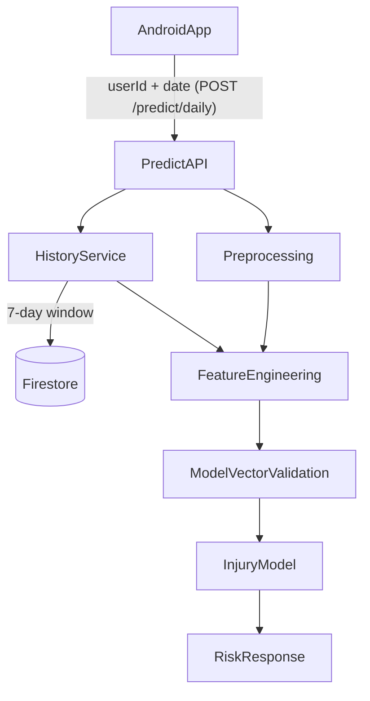

# מסמך פיצ'רים מקצה לקצה

## Executive Summary

מטרת המסמך היא לנעול ארכיטקטורת פיצ'רים ברורה, מדידה ויציבה בין פרונט, Firestore ובקאנד ML.
היעד המרכזי: למנוע Train-Serve Drift, להבטיח איכות חיזוי עקבית, ולתת חלוקת אחריות ברורה בין חברי הצוות.

### מצב נוכחי בקצרה
- יש Contract ברור ל-`POST /predict/daily` (טריגר `userId`+`date`) והבקאנד מרכיב פנימית את מיפוי השדות היומיים.
- Preprocessing ממיר נתוני Firestore לפיצ'רים מחקריים ומייצר feature vector סופי.
- הבקאנד מחשב rolling features עם היסטוריית שבוע (7 ימים) כאשר זמינה.
- קיימת לוגיקת fallback לספורטאי חדש/היסטוריה חלקית.
- קיימת הגנה קשיחה על סדר עמודות ותאימות למודל המאומן.

### 3 סיכונים קריטיים אם לא סוגרים עד הסוף
1. Drift בין אימון להפקה (שמות עמודות, סדר, סקייל).
2. חיזויים לא יציבים בספורטאים חדשים ללא Confidence ברור.
3. פערי אינטגרציה בפרונט (payload חלקי/לא אחיד) שיפגעו באיכות המודל.

---

## Feature Supply Chain (מי מושך מאיפה)

### מקורות נתונים
- `users/{uid}` (Profile): `age`, `historyInjuryCount/history_injury_count`
- `users/{uid}/daily_health/{date}`: שינה, עומס, דופק, מרחק, קלוריות, משקל
- `users/{uid}/daily_checkins/{date}`: סטרס, כאב שרירים, אנרגיה
- `users/{uid}/daily_nutrition/{date}`: חלבון, פחמימות, מספר ארוחות

### אחריות שכבות
- **Frontend (Android)**: שולח טריגר מינימלי (`userId`, `date`) ל-`POST /predict/daily`.
- **Backend API**: טוען מ-Firestore את אותו יום + פרופיל, משלים היסטוריה לפי `userId/date`, ממפה לפיצ'רים.
- **History Service**: מושך 7 ימים מ-Firestore ומחשב rolling features.
- **Prediction Service**: מאחד הכל, מאמת תאימות למודל, מריץ `predict_proba`.

### תרשים זרימה

---

## Canonical Contract (נתונים יומיים — נטענים בשרת אחרי `POST /predict/daily`)

### שדות Context
- `userId`
- `date` (`yyyy-MM-dd`)

### שדות Profile
- `age`
- `history_injury_count` (תמיכה גם ב-`historyInjuryCount`)

### שדות Daily Health
- `sleepMinutes`, `steps`, `distanceMeters`
- `activeCalories`, `totalCalories`, `bmrCalories`
- `heartRateAvg`, `heartRateMin`, `heartRateMax`
- `weightKg`

### שדות Daily Check-in
- `stressLevel`
- `muscleSoreness`
- `energyLevel` (נאסף אך כרגע לא פיצ'ר ישיר ב-v1)

### שדות Daily Nutrition
- `totalProtein`
- `totalCarbs`
- `mealsLoggedCount`

### Required Minimum Daily Fields (ליציבות מודל)
- `sleepMinutes`
- `steps`
- `distanceMeters`
- `activeCalories`
- `totalCalories`
- `heartRateAvg`
- `weightKg`
- `bmrCalories`
- `stressLevel`
- `muscleSoreness`

---

## Transformations & Engineering

## Mapping מרכזי (Firestore -> Model)
- `sleepMinutes -> sleep_hours`
- `distanceMeters -> daily_distance_km` (fallback: `steps * 0.0008`)
- `heartRateMin/Avg -> resting_hr`
- `stressLevel -> stress_level` (scale to 1..10)
- `muscleSoreness -> muscle_soreness` (scale to 1..10)
- `weightKg -> bmi` (height assumption v1: `1.75m`)
- `totalProtein/totalCarbs/mealsLoggedCount -> daily_calories` (אומדן תזונתי v1)

### Derived Features
- `acute_load_7d`
- `chronic_load_21d`
- `acwr_ratio`
- `sleep_debt_3d`
- `hrv_drop`
- `calorie_balance`

### Clamping/Scaling Guardrails
- `stress_level` בטווח 1..10
- `muscle_soreness` בטווח 1..10
- `acwr_ratio` בטווח 0.35..2.8
- ולידציה של finite + float64 לכל ה-vector

---

## History Logic & Fallbacks

### חלון היסטוריה
- חלון ברירת מחדל: 7 ימים אחרונים לפי `userId/date`.
- חישוב rolling:
  - Acute = ממוצע עומס ב-7 ימים
  - Chronic = קירוב baseline מתוך חלון שבועי (שם הפיצ'ר נשאר `chronic_load_21d` לתאימות מודל)
  - ACWR = `acute/chronic`

### Confidence Policy
- `high`: 7 ימים
- `medium`: 4-6 ימים
- `low`: 0-3 ימים

### Fallback Policy
- `high/medium`: שימוש ב-rolling מהיסטוריה אמיתית.
- `low`: שימוש בערכי baseline יציבים לפיצ'רי rolling + הערת Confidence בתגובה.
- אם Firestore לא זמין: fallback זהה ל-`low`.

---

## Train-Serve Alignment (Anti-Drift)

### מה חייב לעבוד תמיד
- סדר עמודות בבקאנד חייב להיות זהה לסדר האימון.
- שמות עמודות חייבים להתאים ל-`feature_columns` ששמורים במודל (bundle) או `feature_names_in_`.
- כל ערך חייב להיות מספרי finite.

### Failure Mode תקני
- במקרה mismatch (עמודה חסרה/לא מוכרת): Fail fast עם שגיאה ברורה.
- לא מחזירים חיזוי "משוער" במקרה אי-תאימות עמודות.

---

## החלטות v1 (נעולות)

- לא מקדמים כרגע `totalProtein/totalCarbs/mealsLoggedCount/energyLevel` לפיצ'רים ישירים.
- כן שומרים ואוספים אותם באופן מלא בפרונט.
- כן משתמשים בהם באופן עקיף ל-`daily_calories` (v1).
- קידום ל-v2 יתבצע רק עם מדדי כיסוי + שיפור אמיתי ב-Recall/F1.

---

## Frontend Hand-off (לביצוע ע"י השותף)

## P0 (חובה מיידית)
- לעבור ל-`POST /predict/daily` (להפסיק `demo_predict`).
- לוודא שנתוני היום נכתבים ל-Firestore לפני הקריאה (profile + daily docs), כדי שהבקאנד יוכל למשוך snapshot מלא.
- לשלוח תמיד בגוף הבקשה רק `userId` + `date`.

## P1 (יציבות והפעלה)
- לשמור תשובת חיזוי בחזרה ל-`daily_health/{date}`.
- להציג `confidence` למשתמש (High/Medium/Low).
- להוסיף retry קצר בקריאות Firestore.

## P2 (שיפור איכות)
- מדידת coverage יומי לשדות חובה.
- דגל UI לספורטאי חדש ("Low confidence").
- instrumentation של גרסת payload (`predictSourceVersion`).

### Definition of Done לפרונט
- כל חיזוי יומי עובר דרך `POST /predict/daily` עם `userId` + `date`, והנתונים הרלוונטיים קיימים ב-Firestore לפני הקריאה.
- כיסוי שדות חובה >= 90% ב-14 ימים רצופים ביוזרי טסט.
- אין שגיאות schema חוזרות מהבקאנד.
- confidence מוצג עקבית במסך.

### הודעה מוכנה לשותף
בכל קריאה ל-`POST /predict/daily` אתה שולח רק `userId` ו-`date`; אני טוען מ-Firestore את Profile + Daily Health + Daily Checkin + Daily Nutrition לאותו יום, מחשב בצד שרת rolling של שבוע (7 ימים) ומחזיר חיזוי סופי + confidence.

---

## Backend Work Breakdown (להשלמה מלאה)

## P0
- לשמור אכיפת column-order קשיחה מול מודל מאומן.
- לשמור fallback ברור ל-history חסר.
- לתעד examples רשמיים של payload ב-docs.

## P1
- להוסיף שדה תגובה נפרד `confidence_level` (לא רק טקסט ב-`recommendation`; היום חלק מרמת הביטחון משורשר גם כמשפט אנגלית קבוע אחרי גוף ההמלצה).
- להוסיף endpoint debug פנימי (days_count, fallback_used, schema_ok).

## P2
- להוסיף feature flags ל-history mode ו-strict validation mode.
- להוסיף nightly train-serve parity check מול דגימות ייצור אנונימיות.

---

## Testing & Observability

### בדיקות שכבר קיימות
- Preprocessing shape/type/no-NaN
- Profile override tests
- History rolling/confidence behavior
- Prediction column alignment

### בדיקות שחסרות (להוסיף)
- E2E test: High confidence path עם 7 ימים מלאים.
- E2E test: Firestore unavailable -> fallback low confidence.
- Contract regression test: payload with alias variants for profile (`historyInjuryCount`/`history_injury_count`).

### Metrics לניטור
- `predict_requests_total`
- `predict_low_confidence_rate`
- `predict_fallback_rate`
- `predict_schema_validation_failures`
- `required_fields_coverage_daily`

---

## Roadmap v2 (אחרי ייצוב v1)

1. לקדם nutrition raw features לפי קריטריון:
   - כיסוי >= 90%
   - שיפור offline מובהק ב-Recall/F1
2. להסיר הנחות proxy (למשל HRV מבוסס HR בלבד) לטובת היסטוריה פיזיולוגית מלאה.
3. להוסיף calibration monitoring בייצור (drift in probability quality).
4. לתמוך בפרופיל מתקדם: height אמיתי, baseline אישי, פציעות מאומתות.

---

## Appendix A: Feature Checklist

- [ ] Profile fields live from Firestore user document
- [ ] Daily required fields consistently sent
- [ ] History 7d retrieval healthy
- [ ] Rolling features valid and bounded
- [ ] Feature vector strict validation enabled
- [ ] Confidence surfaced to client
- [ ] Drift guard tests passing in CI

