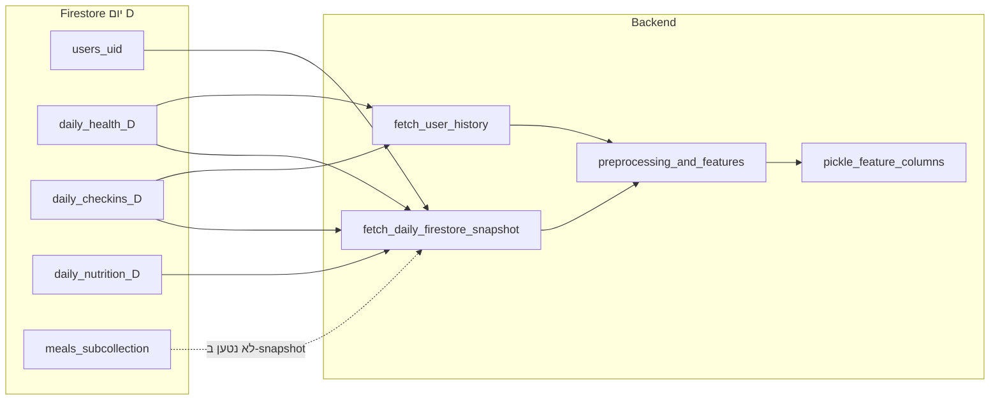

# תכנון פיצ’רים ML לפי מה שנאסף ב-Firestore

מסמך זה מאגד **מלאי שדות ב-Firestore**, **טיוטת פיצ’רים ML** שניתן להפיק מהם, **החלטות לפני בניית דאטה ואימון**, ו**מתי נדרש שינוי פרונט**. מטרה: לסגור רשימת פיצ’רים אחת; לאחר מכן ייבנה **דאטה לאימון מחדש** לפי הרשימה הזו, והשירות (`POST /predict/daily`) יכוון לאותו חוזה עמודות כדי למנוע train/serve drift.

**הערה:** אין תלות בדאטה מאומן קודם — הוא יוחלף; המסמך מתאר מה שנאסף באפליקציה ומה השרת יודע לחשב, לא גרסת CSV ישנה.

**מסמכים קשורים:** [`DATA_CONTRACT_FRONTEND_BACKEND.md`](DATA_CONTRACT_FRONTEND_BACKEND.md), [`FIRESTORE_AND_MODEL_FIELDS_HE.md`](FIRESTORE_AND_MODEL_FIELDS_HE.md), [`ATHLETE_DB_DATA_LIFECYCLE_HE.md`](ATHLETE_DB_DATA_LIFECYCLE_HE.md).

---

## 1. זרימת נתונים (תקציר)

- **`fetch_user_history`** מאחד כיום רק `daily_health` + `daily_checkins` — **לא** `daily_nutrition`. תזונה לא נכנסת לחישובי rolling מהיסטוריה עד שיוסיף איחוד במסמך קוד.

---

## 2. מלאי שדות לפי נתיב Firestore

### 2.1 `users/{uid}` — פרופיל

| שדות שנכתבים בפועל מהאפליקציה | מקור |
|--------------------------------|------|
| `uid`, `fullName`, `email`, `role` | הרשמה — [`LoginManager.kt`](../../android_app/AthleAgent/app/src/main/java/com/yahav/athleagent/logic/LoginManager.kt) |

| שדות שהבקאנד **צריך** לחיזוי (מתועדים; לא נוצרים בהרשמה) | מצב |
|----------------------------------------------------------|-----|
| `age`, `historyInjuryCount` / `history_injury_count` | **פער איסוף:** אין כרגע מסך שמבטיח כתיבה — ברירות מחדל בשרת כשחסר בפרופיל (`vo2_max` אינו שדה מוצר; קבוע טכני במודל בלבד) |

### 2.2 `users/{uid}/daily_health/{yyyy-MM-dd}`

| שדות עיקריים | מקור |
|--------------|------|
| `sleepMinutes`, `steps`, `distanceMeters`, `activeCalories`, `totalCalories`, `heartRateAvg`, `heartRateMax`, `heartRateMin`, `weightKg`, `bmrCalories`, `lastSync` | סנכרון Wearable — [`WearableSyncActivity.kt`](../../android_app/AthleAgent/app/src/main/java/com/yahav/athleagent/ui/athlete/WearableSyncActivity.kt) |
| `finalRiskScore`, `riskLevel`, `backendRecommendation`, `dataQualityScore`, `dataQualityStatus`, `predictionUpdatedAt` | תוצאות חיזוי מהבקאנד (merge) |
| `aiRecommendation` (אופציונלי) | UI / Gemini — לא חלק מחוזה המודל |

**הבחנה קריטית:** `totalCalories` כאן = **שריפה** (Health Connect), לא צריכת מזון.

### 2.3 `users/{uid}/daily_checkins/{yyyy-MM-dd}`

| שדות | מקור |
|------|------|
| `energyLevel`, `muscleSoreness`, `stressLevel`, `lastCheckInTime` | [`DailyCheckInActivity.kt`](../../android_app/AthleAgent/app/src/main/java/com/yahav/athleagent/ui/athlete/DailyCheckInActivity.kt) |

### 2.4 `users/{uid}/daily_nutrition/{yyyy-MM-dd}`

| שדות (אגרגציה על מסמך היום) | מקור |
|------------------------------|------|
| `totalCalories`, `totalProtein`, `totalCarbs`, `mealsLoggedCount`, `lastMealAddedAt` | שמירת ארוחה — [`MealAnalysisActivity.kt`](../../android_app/AthleAgent/app/src/main/java/com/yahav/athleagent/ui/athlete/MealAnalysisActivity.kt) |

| תת־אוסף `meals` | שדות למנה |
|-------------------|-----------|
| מסמכים עם מזהה אוטומטי | `calories`, `protein`, `carbs`, `timestamp` |

הערה: תת־האוסף **לא** נטען ב־`fetch_daily_firestore_snapshot`; קיים לאפליקציה/עתיד ולא לשרת כיום.

---

## 3. טיוטת פיצ’רים: מועמדים מול Firestore ושירות

הטבלה הבאה היא **קטלוג מועמדים** לקראת החלטת הצוות — לא רשימה סגורה. עמודת **סטטוס** מתארת האם הנתון ניתן למלא ממה שנאסף ב-Firestore מול לוגיקת השרת הנוכחית (לפני סינכרון קוד לאימון החדש).

| פיצ’ר (שם לדוגמה במודל) | תפקיד | מקור Firestore וזמן | נגזרת בבקאנד (כיום) | סטטוס איסוף / שירות |
|---------------------------|-------|---------------------|----------------------|----------------------|
| `sleep_hours` | שעות שינה | `daily_health.sleepMinutes` על **יום D** | `sleepMinutes/60` עם גבולות | **קיים** כשסנכרון מלא |
| `hrv_score` | מדד HRV פרוקסי | גזירה מ־`heartRateAvg`/`heartRateMin` ביום D | פרוקסי מדופק מנוחה | **חלקי** — לא HRV אמיתי ממכשיר |
| `resting_hr` | דופק מנוחה | `daily_health.heartRateMin` / `heartRateAvg` יום D | קליפינג לטווח | **קיים** |
| `daily_calories` | צריכה קלורית (קלט) | אידיאלי: תזונה; כיום: `daily_nutrition` **אותו יום D** (`totalProtein`, `totalCarbs`, `mealsLoggedCount`) | אומדן ממאקרו / ברירת מחדל; **לא** משתמש ב־`totalCalories` של מסמך התזונה בשרת | **פער שימוש:** סכום קלוריות מזון (`daily_nutrition.totalCalories`) נשמר באפליקציה אך **לא ממופה** ל־API פנימי |
| `total_calories_burned` | שריפה | `daily_health.totalCalories` (+ BMR/פעילות) יום D | לוגיקת `preprocessing` | **קיים** — אל תבלבל עם צריכה |
| `stress_level` | עומס נפשי | `daily_checkins.stressLevel` יום D | סקייל 1–10 | **קיים** אחרי צ’ק-אין |
| `muscle_soreness` | כאבי שרירים | `daily_checkins.muscleSoreness` יום D | סקייל 1–10 | **קיים** אחרי צ’ק-אין |
| `acute_load_7d` | עומס חריף | חלון ימים מ־`daily_health` (+ צ’ק-אין במיזוג) | מ־`fetch_user_history` או פרוקסי יום בודד | **גלילה חלקית** — תזונה לא במיזוג היסטוריה |
| `chronic_load_21d` | בסיס עומס | כמו למעלה | חישוב מהיסטוריה או פרוקסי | **גלילה חלקית** |
| `acwr_ratio` | יחס עומסים | כמו למעלה | חישוב / פרוקסי | **גלילה חלקית** |
| `calorie_balance` | צריכה − שריפה | גזירה משני עמודות למעלה | `daily_calories - total_calories_burned` | **תלוי** באיכות שני הצדדים |
| `sleep_debt_3d` | חוב שינה | גלילה על שינה מהיסטוריה או פרוקסי יום | `history_service` / `feature_engineering` | **גלילה חלקית** |
| `hrv_drop` | ירידת HRV יחסית | גלילה / פרוקסי | כמו למעלה | **חלקי** — פרוקסי, לא מכשיר |
| `injury_tomorrow` (או שם יעד אחר) | **יעד לאימון** | לא נאסף ב-Firestore כשדה יומי מובנה | נגזר ממקור חיצוני / תיוג ידני בטבלת האימון | **מחוץ לסכימת האפליקציה** — להגדיר מקור תווית לפני בניית הדאטה |

### 3.1 קשר ל־`MODEL_FEATURE_COLUMNS` בקוד השרת (24 עמודות)

ב־[`model_features.py`](../services/model_features.py) מוגדרת רשימת **Superset** של עמודות שהפריסה יודעת למלא לפני חיתוך לפי המודל. הצוות יכול:

- **לבחור תת־קבוצה** לדאטה החדש ול־pickle (`feature_columns`), או
- **להרחיב/לצמצם** את הרשימה בקוד ובאימון יחד (שינוי מבני).

רשימת ה־superset כוללת בין השאר: `age`, `bmi`, `history_injury_count`, `vo2_max`, `daily_distance_km`, `workout_intensity_minutes`, `avg_cadence`, מאפייני rolling נוספים (`acwr_ratio_ma7`, …). אילו מהן נכנסות לדאטה החדש ולמודל — **נקבע רק אחרי סגירת רשימת הפיצ’רים**, לא לפי דאטה ישן.

---

## 4. Checklist החלטות לפני בניית דאטה ואימון

- [ ] **סמנטיקת תזונה:** האם `daily_calories` במודל משקף צריכת **יום D** או **יום D−1** (אתמול)?
- [ ] **הפרדת קלוריות:** להפריד בשמות בין שריפה (`daily_health.totalCalories`) לבין צריכה (`daily_nutrition` — לשקול שם מפורש כמו `nutritionTotalCalories`) כדי למנוע בלבול בחוזה ובפרונט.
- [ ] **שימוש ב־`nutritionTotalCalories`:** האם להזין ישירות ל־`daily_calories` כשקיים, במקום אומדן ממאקרו בלבד.
- [ ] **מאקרו נפרדים במודל:** האם להוסיף עמודות `protein_g`, `carbs_g` (או נורמליזציה) — דורש עמודות באימון וב־Firestore עקבי.
- [ ] **פרופיל:** `age`, `history_injury_count` — חובה מסלול איסוף בפרופיל כשמחליטים על חוזה מלא.
- [ ] **BMI:** גובה קבוע בקוד היום — האם להוסיף `heightCm` בפרופיל.
- [ ] **איחוד תזונה בהיסטוריה:** האם לכלול `daily_nutrition` ב־`fetch_user_history` לצורך rolling תזונתי.
- [ ] **יעד:** הגדרת מקור `injury_tomorrow` (סקר רופא, דיווח ידני, קישור למאגר פציעות).

---

## 5. מטריצה: מתי נדרש שינוי פרונט

| צורך | פרונט | בקאנד / ML |
|------|-------|------------|
| טעינת תזונת D−1 או rolling מתזונה בלי שינוי סכימה | לא חובה אם מסמכי יום קיימים | קריאת `daily_nutrition/{D-1}`, הרחבת מיזוג היסטוריה |
| שדות פרופיל ML | טופס פרופיל / אונבורדינג | מיפוי קיים ב־`predict_injury_risk_from_firestore` |
| הבחנה בשמות קלוריות צריכה מול שריפה | עדכון שמות שדות ב-Firestore או במפרט האפליקציה | עדכון `InjuryPredictionRequest` + preprocessing |
| מאקרו נוסף (שומן וכו’) | פרומפט Gemini + שמירה / שדה חדש | עמודות אימון + סכימה |
| גובה / היסטוריית פציעות מפורטת | שדות חדשים ב־`users/{uid}` | הנדסת פיצ’רים + אימון |

---

## 6. תוצר לצוות

1. למלא את ה-checklist בסעיף 4 ולגבש **רשימת פיצ’רים סופית** (כולל שם עמודות ליעד).
2. לבנות **דאטה לאימון חדש** לפי הרשימה בלבד; לשמור על התאמה מלאה בין עמודות הדאטה, `feature_columns` ב־pickle, והנדסת פיצ’רים בבקאנד.
3. לעדכן את [`DATA_CONTRACT_FRONTEND_BACKEND.md`](DATA_CONTRACT_FRONTEND_BACKEND.md) ואת [`FIRESTORE_AND_MODEL_FIELDS_HE.md`](FIRESTORE_AND_MODEL_FIELDS_HE.md) אחרי כל שינוי חוזה.

**גרסה:** נוצר כחלק מתכנון פיצ’רים Firestore; לעדכן תאריך בעת שינוי מהותי בפיצ’רים.
