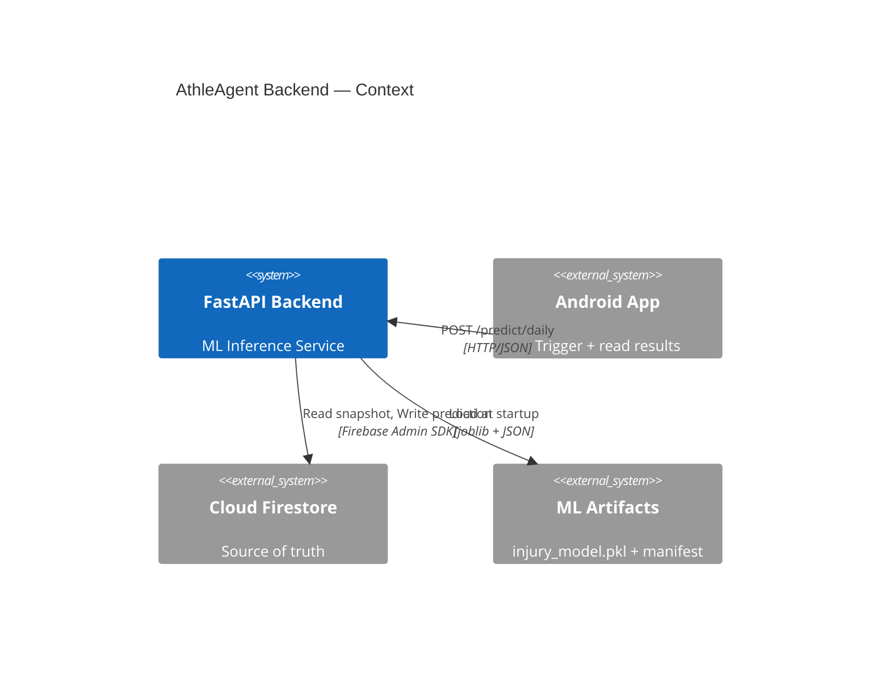
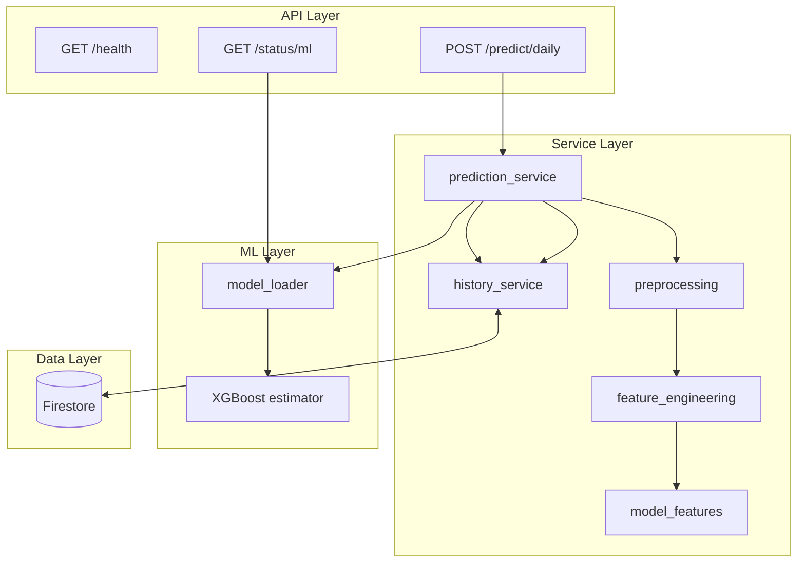
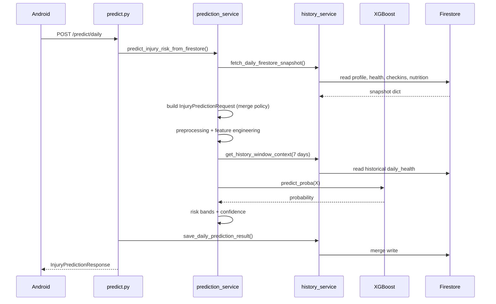
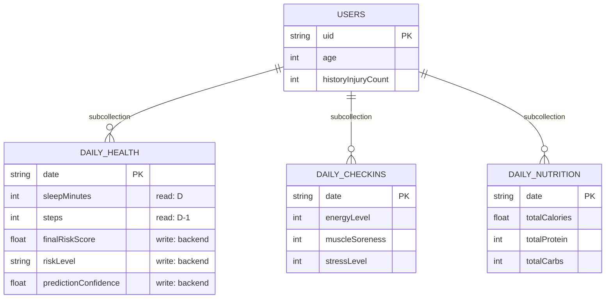
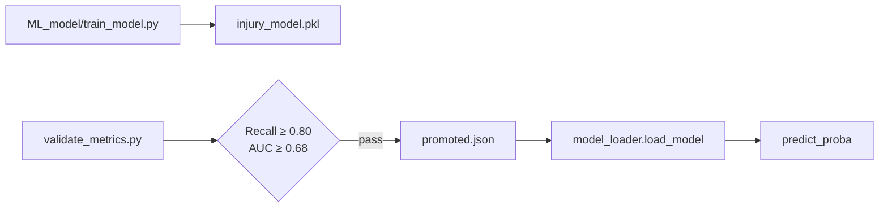
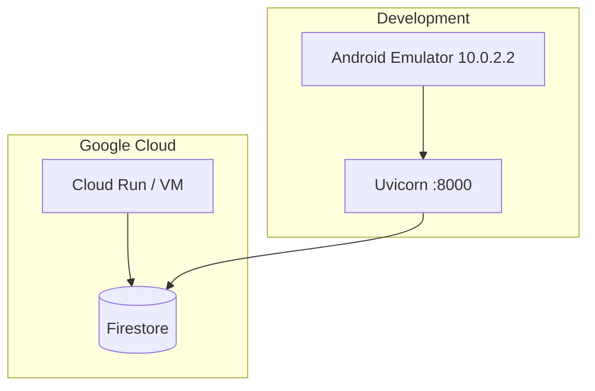

# AthleAgent Backend — High Level Design (HLD)
## מסמך עיצוב ברמה גבוהה — Backend בלבד

| שדה | ערך |
|-----|-----|
| **גרסה** | 1.0 |
| **תאריך** | 2026-06-19 |
| **קהל יעד** | מפתחי backend, DevOps, בוחנים |
| **מסמכים קשורים** | [LLD.md](LLD.md) · [BACKEND.md](BACKEND.md) · [docs/HLD_PROJECT.md](../../docs/HLD_PROJECT.md) |

---

## 1. תפקיד הבקאנד

הבקאנד של AthleAgent הוא **שירות inference stateless** שמבצע:

1. קריאת snapshot יומי מ-Cloud Firestore
2. הנדסת פיצ'רים + enrichment היסטורי (7 ימים)
3. הרצת מודל XGBoost (`predict_proba`)
4. שמירת תוצאות חיזוי חזרה ל-Firestore

הבקאנד **אינו** אחראי על:
- UI / איסוף נתונים מהמשתמש
- Firebase Authentication (מתבצע בלקוח)
- ניתוח תמונות ארוחות (Gemini client-side)
- אימון מודל (pipeline נפרד ב-`ML_model/`)

---

## 2. הקשר מערכת (Backend Context)



---

## 3. ארכיטקטורה לוגית



### 3.1 עקרונות עיצוב

| עקרון | יישום |
|-------|-------|
| **Single source of truth** | Firestore — לא מקבלים payload מלא מהלקוח |
| **Minimal trigger contract** | `{userId, date}` בלבד |
| **Fail closed on model** | אם gate נכשל → 500, לא demo fallback |
| **Merge write** | תוצאות חיזוי merge ל-`daily_health/{date}` |
| **Defaults for sparse data** | `DEFAULT_FEATURE_VALUES` + confidence score |

---

## 4. API Surface

### 4.1 Production Endpoints

| Endpoint | Method | תפקיד | Auth |
|----------|--------|-------|------|
| `/predict/daily` | POST | חיזוי יומי + persist | **None** |
| `/health` | GET | Liveness probe | None |
| `/status/ml` | GET | Model operational status | None |

### 4.2 Development / Legacy Endpoints

| Endpoint | Method | תפקיד |
|----------|--------|-------|
| `/test_predict` | POST | Mock response ל-UI tests |
| `/demo_predict` | POST | Heuristic score (legacy) |
| `/predict/sklearn` | POST | Full payload (disabled by default) |

### 4.3 Production Contract

**Request:**
```json
{
  "userId": "firebase-uid",
  "date": "2026-06-19"
}
```

**Response:**
```json
{
  "risk_level": "Medium",
  "risk_score": 0.4521,
  "prediction_confidence": 78.5
}
```

**Firestore merge** (`users/{uid}/daily_health/{date}`):
| Response field | Firestore field | Transform |
|----------------|-----------------|-----------|
| `risk_score` | `finalRiskScore` | × 100, round 2 |
| `risk_level` | `riskLevel` | as-is |
| `prediction_confidence` | `predictionConfidence` | as-is |
| — | `predictionUpdatedAt` | ISO UTC (Firestore only) |

---

## 5. זרימת חיזוי (Production Flow)



### 5.1 Date Merge Policy (יום D = יום ההתעוררות)

| מקור נתונים | Firestore path | שדות עיקריים |
|-------------|----------------|--------------|
| Sleep / recovery | `daily_health/{D}` | sleepMinutes, HRV (בוקר) |
| Physical load | `daily_health/{D-1}` (fallback `{D}`) | steps, distance, calories, HR |
| Survey | `daily_checkins/{D}` | energy, soreness, stress, injuredYesterday |
| Nutrition | `daily_nutrition/{D-1}` + backfill | totalCalories, protein, carbs |
| Profile | `users/{uid}` | age, historyInjuryCount |

---

## 6. מודל נתונים — Firestore (Backend View)



> חוזה מלא: [FEATURES.md](FEATURES.md)

---

## 7. ML Integration

### 7.1 Model Lifecycle



### 7.2 Inference Output

| שלב | פלט |
|-----|-----|
| `predict_proba` | probability 0–1 (injury class) |
| Risk bands | High ≥ 0.70 · Medium ≥ 0.40 · Low otherwise |
| Confidence | blend: 60% history confidence + 40% data quality |

> **הערה:** ספי UI ב-MODEL.md (0.11/0.18) שונים מספי inference בקוד (0.40/0.70) — יש ליישר.

### 7.3 Feature Count
36 features — מקור אמת: `services/model_features.py`

---

## 8. Configuration

| Setting | Source | Default |
|---------|--------|---------|
| `MODEL_PATH` | env | `ML_model/artifacts/20260512_075115/injury_model.pkl` |
| `FIREBASE_SERVICE_ACCOUNT_KEY` | env / file | `backend/firebase-key.json` |
| `ENABLE_LEGACY_SKLEARN_ENDPOINT` | env | `false` |
| `CORS_ORIGINS` | config | localhost ports |
| `VERSION` | config | `1.0.0` |

---

## 9. Deployment Topology (מומלץ)



**הרצה מקומית:**
```bash
cd backend
uvicorn main:app --host 0.0.0.0 --port 8000
```

---

## 10. אבטחה

### 10.1 מצב נוכחי
- **אין authentication** על `/predict/daily`
- Firebase Admin SDK עם service account ל-Firestore
- CORS מוגבל ל-localhost
- `google_auth.py` קיים אך **לא מחובר**

### 10.2 המלצות Production
1. Middleware: verify Firebase ID Token
2. Validate `userId` == token.uid
3. HTTPS only
4. Rate limiting
5. Secrets via Secret Manager (לא `firebase-key.json` ב-repo)

---

## 11. Observability

| מנגנון | מיקום |
|--------|-------|
| Structured logging | `utils/logging.py` |
| ML status endpoint | `GET /status/ml` |
| Prediction logs | `predict_data_quality`, `predict_confidence_summary` |
| Health check | `GET /health` |

---

## 12. Testing Strategy

| סוג | קבצים |
|-----|-------|
| Unit | `test_preprocessing.py`, `test_feature_engineering.py` |
| Integration | `test_inference.py`, `test_history_service.py` |
| Contract | `test_train_serve_parity.py`, `test_prediction_model_columns.py` |
| Gates | `test_model_loader_gate.py` |
| Error paths | `test_predict_error_mode.py` |

---

## 13. מגבלות ו-SLOs

| מדד | יעד | הערות |
|-----|-----|-------|
| Latency p95 | < 2s | תלוי ב-Firestore reads |
| Availability | 99% | single instance dev |
| Model freshness | manual promote | `run_pipeline.py` |
| History window | 7 days | lookback for rolling features |

---

## 14. מפת מסמכים

| מסמך | תוכן |
|------|------|
| [LLD.md](LLD.md) | עיצוב ברמה נמוכה — modules, functions, schemas |
| [BACKEND.md](BACKEND.md) | ארכיטקטורה + API (קיים) |
| [FEATURES.md](FEATURES.md) | חוזה production |
| [RISK_SCORE.md](RISK_SCORE.md) | pipeline E2E |
| [MODEL.md](MODEL.md) | ML ops config |
| [docs/HLD_PROJECT.md](../../docs/HLD_PROJECT.md) | HLD פרויקט מלא |
