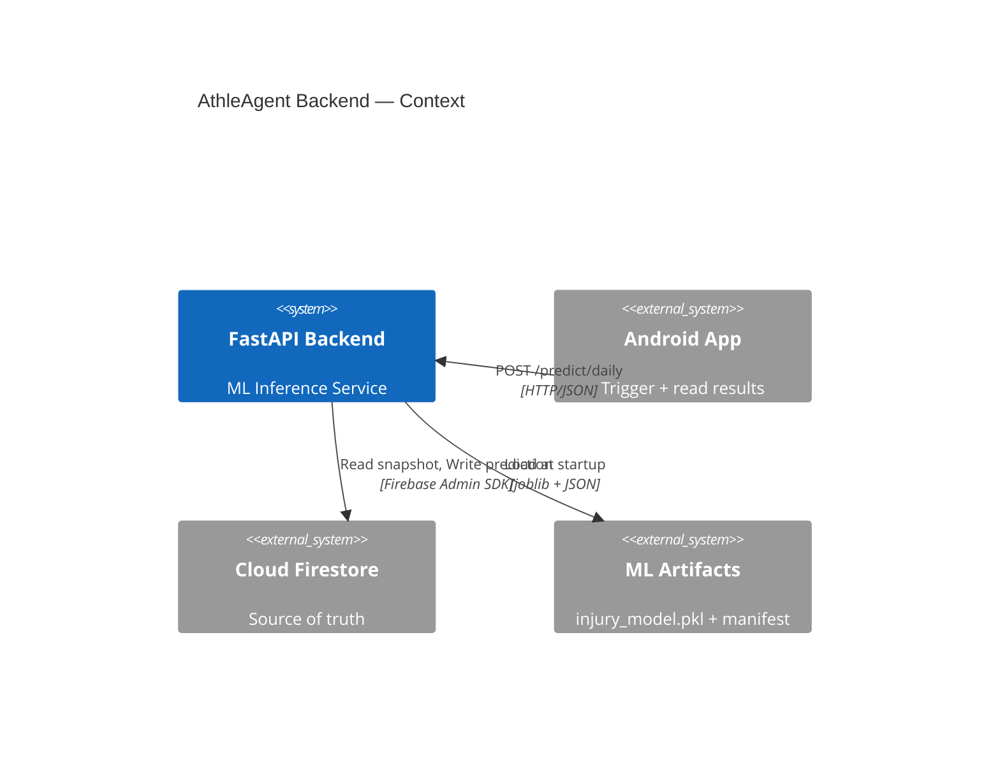
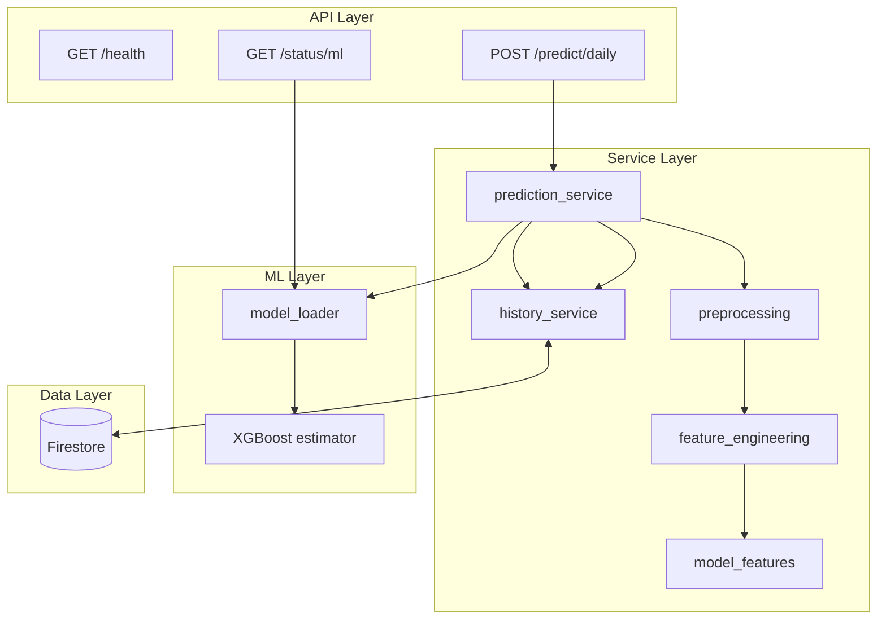
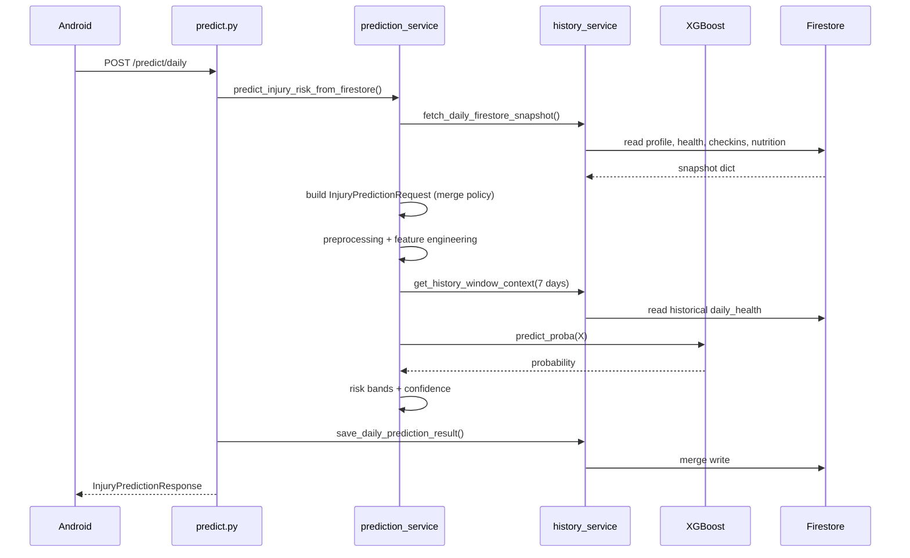
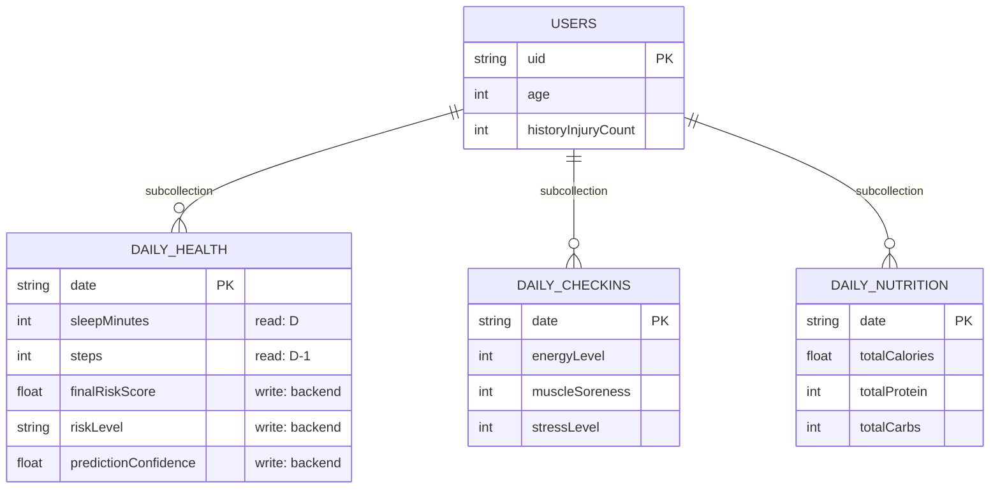
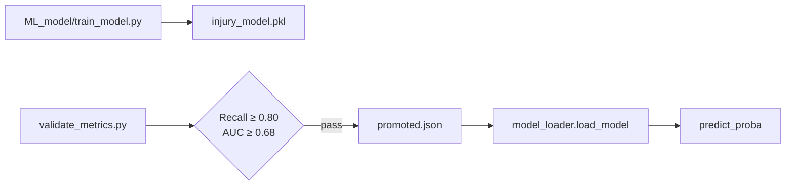
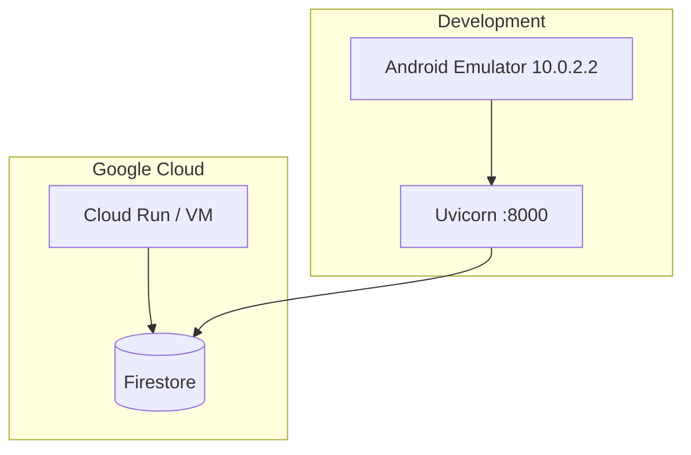

# AthleAgent Backend — High Level Design (HLD)
## מסמך עיצוב ברמה גבוהה — Backend בלבד

| שדה | ערך |
|-----|-----|
| **גרסה** | 1.0 |
| **תאריך** | 2026-06-19 |
| **קהל יעד** | מפתחי backend, DevOps, בוחנים |
| **מסמכים קשורים** | [LLD.md](LLD.md) · [BACKEND.md](BACKEND.md) · [docs/HLD_PROJECT.md](../../docs/HLD_PROJECT.md) |

---

## 1. תפקיד הבקאנד

הבקאנד של AthleAgent הוא **שירות inference stateless** שמבצע:

1. קריאת snapshot יומי מ-Cloud Firestore
2. הנדסת פיצ'רים + enrichment היסטורי (7 ימים)
3. הרצת מודל XGBoost (`predict_proba`)
4. שמירת תוצאות חיזוי חזרה ל-Firestore

הבקאנד **אינו** אחראי על:
- UI / איסוף נתונים מהמשתמש
- Firebase Authentication (מתבצע בלקוח)
- ניתוח תמונות ארוחות (Gemini client-side)
- אימון מודל (pipeline נפרד ב-`ML_model/`)

---

## 2. הקשר מערכת (Backend Context)



---

## 3. ארכיטקטורה לוגית



### 3.1 עקרונות עיצוב

| עקרון | יישום |
|-------|-------|
| **Single source of truth** | Firestore — לא מקבלים payload מלא מהלקוח |
| **Minimal trigger contract** | `{userId, date}` בלבד |
| **Fail closed on model** | אם gate נכשל → 500, לא demo fallback |
| **Merge write** | תוצאות חיזוי merge ל-`daily_health/{date}` |
| **Defaults for sparse data** | `DEFAULT_FEATURE_VALUES` + confidence score |

---

## 4. API Surface

### 4.1 Production Endpoints

| Endpoint | Method | תפקיד | Auth |
|----------|--------|-------|------|
| `/predict/daily` | POST | חיזוי יומי + persist | **None** |
| `/health` | GET | Liveness probe | None |
| `/status/ml` | GET | Model operational status | None |

### 4.2 Development / Legacy Endpoints

| Endpoint | Method | תפקיד |
|----------|--------|-------|
| `/test_predict` | POST | Mock response ל-UI tests |
| `/demo_predict` | POST | Heuristic score (legacy) |
| `/predict/sklearn` | POST | Full payload (disabled by default) |

### 4.3 Production Contract

**Request:**
```json
{
  "userId": "firebase-uid",
  "date": "2026-06-19"
}
```

**Response:**
```json
{
  "risk_level": "Medium",
  "risk_score": 0.4521,
  "prediction_confidence": 78.5
}
```

**Firestore merge** (`users/{uid}/daily_health/{date}`):
| Response field | Firestore field | Transform |
|----------------|-----------------|-----------|
| `risk_score` | `finalRiskScore` | × 100, round 2 |
| `risk_level` | `riskLevel` | as-is |
| `prediction_confidence` | `predictionConfidence` | as-is |
| — | `predictionUpdatedAt` | ISO UTC (Firestore only) |

---

## 5. זרימת חיזוי (Production Flow)



### 5.1 Date Merge Policy (יום D = יום ההתעוררות)

| מקור נתונים | Firestore path | שדות עיקריים |
|-------------|----------------|--------------|
| Sleep / recovery | `daily_health/{D}` | sleepMinutes, HRV (בוקר) |
| Physical load | `daily_health/{D-1}` (fallback `{D}`) | steps, distance, calories, HR |
| Survey | `daily_checkins/{D}` | energy, soreness, stress, injuredYesterday |
| Nutrition | `daily_nutrition/{D-1}` + backfill | totalCalories, protein, carbs |
| Profile | `users/{uid}` | age, historyInjuryCount |

---

## 6. מודל נתונים — Firestore (Backend View)



> חוזה מלא: [FEATURES.md](FEATURES.md)

---

## 7. ML Integration

### 7.1 Model Lifecycle



### 7.2 Inference Output

| שלב | פלט |
|-----|-----|
| `predict_proba` | probability 0–1 (injury class) |
| Risk bands | High ≥ 0.70 · Medium ≥ 0.40 · Low otherwise |
| Confidence | blend: 60% history confidence + 40% data quality |

> **הערה:** ספי UI ב-MODEL.md (0.11/0.18) שונים מספי inference בקוד (0.40/0.70) — יש ליישר.

### 7.3 Feature Count
36 features — מקור אמת: `services/model_features.py`

---

## 8. Configuration

| Setting | Source | Default |
|---------|--------|---------|
| `MODEL_PATH` | env | `ML_model/artifacts/20260512_075115/injury_model.pkl` |
| `FIREBASE_SERVICE_ACCOUNT_KEY` | env / file | `backend/firebase-key.json` |
| `ENABLE_LEGACY_SKLEARN_ENDPOINT` | env | `false` |
| `CORS_ORIGINS` | config | localhost ports |
| `VERSION` | config | `1.0.0` |

---

## 9. Deployment Topology (מומלץ)



**הרצה מקומית:**
```bash
cd backend
uvicorn main:app --host 0.0.0.0 --port 8000
```

---

## 10. אבטחה

### 10.1 מצב נוכחי
- **אין authentication** על `/predict/daily`
- Firebase Admin SDK עם service account ל-Firestore
- CORS מוגבל ל-localhost
- `google_auth.py` קיים אך **לא מחובר**

### 10.2 המלצות Production
1. Middleware: verify Firebase ID Token
2. Validate `userId` == token.uid
3. HTTPS only
4. Rate limiting
5. Secrets via Secret Manager (לא `firebase-key.json` ב-repo)

---

## 11. Observability

### 11.1 Unified system log (Backend + Android)

| רכיב | מיקום | תיאור |
|------|--------|--------|
| **Unified log file** | `logs/athleagent.log` (repo root) | Backend HTTP + domain events + Android telemetry |
| JSON Lines logger | `utils/logging.py` | `RotatingFileHandler` (10 MB × 5), stdout mirror |
| Request context | `utils/request_context.py` | `contextvars`: `request_id`, `user_id` |
| HTTP middleware | `middleware/request_logging.py` | Smart filtering, `X-Request-ID` echo, `duration_ms` |
| Client events API | `POST /api/v1/observability/client-events` | Android errors + navigation + key actions |
| Rate limiter | `utils/client_event_limiter.py` | Dedup screen/action/sync events |
| ML ops audit | `ML_model/artifacts/ops_events.jsonl` | Training/promotion timeline (separate) |
| Trace helper | `backend/scripts/trace_request.sh` | `jq` by `request_id`, `event`, or `source` |

**Log file:** [`logs/athleagent.log`](../../logs/athleagent.log) — gitignored, JSON Lines, **single source for troubleshooting**.

**Environment variables** (`config.py`):

| Variable | Default | תיאור |
|----------|---------|--------|
| `LOG_DIR` | `<repo>/logs` | Unified log directory |
| `LOG_FILE_NAME` | `athleagent.log` | Active log filename |
| `LOG_FORMAT` | `json` | `json` or `text` |
| `LOG_LEVEL` | `INFO` | Python log level |
| `CLIENT_EVENT_RATE_LIMIT_*_SEC` | 30/10/15/5 | screen / action / sync / ml_trigger |

**Log schema (JSON) — all entries include `source`:**

```json
{
  "timestamp": "2026-06-20T10:15:30.123Z",
  "level": "INFO",
  "logger": "athleagent",
  "message": "http_request_completed",
  "source": "backend",
  "request_id": "a1b2c3d4-...",
  "user_id": "firebaseUid",
  "event": "http_request_completed",
  "method": "POST",
  "path": "/predict/daily",
  "status_code": 200,
  "duration_ms": 842,
  "service": "AthleAgent API",
  "version": "1.0.0"
}
```

**Android client event (same file, `source: android`):**

```json
{
  "event": "client_event",
  "source": "android",
  "client_event_type": "ml_trigger",
  "client_tag": "ML_Trigger",
  "client_message": "predict/daily onFailure: Connection refused",
  "client_screen": "DailyCheckInActivity",
  "request_id": "...",
  "user_id": "..."
}
```

**Allowed `client_event_type` values:**

| Type | When to use | Backend log level | Rate limit |
|------|-------------|-------------------|------------|
| `error` | Retrofit/Firestore/Gemini failures | WARNING | none |
| `screen_view` | Main Activity opened | INFO | 30s / screen |
| `user_action` | Submit check-in, save meal, join team | INFO | 10s / action |
| `ml_trigger` | Before/after `/predict/daily` call | INFO | 5s |
| `sync` | Watch sync started/completed/failed | INFO | 15s |

**Backend domain events** (`source: backend`):

- `http_request_completed`, `http_unhandled_error`
- `predict_data_quality`, `predict_confidence_summary`, `predict_blocked`
- `model_loaded`, `domain_error`, `server_startup`, `server_shutdown`

**Trace examples:**

```bash
./backend/scripts/trace_request.sh trace-req-001
./backend/scripts/trace_request.sh --event client_event
./backend/scripts/trace_request.sh --source android
jq 'select(.path=="/predict/daily")' logs/athleagent.log
```

**Manual test (no Android):**

```bash
curl -X POST http://localhost:8000/api/v1/observability/client-events \
  -H "Content-Type: application/json" \
  -H "X-Request-ID: test-manual-001" \
  -d '{"event_type":"screen_view","level":"INFO","tag":"Dashboard","screen":"AthleteDashboardActivity","message":"screen_opened","user_id":"demo","app_version":"1.0"}'
```

### 11.2 ML lineage

| מנגנון | מיקום |
|--------|-------|
| Run snapshot | `ML_model/artifacts/<run_id>/run_manifest.json` |
| Promotion pointer | `ML_model/artifacts/promoted.json` |
| Ops timeline | `ML_model/artifacts/ops_events.jsonl` |
| Live status | `GET /status/ml` |

### 11.3 Firestore (data audit)

Predictions and daily snapshots = **state**. Unified log = **events** (no raw health payloads).

### 11.4 Appendix — Android integration spec (required changes)

> Kotlin not implemented in backend sprint. Wire these when updating the Android app.

**Dependencies:** `okhttp` 4.12, `timber` 5.0.1

**New files:**

| File | Purpose |
|------|---------|
| `network/CorrelationIdInterceptor.kt` | Header `X-Request-ID` on all API calls |
| `network/RequestIdHolder.kt` | Last request ID for error correlation |
| `network/ObservabilityApi.kt` | `POST api/v1/observability/client-events` |
| `observability/ClientEventReporter.kt` | Fire-and-forget reporter (IO dispatcher) |

**Modify:**

| File | Change |
|------|--------|
| `ApiClient.kt` | OkHttp client + interceptor |
| `App.kt` | Timber init (debug tree) |
| Activity `onCreate` | `screen_view` for main screens |
| ML Retrofit callbacks | `ml_trigger` + `error` on failure |
| `WearableSyncActivity` | `sync` events |
| Check-in / meal submit | `user_action` |

**Events to emit (minimum for graduation demo):**

| Activity | event_type | tag | message example |
|----------|------------|-----|-----------------|
| `AthleteDashboardActivity` | `screen_view` | `Dashboard` | `screen_opened` |
| `DailyCheckInActivity` | `screen_view` | `DailyCheckIn` | `screen_opened` |
| `DailyCheckInActivity` | `user_action` | `DailyCheckIn` | `checkin_submitted` |
| `DailyCheckInActivity` | `ml_trigger` | `ML_Trigger` | `predict_daily_started` |
| `DailyCheckInActivity` | `error` | `ML_Trigger` | `onFailure: ...` |
| `WearableSyncActivity` | `sync` | `Sync` | `health_connect_sync_completed` |
| `MealAnalysisActivity` | `ml_trigger` | `ML_Trigger` | `predict_daily_started` |

**Client rules:**

- Message ≤ 500 chars; no PHI; no stack traces
- Include `user_id` (Firebase uid) when logged in
- Reuse `RequestIdHolder.current` as `request_id`
- Swallow reporter failures silently (never block UI)
- Local debug remains Logcat/Timber only

---

## 12. Testing Strategy

| סוג | קבצים |
|-----|-------|
| Unit | `test_preprocessing.py`, `test_feature_engineering.py` |
| Integration | `test_inference.py`, `test_history_service.py` |
| Contract | `test_train_serve_parity.py`, `test_prediction_model_columns.py` |
| Gates | `test_model_loader_gate.py` |
| Error paths | `test_predict_error_mode.py` |

---

## 13. מגבלות ו-SLOs

| מדד | יעד | הערות |
|-----|-----|-------|
| Latency p95 | < 2s | תלוי ב-Firestore reads |
| Availability | 99% | single instance dev |
| Model freshness | manual promote | `run_pipeline.py` |
| History window | 7 days | lookback for rolling features |

---

## 14. מפת מסמכים

| מסמך | תוכן |
|------|------|
| [LLD.md](LLD.md) | עיצוב ברמה נמוכה — modules, functions, schemas |
| [BACKEND.md](BACKEND.md) | ארכיטקטורה + API (קיים) |
| [FEATURES.md](FEATURES.md) | חוזה production |
| [RISK_SCORE.md](RISK_SCORE.md) | pipeline E2E |
| [MODEL.md](MODEL.md) | ML ops config |
| [docs/HLD_PROJECT.md](../../docs/HLD_PROJECT.md) | HLD פרויקט מלא |
