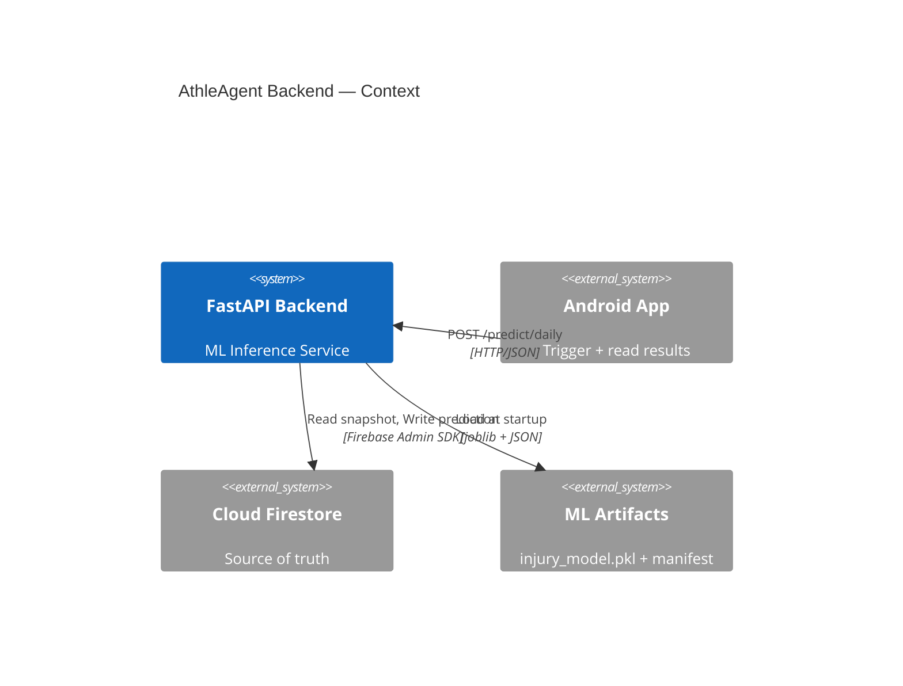
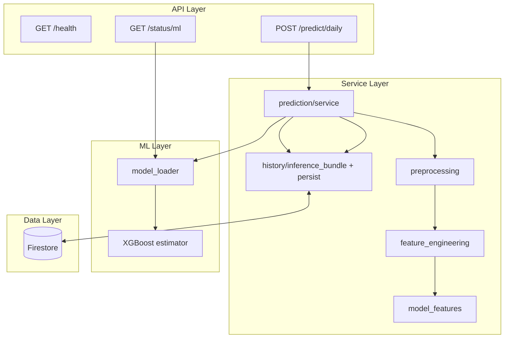
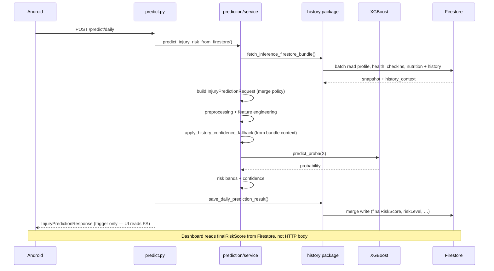
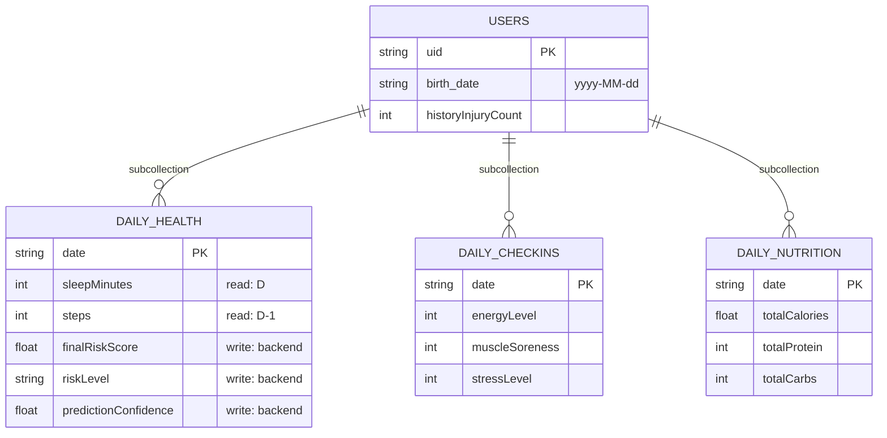
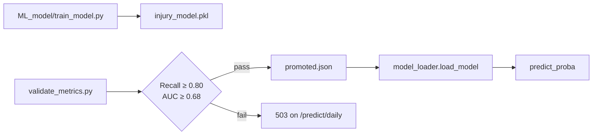
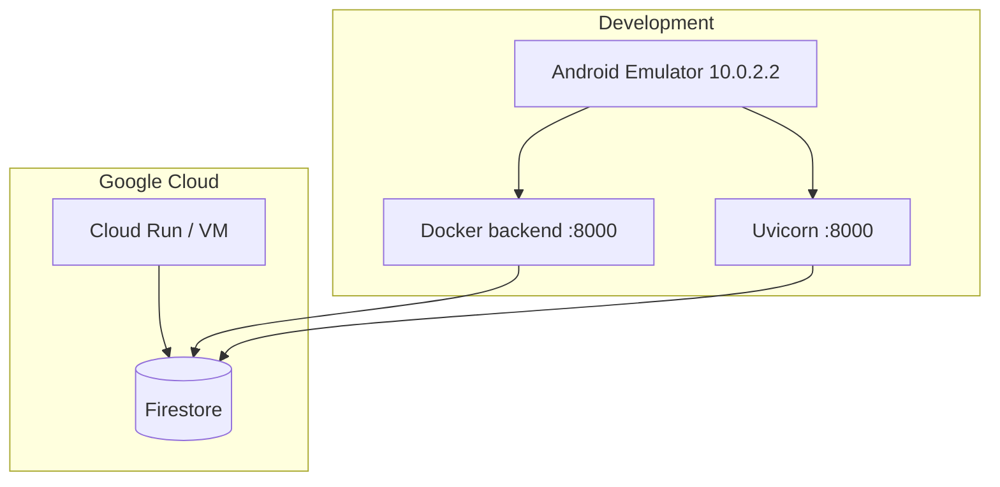

# AthleAgent Backend — High Level Design (HLD)

| Field | Value |
|-------|-------|
| **Version** | 1.3 |
| **Date** | 2026-07-11 |
| **Audience** | Backend developers, DevOps, course evaluators |
| **Related docs** | [FEATURES.md](FEATURES.md) · [docs/HLD_PROJECT.md](../../docs/HLD_PROJECT.md) · [docs/DOCKER.md](../../docs/DOCKER.md) · [../README.md](../README.md) |

---

## 1. Backend Role

The AthleAgent backend is a **stateless inference service** that:

1. Reads a daily snapshot from Cloud Firestore
2. Engineers features and enriches them with a 7-day history window
3. Runs an XGBoost classifier (`predict_proba`)
4. Merges prediction results back into Firestore

The backend is **not** responsible for:

- UI or user data collection
- Firebase Authentication (handled on the client)
- Meal image analysis (Gemini, client-side)
- Model training (separate pipeline under `ML_model/`)

---

## 2. System Context (Backend View)


```mermaid
C4Context
    title AthleAgent Backend — Context

    System(backend, "FastAPI Backend", "ML Inference Service")

    System_Ext(android, "Android App", "Trigger + read results")
    System_Ext(firestore, "Cloud Firestore", "Source of truth")
    System_Ext(artifacts, "ML Artifacts", "injury_model.pkl + manifest")

    Rel(android, backend, "POST /predict/daily", "HTTP/JSON")
    Rel(backend, firestore, "Read snapshot, Write prediction", "Firebase Admin SDK")
    Rel(backend, artifacts, "Load at startup", "joblib + JSON")
```

---

## 3. Logical Architecture


```mermaid
flowchart TB
    subgraph HTTP["API Layer"]
        Health["GET /health"]
        Predict["POST /predict/daily"]
        Status["GET /status/ml"]
    end

    subgraph Services["Service Layer"]
        PS[prediction/service]
        HS[history/inference_bundle + persist]
        PP[preprocessing]
        FE[feature_engineering]
        MF[model_features]
    end

    subgraph ML["ML Layer"]
        ML_L[model_loader]
        XGB[XGBoost estimator]
    end

    subgraph Data["Data Layer"]
        FS[(Firestore)]
    end

    Predict --> PS
    PS --> HS
    PS --> PP
    PP --> FE
    FE --> MF
    PS --> ML_L
    ML_L --> XGB
    HS <--> FS
    PS --> HS
    Status --> ML_L
```

### 3.1 Design Principles

| Principle | Implementation |
|-----------|----------------|
| **Single source of truth** | Firestore — the backend does not accept a full feature payload from the client |
| **Minimal trigger contract** | `{userId, date}` only |
| **Fail closed on model** | If an ML gate fails → HTTP 503; no ungated demo fallback outside development |
| **Merge write** | Prediction results merge into `daily_health/{date}` |
| **Defaults for sparse data** | `data/model_feature_contract.json` + `HistoryConfidence` enum |

---

## 4. API Surface

### 4.1 Production Endpoints

| Endpoint | Method | Purpose | Auth |
|----------|--------|---------|------|
| `/predict/daily` | POST | Daily prediction + persist | **None** |
| `/health` | GET | Liveness probe | None |
| `/status/ml` | GET | Model operational status | None |

### 4.2 Development Endpoints

| Endpoint | Method | Purpose |
|----------|--------|---------|
| `/test_predict` | POST | Mock response for UI tests (behind `ENABLE_TEST_PREDICT_ENDPOINT`) |

### 4.3 Observability Endpoint

| Endpoint | Method | Purpose |
|----------|--------|---------|
| `/api/v1/observability/client-events` | POST | Android telemetry ingestion (202 Accepted) |

### 4.4 Production Contract

**Request:**

```json
{
  "userId": "firebase-uid",
  "date": "2026-06-19"
}
```

**Response:**

```json
{
  "risk_level": "Medium",
  "risk_score": 0.4521,
  "prediction_confidence": 78.5
}
```

**Firestore merge** (`users/{uid}/daily_health/{date}`):

| Response field | Firestore field | Transform |
|----------------|-----------------|-----------|
| `risk_score` | `finalRiskScore` | × 100, round 2 |
| `risk_level` | `riskLevel` | as-is |
| `prediction_confidence` | `predictionConfidence` | as-is |
| — | `predictionUpdatedAt` | ISO UTC (Firestore only) |

> **Display source of truth on Android:** Firestore (`finalRiskScore` 0–100), not the `POST /predict/daily` response body.  
> `risk_score` in the API (0–1) is raw ML output; the app treats the endpoint as a trigger (`isSuccessful`) and reads the result from the Firestore document.

---

## 5. Prediction Flow (Production)


```mermaid
sequenceDiagram
    participant Client as Android
    participant API as predict.py
    participant PS as prediction/service
    participant HS as history package
    participant ML as XGBoost
    participant FS as Firestore

    Client->>API: POST /predict/daily
    API->>PS: predict_injury_risk_from_firestore()
    PS->>HS: fetch_inference_firestore_bundle()
    HS->>FS: batch read profile, health, checkins, nutrition + history
    FS-->>HS: snapshot + history_context
    PS->>PS: build InjuryPredictionRequest (merge policy)
    PS->>PS: preprocessing + feature engineering
    PS->>PS: apply_history_confidence_fallback (from bundle context)
    PS->>ML: predict_proba(X)
    ML-->>PS: probability
    PS->>PS: risk bands + confidence
    API->>HS: save_daily_prediction_result()
    HS->>FS: merge write (finalRiskScore, riskLevel, …)
    API-->>Client: InjuryPredictionResponse (trigger only — UI reads FS)
    Note over Client,FS: Dashboard reads finalRiskScore from Firestore, not HTTP body
```

### 5.1 Date Merge Policy (day D = wake-up day)

| Data source | Firestore path | Key fields |
|-------------|----------------|------------|
| Sleep / recovery | `daily_health/{D}` | sleepMinutes, HRV (morning) |
| Physical load | `daily_health/{D-1}` only | steps, distance, calories, HR (>0 for load signal) |
| Survey | `daily_checkins/{D}` | energy, soreness, stress, injuredYesterday |
| Nutrition | `daily_nutrition/{D-1}` + population averages | totalCalories, protein, carbs; `nutritionImputed` → −0.12 confidence |
| Profile | `users/{uid}` | `birth_date`, historyInjuryCount → model: `age` (derived) |

---

## 6. Data Model — Firestore (Backend View)


```mermaid
erDiagram
    USERS ||--o{ DAILY_HEALTH : "subcollection"
    USERS ||--o{ DAILY_CHECKINS : "subcollection"
    USERS ||--o{ DAILY_NUTRITION : "subcollection"

    USERS {
        string uid PK
        string birth_date "yyyy-MM-dd"
        int historyInjuryCount
    }

    DAILY_HEALTH {
        string date PK
        int sleepMinutes "read: D"
        int steps "read: D-1"
        float finalRiskScore "write: backend"
        string riskLevel "write: backend"
        float predictionConfidence "write: backend"
    }

    DAILY_CHECKINS {
        string date PK
        int energyLevel
        int muscleSoreness
        int stressLevel
    }

    DAILY_NUTRITION {
        string date PK
        float totalCalories
        int totalProtein
        int totalCarbs
    }
```

> **Age in the model:** Firestore stores `birth_date` (string `yyyy-MM-dd`). The backend computes model feature `age` in `age_from_profile()` relative to prediction date `D`. If `birth_date` is missing, `settings.PROFILE_DEFAULT_AGE` (**22**) is used and `ageImputed=true` (confidence penalty).

> Full contract: [FEATURES.md](FEATURES.md)

---

## 7. ML Integration

### 7.1 Model Lifecycle


```mermaid
flowchart LR
    Train[ML_model/train_model.py] --> Artifact[injury_model.pkl]
    Validate[validate_metrics.py] --> Gate{Recall ≥ 0.80<br/>AUC ≥ 0.68}
    Gate -->|pass| Promote[promoted.json]
    Promote --> Startup[model_loader.load_model]
    Startup --> Serve[predict_proba]
    Gate -->|fail| Blocked[503 on /predict/daily]
```

**Resolution order at startup:**

1. Explicit `MODEL_PATH` override (if set)
2. `ML_model/artifacts/promoted.json` → `model_path`
3. `backend/injury_model.pkl` fallback (ungated only when `APP_ENV=development`)

**Fail-closed behavior:** If manifest gates fail or the promoted artifact is missing in non-development environments, `_model_live` stays `false` and `POST /predict/daily` returns **503** (`model_not_live:*`). There is no silent fallback to a demo score in production.

### 7.2 Inference Output

| Stage | Output |
|-------|--------|
| `predict_proba` | Probability 0–1 (injury class) |
| Risk bands | Low ≤ 20% · Medium 21–70% · High > 70% (`services/risk_levels.py`, aligned with Android) |
| Confidence | Blend: 60% history confidence + 40% data quality |

> **Note:** The training threshold in `run_manifest.json` is used for Recall/Precision evaluation only — not for production `risk_level` classification.

### 7.3 Feature Count

35 features — source of truth: `services/model_features.py` and `data/model_feature_contract.json`

---

## 8. Configuration

**No `.env` file is required.** All defaults live in `backend/config.py` (pydantic-settings). To override locally, copy [`backend/.env.example`](../.env.example) to `backend/.env` (or repo-root `.env`) and uncomment the variables you need.

| Setting | Source | Default |
|---------|--------|---------|
| `MODEL_PATH` | env (optional) | `None` → `ML_model/artifacts/promoted.json` → `backend/injury_model.pkl` |
| `FIREBASE_SERVICE_ACCOUNT_KEY` | env / bundled file | `backend/firebase-key.json` when present |
| `ML_MIN_RECALL_HARD` | env | `0.80` |
| `ML_MIN_AUC_FOR_LIVE` | env | `0.68` |
| `ENABLE_TEST_PREDICT_ENDPOINT` | env | `false` |
| `CORS_ORIGINS` | env | `http://localhost:3000`, `http://localhost:8080` |
| `VERSION` | config | `1.0.0` |

**Local credentials:** place `backend/firebase-key.json` on disk (gitignored). For production deployments, use Secret Manager instead of committing service-account keys.

---

## 9. Deployment Topology


```mermaid
flowchart TB
    subgraph GCP["Google Cloud"]
        FS[(Firestore)]
        CR[Cloud Run / VM]
    end

    subgraph Local["Development"]
        Docker[Docker backend :8000]
        UV[Uvicorn :8000]
        Emulator[Android Emulator 10.0.2.2]
    end

    Emulator --> Docker
    Emulator --> UV
    CR --> FS
    Docker --> FS
    UV --> FS
```

**Docker (recommended for evaluators):**

```bash
# From repository root — see docs/DOCKER.md
docker compose up --build
```

`docker-compose.yml` binds to `127.0.0.1:8000`, mounts `backend/firebase-key.json`, and sets `FIREBASE_SERVICE_ACCOUNT_KEY=/app/backend/firebase-key.json`. An optional repo-root `.env` may be supplied; it is not required.

**Local Python (uvicorn):**

```bash
cd backend
uvicorn main:app --host 0.0.0.0 --port 8000
```

The Android emulator reaches the host API at `10.0.2.2:8000`.

---

## 10. Security

### 10.1 Current State

- **No authentication** on `/predict/daily`
- Firebase Admin SDK with a service account for Firestore access
- CORS limited to localhost web dev origins
- Docker binds to localhost only

### 10.2 Production Recommendations

1. Middleware: verify Firebase ID Token
2. Validate `userId` == `token.uid`
3. HTTPS only
4. Rate limiting
5. Secrets via Secret Manager (do not commit `firebase-key.json`)

---

## 11. Observability

### 11.1 Unified System Log (Backend + Android)

| Component | Location | Description |
|-----------|----------|-------------|
| **Unified log file** | `logs/athleagent.log` (repo root) | Backend HTTP + domain events + Android telemetry |
| Logger | `utils/logging.py` | `RotatingFileHandler` (10 MB × 5), stdout mirror |
| Request context | `utils/request_context.py` | `contextvars`: `request_id`, `user_id` |
| HTTP middleware | `middleware/request_logging.py` | Smart filtering, `X-Request-ID` echo, `duration_ms` |
| Client events API | `POST /api/v1/observability/client-events` | Android errors + navigation + key actions |
| Rate limiter | `utils/client_event_limiter.py` | Dedup screen/action/sync events |
| Trace helper | `backend/scripts/trace_request.sh` | Filter by `request_id`, `event`, or `source` via `jq` |

**Log file:** [`logs/athleagent.log`](../../logs/athleagent.log) — gitignored; single troubleshooting surface for backend and Android events.

**Environment variables** (`config.py`):

| Variable | Default | Description |
|----------|---------|-------------|
| `LOG_DIR` | `<repo>/logs` | Unified log directory |
| `LOG_FILE_NAME` | `athleagent.log` | Active log filename |
| `LOG_LEVEL` | `INFO` | Python log level |
| `LOG_MAX_BYTES` | `10000000` | Rotating file size |
| `LOG_BACKUP_COUNT` | `5` | Rotated file retention |
| `CLIENT_EVENT_RATE_LIMIT_*_SEC` | 30/10/15/5 | screen / action / sync / ml_trigger |

**Structured log metadata** — domain events attach fields via Python `extra`:

```json
{
  "event": "http_request_completed",
  "source": "backend",
  "request_id": "a1b2c3d4-...",
  "user_id": "firebaseUid",
  "method": "POST",
  "path": "/predict/daily",
  "status_code": 200,
  "duration_ms": 842,
  "service": "AthleAgent API",
  "version": "1.0.0"
}
```

**Android client event (same file, `source: android`):**

```json
{
  "event": "client_event",
  "source": "android",
  "client_event_type": "ml_trigger",
  "client_tag": "ML_Trigger",
  "client_message": "predict/daily onFailure: Connection refused",
  "client_screen": "DailyCheckInActivity",
  "request_id": "...",
  "user_id": "..."
}
```

**Allowed `client_event_type` values:**

| Type | When to use | Backend log level | Rate limit |
|------|-------------|-------------------|------------|
| `error` | Retrofit/Firestore/Gemini failures | WARNING | none |
| `screen_view` | Main Activity opened | INFO | 30s / screen |
| `user_action` | Submit check-in, save meal, join team | INFO | 10s / action |
| `ml_trigger` | Before/after `/predict/daily` call | INFO | 5s |
| `sync` | Watch sync started/completed/failed | INFO | 15s |

**Backend domain events** (`source: backend`):

- `http_request_completed`, `http_unhandled_error`
- `predict_data_quality`, `predict_confidence_summary`, `predict_blocked`
- `model_loaded`, `model_startup_blocked`, `domain_error`, `server_startup`, `server_shutdown`

**Trace examples:**

```bash
./backend/scripts/trace_request.sh trace-req-001
./backend/scripts/trace_request.sh --event client_event
./backend/scripts/trace_request.sh --source android
```

**Manual test (no Android):**

```bash
curl -X POST http://localhost:8000/api/v1/observability/client-events \
  -H "Content-Type: application/json" \
  -H "X-Request-ID: test-manual-001" \
  -d '{"event_type":"screen_view","level":"INFO","tag":"Dashboard","screen":"AthleteDashboardActivity","message":"screen_opened","user_id":"demo","app_version":"1.0"}'
```

### 11.2 ML Lineage

| Mechanism | Location |
|-----------|----------|
| Run snapshot | `ML_model/artifacts/<run_id>/run_manifest.json` |
| Promotion pointer | `ML_model/artifacts/promoted.json` |
| Live status | `GET /status/ml` |

### 11.3 Firestore (Data Audit)

Predictions and daily snapshots = **state**. Unified log = **events** (no raw health payloads).

### 11.4 Appendix — Android Integration (Implemented)

**Dependencies:** `okhttp` 4.12, `timber` 5.0.1

**Files:**

| File | Purpose |
|------|---------|
| `observability/CorrelationIdInterceptor.kt` | Header `X-Request-ID` on all API calls |
| `observability/RequestIdHolder.kt` | Last request ID for error correlation |
| `observability/ObservabilityApi.kt` | `POST /api/v1/observability/client-events` |
| `observability/ClientEventReporter.kt` | Fire-and-forget reporter (IO dispatcher) |

**Wired in:** `ApiClient.kt`, `App.kt`, `WearableSyncActivity`, `DailyCheckInActivity`, `MealAnalysisActivity`, `AthleteDashboardActivity`

**Events to emit (minimum for graduation demo):**

| Activity | event_type | tag | message example |
|----------|------------|-----|-----------------|
| `AthleteDashboardActivity` | `screen_view` | `Dashboard` | `screen_opened` |
| `DailyCheckInActivity` | `screen_view` | `DailyCheckIn` | `screen_opened` |
| `DailyCheckInActivity` | `user_action` | `DailyCheckIn` | `checkin_submitted` |
| `DailyCheckInActivity` | `ml_trigger` | `ML_Trigger` | `predict_daily_started` |
| `DailyCheckInActivity` | `error` | `ML_Trigger` | `onFailure: ...` |
| `WearableSyncActivity` | `sync` | `Sync` | `health_connect_sync_completed` |

**Client rules:**

- Message ≤ 500 chars; no PHI; no stack traces
- Include `user_id` (Firebase uid) when logged in
- Reuse `RequestIdHolder.current` as `request_id`
- Swallow reporter failures silently (never block UI)
- Local debug remains Logcat/Timber only

---

## 12. Testing Strategy

| Type | Files |
|------|-------|
| Unit | `tests/unit/test_preprocessing.py`, `tests/unit/test_prediction_service.py`, `tests/unit/test_confidence_fallback.py`, `tests/unit/test_field_transforms.py`, `tests/unit/test_feature_engineering.py`, `tests/unit/test_history_repository.py`, `tests/unit/test_nutrition_defaults.py`, `tests/unit/test_model_loader.py`, `tests/unit/test_exceptions.py`, `tests/unit/test_config.py`, `tests/unit/test_risk_levels.py`, `tests/unit/test_request_context.py` |
| Integration | `tests/integration/test_routes_predict_daily.py`, `tests/integration/test_routes_ml_status.py`, `tests/integration/test_openapi_contract.py`, `tests/integration/test_routes_health.py`, `tests/integration/test_request_logging.py` |
| Contract | `tests/unit/test_validation.py`, `tests/integration/test_prediction_model_columns.py`, `tests/unit/test_feature_type_contract.py` |
| Gates | `tests/unit/test_model_loader.py` |
| Error paths | `tests/integration/test_routes_predict_daily.py`, `tests/unit/test_exceptions.py` |

---

## 13. Limitations and SLOs

| Metric | Target | Notes |
|--------|--------|-------|
| Latency p95 | < 2s | Depends on Firestore reads |
| Availability | 99% | Single instance in dev |
| Model freshness | Manual promote | `run_pipeline.py` |
| History window | 7 days | Lookback for rolling features |

---

## 14. Document Map

| Document | Content |
|----------|---------|
| [../README.md](../README.md) | Run, config, API sketch, tests |
| [FEATURES.md](FEATURES.md) | Production feature contract |
| [RISK_SCORE.md](RISK_SCORE.md) | End-to-end risk pipeline |
| [MODEL.md](MODEL.md) | ML ops configuration |
| [docs/HLD_PROJECT.md](../../docs/HLD_PROJECT.md) | Full-project HLD |
| [docs/LLD_PROJECT.md](../../docs/LLD_PROJECT.md) | Full-project LLD |
