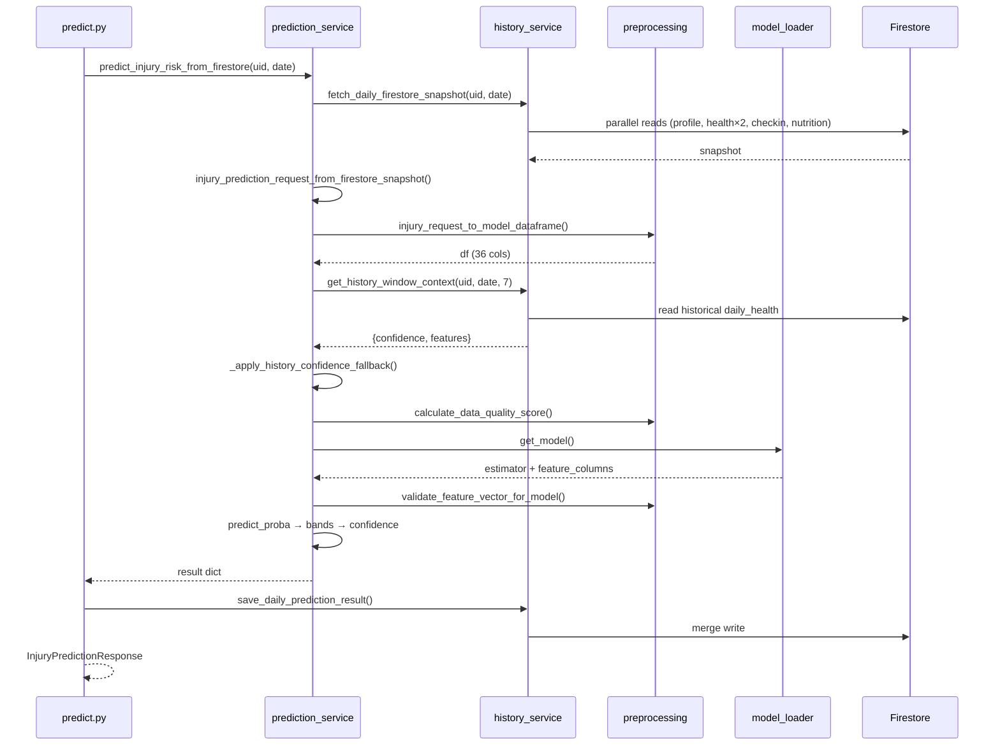
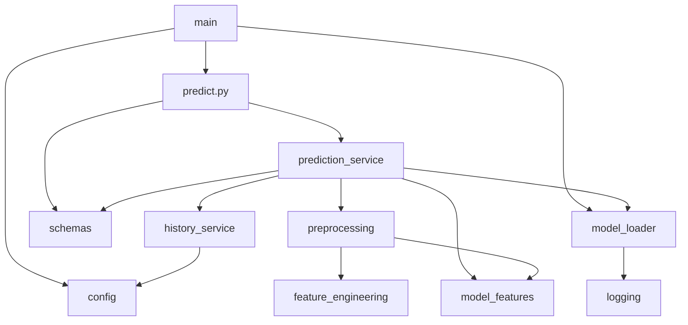

# AthleAgent Backend — Low Level Design (LLD)
## מסמך עיצוב ברמה נמוכה — Backend בלבד

| שדה | ערך |
|-----|-----|
| **גרסה** | 1.1 |
| **תאריך** | 2026-06-20 |
| **קהל יעד** | מפתחי backend |
| **מסמכים קשורים** | [HLD.md](HLD.md) · [FEATURES.md](FEATURES.md) · [docs/LLD_PROJECT.md](../../docs/LLD_PROJECT.md) |

---

## 1. מבנה תיקיות ומודולים

```
backend/
├── main.py                     # FastAPI app, CORS, startup load_model
├── config.py                   # Settings (pydantic-settings)
├── data/
│   └── model_feature_contract.json
├── api/
│   └── routes/
│       ├── health.py           # GET /, GET /health
│       ├── predict.py          # prediction endpoints
│       └── observability.py    # client telemetry
├── services/
│   ├── prediction_service.py   # backward-compat re-exports
│   ├── prediction/             # service, bundle, confidence, firestore_mapping
│   ├── history_service.py      # backward-compat re-exports
│   ├── history/                # firestore_client, repository, rolling_features, date_utils
│   ├── preprocessing/          # quality, validation, scales, request_mapping
│   ├── feature_engineering.py  # derived features
│   ├── field_transforms.py     # Firestore field helpers
│   ├── model_features.py       # loads contract JSON from disk
│   └── risk_levels.py
├── schemas/
│   ├── inference.py            # Pydantic models
│   ├── enums.py                # HistoryConfidence, ModelGateReason, ModelLiveStatus
│   └── types.py
├── ml/
│   └── model_loader.py         # joblib load + manifest gates
├── middleware/
│   └── request_logging.py
├── utils/
│   ├── logging.py
│   ├── client_event_limiter.py # TTL + max-key eviction
│   └── exceptions.py
├── scripts/                    # ops utilities
└── tests/
    ├── unit/
    └── integration/
```

---

## 2. Entry Point — `main.py`

```python
app = FastAPI(title="AthleAgent API", version="1.0.0")
app.add_middleware(CORSMiddleware, ...)
app.include_router(health_router)
app.include_router(predict_router)

@app.on_event("startup")
async def startup_event():
    load_model(settings.MODEL_PATH)  # gate-validated
```

| Event | Action |
|-------|--------|
| Startup | Load XGBoost bundle from `MODEL_PATH` or `promoted.json` |
| Shutdown | Log only |
| Run (Docker) | `docker compose up --build` from repo root — see [`docs/DOCKER.md`](../../docs/DOCKER.md) |
| Run (local) | `uvicorn main:app --host 0.0.0.0 --port 8000` |

---

## 3. Configuration — `config.py`

```python
class Settings(BaseSettings):
    ENABLE_TEST_PREDICT_ENDPOINT: bool = False
    MODEL_PATH: str = "ML_model/artifacts/20260512_075115/injury_model.pkl"
    FIREBASE_SERVICE_ACCOUNT_KEY: Optional[str]  # default: backend/firebase-key.json
    GEMINI_API_KEY: Optional[str]                 # unused in routes
    CORS_ORIGINS: list = ["http://localhost:3000", ...]
    PROJECT_NAME: str = "AthleAgent API"
    VERSION: str = "1.0.0"
```

---

## 4. API Layer — `api/routes/`

### 4.1 `health.py`

| Route | Response |
|-------|----------|
| `GET /` | `{status: "ok", service, version}` |
| `GET /health` | `{status: "healthy"}` |

### 4.2 `predict.py`

#### `POST /predict/daily` (Production)

```python
def predict_injury_daily(trigger: DailyPredictionTriggerRequest) -> InjuryPredictionResponse:
    result = predict_injury_risk_from_firestore(trigger.userId, trigger.date)
    persist_prediction_result_or_raise(trigger.userId, trigger.date, result)
    return InjuryPredictionResponse(**result)
```

**Error handling:** domain exceptions via `register_exception_handlers()` — `MLModelError` / `DatabaseError` → **503**, `ValidationError` → **422** (structured `detail` + optional `code`).

**Client contract:** Android treats this endpoint as a **trigger** (`isSuccessful` only). UI reads `finalRiskScore` / `riskLevel` / `predictionConfidence` from Firestore after the merge write — not from the HTTP response body.

#### `GET /status/ml`

Returns from `get_model_status()`:
```json
{
  "status": "Live|Blocked",
  "gate_reason": "none|manifest_recall_below_hard_gate|...",
  "winner": "XGBoostDeep",
  "threshold": 0.18,
  "policy": {},
  "degraded_rc": false
}
```

#### `POST /test_predict` (Development)

Mock response for UI/API smoke tests. Disabled by default (`ENABLE_TEST_PREDICT_ENDPOINT=false` → HTTP 404).

---

## 5. Schemas — `schemas/inference.py`

### 5.1 Production Types

| Class | Fields | Usage |
|-------|--------|-------|
| `DailyPredictionTriggerRequest` | `userId`, `date` | API input |
| `InjuryPredictionResponse` | `risk_level`, `risk_score`, `prediction_confidence` | API output |
| `InjuryPredictionRequest` | 40+ optional camelCase fields | Internal after Firestore merge |

### 5.2 `InjuryPredictionRequest` — Field Groups

| Group | Fields |
|-------|--------|
| Profile | `age` (נגזר מ-`birth_date` בפרופיל Firestore), `historyInjuryCount` |
| Health Connect | `sleepMinutes`, `steps`, `distanceMeters`, `activeCalories`, `totalCalories`, `heartRate*`, `hrvRmssd`, `restingHeartRate`, `bodyFatPct`, `vo2Max`, `elevationGainedMeters`, `floorsClimbed`, `avgSpeed`, `maxSpeed`, `avgPower`, `avgCadence`, `respiratoryRate`, `oxygenSaturation`, `weightKg`, `heightCm`, `bmrCalories` |
| Check-in | `energyLevel`, `muscleSoreness`, `stressLevel`, `injuredYesterday` |
| Nutrition | `totalProtein`, `totalCarbs`, `mealsLoggedCount`, `nutritionTotalCalories` |

All fields optional — service applies defaults.

---

## 6. Service Layer

### 6.1 `services/prediction/` — Function Map

| Module / Function | Responsibility |
|----------|----------------|
| `service.predict_injury_risk_from_firestore` | Main entry: snapshot → predict |
| `firestore_mapping.injury_prediction_request_from_firestore_snapshot` | Firestore dict → Pydantic request |
| `service.predict_injury_risk` | Core inference logic |
| `confidence.apply_history_confidence_fallback` | 7-day rolling enrichment |
| `bundle.resolve_model_bundle` | Parse joblib dict contract |
| `confidence.prediction_confidence_0_100` | 0.6×history + 0.4×quality |
| `service.persist_prediction_result_or_raise` | Write or raise |
| `service.training_base_feature_dict_from_request` | Export path for retraining |

> `prediction_service.py` re-exports the above for backward compatibility and test monkeypatching.

#### Inference Logic (`predict_injury_risk`)

```
1. df = injury_request_to_model_dataframe(payload)
2. df, history_confidence = _apply_history_confidence_fallback(df, payload)
3. quality = calculate_data_quality_score(payload)
4. prediction_confidence = blend(history_confidence, quality.score)
5. model, cols, threshold, ... = _resolve_model_bundle(get_model())
6. if model is None → raise RuntimeError("model_not_live:...")
7. X = validate_feature_vector_for_model(df, model_contract)
8. proba = model.predict_proba(X)[0, 1]
9. risk_level = classify_risk_level(proba): Low ≤ 20%, Medium 21–70%, High > 70% (`risk_levels.py`)
10. return {risk_level, risk_score: proba, prediction_confidence}
```

#### Firestore Merge Policy (`injury_prediction_request_from_firestore_snapshot`)

| Field category | Source function | Priority |
|----------------|-----------------|----------|
| Sleep | `_today_only()` | `daily_health/{D}` |
| Physical | `_yesterday_only()` | `daily_health/{D-1}` בלבד |
| Survey | direct from checkins | `daily_checkins/{D}` |
| Nutrition | `merge_nutrition_with_history()` | `{D-1}` + `nutrition_defaults.py` |
| HR avg | `_firestore_doc_heartrate_avg()` | `daily_health/{D-1}` בלבד |

---

### 6.2 `services/history/` — Function Map

| Module / Function | Responsibility |
|----------|----------------|
| `firestore_client.get_firestore_client()` | Firebase Admin init (singleton) |
| `repository.fetch_daily_firestore_snapshot` | Profile + D + D-1 docs |
| `repository.get_history_window_context` | Rolling features + `HistoryConfidence` enum |
| `rolling_features.compute_historical_derived_features` | ACWR, sleep_debt, hrv_drop |
| `repository.save_daily_prediction_result` | Merge write to daily_health |
| `repository.merge_nutrition_with_history` | אתמול + ממוצעים כלליים; מחזיר `(doc, imputed)` |
| `repository.fetch_injury_tomorrow_label` | Training label from D+1 checkin |
| `repository.stable_athlete_numeric_id` | SHA256 → int for CSV export |

> `history_service.py` re-exports the above (including `_get_firestore_client` alias).

#### Rolling Features (`compute_historical_derived_features`)

Input: list of `{date_key, daily_distance_km, sleep_hours, hrv_score}` per day.

| Feature | Formula |
|---------|---------|
| `acute_load_7d` | 7-day rolling mean of `daily_distance_km` |
| `chronic_load_21d` | approximated from weekly mean + std (7-day window) |
| `acwr_ratio` | acute / chronic, clipped [0.35, 2.8] |
| `sleep_debt_3d` | rolling sum of `(8.0 - sleep_hours)`, 3 days |
| `hrv_drop` | current hrv - 7d rolling mean, clipped [-15, 15] |

#### History Confidence Levels

| Level | Condition | Rolling features |
|-------|-----------|------------------|
| `HistoryConfidence.HIGH` | ≥ 7 days history | computed from Firestore |
| `HistoryConfidence.MEDIUM` | 4–6 days | computed |
| `HistoryConfidence.LOW` | < 4 days or new athlete | `DEFAULT_FEATURE_VALUES` for rolling cols |

#### Firestore Read (`fetch_daily_firestore_snapshot`)

```
users/{uid}                                    → profile
users/{uid}/daily_health/{date}                → health_today
users/{uid}/daily_health/{date-1}              → health_yesterday
users/{uid}/daily_checkins/{date}              → checkins
users/{uid}/daily_nutrition/{date-1}           → nutrition_yesterday
```

#### Firestore Write (`save_daily_prediction_result`)

```python
{
    "finalRiskScore": round(risk_score * 100, 2),
    "riskLevel": risk_level,
    "predictionConfidence": prediction_confidence,
    "predictionUpdatedAt": datetime.utcnow().isoformat() + "Z"
}
# merge=True on daily_health/{date}
```

---

### 6.3 `services/preprocessing/`

| Module / Function | Responsibility |
|----------|----------------|
| `request_mapping.injury_request_to_model_dataframe` | Pydantic → 1-row DataFrame (36 cols) |
| `quality.calculate_data_quality_score` | Completeness score 0–1 |
| `validation.validate_feature_vector_for_model` | Align columns to bundle |
| `scales.stress_to_model_scale` / `soreness_to_model_scale` / `energy_to_model_scale` | Android → training scale |
| `helpers.safe_float` / `is_present` | Numeric + presence helpers |

**Key transforms (request → model columns):**

| Firestore field | Model column | Transform |
|-----------------|--------------|-----------|
| `sleepMinutes` | `sleep_hours` | minutes / 60, clip [3, 12] |
| `distanceMeters` / `steps` | `daily_distance_km` | m/1000 or steps×0.0008 |
| `heightCm`, `weightKg` | `bmi` | weight / (height/100)² |
| `hrvRmssd` | `hrv_score` | direct or proxy from resting HR |
| `restingHeartRate` | `resting_hr` | priority chain |
| `nutritionTotalCalories` | `nutrition_intake_calories` | direct |
| `activeCalories` | `active_calories_burned` | direct |
| `oxygenSaturation` | `spo2` | direct |

---

### 6.4 `feature_engineering.py`

Derived features computed in preprocessing:

| Feature | Derivation |
|---------|------------|
| `calorie_balance` | intake - burned |
| `load_recovery_imbalance` | f(acwr, sleep_debt) |
| `speed_intensity_ratio` | max_speed / avg_speed |
| `workout_intensity_minutes` | from active calories heuristic |

---

### 6.5 `model_features.py` + `data/model_feature_contract.json`

**36 model columns** — stored in `backend/data/model_feature_contract.json` and loaded once via `model_features.py` (not inline Python lists).

**Defaults:** `default_values` in the same JSON — population medians for imputation.

**Training exclusion:** `acwr_ratio_ma7`, `sleep_hours_ma7` recomputed in `train_model.add_sequential_features`.

---

## 7. ML Layer — `ml/model_loader.py`

### 7.1 State Variables

```python
_estimator: Optional[Any] = None
_model_gate_reason: str = "model_not_loaded"
_model_live: bool = False
_active_manifest: dict = {}
```

### 7.2 Load Sequence

```
1. Resolve path: explicit → promoted.json → default injury_model.pkl
2. Load manifest (run_manifest.json)
3. _validate_manifest_for_live():
   - winner exists
   - Recall@Threshold ≥ 0.80
   - ROC-AUC ≥ 0.68
   - model file exists
4. joblib.load(path) → _estimator
5. _model_live = True
```

### 7.3 Model Bundle Contract

```python
{
    "estimator": <sklearn-compatible classifier>,
    "feature_columns": ["bmi", "age", ...],  # 36 names
    "threshold": 0.18,
    "medium_threshold": 0.11,  # optional
    "winner": "XGBoostDeep"
}
```

### 7.4 Gate Constants

```python
MIN_RECALL_HARD = 0.80
MIN_AUC_FOR_LIVE = 0.68
```

---

## 8. Data Quality Scoring

`calculate_data_quality_score(payload)` returns:

```python
{
    "score": 0.0-1.0,
    "sensitive_missing": [...],
    "hard_missing": [...],
    "has_hard_blocker": bool
}
```

**Sensitive fields:** `sleepMinutes`, `steps`, `distanceMeters`, `heartRateAvg`, `stressLevel`, `muscleSoreness`, `hrvRmssd`, `restingHeartRate`  
**Imputation flag:** `nutritionImputed` → counts as `nutrition_imputed` (−0.12)  
**Hard fields:** `userId`, `date` (+ load signal: steps/dist/activeCal **>0**; recovery signal)

Used in: `prediction_confidence = 0.6 × history_score + 0.4 × quality_score`

---

## 9. Error Catalog

| Error | Source | HTTP | When |
|-------|--------|------|------|
| `firestore_snapshot_unavailable` | history_service | 503 | Firestore client None or read fail |
| `model_not_live:*` | prediction_service | 503 | Gate failed or model not loaded |
| `prediction_persist_failed` | history_service | 503 | Write returned False |

---

## 10. Scripts (Ops)

| Script | Purpose |
|--------|---------|
| `seed_demo_athlete_firestore.py` | Demo data for testing |
| `build_training_dataset_from_firestore.py` | Export CSV for retraining |
| `introspect_firestore.py` | Debug Firestore structure |
| `smoke_uvicorn.py` | Server smoke test |

---

## 11. Test Coverage Map

| Test file | Covers |
|-----------|--------|
| `tests/integration/test_routes_predict_daily.py` | Production predict route, error paths |
| `tests/integration/test_inference_edge_cases.py` | Sparse payloads, missing fields |
| `tests/unit/test_history_service.py` | Snapshot fetch, rolling features, persist |
| `tests/unit/test_preprocessing.py` | DataFrame building, quality score |
| `tests/unit/test_feature_engineering.py` | Derived features |
| `tests/unit/test_model_loader.py` | Manifest validation, gates |
| `tests/unit/test_train_serve_parity.py` | Training CSV ↔ serving alignment |
| `tests/integration/test_prediction_model_columns.py` | 36-column contract |
| `tests/unit/test_exceptions.py` | Domain exception status codes |
| `tests/integration/test_openapi_contract.py` | OpenAPI path coverage |

---

## 12. Sequence — Full Request Lifecycle



---

## 13. Class / Module Dependency Graph



---

## 14. Known Implementation Gaps

| # | Location | Issue |
|---|----------|-------|
| 1 | `external/google_auth.py` | Not imported by any route |
| 2 | `config.GEMINI_API_KEY` | Configured but no Gemini routes |
| 3 | Android trigger gate | אין בדיקת עומס `{D-1}` > 0 לפני `/predict/daily` | חיזוי עם load חלש אם לא ענדו שעון אתמול |

---

## 15. Code References (Source of Truth)

| Concern | File |
|---------|------|
| Feature names | `services/model_features.py` |
| Nutrition defaults | `services/nutrition_defaults.py` |
| API contract | `schemas/inference.py` |
| Merge policy | `services/prediction_service.py` |
| Firestore I/O | `services/history_service.py` |
| Model gates | `ml/model_loader.py` |
| Settings | `config.py` |
