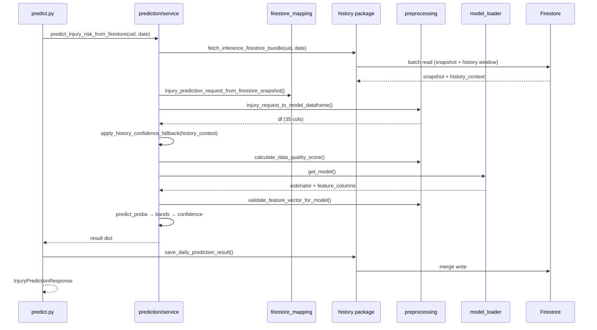
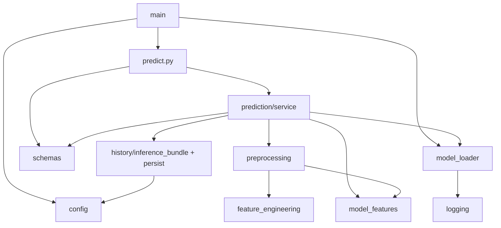

# AthleAgent Backend — Low Level Design (LLD)

| Field | Value |
|-------|-------|
| **Version** | 1.2 |
| **Date** | 2026-07-11 |
| **Audience** | Backend developers |
| **Related docs** | [HLD.md](HLD.md) · [FEATURES.md](FEATURES.md) · [docs/LLD_PROJECT.md](../../docs/LLD_PROJECT.md) |

---

## 1. Directory Layout and Modules

```
backend/
├── main.py                     # FastAPI app, CORS, lifespan load_model
├── config.py                   # Settings (pydantic-settings; no .env required)
├── data/
│   └── model_feature_contract.json
├── api/
│   └── routes/
│       ├── health.py           # GET /, GET /health
│       ├── predict.py          # prediction endpoints
│       └── observability.py    # POST /api/v1/observability/client-events
├── services/
│   ├── prediction/             # service, bundle, confidence, firestore_mapping
│   ├── history/                # firestore_client, repository, rolling_features, date_utils
│   ├── preprocessing/          # quality, validation, scales, request_features, request_mapping
│   ├── feature_engineering.py  # derived features
│   ├── field_transforms.py     # Firestore field helpers
│   ├── model_features.py       # loads contract JSON from disk
│   ├── nutrition_defaults.py   # population nutrition imputation
│   ├── profile_defaults.py     # age imputation from birth_date
│   └── risk_levels.py
├── schemas/
│   ├── inference.py            # Pydantic models
│   ├── observability.py        # Client event schema
│   ├── enums.py                # HistoryConfidence, ModelGateReason, ModelLiveStatus
│   └── types.py
├── ml/
│   └── model_loader.py         # joblib load + manifest gates + promoted.json
├── middleware/
│   └── request_logging.py
├── utils/
│   ├── logging.py
│   ├── request_context.py
│   ├── client_event_limiter.py # TTL + max-key eviction
│   └── exceptions.py
├── scripts/                    # ops utilities
├── firebase-key.json           # bundled for course evaluation (Admin SDK → Firestore)
├── injury_model.pkl            # fallback artifact when promoted pointer is missing
└── tests/
    ├── unit/
    └── integration/
```

---

## 2. Entry Point — `main.py`

```python
@asynccontextmanager
async def lifespan(app: FastAPI):
    load_model(settings.MODEL_PATH)  # gate-validated
    yield  # shutdown: log only

app = FastAPI(..., lifespan=lifespan)
app.add_middleware(CORSMiddleware, ...)
app.add_middleware(RequestLoggingMiddleware)
app.include_router(health_router)
app.include_router(predict_router)
app.include_router(observability_router)
register_exception_handlers(app)
```

| Event | Action |
|-------|--------|
| Startup (`lifespan` enter) | Load model bundle from `MODEL_PATH` or `promoted.json`; log warning if not Live |
| Shutdown (`lifespan` exit) | Log only |
| Run (Docker) | `docker compose up --build` from repo root — see [`docs/DOCKER.md`](../../docs/DOCKER.md) |
| Run (local) | `cd backend && uvicorn main:app --host 0.0.0.0 --port 8000` |

No `.env` file is required. Defaults are defined in `config.py`; optional overrides are documented in `backend/.env.example`.

---

## 3. Configuration — `config.py`

```python
class Settings(BaseSettings):
    APP_ENV: str = "development"
    ENABLE_TEST_PREDICT_ENDPOINT: bool = False
    PROJECT_NAME: str = "AthleAgent API"
    VERSION: str = "1.0.0"
    HOST: str = "0.0.0.0"
    PORT: int = 8000
    API_V1_PREFIX: str = "/api/v1"

    MODEL_PATH: Path | None = None  # None → promoted.json → injury_model.pkl
    ML_MIN_RECALL_HARD: float = 0.80
    ML_MIN_AUC_FOR_LIVE: float = 0.68

    FIREBASE_SERVICE_ACCOUNT_KEY: Path | None = None  # resolves to backend/firebase-key.json
    GOOGLE_APPLICATION_CREDENTIALS: Path | None = None

    CORS_ORIGINS: list[str] = ["http://localhost:3000", "http://localhost:8080"]
    # ... history, confidence, nutrition, logging, rate-limit settings
```

**Firebase key resolution** (`_resolve_firebase_key`):

1. Explicit `FIREBASE_SERVICE_ACCOUNT_KEY`
2. Else `GOOGLE_APPLICATION_CREDENTIALS`
3. Else bundled `backend/firebase-key.json` when the file exists

---

## 4. API Layer — `api/routes/`

### 4.1 `health.py`

| Route | Response |
|-------|----------|
| `GET /` | `{status: "ok", service, version}` |
| `GET /health` | `{status: "healthy"}` |

### 4.2 `predict.py`

#### `POST /predict/daily` (Production)

```python
def predict_injury_daily(trigger: DailyPredictionTriggerRequest) -> InjuryPredictionResponse:
    result = predict_injury_risk_from_firestore(trigger.userId, trigger.date)
    persist_prediction_result_or_raise(trigger.userId, trigger.date, result)
    return InjuryPredictionResponse(**result)
```

**Error handling:** domain exceptions via `register_exception_handlers()` — `MLModelError` / `DatabaseError` → **503**, `ValidationError` → **422** (structured `detail` + optional `code`).

**Client contract:** Android treats this endpoint as a **trigger** (`isSuccessful` only). UI reads `finalRiskScore` / `riskLevel` / `predictionConfidence` from Firestore after the merge write — not from the HTTP response body.

#### `GET /status/ml`

Returns from `get_model_status()`:

```json
{
  "status": "Live|Blocked",
  "gate_reason": "none|manifest_recall_below_hard_gate|...",
  "winner": "<from run_manifest.json>",
  "threshold": "<from run_manifest.json>",
  "policy": {},
  "run_id": "<from manifest or promoted.json>",
  "promoted_at_utc": "<from promoted.json>",
  "manifest_path": "<from promoted.json>",
  "winner_metrics": {
    "Recall@Threshold": 0.85,
    "ROC-AUC": 0.72
  }
}
```

#### `POST /test_predict` (Development)

Mock response for UI/API smoke tests. Disabled by default (`ENABLE_TEST_PREDICT_ENDPOINT=false` → HTTP 404).

### 4.3 `observability.py`

#### `POST /api/v1/observability/client-events`

Accepts `ClientEventIn`, applies rate limiting via `should_accept_client_event`, logs to the unified system log, returns **202** with `{accepted, request_id}`.

---

## 5. Schemas — `schemas/inference.py`

### 5.1 Production Types

| Class | Fields | Usage |
|-------|--------|-------|
| `DailyPredictionTriggerRequest` | `userId`, `date` | API input |
| `InjuryPredictionResponse` | `risk_level`, `risk_score`, `prediction_confidence` | API output |
| `InjuryPredictionRequest` | 40+ optional camelCase fields | Internal after Firestore merge |

### 5.2 `InjuryPredictionRequest` — Field Groups

| Group | Fields |
|-------|--------|
| Profile | `age` (derived from Firestore profile `birth_date`), `historyInjuryCount` |
| Health Connect | `sleepMinutes`, `steps`, `distanceMeters`, `activeCalories`, `totalCalories`, `heartRate*`, `hrvRmssd`, `restingHeartRate`, `bodyFatPct`, `vo2Max`, `elevationGainedMeters`, `floorsClimbed`, `avgSpeed`, `maxSpeed`, `avgPower`, `avgCadence`, `respiratoryRate`, `oxygenSaturation`, `weightKg`, `heightCm`, `bmrCalories` |
| Check-in | `energyLevel`, `muscleSoreness`, `stressLevel`, `injuredYesterday` |
| Nutrition | `totalProtein`, `totalCarbs`, `mealsLoggedCount`, `nutritionTotalCalories` |

All fields optional — the service applies defaults.

---

## 6. Service Layer

### 6.1 `services/prediction/` — Function Map

| Module / Function | Responsibility |
|-------------------|----------------|
| `service.predict_injury_risk_from_firestore` | Main entry: snapshot → predict |
| `firestore_mapping.injury_prediction_request_from_firestore_snapshot` | Firestore dict → Pydantic request |
| `service.predict_injury_risk` | Core inference logic |
| `confidence.apply_history_confidence_fallback` | 7-day rolling enrichment |
| `bundle.resolve_model_bundle` | Parse joblib dict → `ResolvedModelBundle` |
| `confidence.compute_prediction_confidence_percent` | 0.6×history + 0.4×quality |
| `service.persist_prediction_result_or_raise` | Write or raise |

#### Inference Logic (`predict_injury_risk`)

```
1. payload = resolve_request_nutrition(payload)
2. df = injury_request_to_model_dataframe(payload)   # request_features → derived → DataFrame
3. df, history_confidence = apply_history_confidence_fallback(df, payload)
4. quality = calculate_data_quality_score(payload)
5. prediction_confidence = compute_prediction_confidence_percent(history_confidence, quality.score)
6. bundle = resolve_model_bundle(get_model())  → ResolvedModelBundle
7. if bundle.estimator is None → raise MLModelError("model_not_live:...")
8. X = validate_feature_vector_for_model(df, model_contract)
9. proba = bundle.estimator.predict_proba(X)[0, 1]
10. risk_level = classify_risk_level(proba): Low ≤ 20%, Medium 21–70%, High > 70% (risk_levels.py)
11. return {risk_level, risk_score: proba, prediction_confidence}
```

#### Firestore Merge Policy (`injury_prediction_request_from_firestore_snapshot`)

| Field category | Source function | Priority |
|----------------|-----------------|----------|
| Sleep | `today_only()` | `daily_health/{D}` |
| Physical | `yesterday_only()` | `daily_health/{D-1}` only |
| Survey | direct from checkins | `daily_checkins/{D}` |
| Nutrition | raw `daily_nutrition/{D-1}` → `resolve_request_nutrition` in `predict_injury_risk` | `{D-1}` |
| HR avg | `heart_rate_avg_from_doc()` | `daily_health/{D-1}` only |

---

### 6.2 `services/history/` — Function Map

| Module / Function | Responsibility |
|-------------------|----------------|
| `firestore_client.get_firestore_client()` | Firebase Admin init (singleton) |
| `firestore_io.read_firestore_documents` | Batch / sequential document reads |
| `inference_bundle.fetch_inference_firestore_bundle` | Single batch: snapshot + history window |
| `history_window.get_history_window_context` | Rolling features + `HistoryConfidence` enum |
| `history_window.fetch_user_history` | Wake-up-day merged history rows |
| `day_quality.count_quality_history_days` | Usable watch-sync days (≥3 of 4 categories) |
| `history_merge.merge_wake_up_day_row` | physical@W-1 + sleep/survey@W |
| `rolling_features.compute_historical_derived_features` | ACWR, sleep_debt, hrv_drop |
| `persist.save_daily_prediction_result` | Merge write to daily_health |
| `repository` | Thin re-export facade for the modules above |

#### Rolling Features (`compute_historical_derived_features`)

Input: list of `{date_key, daily_distance_km, sleep_hours, hrv_score}` per day.

| Feature | Formula |
|---------|---------|
| `acute_load_7d` | 7-day rolling mean of `daily_distance_km` |
| `acwr_ratio` | acute / chronic, clipped [0.35, 2.8]; chronic = 7d baseline (mean×0.85 + std×0.35 + 0.5) |
| `sleep_debt_3d` | rolling sum of `(8.0 - sleep_hours)`, 3 days |
| `hrv_drop` | current hrv − 7d rolling mean, clipped [−15, 15] |

#### History Confidence Levels

A **quality day** = merged wake-up row with ≥ `HISTORY_MIN_WATCH_SYNC_SIGNAL_GROUPS` (default 3) of 4 watch categories: load, sleep, heart, energy (`day_quality.py`).

| Level | Condition (`quality_days_count`) | Rolling features |
|-------|----------------------------------|------------------|
| `HistoryConfidence.HIGH` | ≥ `HISTORY_CONFIDENCE_HIGH_MIN_DAYS` (7) | computed from Firestore |
| `HistoryConfidence.MEDIUM` | ≥ `HISTORY_CONFIDENCE_MEDIUM_MIN_DAYS` (4) | computed |
| `HistoryConfidence.LOW` | below medium threshold | `DEFAULT_FEATURE_VALUES` for rolling cols |

#### Firestore Read (`fetch_inference_firestore_bundle`)

Single batch read covering snapshot inputs **and** the history window:

```
users/{uid}                                    → profile
users/{uid}/daily_health/{date}                → health_today
users/{uid}/daily_health/{date-1}              → health_yesterday
users/{uid}/daily_checkins/{date}              → checkins
users/{uid}/daily_nutrition/{date-1}           → nutrition_yesterday
users/{uid}/daily_health|checkins/{W} …        → history wake-up days (lookback)
```
#### Firestore Write (`save_daily_prediction_result`)

```python
{
    "finalRiskScore": round(risk_score * 100, 2),
    "riskLevel": risk_level,
    "predictionConfidence": prediction_confidence,
    "predictionUpdatedAt": datetime.utcnow().isoformat() + "Z"
}
# merge=True on daily_health/{date}
```

---

### 6.3 `services/preprocessing/`

| Module / Function | Responsibility |
|-------------------|----------------|
| `request_features.base_model_features_from_request` | API fields → model-side feature dict |
| `request_mapping.injury_request_to_model_dataframe` | base + derived features → 1-row DataFrame |
| `quality.calculate_data_quality_score` | Completeness score 0–1 (`weak_fields`) |
| `validation.validate_feature_vector_for_model` | Align columns via `ModelServingContract` |
| `validation.parse_model_serving_contract` | Parse `{estimator, feature_columns}` dict |
| `scales.stress_to_model_scale` / `soreness_to_model_scale` / `energy_to_model_scale` | Android → training scale |
| `helpers.safe_float` / `is_absent_or_weak` | Numeric + presence helpers |

**Key transforms (request → model columns):**

| Firestore field | Model column | Transform |
|-----------------|--------------|-----------|
| `sleepMinutes` | `sleep_hours` | minutes / 60, clip [3, 12] |
| `distanceMeters` / `steps` | `daily_distance_km` | m/1000 or steps×0.0008 |
| `heightCm`, `weightKg` | `bmi` | weight / (height/100)² |
| `hrvRmssd` | `hrv_score` | direct or proxy from resting HR |
| `restingHeartRate` | `resting_hr` | priority chain |
| `nutritionTotalCalories` | `nutrition_intake_calories` | direct |
| `activeCalories` | `active_calories_burned` | direct |
| `oxygenSaturation` | `spo2` | direct |

---

### 6.4 `feature_engineering.py`

Derived features computed in preprocessing:

| Feature | Derivation |
|---------|------------|
| `calorie_balance` | intake − burned |
| `load_recovery_imbalance` | f(acwr, sleep_debt) |
| `speed_intensity_ratio` | max_speed / avg_speed |
| `workout_intensity_minutes` | `0` if distance ≤ 0.2 km; else `round(distance × 5.5 + active_cal / 40)` — shared with `ML_model/feature_contract.py` |

---

### 6.5 `model_features.py` + `data/model_feature_contract.json`

**35 model columns** — stored in `backend/data/model_feature_contract.json` and loaded once via:

| Function / constant | Role |
|---------------------|------|
| `load_model_feature_contract()` | Parse JSON (cached) |
| `MODEL_FEATURE_COLUMNS` | Column order for `predict_proba` |
| `INTEGER_FEATURE_COLUMNS` | 15 whole-number fields (from `integer_feature_columns` in JSON) |
| `coerce_whole_number_features()` | Round integer contract columns before inference DataFrame |
| `DEFAULT_FEATURE_VALUES` | Population defaults for thin history |
| `TRAINING_BASE_FEATURE_COLUMNS` | Columns present in training CSV export |

**Defaults:** `default_values` in the same JSON — population medians for imputation.

**Training exclusion:** `acwr_ratio_ma7`, `sleep_hours_ma7` recomputed in `train_model.add_sequential_features`.

**ML training:** `ML_model/feature_contract.py` loads the same JSON; `data_generator.py` calls `normalize_whole_number_columns()` + `assert_whole_number_columns()` at export.

---

## 7. ML Layer — `ml/model_loader.py`

### 7.1 State Variables

```python
_estimator: Optional[Any] = None
_model_gate_reason: str = "model_not_loaded"
_model_live: bool = False
_active_manifest: dict = {}
_active_promoted: dict = {}
```

### 7.2 Load Sequence

```
1. Resolve path: explicit MODEL_PATH → promoted.json → backend/injury_model.pkl
2. Load manifest (run_manifest.json adjacent to model or project default)
3. _validate_manifest_for_live():
   - winner exists
   - Recall@Threshold ≥ settings.ML_MIN_RECALL_HARD (0.80)
   - ROC-AUC ≥ settings.ML_MIN_AUC_FOR_LIVE (0.68)
   - optional policy recall_hard_min
   - model file exists
4. joblib.load(path) → _estimator
5. _model_live = True
```

**Fail-closed:** Any gate failure sets `_model_live = False` and leaves `_estimator = None`. `predict_injury_risk` raises `MLModelError("model_not_live:...")` → HTTP 503.

**Ungated fallback:** `backend/injury_model.pkl` loads without manifest gates only when `APP_ENV=development`. Outside development, `UNGATED_FALLBACK_BLOCKED` prevents serving.

### 7.3 Model Bundle Contract

```python
{
    "estimator": <sklearn-compatible XGBoost classifier>,
    "feature_columns": ["bmi", "age", ...],  # 35 names
    "threshold": "<from run_manifest.json>",
    "medium_threshold": 0.11,  # optional
    "winner": "<from run_manifest.json>"
}
```

### 7.4 Gate Constants

Configured in `settings` (override via env):

```python
ML_MIN_RECALL_HARD = 0.80
ML_MIN_AUC_FOR_LIVE = 0.68
```

`ModelGateReason` enum in `schemas/enums.py` enumerates all blocked states exposed via `gate_reason` on `GET /status/ml`.

---

## 8. Data Quality Scoring

`calculate_data_quality_score(payload)` returns:

```python
{
    "score": 0.0-1.0,
    "weak_fields": [...]
}
```

**Same-day measurement fields** (`SAME_DAY_MEASUREMENT_FIELDS`): missing, null, zero, or NaN → penalty **−0.08** each.

**Optional profile fields** (`OPTIONAL_PROFILE_FIELDS`): penalized only when explicitly sent as 0 or NaN.

**Imputation flag:** `nutritionImputed` → `nutrition_imputed` (−0.12).

Used in: `prediction_confidence = 0.6 × history_score + 0.4 × quality_score`

---

## 9. Error Catalog

| Error | Source | HTTP | When |
|-------|--------|------|------|
| `firestore_snapshot_unavailable` | `history/inference_bundle` | 503 | Firestore client None or read fail |
| `model_not_live:*` | `prediction/service` | 503 | Gate failed or model not loaded |
| `prediction_persist_failed` | `history/persist` | 503 | Write returned False |

---

## 10. Scripts (Ops)

| Script | Purpose |
|--------|---------|
| `seed_demo_athlete_firestore.py` | Demo data for testing |
| `trace_request.sh` | Trace unified logs by `request_id` / event / source |

---

## 11. Test Coverage Map

| Test file | Covers |
|-----------|--------|
| `tests/integration/test_routes_predict_daily.py` | Production predict route, error paths |
| `tests/integration/test_routes_ml_status.py` | `/status/ml` schema |
| `tests/integration/test_routes_health.py` | `/` and `/health` |
| `tests/integration/test_request_logging.py` | Middleware + observability route |
| `tests/unit/test_prediction_service.py` | Bundle, Firestore mapping, predict orchestration |
| `tests/unit/test_confidence_fallback.py` | History confidence parsing, rolling-feature fallback, blend scoring |
| `tests/unit/test_field_transforms.py` | Age, distance, HR, injured-yesterday parsing |
| `tests/unit/test_history_repository.py` | Snapshot fetch, rolling features, day quality |
| `tests/unit/test_request_features.py` | Request → base model feature helpers |
| `tests/unit/test_nutrition_defaults.py` | Population nutrition imputation |
| `tests/unit/test_preprocessing.py` | DataFrame building, quality score, scales |
| `tests/unit/test_validation.py` | ModelServingContract, column alignment |
| `tests/unit/test_feature_engineering.py` | Derived features |
| `tests/unit/test_model_loader.py` | Manifest validation, gates, promoted.json resolution |
| `tests/unit/test_config.py` | Settings defaults and Firebase key resolution |
| `tests/unit/test_risk_levels.py` | Risk band cutoffs aligned with Android |
| `tests/unit/test_request_context.py` | Correlation ID contextvars |
| `tests/unit/test_feature_type_contract.py` | Train-serve parity — formulas + 15 integer columns |
| `tests/integration/test_prediction_model_columns.py` | HTTP `/predict/daily` with real model artifact |
| `tests/unit/test_exceptions.py` | Domain exception status codes |
| `tests/integration/test_openapi_contract.py` | OpenAPI path coverage |

---

## 12. Sequence — Full Request Lifecycle


```mermaid
sequenceDiagram
    participant R as predict.py
    participant PS as prediction/service
    participant FM as firestore_mapping
    participant HS as history package
    participant PP as preprocessing
    participant ML as model_loader
    participant FS as Firestore

    R->>PS: predict_injury_risk_from_firestore(uid, date)
    PS->>HS: fetch_inference_firestore_bundle(uid, date)
    HS->>FS: batch read (snapshot + history window)
    FS-->>HS: snapshot + history_context
    PS->>FM: injury_prediction_request_from_firestore_snapshot()
    PS->>PP: injury_request_to_model_dataframe()
    PP-->>PS: df (35 cols)
    PS->>PS: apply_history_confidence_fallback(history_context)
    PS->>PP: calculate_data_quality_score()
    PS->>ML: get_model()
    ML-->>PS: estimator + feature_columns
    PS->>PP: validate_feature_vector_for_model()
    PS->>PS: predict_proba → bands → confidence
    PS-->>R: result dict
    R->>HS: save_daily_prediction_result()
    HS->>FS: merge write
    R-->>R: InjuryPredictionResponse
```
---

## 13. Class / Module Dependency Graph


```mermaid
flowchart TD
    main --> config
    main --> predict_route[predict.py]
    main --> model_loader

    predict_route --> prediction_svc[prediction/service]
    predict_route --> schemas

    prediction_svc --> history_pkg[history/inference_bundle + persist]
    prediction_svc --> preprocessing
    prediction_svc --> model_features
    prediction_svc --> model_loader
    prediction_svc --> schemas

    preprocessing --> feature_engineering
    preprocessing --> model_features

    history_pkg --> config

    model_loader --> logging
```
---

## 14. Known Implementation Gaps

| # | Location | Issue |
|---|----------|-------|
| 1 | Android trigger gate | No client-side check that `{D-1}` load signal > 0 before calling `/predict/daily` — weak load if the watch was not synced yesterday |

---

## 15. Code References (Source of Truth)

| Concern | File |
|---------|------|
| Feature names | `services/model_features.py` |
| Nutrition defaults | `services/nutrition_defaults.py` |
| API contract | `schemas/inference.py` |
| Merge policy | `services/prediction/firestore_mapping.py` |
| Firestore I/O | `services/history/inference_bundle.py`, `persist.py`, `firestore_io.py` |
| Model gates | `ml/model_loader.py` |
| Settings | `config.py` |
