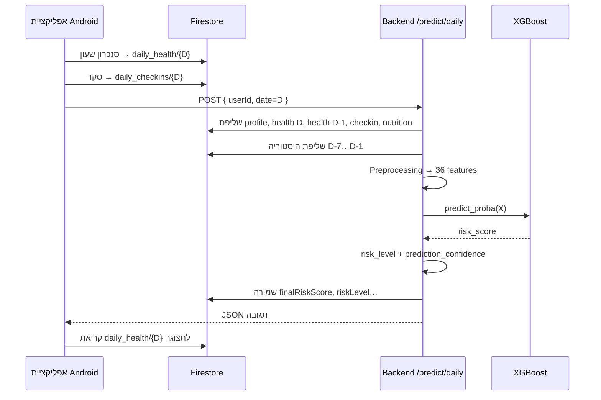

# חישוב ציון הסיכון (Daily Injury Risk Score) — מדריך מפורט

> **מסמך זה:** הסבר מלא בעברית על איך נבנה ציון הסיכון, מאיזה ימים, אילו פרמטרים, מה חוזר לפרונט, ואילו ספים חלים.  
> **קוד אמת:** `services/prediction/` · `services/preprocessing/` · `services/history/` · `data/model_feature_contract.json`  
> **מודל פרודקשן:** XGBoostDeep — `ML_model/artifacts/promoted.json`  
> **חוזה שדות Firestore:** [`FEATURES.md`](FEATURES.md)  
> **קונפיג ML:** [`MODEL.md`](MODEL.md)

---

## תוכן עניינים

1. [סיכום מנהלים](#1-סיכום-מנהלים)
2. [מה זה בכלל risk_score?](#2-מה-זה-בכלל-risk_score)
3. [מתי ולאיזה יום מחושב הסיכון?](#3-מתי-ולאיזה-יום-מחושב-הסיכון)
4. [זרימה מלאה — מ-Firestore עד האפליקציה](#4-זרימה-מלאה--מ-firestore-עד-האפליקציה)
5. [מיפוי מלא: Firestore → פיצ'ר מודל](#5-מיפוי-מלא-firestore--פיצר-מודל)
6. [36 הפיצ'רים — טבלה מלאה](#6-36-הפיצרים--טבלה-מלאה)
7. [נוסחאות וחישובים (Preprocessing)](#7-נוסחאות-וחישובים-preprocessing)
8. [היסטוריה ו-Rolling Features (7 ימים)](#8-היסטוריה-ו-rolling-features-7-ימים)
9. [ברירות מחדל (Defaults)](#9-ברירות-מחדל-defaults)
10. [המודל ML — איך הוא "מחשב" ולא משקלים ידניים](#10-המודל-ml--איך-הוא-מחשב-ולא-משקלים-ידניים)
11. [פרמטרים לפרונט — מדריך מלא](#11-פרמטרים-לפרונט--מדריך-מלא)
12. [ספים (Thresholds) — כל השכבות](#12-ספים-thresholds--כל-השכבות)
13. [איכות נתונים ו-prediction_confidence](#13-איכות-נתונים-ו-prediction_confidence)
14. [דוגמה מספרית מקצה לקצה](#14-דוגמה-מספרית-מקצה-לקצה)
15. [שאלות נפוצות](#15-שאלות-נפוצות)
16. [קישורים](#16-קישורים)

---

## 1. סיכום מנהלים

| שאלה | תשובה |
|------|--------|
| **מהו הציון?** | הסתברות (0–1) לפציעה **היום**, ממודל XGBoost — לא ניקוד ידני של "נקודות" |
| **איך מציגים באפליקציה?** | `finalRiskScore` = אחוז 0–100 (`risk_score × 100`) |
| **על איזה יום?** | יום **D** (היום) — חיזוי בוקר, לא תחזית למחר |
| **מאיפה הנתונים?** | שעון (Health Connect), סקר יומי, תזונה, פרופיל, היסטוריה 7 ימים |
| **כמה פיצ'רים?** | **36** — רשימה קבועה ב־`data/model_feature_contract.json` |
| **מה חוזר ל-API?** | 3 שדות: `risk_score` (0–1), `risk_level`, `prediction_confidence` — **לא נקראים ב-UI** |
| **מה נשמר ב-Firestore?** | `finalRiskScore`, `riskLevel`, `predictionConfidence`, `predictionUpdatedAt` — **מקור האמת לתצוגה** |
| **מי מציג למשתמש?** | אנדרואיד קורא `finalRiskScore` מ-Firestore — לא את body של `POST /predict/daily` |

---

## 2. מה זה בכלל risk_score?

### 2.1 הגדרה

**`risk_score`** (בשרת) = **הסתברות לפציעה** (מחלקה חיובית) שהמודל מחזיר:

```
risk_score = model.predict_proba(X)[0, 1]
```

- טווח: **0.0 – 1.0**
- דוגמה: `0.2341` ≈ 23.4% הסתברות לפציעה היום
- **לא** מדד "כמה קשה אימנת" — אלא פלט סטטיסטי של מודל שאומן על דאטה היסטורי

### 2.2 מה זה *לא*

| מיתוס | מציאות |
|-------|--------|
| "יש נוסחה: שינה×2 + סטרס×3…" | **לא.** אין נוסחה ידנית ב-API — הציון מגיע רק ממודל XGBoost דרך `POST /predict/daily` |
| "המשקלים בקוד קובעים את הציון" | המשקלים הם **בתוך עצי XGBoost** (נלמדו באימון), לא קבועים ב-Python |
| "prediction_confidence = הסיכון" | **לא.** זה ביטחון באיכות הקלט (היסטוריה + שלמות נתונים) |
| "finalRiskScore שונה מהמודל" | **אותו מספר** — רק מוכפל ב-100 לתצוגה |

### 2.3 שלושה מספרים שונים שמבלבלים

| שם | טווח | משמעות בעברית |
|----|------|----------------|
| `risk_score` | 0–1 | הסתברות פציעה מהמודל |
| `finalRiskScore` | 0–100 | אותה הסתברות באחוזים — **זה מה שהמשתמש רואה** |
| `prediction_confidence` | 0–100 | "כמה אנחנו בטוחים שהקלט מספיק טוב לחיזוי" |

---

## 3. מתי ולאיזה יום מחושב הסיכון?

### 3.1 יום החיזוי = D

כשהאפליקציה שולחת:

```json
POST /predict/daily
{ "userId": "abc123", "date": "2026-06-16" }
```

התאריך `2026-06-16` הוא **יום D**. המשמעות:

> **"מה הסיכון לפציעה ביום 16 ביוני 2026?"** — לא מחר, לא אתמול.

תרחיש טיפוסי (בוקר):

1. המשתמש ישן — השעון מסנכרן שינה ל־`daily_health/{D}`
2. המשתמש ממלא סקר — `daily_checkins/{D}`
3. האפליקציה קוראת ל־`/predict/daily` — השרת מחשב ושומר ל־`daily_health/{D}`
4. הדשבורד קורא `finalRiskScore` מאותו מסמך

### 3.2 טבלת מקורות לפי תאריך

| # | מקור Firestore | נתיב | תאריך | תפקיד בעברית |
|---|----------------|------|-------|--------------|
| 1 | פרופיל | `users/{uid}` | קבוע | גיל, היסטוריית פציעות |
| 2 | שינה (בוקר) | `daily_health/{D}` | **היום** | `sleepMinutes` מהלילה שזה עתה נגמר |
| 3 | עומס פיזי | `daily_health/{D-1}` | **אתמול** | צעדים, מרחק, דופק, HRV, קלוריות שרופות… |
| 4 | עומס (legacy) | `daily_health/{D}` | fallback | סנכרון ישן ששמר הכל ביום הקימה |
| 5 | סקר | `daily_checkins/{D}` | **היום** | סטרס, כאב, אנרגיה, פציעה אתמול |
| 6 | תזונה | `daily_nutrition/{D-1}` | **אתמול** | קלוריות צריכה, מאקרו |
| 7 | תזונה (fallback) | `daily_nutrition/{D-2}…{D-14}` | היסטוריה | עד 14 ימים אחורה |
| 8 | היסטוריה rolling | `daily_health` + `daily_checkins` | **D-7 … D-1** | ACWR, חוב שינה, ירידת HRV |

### 3.3 חלון ההיסטוריה — בדיוק אילו ימים?

קוד: `get_history_window_context(..., lookback_days=7, include_target_day=False)`

```
include_target_day=False  →  סוף החלון = D-1 (אתמול)
lookback_days=7           →  התחלה = D-7

ימים בחלון:  D-7, D-6, D-5, D-4, D-3, D-2, D-1
             (7 ימים — בלי היום הנוכחי D)
```

**למה בלי היום?**  
פיצ'רי rolling (עומס שבועי, ממוצע שינה) מתארים **רקע לפני היום הנוכחי**. נתוני היום (שינה מהלילה, צעדים בוקר) נכנסים בנפרד כפיצ'רים "נקודתיים" של D.

### 3.4 `injuredYesterday` — מה זה אומר?

| שדה | תאריך מסמך | משמעות |
|-----|------------|--------|
| `daily_checkins/{D}.injuredYesterday` | סקר של **היום D** | "האם נפצעתי **אתמול** (D−1)?" → פיצ'ר `injured_yesterday` |

> **לאימון מחדש בלבד:** כדי לדעת "האם הייתה פציעה ביום D", הסקריפט קורא `injuredYesterday` מ־`daily_checkins/{D+1}`. בפרודקשן (חיזוי בוקר) — **לא** משתמשים ב-D+1.

### 3.5 מדיניות מיזוג לשדות שעון (בוקר, יום D)

ב־`injury_prediction_request_from_firestore_snapshot`:

| סוג | מקור ראשי | Fallback |
|-----|-----------|----------|
| **שינה** (`sleepMinutes`) | `daily_health/{D}` | אין — חייב סנכרון בוקר |
| **עומס פיזי** (צעדים, מרחק, דופק, HRV…) | `daily_health/{D-1}` | `daily_health/{D}` (סנכרון legacy משולב) |

**סקר (`daily_checkins/{D}`):** אין fallback לאתמול — אם לא מילאו סקר, נכנסים defaults ניטרליים.

**תזונה:** `daily_nutrition/{D-1}` + backfill מ-`{D-2}`… (עד 14 ימים).

---

## 4. זרימה מלאה — מ-Firestore עד האפליקציה



### שלבי השרת (פירוט)

| שלב | פונקציה | קובץ |
|-----|---------|------|
| 1. שליפה | `fetch_daily_firestore_snapshot` | `history_service.py` |
| 2. בניית בקשה | `injury_prediction_request_from_firestore_snapshot` | `prediction_service.py` |
| 3. מיזוג תזונה | `merge_nutrition_with_history` | `history_service.py` |
| 4. DataFrame | `injury_request_to_model_dataframe` | `preprocessing.py` |
| 5. היסטוריה | `_apply_history_confidence_fallback` | `prediction_service.py` |
| 6. איכות | `calculate_data_quality_score` | `preprocessing.py` |
| 7. ולידציה | `validate_feature_vector_for_model` | `preprocessing.py` |
| 8. חיזוי | `model.predict_proba` | `prediction_service.py` |
| 9. שמירה | `save_daily_prediction_result` | `history_service.py` |

### מתי האפליקציה מפעילה חיזוי?

> **קוד נוכחי (פרונט):** בודק `steps` ב-`daily_health/{D}` בלבד.  
> **יעד (אחרי עדכון פרונט):** ראו [FEATURES.md — משימות Android](FEATURES.md#משימות-android--סנכרון-שעון-לשותף-פרונט).

| מסך Android | תנאי (יעד) |
|-------------|------------|
| `WearableSyncActivity` | אחרי סנכרון + סקר קיים |
| `DailyCheckInActivity` | `sleepMinutes` ב-`{D}` ו-`steps` ב-`{D-1}` |
| `MealAnalysisActivity` | כמו למעלה + סקר |

האפליקציה **לא מציגה** את תגובת ה-API ישירות — היא קוראת מ-Firestore אחרי שהשרת שמר.

---

## 5. מיפוי מלא: Firestore → פיצ'ר מודל

### 5.1 פרופיל (`users/{uid}`)

| שדה Firestore | פיצ'ר מודל | המרה |
|---------------|------------|------|
| `age` | `age` | 12–90; default 28 |
| `historyInjuryCount` | `history_injury_count` | 0–50; default 0 |

### 5.2 שעון — פיצול תאריכים

| שדה | מקור למודל (בוקר D) |
|-----|---------------------|
| `sleepMinutes` | `daily_health/{D}` בלבד |
| `steps`, `distanceMeters`, `activeCalories`, `heartRate*`, `hrvRmssd`, … | `daily_health/{D-1}` (fallback `{D}` legacy) |

| שדה Firestore | פיצ'ר(ים) במודל | המרה / הערה |
|---------------|-----------------|-------------|
| `sleepMinutes` | `sleep_hours` | ÷60, חסום 3–12 שעות |
| `distanceMeters` | `daily_distance_km` | ÷1000, מקס 60 ק"מ |
| `steps` | `daily_distance_km` (fallback), `avg_cadence` | מרחק: `steps × 0.0008` |
| `activeCalories` | `active_calories_burned`, `workout_intensity_minutes` | ישיר |
| `totalCalories` / `bmrCalories` | `total_calories_burned` | שריפה = active+BMR |
| `heartRateAvg` / `Max` / `Min` | `resting_hr`, `hrv_score` | עדיפות: Resting → Min → Avg |
| `hrvRmssd` | `hrv_score`, `hrv_drop` | ישיר; proxy אם חסר |
| `restingHeartRate` | `resting_hr` | 38–95 bpm |
| `weightKg` + `heightCm` | `bmi` | `weight/height²`, 15–45 |
| `bodyFatPct` | `body_fat_pct` | 3–50% |
| `vo2Max` | `vo2_max` | 15–90 |
| `elevationGainedMeters` | `elevation_gained_m` | 0–5000 |
| `floorsClimbed` | `floors_climbed` | 0–200 |
| `avgSpeed` / `maxSpeed` | `avg_speed`, `max_speed`, `speed_intensity_ratio` | km/h |
| `avgPower` | `avg_power` | וואט, 0–800 |
| `avgCadence` | `avg_cadence` | spm, 120–200 |
| `respiratoryRate` | `respiratory_rate` | 6–40 |
| `oxygenSaturation` | `spo2` | 80–100% |

> **הבחנה קריטית:** `daily_health.totalCalories` = **שריפה** (מ-Health Connect).  
> `daily_nutrition.totalCalories` = **צריכה** (ממזון). לא לבלבל!

### 5.3 סקר (`daily_checkins/{D}`)

| שדה Firestore | פיצ'ר מודל | סקאלה באפליקציה → מודל |
|---------------|------------|------------------------|
| `stressLevel` | `stress_level` | 0–100 → 1–10 (÷10) |
| `muscleSoreness` | `muscle_soreness` | 1–5 → 1–10 (`×2−0.5`) |
| `energyLevel` | `energy_level` | 0–100 → 1–10 (÷10) |
| `injuredYesterday` | `injured_yesterday` | 0/1 — פציעה ב-D−1 |

### 5.4 תזונה (`daily_nutrition/{D-1}` + fallback 14 ימים)

| שדה Firestore | פיצ'ר(ים) | לוגיקה |
|---------------|-----------|--------|
| `totalCalories` | `nutrition_intake_calories`, `daily_calories` | עדיפות ראשונה |
| `totalProtein` + `totalCarbs` | `daily_calories` (אומדן) | `(P×4 + C×4) × 1.2` |
| `mealsLoggedCount` | `daily_calories` (אומדן) | `2500 × (0.6 + meals×0.2)` |
| (אין כלום) | defaults | 2500 קלוריות ניטרלי |

`calorie_balance` = `daily_calories − total_calories_burned` (צריכה מינוס שריפה).

---

## 6. 36 הפיצ'רים — טבלה מלאה

כל עמודה: **שם באנגלית (קוד)** | **תיאור בעברית** | **מקור עיקרי**

| # | פיצ'ר (`feature`) | תיאור בעברית | מקור |
|---|-------------------|--------------|------|
| 1 | `bmi` | מדד מסת גוף | משקל + גובה |
| 2 | `age` | גיל | פרופיל |
| 3 | `body_fat_pct` | אחוז שומן | שעון |
| 4 | `vo2_max` | VO2 מקס | שעון |
| 5 | `history_injury_count` | מספר פציעות בעבר | פרופיל |
| 6 | `injured_yesterday` | נפצע אתמול (0/1) | סקר |
| 7 | `daily_distance_km` | מרחק יומי (ק"מ) | שעון |
| 8 | `workout_intensity_minutes` | עוצמת אימון (דקות מוערכות) | נגזר ממרחק+קלוריות |
| 9 | `avg_cadence` | קצב צעדים ממוצע | שעון / חישוב |
| 10 | `elevation_gained_m` | עליית גובה (מטר) | שעון |
| 11 | `floors_climbed` | קומות | שעון |
| 12 | `avg_speed` | מהירות ממוצעת | שעון / חישוב |
| 13 | `max_speed` | מהירות מקסימלית | שעון / חישוב |
| 14 | `avg_power` | הספק ממוצע (וואט) | שעון |
| 15 | `active_calories_burned` | קלוריות פעילות | שעון |
| 16 | `sleep_hours` | שעות שינה | שעון |
| 17 | `hrv_score` | ציון HRV (RMSSD) | שעון / proxy |
| 18 | `resting_hr` | דופק מנוחה | שעון |
| 19 | `respiratory_rate` | קצב נשימה | שעון |
| 20 | `spo2` | ריווי חמצן | שעון |
| 21 | `nutrition_intake_calories` | קלוריות צריכה | תזונה |
| 22 | `daily_calories` | קלוריות יומיות (צריכה) | תזונה |
| 23 | `total_calories_burned` | קלוריות שרופות | שעון |
| 24 | `stress_level` | רמת סטרס (1–10) | סקר |
| 25 | `muscle_soreness` | כאב שרירים (1–10) | סקר |
| 26 | `energy_level` | רמת אנרגיה (1–10) | סקר |
| 27 | `acute_load_7d` | עומס חד (7 ימים) | היסטוריה / proxy |
| 28 | `chronic_load_21d` | עומס כרוני (קירוב מ-7 ימים) | היסטוריה / proxy |
| 29 | `acwr_ratio` | יחס עומס חד/כרוני (ACWR) | היסטוריה / proxy |
| 30 | `acwr_ratio_ma7` | ממוצע ACWR (proxy: = יום D) | proxy מיום נוכחי |
| 31 | `calorie_balance` | מאזן קלורי (צריכה−שריפה) | נגזר |
| 32 | `sleep_hours_ma7` | ממוצע שינה (proxy: = יום D) | proxy מיום נוכחי |
| 33 | `sleep_debt_3d` | חוב שינה 3 ימים | היסטוריה / proxy |
| 34 | `hrv_drop` | ירידת HRV מול ממוצע שבועי | היסטוריה / proxy |
| 35 | `load_recovery_imbalance` | חוסר איזון עומס/התאוששות | `acwr × sleep_debt` |
| 36 | `speed_intensity_ratio` | יחס עוצמת מהירות | `max_speed / avg_speed` |

---

## 7. נוסחאות וחישובים (Preprocessing)

### 7.1 המרות סקאלה (יום D)

```
sleep_hours        = clamp(sleepMinutes / 60,  3, 12)
daily_distance_km  = distanceMeters/1000  OR  steps × 0.0008  (max 60)
stress_level       = stressLevel / 10  if stressLevel > 10  else stressLevel  (1–10)
muscle_soreness    = soreness × 2 − 0.5  if soreness ≤ 5  (1–10)
energy_level       = energyLevel / 10  if energyLevel > 10  (1–10)
bmi                = weight_kg / (height_m)²  clamped 15–45
hrv_score          = hrvRmssd  OR  110 − resting_hr × 0.65
resting_hr         = restingHeartRate  →  heartRateMin  →  heartRateAvg
```

### 7.2 פיצ'רים נגזרים — יום בודד (לפני היסטוריה)

מ־`feature_engineering.compute_derived_features` + `preprocessing.py`:

| פיצ'ר | נוסחה | טווח / הערה |
|--------|--------|-------------|
| `workout_intensity_minutes` | `distance_km × 5.5 + active_cal / 40` | 0–240 דקות |
| `acute_load_7d` | `max(0.05, distance × 0.95 + active_cal/450)` | proxy ליום בודד |
| `chronic_load_21d` | `max(0.55, acute × 0.78 + 1.35)` | proxy ליום בודד |
| `acwr_ratio` | `acute / chronic` | חסום **0.35 – 2.8** |
| `sleep_debt_3d` | `max(0, (8 − sleep_hours) × 1.25)` | proxy ליום בודד |
| `hrv_drop` | `clamp(62 − hrv + (resting_hr−54)×0.15, −15, 15)` | proxy ליום בודד |
| `calorie_balance` | `daily_calories − total_calories_burned` | — |
| `load_recovery_imbalance` | `acwr_ratio × sleep_debt_3d` | — |
| `speed_intensity_ratio` | `min(5, max_speed / (avg_speed + 0.1))` | — |
| `acwr_ratio_ma7` | `= acwr_ratio` (זמנית) | מוחלף רק אם היסטוריה low |
| `sleep_hours_ma7` | `= sleep_hours` (זמנית) | מוחלף רק אם היסטוריה low |

### 7.3 ACWR — מה זה אומר בעברית?

**ACWR** (Acute:Chronic Workload Ratio) = יחס בין עומס **חד** (שבוע אחרון) לעומס **כרוני** (בסיס ארוך טווח).

| ערך ACWR | פרשנות כללית (ספרותית) |
|----------|------------------------|
| < 0.8 | עומס נמוך יחסית לבסיס |
| 0.8 – 1.3 | "אזור בטוח" לרוב |
| 1.3 – 1.5 | עומס עולה — זהירות |
| > 1.5 – 2.8 | סיכון מוגבר (חסום בקוד ב-2.8) |

בפרודקשן: העומס מבוסס בעיקר על **מרחק יומי (ק"מ)** מהשעון, לא על דקות אימון מפורשות.

---

## 8. היסטוריה ו-Rolling Features (7 ימים)

### 8.1 איך נבנה חלון ההיסטוריה

`fetch_user_history`:
1. סורק את כל `daily_health` ו-`daily_checkins` של המשתמש
2. מסנן לתאריכים בטווח `[D-7, D-1]`
3. ממזג checkin לתוך health לפי `date_key`
4. מחשב פיצ'רים ב־`compute_historical_derived_features`

### 8.2 נוסחאות מהיסטוריה (כשיש ≥4 ימים)

לכל יום בחלון מחושבים:

```
daily_distance_km  = distanceMeters/1000  OR  steps × 0.0008
sleep_hours        = sleepMinutes/60  (default 7 אם חסר)
hrv_score          = hrvRmssd  OR  proxy מ-resting_hr

acute_load_7d      = rolling_mean(daily_distance_km, window=7)
weekly_mean        = rolling_mean(daily_distance_km, window=7)
weekly_std         = rolling_std(daily_distance_km, window=7)
chronic_load_21d   = max(0.55, weekly_mean×0.85 + weekly_std×0.35 + 0.5)
acwr_ratio         = clamp(acute/chronic, 0.35, 2.8)
sleep_debt_3d      = rolling_sum(8 − sleep_hours, window=3)
hrv_drop           = clamp(hrv_today − rolling_mean(hrv, 7), −15, 15)
```

הערך שנכנס למודל = **שורה האחרונה** בטבלה (יום D−1 בחלון).

### 8.3 מדיניות Confidence (ביטחון היסטוריה)

| ימי היסטוריה זמינים | `confidence` | מה קורה בעברית |
|---------------------|--------------|----------------|
| **7** | `high` | כל פיצ'רי rolling מחושבים מהנתונים האמיתיים |
| **4–6** | `medium` | אותו חישוב (`min_periods=1` — גם עם פחות ימים) |
| **0–3** | `low` | **ברירות מחדל ניטרליות** — ספורטאי חדש / אין מספיק היסטוריה |

כש-`confidence = low`, הפיצ'רים הבאים **מוחלפים** ב-defaults:

| פיצ'ר | ערך default | משמעות ניטרלית |
|--------|-------------|----------------|
| `acute_load_7d` | 4.5 | עומס ממוצע |
| `chronic_load_21d` | 5.1 | בסיס ממוצע |
| `acwr_ratio` | 1.0 | יחס מאוזן |
| `acwr_ratio_ma7` | 1.0 | — |
| `sleep_hours_ma7` | 7.0 | שינה תקינה |
| `sleep_debt_3d` | 1.0 | חוב קל |
| `hrv_drop` | 0.0 | ללא ירידה |

### 8.4 מה *לא* מחושב מהיסטוריה

| פיצ'ר | מה קורה בפועל |
|--------|---------------|
| `acwr_ratio_ma7` | נשאר `= acwr_ratio` של היום (proxy) |
| `sleep_hours_ma7` | נשאר `= sleep_hours` של היום (proxy) |

---

## 9. ברירות מחדל (Defaults)

כששדה חסר — נכנס ערך **ניטרלי** (לא מושך לסיכון גבוה או נמוך במכוון).

### 9.1 כל 36 הערכים (`DEFAULT_FEATURE_VALUES`)

| פיצ'ר | Default | פיצ'ר | Default |
|--------|---------|--------|---------|
| `bmi` | 23.5 | `nutrition_intake_calories` | 2500 |
| `age` | 28 | `daily_calories` | 2500 |
| `body_fat_pct` | 16 | `total_calories_burned` | 2450 |
| `vo2_max` | 48 | `stress_level` | 5 |
| `history_injury_count` | 0 | `muscle_soreness` | 5 |
| `injured_yesterday` | 0 | `energy_level` | 5 |
| `daily_distance_km` | 3.5 | `acute_load_7d` | 4.5 |
| `workout_intensity_minutes` | 45 | `chronic_load_21d` | 5.1 |
| `avg_cadence` | 168 | `acwr_ratio` | 1.0 |
| `elevation_gained_m` | 50 | `acwr_ratio_ma7` | 1.0 |
| `floors_climbed` | 5 | `calorie_balance` | 0 |
| `avg_speed` | 8 | `sleep_hours_ma7` | 7 |
| `max_speed` | 11 | `sleep_debt_3d` | 1 |
| `avg_power` | 0 | `hrv_drop` | 0 |
| `active_calories_burned` | 350 | `load_recovery_imbalance` | 1 |
| `sleep_hours` | 7 | `speed_intensity_ratio` | 1.3 |
| `hrv_score` | 62 | | |
| `resting_hr` | 54 | | |
| `respiratory_rate` | 15 | | |
| `spo2` | 97 | | |

### 9.2 שדות שלא מורידים ציון איכות (Tolerant)

`totalProtein`, `totalCarbs`, `mealsLoggedCount`, `energyLevel`, `heartRateMax/Min`, `activeCalories`, `bodyFatPct`, `vo2Max`, `elevationGainedMeters`, `floorsClimbed`, `avgSpeed`, `maxSpeed`, `avgPower`, `avgCadence`, `respiratoryRate`, `oxygenSaturation`, `heightCm`

---

## 10. המודל ML — איך הוא "מחשב" ולא משקלים ידניים

### 10.1 מודל פרודקשן

| פרמטר | ערך |
|--------|-----|
| אלגוריתם | **XGBoostDeep** (Gradient Boosted Trees) |
| פיצ'רים | 36 |
| פלט | `predict_proba` — הסתברות למחלקה 1 (פציעה) |
| קובץ | `ML_model/artifacts/.../injury_model.pkl` |

המודל לומד **אינטראקציות לא-לינאריות** בין הפיצ'רים (למשל: ACWR גבוה + שינה גרועה + סטרס גבוה). אי אפשר לכתוב נוסחה אחת פשוטה שמחליפה אותו.

### 10.2 חשיבות פיצ'רים (Feature Importance) — מהאימון

אלה **לא משקלי שירות** — אלא תרומה יחסית בזמן אימון (`feature_importance.csv`):

| דירוג | פיצ'ר | חשיבות | הסבר בעברית |
|------|--------|--------|-------------|
| 1 | `hrv_drop` | 14.9% | ירידה ב-HRV לעומת הממוצע השבועי |
| 2 | `stress_level` | 8.1% | סטרס מהסקר |
| 3 | `load_recovery_imbalance` | 8.0% | עומס גבוה × חוב שינה |
| 4 | `injured_yesterday` | 7.1% | דיווח פציעה אתמול |
| 5 | `acwr_ratio` | 7.0% | יחס עומס חד/כרוני |
| 6 | `history_injury_count` | 5.0% | היסטוריית פציעות |
| 7 | `sleep_debt_3d` | 4.4% | חוב שינה מצטבר |
| 8 | `daily_distance_km` | 2.4% | מרחק יומי |
| 9–36 | (שאר הפיצ'רים) | ~1–2% כל אחד | תרומה קטנה יחסית |

### 10.3 סף אימון (Operating Threshold) — לא סיווג UI

ב־`run_manifest.json` של המודל המקודם:

```json
"threshold": 0.18
```

| מטריקה @ 0.18 | ערך |
|---------------|-----|
| Recall | ~86.6% |
| Precision | ~14.1% |
| ROC-AUC | ~72.3% |

סף זה נבחר באימון כדי **למקסם Recall** (לתפוס כמה שיותר פציעות) תוך הגבלת False Positive Rate.  
**הוא נשמר ב-bundle** אך **לא משמש כרגע** לקביעת `risk_level` בשרת (ראו סעיף 12).

### 10.4 שער איכות מודל (Model Gate)

המודל **לא נטען** אם:

| בדיקה | סף | מטרה |
|-------|-----|------|
| `Recall@Threshold` | ≥ 0.80 | לא לפרוס מודל שלא תופס פציעות |
| `ROC-AUC` | ≥ 0.68 | הפרדה סטטיסטית מינימלית |

אם השער נכשל → `POST /predict/daily` מחזיר **HTTP 500**.

---

## 11. פרמטרים לפרונט — מדריך מלא

> **עיקרון חשוב:** האפליקציה **לא מציגה** את תגובת ה-HTTP ישירות.  
> הזרימה: `POST /predict/daily` → השרת שומר ל-Firestore → האפליקציה קוראת מ-Firestore.

### 11.0 סקירה — מה בכלל עובר לפרונט?

| # | שם (Firestore) | שם (API) | מגיע מהשרת? | מוצג ב-UI? | מי קורא |
|---|----------------|----------|-------------|------------|---------|
| 1 | `finalRiskScore` | `risk_score` | ✅ כן | ✅ **כן** — מד + גרף | ספורטאי, מאמן |
| 2 | `riskLevel` | `risk_level` | ✅ כן | ⚠️ לא ישירות — רק ל-Gemini | ספורטאי (prompt) |
| 3 | `predictionConfidence` | `prediction_confidence` | ✅ כן | ⚠️ לא ישירות — רק ל-Gemini | ספורטאי (prompt) |
| 4 | `predictionUpdatedAt` | — | ✅ כן | ❌ לא | אף מסך (עתידי) |
| 5 | `aiRecommendation` | — | ❌ לא (נכתב באפליקציה) | ✅ **כן** — טקסט המלצה | ספורטאי, מאמן |

**מה *לא* עובר לפרונט:** אף אחד מ-36 הפיצ'רי המודל (`acwr_ratio`, `stress_level`…), `data_quality_score`, או פירוט החסרים — אלה נשארים בשרת (לוגים בלבד).

---

### 11.1 `finalRiskScore` — הציון שהמשתמש רואה

| מאפיין | ערך |
|--------|-----|
| **שם בעברית** | ציון סיכון פציעה יומי (אחוז) |
| **מקור API** | `risk_score` |
| **נתיב Firestore** | `users/{uid}/daily_health/{date}.finalRiskScore` |
| **טיפוס** | `number` (double) |
| **טווח** | **0 – 100** |
| **יחידות** | אחוז (%) |

#### איך מחושב?

```
שלב 1 (מודל):
  risk_score = XGBoost.predict_proba(X)[0, 1]     # 0.0 – 1.0

שלב 2 (שמירה):
  finalRiskScore = round(risk_score × 100, 2)     # 0 – 100
```

קוד (`history_service.save_daily_prediction_result`):

```python
risk_score = float(result.get("risk_score") or 0.0)
"finalRiskScore": round(risk_score * 100.0, 2)
```

#### מה זה אומר למשתמש?

> "לפי המודל, יש **X%** הסתברות לפציעה **היום**."

זו **הסתברות סטטיסטית**, לא אבחנה רפואית. ערך 23 = 23% — לא "23 נקודות סיכון" מנוסחה ידנית.

#### איך האפליקציה משתמשת?

| מסך | שימוש | קוד |
|-----|-------|-----|
| דשבורד ספורטאי | מד עגול + `"$riskScore%"` | `AthleteDashboardActivity.updateUIWithScore` |
| דשבורד ספורטאי | גרף 7 ימים | `loadHistoricalData` → `finalRiskScore` לכל יום |
| דשבורד מאמן | מד + גרף לספורטאי נבחר | `CoachDashboardActivity.loadAthleteHealthData` |

**עיגול בתצוגה:** Firestore שומר 2 ספרות (`23.41`), UI מציג **int** (`23`) — `getDouble(...).toInt()`.

#### צבע המד (נגזר בפרונט — לא מהשרת)

הצבע נקבע **באפליקציה** לפי `finalRiskScore`, לא לפי `riskLevel`:

| `finalRiskScore` | צבע | משמעות ויזואלית |
|------------------|-----|-----------------|
| 0 – 20 | 🟢 ירוק | סיכון נמוך |
| 21 – 50 | 🟡 צהוב | סיכון בינוני-נמוך |
| 51 – 70 | 🟠 כתום | סיכון בינוני-גבוה |
| 71 – 100 | 🔴 אדום | סיכון גבוה |

#### מתי לא מוצג?

אם `daily_health/{today}` **אין** שדה `finalRiskScore` → UI מציג `--%` והודעה:

> "Pending: Please complete today's Stress Survey and Watch Sync…"

---

### 11.2 `riskLevel` — רמת סיכון קטגוריאלית

| מאפיין | ערך |
|--------|-----|
| **שם בעברית** | רמת סיכון (נמוך / בינוני / גבוה) |
| **מקור API** | `risk_level` |
| **נתיב Firestore** | `users/{uid}/daily_health/{date}.riskLevel` |
| **טיפוס** | `string` |
| **ערכים אפשריים** | `"Low"` · `"Medium"` · `"High"` |

#### איך מחושב?

```
risk_score = predict_proba(...)   # 0.0 – 1.0
pct = int(risk_score * 100)       # תואם Android toInt()

אם pct > 70   →  "High"
אם pct > 20   →  "Medium"
אחרת          →  "Low"
```

קוד (`services/risk_levels.classify_risk_level`):

```python
pct = int(probability * 100)
if pct > 70:
    return "High"
if pct > 20:
    return "Medium"
return "Low"
```

#### טבלת תרגום

| `riskLevel` | תנאי `finalRiskScore` (%) | שקול `risk_score` | בעברית |
|-------------|---------------------------|-------------------|--------|
| `Low` | 0 – 20 | ≤ 0.20 | סיכון נמוך |
| `Medium` | 21 – 70 | > 0.20 – ≤ 0.70 | סיכון בינוני |
| `High` | 71 – 100 | > 0.70 | סיכון גבוה |

#### איך האפליקציה משתמשת?

- **לא מוצג כטקסט נפרד** על המסך (אין Label "Low/Medium/High").
- **כן נשלח ל-Gemini** בפרומפט לייצור המלצה:

```
ML Injury Risk Score: 23% (Risk Level: Medium, AI Confidence: 78.5%).
```

- דשבורד מאמן: **לא קורא** `riskLevel` — רק `finalRiskScore` + `aiRecommendation`.

#### התאמה לצבע המד (Android)

| `finalRiskScore` | `riskLevel` (שרת) | צבע UI (אפליקציה) |
|------------------|-------------------|-------------------|
| 15% | `Low` | ירוק |
| 23% | `Medium` | צהוב |
| 45% | `Medium` | צהוב |
| 65% | `Medium` | כתום |
| 75% | `High` | אדום |

> צהוב (21–50) וכתום (51–70) הם **גוונים ויזואליים** בתוך רמת `Medium` — הסיווג הקטגוריאלי זהה.

---

### 11.3 `predictionConfidence` — ביטחון בחיזוי (לא הסיכון!)

| מאפיין | ערך |
|--------|-----|
| **שם בעברית** | רמת ביטחון בקלט הנתונים / אמינות החיזוי |
| **מקור API** | `prediction_confidence` |
| **נתיב Firestore** | `users/{uid}/daily_health/{date}.predictionConfidence` |
| **טיפוס** | `number` |
| **טווח** | **0 – 100** |
| **יחידות** | אחוז ביטחון |

#### מה זה *לא*?

| ❌ לא | ✅ כן |
|------|------|
| הסתברות לפציעה | "כמה הנתונים שלך מספיקים טובים לחיזוי אמין" |
| `100 - finalRiskScore` | שילוב של היסטוריה + שלמות נתוני היום |
| ביטחון המודל הסטטיסטי (calibration) | ציון תפעולי פנימי של השרת |

#### איך מחושב? — נוסחה מלאה

**שלב א — ציון היסטוריה (`history_score`)**

לפי כמה ימי `daily_health` זמינים בחלון D−7…D−1:

| ימים זמינים | `confidence` | `history_score` |
|-------------|--------------|-----------------|
| 7 | `high` | **0.95** |
| 4 – 6 | `medium` | **0.70** |
| 0 – 3 | `low` | **0.45** |

**שלב ב — ציון איכות יום (`quality_score`)**

התחלה: **1.0**. כל שדה **רגיש** חסר: **−0.12**.

שדות רגישים: `sleepMinutes`, `steps`, `distanceMeters`, `heartRateAvg`, `stressLevel`, `muscleSoreness`, `hrvRmssd`, `restingHeartRate`.

חסמים קשים (מורידים ל-**מקסימום 0.25**):
- חסר **אות עומס:** אין `steps` **וגם** אין `distanceMeters`
- חסר **אות התאוששות:** אין `sleepMinutes` **וגם** (אין `stressLevel` **או** אין `muscleSoreness`)

**שלב ג — שילוב**

```
prediction_confidence = round((0.6 × history_score + 0.4 × quality_score) × 100, 2)
```

משקלים: **60%** היסטוריה · **40%** איכות יום.

**שלב ד — שמירה**

```python
"predictionConfidence": round(min(100.0, max(0.0, conf)), 2)
```

#### דוגמאות מספריות

| תרחיש | history | quality | חישוב | תוצאה |
|-------|---------|---------|-------|-------|
| ספורטאי ותיק, נתונים מלאים | 0.95 | 1.0 | (0.6×0.95+0.4×1.0)×100 | **97%** |
| 5 ימי היסטוריה, חסר HRV | 0.70 | 0.88 | (0.6×0.70+0.4×0.88)×100 | **77.2%** |
| חדש, חסר צעדים היום | 0.45 | 0.25 | (0.6×0.45+0.4×0.25)×100 | **37%** |

#### איך האפליקציה משתמשת?

- **לא מוצג** כמספר על המסך.
- נשלח ל-**Gemini** כ-"AI Confidence" בפרומפט.
- מאמן: **לא קורא** שדה זה.

#### פרשנות למשתמש (אם תרצו להציג בעתיד)

| טווח | משמעות מוצעת |
|------|--------------|
| 80 – 100 | נתונים טובים — החיזוי אמין |
| 50 – 79 | חלק מהנתונים חסרים — התייחסו בזהירות |
| 0 – 49 | מעט היסטוריה / נתונים חסרים — החיזוי פחות אמין |

---

### 11.4 `predictionUpdatedAt` — חותמת זמן (שרת בלבד כרגע)

| מאפיין | ערך |
|--------|-----|
| **שם בעברית** | מתי חושב החיזוי לאחרונה |
| **מקור API** | **לא מוחזר** בתגובת HTTP |
| **נתיב Firestore** | `users/{uid}/daily_health/{date}.predictionUpdatedAt` |
| **טיפוס** | `string` (ISO 8601 UTC) |
| **דוגמה** | `"2026-06-16T08:15:00.123456"` |

#### איך מחושב?

```python
"predictionUpdatedAt": datetime.utcnow().isoformat()
```

נכתב **בכל** הרצת `save_daily_prediction_result` (merge על המסמך).

#### שימוש בפרונט

**כרגע:** אף מסך באנדרואיד לא קורא שדה זה.  
**שימוש עתידי אפשרי:** "עודכן לפני 2 שעות", בדיקת stale data, debug.

---

### 11.5 `aiRecommendation` — המלצה מילולית (לא מהשרת!)

| מאפיין | ערך |
|--------|-----|
| **שם בעברית** | המלצת אימון יומית (טקסט חופשי) |
| **מקור** | **אפליקציית Android** — Gemini API |
| **נתיב Firestore** | `users/{uid}/daily_health/{date}.aiRecommendation` |
| **טיפוס** | `string` |

#### איך נוצר?

1. דשבורד ספורטאי קורא `finalRiskScore`, `riskLevel`, `predictionConfidence` מ-Firestore
2. קורא גם **קלטים מקומיים** (לא מפלט החיזוי):
   - `sleepMinutes` מ-`daily_health`
   - `muscleSoreness`, `stressLevel` מ-`daily_checkins`
3. שולח פרומפט ל-**Gemini 2.5 Flash**
4. שומר את התשובה ב-Firestore: `aiRecommendation`

#### פרומפט לדוגמה (מקוצר)

```
ML Injury Risk Score: 23% (Risk Level: Low, AI Confidence: 78.5%).
Sleep: 6h 30m, Soreness: 3/5, Stress: 60/100.
Provide a short 1-sentence recommendation for training today.
```

#### מי מציג?

| מסך | שדה |
|-----|-----|
| דשבורד ספורטאי | `dashboard_TXT_aiRecommendation` |
| דשבורד מאמן | `coachDash_TXT_aiRecommendation` (קורא מהיום האחרון של הספורטאי) |

> **לא חלק מפלט המודל** — המלצה זו LLM, לא XGBoost.

---

### 11.6 תגובת API — `POST /predict/daily`

#### בקשה (מה האפליקציה שולחת)

```json
{
  "userId": "firebase-uid-abc",
  "date": "2026-06-16"
}
```

רק 2 שדות. השרת טוען את כל השאר מ-Firestore.

#### תגובה (מה השרת מחזיר)

> **חשוב:** תגובת ה-HTTP היא **אישור שהחיזוי רץ** + ערכים לדיבוג/בדיקות.  
> **האפליקציה בפרודקשן לא משתמשת בה לתצוגה** — מקור האמת הוא Firestore (ראו למטה).

```json
{
  "risk_score": 0.2341,
  "risk_level": "Low",
  "prediction_confidence": 78.5
}
```

| שדה API | טיפוס | ממופה ל-Firestore | נקרא ב-UI? |
|---------|--------|-------------------|------------|
| `risk_score` | float 0–1 | → `finalRiskScore` (×100) | ❌ **לא** — Firestore בלבד |
| `risk_level` | string | → `riskLevel` | ❌ **לא** — Firestore בלבד |
| `prediction_confidence` | float 0–100 | → `predictionConfidence` | ❌ **לא** — Firestore בלבד |

**זה תקין:** `risk_score` (0–1) ו-`finalRiskScore` (0–100) הם **אותו ערך בסקאלות שונות** — ההמרה נעשית בבקאנד לפני השמירה.

#### מי קורא ל-API ומה עושה עם התשובה?

| מסך | מתי קורא | משתמש בתגובה? |
|-----|----------|---------------|
| `WearableSyncActivity` | אחרי סנכרון שעון | ❌ רק לוג הצלחה |
| `DailyCheckInActivity` | אחרי סקר + יש steps | ❌ רק לוג |
| `MealAnalysisActivity` | אחרי רישום ארוחה | ❌ רק לוג |

האפליקציה מסתמכת על **קריאה מ-Firestore** (`finalRiskScore`, `riskLevel`, `predictionConfidence`) — **לא** על body של תגובת `POST /predict/daily`.  
בכל שלושת מסכי ה-trigger נבדק רק `response.isSuccessful`.

מחלקת Retrofit (`ApiService.kt`):

```kotlin
data class PredictionResponse(
    val risk_level: String,
    val risk_score: Float,
    val prediction_confidence: Float
)
```

---

### 11.7 גרף היסטוריה — פרמטר נוסף מהפרונט

| מאפיין | ערך |
|--------|-----|
| **מקור** | `finalRiskScore` מ-**עד 7** מסמכי `daily_health` אחרונים |
| **ציר Y** | 0 – 100 (אחוז) |
| **ציר X** | אינדקס יום (0, 1, 2…) — **לא** תאריך מפורש על הציר |
| **מיון** | לפי `document.id` (מפתח `yyyy-MM-dd`) |

ימים **בלי** `finalRiskScore` (למשל לפני שהופעל המודל) — מדלגים עליהם בגרף.

---

### 11.8 מפת זרימה — משרת למסך

```
┌─────────────────────────────────────────────────────────────────┐
│  BACKEND  predict_injury_risk()                                 │
│                                                                 │
│  risk_score          = predict_proba (0–1)                      │
│  risk_level          = Low | Medium | High                      │
│  prediction_confidence = f(היסטוריה, איכות) (0–100)            │
└──────────────────────────┬──────────────────────────────────────┘
                           │ save_daily_prediction_result (merge)
                           ▼
┌─────────────────────────────────────────────────────────────────┐
│  FIRESTORE  users/{uid}/daily_health/{D}                        │
│                                                                 │
│  finalRiskScore         = risk_score × 100                      │
│  riskLevel              = risk_level                            │
│  predictionConfidence   = prediction_confidence                 │
│  predictionUpdatedAt    = UTC now                               │
│  (+ sleepMinutes, steps… מהשעון — לא מהמודל)                    │
└──────────────────────────┬──────────────────────────────────────┘
                           │ onResume / get()
                           ▼
┌─────────────────────────────────────────────────────────────────┐
│  ANDROID  AthleteDashboardActivity                              │
│                                                                 │
│  UI מד:        finalRiskScore → Int → "23%" + צבע              │
│  UI גרף:       finalRiskScore × 7 ימים                          │
│  Gemini:       finalRiskScore + riskLevel + confidence          │
│                + sleep + soreness + stress                      │
│  שמירה:        aiRecommendation → Firestore                     │
└─────────────────────────────────────────────────────────────────┘
```

---

### 11.9 טבלת סיכום — כל פרמטר לפרונט

| פרמטר | עברית | טווח | מחושב איך | מוצג? | איפה |
|-------|-------|------|-----------|-------|------|
| `finalRiskScore` | ציון סיכון % | 0–100 | `round(risk_score×100,2)` | ✅ מד + גרף | ספורטאי, מאמן |
| `riskLevel` | רמת סיכון | Low/Med/High | `classify_risk_level` — 20% / 70% (תואם Android) | ⚠️ Gemini בלבד | ספורטאי |
| `predictionConfidence` | ביטחון בקלט | 0–100 | 60% היסטוריה + 40% איכות | ⚠️ Gemini בלבד | ספורטאי |
| `predictionUpdatedAt` | זמן עדכון | ISO string | `utcnow()` | ❌ | — |
| `aiRecommendation` | המלצת אימון | טקסט | Gemini באפליקציה | ✅ טקסט | ספורטאי, מאמן |

---


## 12. ספים (Thresholds) — כל השכבות

יש **3 שכבות ספים** — חשוב לא לערבב:

### 12.1 שכבה 1: `risk_level` + צבעי UI — production (מיושר)

קובץ: `services/risk_levels.py` — **תואם Android** (`AthleteDashboardActivity`, `CoachDashboardActivity`):

| רמה | `finalRiskScore` (%) | צבע Android |
|-----|----------------------|-------------|
| **Low** | 0 – 20 | ירוק |
| **Medium** | 21 – 70 | צהוב (21–50) / כתום (51–70) |
| **High** | 71 – 100 | אדום |

```python
pct = int(probability * 100)
if pct > 70:
    return "High"
if pct > 20:
    return "Medium"
return "Low"
```

### 12.2 שכבה 2: סף אימון (Manifest) — מטריקות ML בלבד

מ־`run_manifest.json`:

| סף | ערך | שימוש |
|----|-----|-------|
| Operating threshold | **0.18** | Recall@Threshold, Precision, FPR — **לא** לסיווג `risk_level` ב-production |

> `threshold` ו-`medium_threshold` ב-bundle נטענים ל-gates ולתיעוד — **לא** משמשים ל-`classify_risk_level`.

### 12.3 שכבה 3: בינים סטטיסטיים (אימון)

מ־`run_manifest.json` → `risk_bins`:

| בין הסתברות | שם | injury_rate באימון |
|-------------|-----|-------------------|
| 0–20% | green | ~5% |
| 20–50% | yellow | ~11% |
| 50–100% | red | ~37% |

אלה **סטטיסטיקת אימון** — לא ספי production.

### 12.4 סיכום השכבות

```
                    ┌─────────────────────────────────────┐
  risk_score (ML)   │  0.0 ──────────────── 1.0          │
                    └─────────────────────────────────────┘
                              │
  risk_level + Android UI     │  Low ≤20 | Med 21–70 | High >70
                              │
    סף אימון (manifest)       │  threshold=0.18 (Recall metrics only)
```

---

## 13. איכות נתונים ו-prediction_confidence

### 13.1 `prediction_confidence` — נוסחה מלאה

```
history_score:
  confidence = "high"   → 0.95
  confidence = "medium" → 0.70
  confidence = "low"    → 0.45

quality_score = calculate_data_quality_score(payload)["score"]   # 0.0 – 1.0

prediction_confidence = round((0.6 × history_score + 0.4 × quality_score) × 100, 2)
```

| רכיב | משקל | משמעות |
|------|------|--------|
| היסטוריה | **60%** | כמה ימים יש לחישוב rolling |
| איכות יום | **40%** | כמה שדות חשובים מולאו היום |

**דוגמאות:**

| היסטוריה | איכות | חישוב | תוצאה |
|----------|-------|-------|-------|
| high (0.95) | 1.0 | (0.6×0.95 + 0.4×1.0)×100 | **97%** |
| medium (0.70) | 0.76 | (0.6×0.70 + 0.4×0.76)×100 | **72.4%** |
| low (0.45) | 0.25 (hard) | (0.6×0.45 + 0.4×0.25)×100 | **37%** |

### 13.2 `quality_score` — כללים

התחלה: **1.0**

| אירוע | השפעה |
|-------|--------|
| כל שדה **רגיש** חסר | **−0.12** |
| חסר אות עומס (`steps` **או** `distanceMeters`) | `hard_missing` → מקסימום **0.25** |
| חסר אות התאוששות (`sleepMinutes` **או** `stressLevel`+`muscleSoreness`) | `hard_missing` → מקסימום **0.25** |

**שדות רגישים (SENSITIVE):**  
`sleepMinutes`, `steps`, `distanceMeters`, `heartRateAvg`, `stressLevel`, `muscleSoreness`, `hrvRmssd`, `restingHeartRate`

**אות עומס (Load signal):** חובה `steps` **או** `distanceMeters`  
**אות התאוששות (Recovery signal):** חובה `sleepMinutes` **או** (`stressLevel` **ו**-`muscleSoreness`)

> **חשוב:** `has_hard_blocker` מחושב ונרשם בלוג, אך **לא חוסם** את החיזוי בקוד הנוכחי — רק מוריד `prediction_confidence`.  
> (ב-`FEATURES.md` מופיע "חיזוי נחסם מתחת ל-0.35" — זה **לא מיושם** ב-`predict_injury_risk` היום.)

---

## 14. דוגמה מספרית מקצה לקצה

**תרחיש:** ספורטאי ב-16/06/2026, בוקר, 6 ימי היסטוריה.

### קלט (מקוצר)

| מקור | ערך |
|------|-----|
| שינה | 390 דקות (6.5 שעות) |
| צעדים | 8,500 (אין מרחק) |
| סטרס | 60 (→ 6/10) |
| כאב שרירים | 3 (→ 5.5/10) |
| injuredYesterday | 0 |
| היסטוריה | 6 ימים → `confidence = medium` |

### חישוב ביניים

```
daily_distance_km  = 8500 × 0.0008 = 6.8 km
sleep_hours        = 6.5
stress_level       = 6
muscle_soreness    = 5.5
acute_load_7d      = (ממוצע 6 ימי מרחק מהיסטוריה) ≈ 5.2
acwr_ratio         ≈ 1.15
sleep_debt_3d      ≈ 4.5
hrv_drop           ≈ -3.2
```

### פלט מודל (דוגמה)

```
risk_score = 0.2341
```

### פלט לפרונט

| שדה | ערך | הסבר |
|-----|-----|------|
| `risk_score` | 0.2341 | 23.41% הסתברות |
| `finalRiskScore` | 23.41 | מוצג כ-**23%** במד |
| `risk_level` | **Medium** | 21–70% |
| צבע UI | **צהוב** | 21–50% — תואם `Medium` |
| `prediction_confidence` | ~72 | medium history + איכות סבירה |

---

## 15. שאלות נפוצות

### למה הציון לא 0–100 ישירות ב-API?

המודל מחזיר הסתברות (0–1) — סטנדרט ב-ML. ההמרה ל-100 נעשית בשכבת Firestore/UI (`finalRiskScore`).

### למה יש fallback לאתמול?

בבוקר, נתוני עומס של **היום** עדיין חלקיים (הרבה צעדים יגיעו אחר כך). עומס **אתמול** מלא יותר ומשמש כגיבוי.

### ספורטאי חדש — מה קורה?

- פחות מ-4 ימי היסטוריה → defaults ניטרליים ל-ACWR/HRV
- `prediction_confidence` נמוך (~37–50%)
- החיזוי **עדיין רץ** — אבל פחות אמין

### האם תזונה משפיעה על הסיכון?

כן — דרך `nutrition_intake_calories`, `daily_calories`, `calorie_balance`. חשיבות יחסית נמוכה (~1.4%) לעומת HRV/סטרס/ACWR.

### מה ההבדל בין `/test_predict` ל-`/predict/daily`?

| | `/test_predict` | `/predict/daily` |
|---|-----------------|------------------|
| מודל | Mock קבוע (לא ML) | XGBoost |
| קלט | `user_id` בלבד | `userId` + `date`; שאר הנתונים מ-Firestore |
| פרודקשן | לא (smoke tests) | כן |

---

## 16. קישורים

| מסמך | תוכן |
|------|------|
| [`FEATURES.md`](FEATURES.md) | חוזה Firestore מלא, Health Connect, שדות |
| [`MODEL.md`](MODEL.md) | קונפיג מודל, gate, סף אימון 0.18 |
| [`BACKEND.md`](BACKEND.md) | API, ארכיטקטורה, מבנה תיקיות |
| [`ML_model/notebooks/model_improvement_journey.ipynb`](../../ML_model/notebooks/model_improvement_journey.ipynb) | מסע שיפור המודל, גרפים, השוואות |
| `backend/data/model_feature_contract.json` | רשימת 36 פיצ'רים + defaults |
| `backend/services/model_features.py` | Loader ל-contract JSON |
| `ML_model/artifacts/.../feature_importance.csv` | חשיבות פיצ'רים מהאימון |
