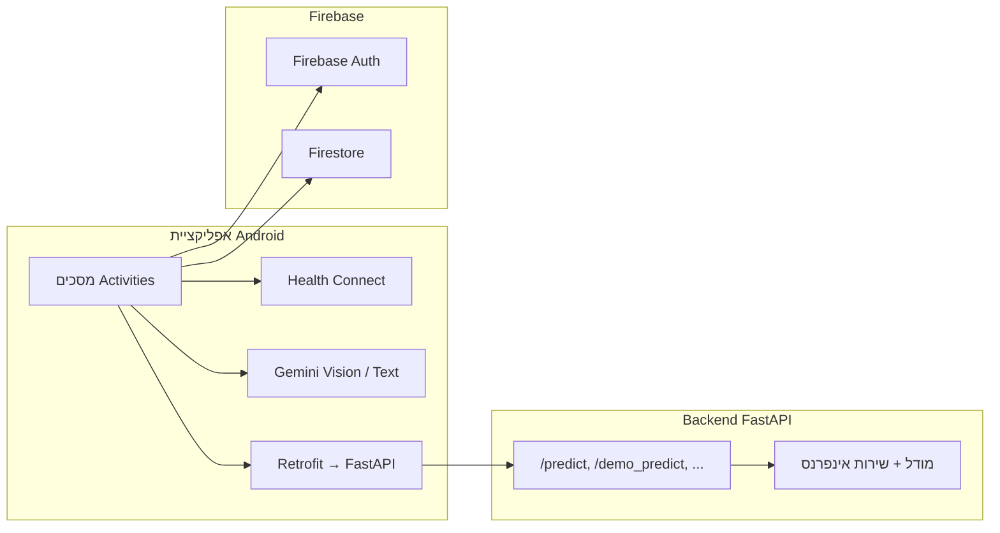

# AthleAgent — מדריך התקשרות למפתח חדש

מסמך זה מספק תמונה ברמת מערכת של פרויקט **AthleAgent**: מה האפליקציה עושה, אילו מסכים קיימים, איך האנדרואיד מתחבר לבקאנד, ומרשם נקודות קצה (API) רלוונטיות. הוא נועד לחפיפה מהירה של מפתח שנכנס לפרויקט.

---

## 1. מה המערכת עושה

**AthleAgent** היא פלטפורמה לאיסוף נתוני בריאות וביצועים של ספורטאים, חישוב **ציון סיכון יומי לפציעה**, והצגת המידע לספורטאי ולמאמן. הרעיון המרכזי: לאחד נתונים סובייקטיביים (שאלונים יומיים), נתונים אובייקטיביים (Health Connect / נתוני פעילות), ותזונה (ניתוח תמונה עם AI), ולהפיק מתוכם תובנה פרוגנוסטית לפני שהפציעה מתרחשת.

הפרויקט מורכב משלושה רכיבים עיקריים:

| רכיב | טכנולוגיה | תפקיד |
|------|-----------|--------|
| אפליקציית אנדרואיד | Kotlin, XML, Material | UI, איסוף נתונים, Firebase, קריאות לבקאנד |
| Backend למודל | Python, FastAPI | אינפרנס סיכון פציעה, ניטור מודל, הקשר ייצור |
| Firebase | Auth + Cloud Firestore | משתמשים, פרופילים, קבוצות, בקשות הצטרפות, מסמכי יום (`daily_health`, `daily_checkins`, וכו') |
| צינור ML (נפרד) | Python (`ML_model/`) | אימון, artifacts, gates — לא רץ בתוך האפליקציה |

---

## 2. ארכיטקטורה וזרימת נתונים (ברמה גבוהה)



- **אימות והרשאות:** משתמשים נכנסים בעיקר דרך **Firebase Auth** (כולל Google דרך Firebase UI). תפקיד המשתמש (`Athlete` / `Coach`) נשמר במסמך `users/{uid}` ב-Firestore.
- **נתונים יומיים:** הספורטאי ממלא צ'ק-אין, מסנכרן Health Connect, ומעלה ארוחות — הכול נכתב ל-Firestore תחת מבנה לפי משתמש ותאריך.
- **סיכון פציעה (Production target):** הטריגר המומלץ הוא `POST /predict/daily` עם `userId+date` בלבד; הבקאנד מושך ישירות את נתוני היום והפרופיל מ-Firestore ומריץ את המודל.
- **אינפרנס ייצור מתקדם:** `POST /predict` נשאר נתיב תקין להעברת payload מלא (camelCase), אך אינו הנתיב המומלץ לזרימה יומית רגילה.

---

## 3. מסכים ופונקציונליות

נקודת הכניסה המוגדרת ב-`AndroidManifest` היא **`LoginActivity`** (LAUNCHER). **`MainActivity`** מנתב לפי מצב התחברות ותפקיד; אם אין משתמש — חזרה ל-Login.

### 3.1 זרימת ספורטאי

| מסך | קובץ / Activity | תיאור קצר |
|-----|-------------------|-----------|
| התחברות | `LoginActivity` | Google / הרשמה דרך `LoginManager`, יצירת/טעינת פרופיל ב-Firestore, ניווט לפי `role`. |
| רישום (אם בשימוש) | `RegisterActivity` | הרשמה ידנית לפי לוגיקת הפרויקט. |
| ניתוב ראשוני | `MainActivity` | קורא `role` מ-Firestore ומפנה ל-`HomeAthleteActivity` או `HomeCoachActivity`. |
| בית ספורטאי | `HomeAthleteActivity` | כפתורים: דשבורד סיכון, צ'ק-אין יומי, תזונה (מצלמה/גלריה), סנכרון Wearable, הצטרפות לקבוצה, התנתקות. טוען התראות/סטטוס יום מ-Firestore. |
| דשבורד סיכון | `AthleteDashboardActivity` | מציג ציון וגרף היסטורי; אינטגרציית backend מומלצת לייצור: `POST /predict/daily` עם טריגר מינימלי. |
| צ'ק-אין יומי | `DailyCheckInActivity` | שאלון יומי (אנרגיה, כאב שרירים, לחץ) → כתיבה ל-`daily_checkins`. |
| סנכרון Wearable | `WearableSyncActivity` | אינטגרציה עם **Health Connect** (שינה, צעדים, דופק וכו') → כתיבה ל-`daily_health`. |
| תזונה — ניתוח | `AnalyzingMealActivity` → `MealAnalysisActivity` | תמונת ארוחה; ניתוח עם **Gemini Vision**; סיכום מאקרו ושמירה תחת מסלול תזונה יומי ב-Firestore. |
| הצטרפות לקבוצה | `JoinTeamActivity` | יצירת בקשת join לקבוצה/מאמן ב-Firestore. |
| מדיניות פרטיות | `PrivacyPolicyActivity` | טקסט מדיניות; משמש גם rationale להרשאות Health Connect. |

### 3.2 זרימת מאמן

| מסך | קובץ / Activity | תיאור קצר |
|-----|-------------------|-----------|
| בית מאמן | `HomeCoachActivity` | שם הקבוצה, התראות על בקשות ממתינות, קיצור לדשבורד ולניהול בקשות. |
| בקשות / ניהול קבוצה | `CoachRequestsActivity` | אישור או דחייה של בקשות הצטרפות ספורטאים (Firestore). |
| דשבורד מאמן | `CoachDashboardActivity` | רשימת ספורטאים בקבוצה, צפייה בפרטים וציוני סיכון מ-Firestore. |

---

## 4. חיבור פרונטאנד (Android) לבקאנד (FastAPI)

### 4.1 כתובת בסיס ופרוטוקול

- הקליינט מוגדר ב-`ApiClient.kt` עם בסיס:

  `http://10.0.2.2:8000/`

  כתובת **`10.0.2.2`** היא alias של האמולטור לאנדואיד למחשב המארח (`localhost` של המפתח). במכשיר פיזי יש להחליף לכתובת IP של המחשב ברשת המקומית או לשרת פריסה.

### 4.2 ממשק Retrofit

קובץ `ApiService.kt` מגדיר כרגע קריאה אחת:

- **`POST /demo_predict`** — גוף מסוג `AthleteData` (שדות באנגלית עם קו תחתון, תואמים לסכימת הבקאנד).

שימוש עיקרי: `AthleteDashboardActivity.sendToPythonBackend()`.

בנתיב הייצור המומלץ יש לעבור לטריגר מינימלי (`userId`,`date`) מול `POST /predict/daily` ולהימנע מפיצול לוגיקה בין פרונט לבקאנד.

### 4.3 פער אפשרי בין מודל Kotlin לתגובת השרת

הבקאנד ב-`/demo_predict` מחזיר JSON עם **`risk_percentage`** ו-**`risk_level`** בלבד. מודל `PredictionResponse` באפליקציה כולל גם שדות נוספים — ייתכן צורך בהתאמת המודל או בשימוש בשדות אופציונליים כדי למנוע בעיות דה-סריאליזציה; זה נקודת ביקורת למפתח חדש בעת שינוי החוזה.

### 4.4 נתיב ייצור מומלץ לעתיד

הנתיב המומלץ לזרימת ייצור יומית הוא **`POST /predict/daily`** עם טריגר מינימלי (`userId`, `date`), כך שהבקאנד מושך עצמאית את מסמכי Firestore, מריץ אינפרנס ושומר תוצאה.

הנתיב **`POST /predict`** נשאר נתיב מתקדם/תואמות להעברת `InjuryPredictionRequest` מלא (שדות אופציונליים רבים, camelCase, תואמי Firestore) ומחזיר `InjuryPredictionResponse` (`risk_score`, `risk_level`, `recommendation`, איכות נתונים, `meta`).

לכן מעבר האפליקציה מ-`/demo_predict` צריך להיות קודם כל ל-`/predict/daily`, ולאחר מכן להשתמש ב-`/predict` רק כשיש צורך עסקי ברור ב-payload מלא מהקליינט.

---

## 5. מרשם API — Backend (FastAPI)

כל הנתיבים למטה יחסיים לשורש השרת (ברירת מחדל פורט **8000**), אלא אם צוין קידומת `/api/v1`.

### 5.1 בריאות ושירות

| שיטה | נתיב | תיאור |
|------|------|--------|
| GET | `/` | סטטוס קצר, שם שירות וגרסה. |
| GET | `/health` | בדיקת חיים (`healthy`). |

### 5.2 חיזוי ומודל

| שיטה | נתיב | תיאור |
|------|------|--------|
| POST | `/test_predict` | תגובת mock יציבה לבדיקות עשן (נדרש `user_id` מינימלי). |
| POST | `/demo_predict` | היוריסטיקה קלה על בסיס שינה, עומס, מתח וכו' — **בשימוש האפליקציה כרגע**. |
| POST | `/predict/daily` | **אינפרנס יומי מומלץ**: טריגר מינימלי (`userId`,`date`), הבקאנד שולף נתוני Firestore בעצמו. |
| POST | `/predict` | **אינפרנס ייצור מתקדם**: payload מלא מהלקוח, נשמר לתאימות/דיבוג. |
| POST | `/predict/sklearn` | נתיב sklearn ישן; מושבת כברירת מחדל (`ENABLE_LEGACY_SKLEARN_ENDPOINT=false`) — מחזיר 410 כשכבוי. |
| GET | `/status/ml` | מטא-דאטה תפעולית: סטטוס מודל (Live/Blocked), gates, סיבות. |

### 5.3 אימות Legacy (Postgres + JWT) — אופציונלי

כאשר **`ENABLE_LEGACY_AUTH_DB=true`** נטענים הנתיבים הבאים תחת הקידומת **`/api/v1/auth`**:

| שיטה | נתיב מלא | תיאור |
|------|-----------|--------|
| POST | `/api/v1/auth/register` | הרשמת משתמש (מסד SQLAlchemy). |
| POST | `/api/v1/auth/login` | התחברות מייל/סיסמה → JWT. |
| POST | `/api/v1/auth/google` | אימות Google לטוקן JWT של הבקאנד. |
| GET | `/api/v1/auth/me` | פרופיל משתמש נוכחי (Bearer JWT). |

בברירת המחדל של הקונפיגורציה (**`ENABLE_LEGACY_AUTH_DB=false`**) נתיבים אלה **לא נטענים**; האפליקציה הסלולרית משתמשת ב-**Firebase Auth** ולא תלויה בהם.

---

## 6. שירותים חיצוניים (מרשם מורחב)

מעבר ל-REST הפנימי, הפרויקט מתחבר לשירותים הבאים:

| שירות | שימוש עיקרי |
|--------|-------------|
| **Firebase Authentication** | התחברות משתמשים (כולל Google). |
| **Cloud Firestore** | פרופילים, קבוצות, מסמכי יום, בקשות join, ציוני סיכון לאורך זמן. |
| **Google Health Connect** | קריאת מדדי בריאות מורשים מהמכשיר. |
| **Google Gemini** (מפתח ב-`local.properties` / `BuildConfig`) | ניתוח תמונות ארוחה והמלצות טקסט בדשבורד הספורטאי. |
| **FastAPI Backend** | חישוב סיכון (`/predict/daily` מומלץ לייצור; `/predict` מתקדם; `/demo_predict` legacy). |

בקונפיג הבקאנד מופיעים גם משתנים ל-**Firebase Admin**, **Gemini**, והעלאות קבצים — לפי הצורך בשירותים נוספים בצד השרת (למשל היסטוריה או עיבוד תמונות בשרת).

---

## 7. הרצה מהירה למפתח חדש

**אנדרואיד**

1. פתיחת `android_app/AthleAgent` ב-Android Studio.
2. `google-services.json` בתיקיית `app/`.
3. `GEMINI_API_KEY` ב-`local.properties` (כמתואר ב-README השורשי).
4. להרצה מול בקאנד מקומי: להפעיל את השרת על הפורט הצפוי ולהתאים `BASE_URL` במידת הצורך (אמולטור מול `10.0.2.2`, מכשיר פיזי מול IP המחשב).

**Backend**

```bash
cd backend
# venv + pip install -r requirements.txt
uvicorn main:app --reload --host 0.0.0.0 --port 8000
```

ודא ש-artifacts המודל והגדרות הסביבה תואמים ל-`ML_model/artifacts` ולמדיניות ה-gate (ראה `backend/README.md`).

---

## 8. קבצים מרכזיים להמשך קריאה

| נושא | מיקום |
|------|--------|
| רישום ראוטים והפעלת auth legacy | `backend/main.py` |
| נתיבי חיזוי | `backend/api/routes/predict.py` |
| חוזה JSON ייצור | `backend/schemas/inference.py` |
| לוגיקת אינפרנס | `backend/services/prediction_service.py` |
| קליינט HTTP באנדרואיד | `android_app/.../network/ApiClient.kt`, `ApiService.kt` |
| דשבורד וקריאת API | `AthleteDashboardActivity.kt` |

---

*מסמך זה משקף את מצב הקוד כפי שנסקר לצורך חפיפה; בעת שינוי חוזי API או מסכים, עדכן את הסעיפים הרלוונטיים או הפנה ל-ADR/README ספציפיים.*
