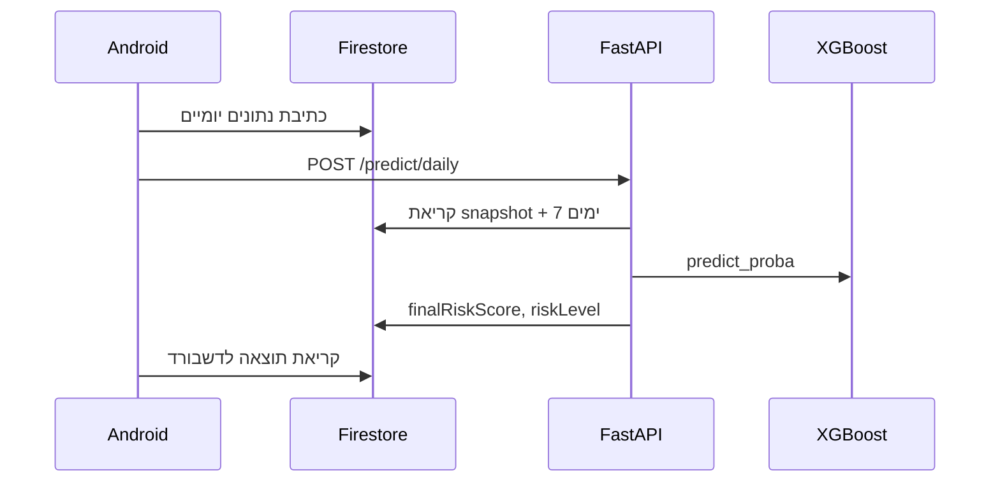
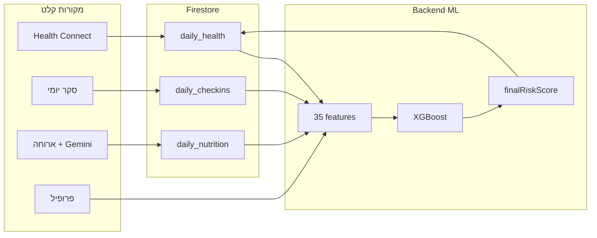

# AthleAgent — מדריך הכנה לתערוכה

> **מטרה:** להכין אותך להציג את הפוסטר ולענות לעומק על כל מה שכתוב בו — וגם על שאלות שמחוץ לפוסטר.  
> **עקרון מספרים:** בפני הקהל — **הפוסטר הוא מקור האמת**. הערות שוליים בסוף המסמך מסבירות עדכונים בקוד (אם שואלים).

| שדה | ערך |
|-----|-----|
| **מגישים** | יהב סימון, צוף פלדון |
| **מנחה** | מר איל איזנשטיין \| מדעי המחשב |
| **מסמכים קשורים** | [HLD_PROJECT.md](HLD_PROJECT.md) · [EXHIBITION_QA_CHEATSHEET_HE.md](EXHIBITION_QA_CHEATSHEET_HE.md) · [RISK_SCORE.md](../backend/docs/RISK_SCORE.md) |

---

## חלק א׳ — פתיחה (30 שניות)

### Elevator pitch

> **AthleAgent** היא פלטפורמה למניעת פציעות בספורטאים. במקום לטפל בפציעה **אחרי** שהיא קרתה, המערכת מחשבת כל בוקר **ציון סיכון יומי** (0–100%) שמאחד עומס אימון, שינה, תזונה ומצב נפשי — ומציגה אותו לספורטאי ולמאמן.

**משפט מפתח:** *מעבר מטיפול תגובתי בפציעות ל**מניעה**.*

### שני סוגי משתמשים

| תפקיד | מה עושה | מסך מרכזי |
|-------|---------|-----------|
| **ספורטאי** | מסנכרן שעון, ממלא סקר, (אופציונלי) מצלם ארוחה | `AthleteDashboardActivity` — מחוון סיכון + גרף + המלצת Gemini |
| **מאמן** | יוצר קבוצה, מאשר בקשות הצטרפות | `CoachDashboardActivity` — רשימת ספורטאים + סיכון לכל אחד |

### Tagline מהפוסטר

**"פלטפורמה אחודה מבוססת ML: איסוף נתונים יומי המזין דאשבורד למאמנים ולספורטאים לניהול סיכונים והערכת סיכון לפציעה."**

**מה זה אומר בפועל:**
- **אחודה** — כל המקורות (שעון, סקר, תזונה) נכנסים לציון אחד, לא לאפליקציות נפרדות.
- **יומי** — החיזוי הוא ל**היום** (בוקר האימון), לא תחזית לשבוע הבא.
- **דאשבורד** — לא רק מספר; גם רמת סיכון (נמוך/בינוני/גבוה), היסטוריה, והמלצות טקסט.

---

## חלק ב׳ — פירוק הפוסטר שורה-שורה

### כותרת ונקודות מרכזיות (מעל הסעיפים)

#### אינטגרציה מרובת מקורות: 21 מדדים פיזיים + תזונה + סקר מנטלי

| מקור | מה נאסף | איפה נשמר | קובץ בקוד |
|------|---------|-----------|-----------|
| **Health Connect** (שעון חכם) | שינה, צעדים, מרחק, דופק, HRV, VO2, SpO2, קלוריות, גובה, קומות, קצב, מהירות, כוח ועוד | `users/{uid}/daily_health/{date}` | `WearableSyncActivity.kt` |
| **סקר מנטלי יומי** | אנרגיה, כאב שרירים, סטרס (1–10), פציעה אתמול | `users/{uid}/daily_checkins/{date}` | `DailyCheckInActivity.kt` |
| **תזונה (AI)** | קלוריות, חלבון, פחמימות מתמונת ארוחה | `users/{uid}/daily_nutrition/{date}` | `AnalyzingMealActivity.kt` + Gemini Vision |

**למה "21 מדדים פיזיים"?**  
ב-Health Connect מוגדרים **19 סוגי רשומות** (הרשאות קריאה): שינה, דופק, צעדים, מרחק, מהירות, קלוריות פעילות/כוללות, BMR, משקל, HRV, דופק מנוחה, SpO2, VO2max, אחוז שומן, קצב נשימה, עליית גובה, קומות, קצב צעדים, סשן אימון. מהן נגזרים שדות נוספים ב-Firestore (למשל `sleepMinutes`, `distanceMeters`, `heartRateAvg`). המספר 21 בפוסטר מתאר את **מקורות האיסוף הפיזיים** — לא את מספר הפיצ'רים של המודל.

**חשוב להבחין:** המודל ML משתמש ב-**35 פיצ'רים** (כולל פיצ'רים מחושבים כמו ACWR, חוב שינה, ירידת HRV). ראו [model_feature_contract.json](../backend/data/model_feature_contract.json).

---

#### חיזוי סיכון יומי: XGBoost → 3 רמות

| שלב | מה קורה |
|-----|---------|
| 1 | הבקאנד קורא snapshot מ-Firestore + 7 ימי היסטוריה |
| 2 | Feature engineering → וקטור של 35 ערכים |
| 3 | `model.predict_proba(X)[0, 1]` → הסתברות פציעה **היום** (0–1) |
| 4 | הכפלה ב-100 → `finalRiskScore` (0–100%) |
| 5 | סיווג לרמות UI |

**רמות סיכון (production):**

| רמה | טווח `finalRiskScore` | צבע ב-UI |
|-----|----------------------|----------|
| **Low** (נמוך) | 0–20% | ירוק |
| **Medium** (בינוני) | 21–70% | צהוב/כתום |
| **High** (גבוה) | 71–100% | אדום |

קוד: `backend/services/risk_levels.py`

**למה XGBoost?**  
Gradient boosting על עצי החלטה — מתאים לטאבלארי, מטפל ביחסים לא-ליניאריים (למשל ACWR גבוה + שינה נמוכה יחד), ונותן feature importance לניתוח.

---

#### ביצועי המודל (כפי שמופיע בפוסטר)

| מדד בפוסטר | משמעות | איך להסביר לקהל |
|------------|--------|-----------------|
| **~340,000 רשומות** | שורות אימון סינתטיות (ספורטאים × ימים) | "אימנו על כשנה של נתונים ל-1,000 ספורטאים וירטואליים" |
| **Recall 86.6%** | מתוך כל הימים עם פציעה אמיתית — כמה תפסנו | "רוב מקרי הסיכון הגבוה לא מפספסים — קריטי למניעה" |
| **ROC-AUC 0.72** | יכולת הפרדה כללית בין יום עם/בלי פציעה | "0.5 = מטבע, 1.0 = מושלם; 0.72 = הפרדה סבירה" |
| **Brier-Score 0.115** | כיול הסתברויות — נמוך יותר = טוב יותר | "כשהמודל אומר 30% — באמת בערך שליש מהמקרים נפצעים" |

**מאיפה הדאטה?**  
`ML_model/data_generator.py` — דאטה **סינתטי** עם מודל סיכון מבוסס מחקר ספורט:

- **ACWR > 1.4** — יחס עומס חד לכרוני (Gabbett, 2016)
- **חוב שינה** מצטבר
- **ירידת HRV** — לחץ על מערכת העצבים האוטונומית
- **סטרס גבוה** + עומס — אפקט מכפיל
- **Cooldown** אחרי פציעה

Pipeline: `data_generator.py` → `create_benchmark_set.py` → `train_model.py` (CV×2 → 5 מועמדים → benchmark holdout → refit מלא) → `run_pipeline.py` → `artifacts/promoted.json`

פרוטוקול מלא: [`ML_model/docs/MODEL_SELECTION.md`](../ML_model/docs/MODEL_SELECTION.md)

---

### סעיף 1 — תיאור הבעיה

#### נתונים מפוזרים

**הבעיה:** ספורטאי מנהל עומס ב-Garmin/Strava, תזונה ב-MyFitnessPal, שינה באפליקציה נפרדת. המאמן רואה רק חלק מהתמונה.

**הפתרון שלנו:** מקור אמת אחד — **Cloud Firestore** — שמאגד הכל לפני חיזוי.

#### גישה תגובתית

**הבעיה:** רוב המערכות בתעשייה מתמקדות ב**שיקום** — פיזיותרפיה, MRI, הפסקת אימונים — **אחרי** שהפציעה כבר קרתה.

**הפתרון שלנו:** **מניעה** — התראה מוקדמת כשדפוסי הסיכון (עומס + שחיקה + שינה גרועה) מצטברים.

#### מורכבות חישוב

**הבעיה:** מדדים כמו **ACWR** (Acute:Chronic Workload Ratio), **חוב שינה 3 ימים**, **ירידת HRV** — קשים לחשב ידנית ב-5 דקות בבוקר לפני אימון.

**הפתרון שלנו:** המודל מחשב **35 פיצ'רים** אוטומטית, כולל rolling features על 7 ימים אחורה.

#### הצורך

**הבעיה:** אין כלי שמעריך **סיכון פציעה יומי** באופן אוטומטי ממקורות מרובים.

**הפתרון שלנו:** פלטפורמה מבוססת ML שמייצרת **Daily Injury Risk Score** כל בוקר.

---

### סעיף 2 — פתרון (ארכיטקטורה)



#### שכבת הלקוח — Android/Kotlin

| נושא | מה לומר |
|------|---------|
| **טכנולוגיה** | Kotlin native, Activities, View Binding, Material Design, Retrofit |
| **Health Connect** | גשר סטנדרטי של Google לשעונים (Garmin, Samsung, Pixel Watch וכו') |
| **Gemini Vision** | ניתוח ארוחה מתמונה — **בלי הקלדה ידנית** של קלוריות |
| **שני תפקידים** | routing אחרי Firebase Auth — ספורטאי או מאמן |

**הערה פנימית (אם שואלים על MVVM):**  
הפוסטר מציין "ארכיטקטורת MVVM". **במימוש בפועל** — Activity-centric + View Binding, **ללא** ViewModel/Repository (ראו [README.md](../README.md)). ניסוח מומלץ: *"תכננו הפרדת שכבות; בפרויקט הגמר יישמנו Activities ישירות לצמצום scope — עם roadmap ל-Repository layer."*

#### בסיס הנתונים — Firebase

| רכיב | תפקיד |
|------|-------|
| **Firebase Auth** | התחברות (אימייל + Google), routing לפי role |
| **Cloud Firestore** | **מקור אמת ל-UI** — כל הנתונים היומיים + תוצאות חיזוי |

**עקרון מרכזי — Firestore-as-truth:**
1. האפליקציה **כותבת** נתונים ל-Firestore
2. האפליקציה **מפעילה** `POST /predict/daily` (trigger בלבד)
3. הבקאנד **קורא** מ-Firestore, מריץ ML, **כותב חזרה** `finalRiskScore`
4. האפליקציה **קוראת** את התוצאה מ-Firestore לדשבורד — **לא** מה-response body של ה-API

#### שכבת השרת — FastAPI/Python

| endpoint | תפקיד |
|----------|-------|
| `POST /predict/daily` | חיזוי production — body: `{userId, date}` |
| `GET /status/ml` | האם המודל Live או Blocked |
| `GET /health` | liveness |
| `POST /api/v1/observability/client-events` | telemetry מהאנדרואיד |

**מה קורה בחיזוי:**
1. קריאת `daily_health`, `daily_checkins`, `daily_nutrition`, `users` מ-Firestore
2. הנדסת פיצ'רים (ACWR, sleep debt, HRV drop...)
3. `predict_proba` → `risk_score`
4. `classify_risk_level` → Low/Medium/High
5. חישוב `prediction_confidence` (איכות קלט)
6. כתיבה ל-`daily_health/{date}`

#### בקרת אמינות ושלמות נתונים

הפוסטר: *"מנגנון אימות קלט המונע מתן ציון סיכון במצב של נתונים חסרים"*.

**בפועל — שכבות הגנה:**

| מנגנון | מה עושה |
|--------|---------|
| **Cross-trigger** | חיזוי רק כשגם סקר **וגם** סנכרון שעון הושלמו |
| **prediction_confidence** | מספר 0–100 נפרד מהסיכון — "כמה הקלט אמין" |
| **Defaults ניטרליים** | שדות חסרים לא מניחים 0 שינה (= סיכון נמוך מלאכותי) |
| **ML manifest gates** | אם Recall < 80% או AUC < 0.68 — הבקאנד מחזיר **HTTP 503** ולא משרת חיזוי |
| **nutritionImputed** | תזונה חסרה → ממוצעים כלליים + confidence יורד |

**Cross-trigger בפירוט:**

| מסך | מפעיל חיזוי כאשר |
|-----|------------------|
| `DailyCheckInActivity` | `sleepMinutes` קיים ב-`daily_health/{היום}` |
| `WearableSyncActivity` | `energyLevel` קיים ב-`daily_checkins/{היום}` |

`MealAnalysisActivity` **לא** מפעיל חיזוי — רק שומר תזונה.

---

### סעיף 3 — ארכיטקטורה (אתגרים)

#### אמינות החיזוי תחת מידע חסר

**האתגר:** משתמש לא תמיד מסנכרן שעון, מפספס סקר, או שאין תזונה.

**הפתרון:**
- **`prediction_confidence`** (0–100) — **לא** סיכון פציעה! מודד איכות קלט (עומק היסטוריה + שלמות שדות).
- **השלמה ניטרלית** — ערכי default שלא מוטים לכיוון סיכון גבוה או נמוך.
- **התניית חיזוי** — cross-trigger: לא מריצים ML בלי שינה **וגם** סקר.

**דוגמה לקהל:**  
"אם המודל אומר 45% סיכון אבל confidence רק 30 — אנחנו מציגים את הסיכון אבל יודעים שהקלט חלקי."

#### פער נתונים בשעת החיזוי

**האתגר:** בבוקר יום D עדיין **אין** נתוני אימון של היום — רק שינה מהלילה וסקר.

**הפתרון — מדיניות date-split:**

| נתון | תאריך במסמך Firestore | למה |
|------|----------------------|-----|
| שינה | `daily_health/{D}` | הלילה שזה עתה נגמר |
| עומס פיזי (צעדים, מרחק, HRV...) | `daily_health/{D-1}` | יום מלא אתמול |
| סקר | `daily_checkins/{D}` | מצב נפשי הבוקר |
| תזונה | `daily_nutrition/{D-1}` | צריכה אתמול |
| Rolling (ACWR, חוב שינה) | 7 ימים עד **D-1** | היסטוריה לפני היום |

**למה זה נכון מבחינה מדעית:** בבוקר האימון המאמן שואל "מה הסיכון **היום**?" — התשובה מבוססת על מה שכבר קרה (אתמול + הלילה), לא על עומס שעדיין לא נאסף.

#### היעדר נתוני שטח אמיתיים ומתויגים

**האתגר:** אין מספיק דאטה אמיתי עם תיוג "נפצע / לא נפצע" לכל יום.

**הפתרון:**
- `data_generator.py` — 1,000 ספורטאים × 365 יום, hazard model מבוסס מחקר
- תיוג: `injury_today` — פציעה ביום D

---

### סעיף 4 — אתגר הנדסי (כותרת בלבד בפוסטר)

הפוסטר מציג כותרת **"4. אתגר הנדסי"** ללא טקסט. **המלצה:** כשמצביעים על הסעיף — לדבר על 2–3 נקודות הבאות (מתוך סעיף 3 + מעבר):

| אתגר | הסבר קצר |
|------|----------|
| **Train-serve parity** | אותן נוסחאות פיצ'רים באימון (`data_generator.py`) ובשרת (`model_features.py`) — נבדק ב-`test_train_serve_parity.py` |
| **Model manifest gates** | הבקאנד לא משרת מודל גרוע — `GET /status/ml` → Live/Blocked |
| **Firestore-as-truth** | decoupling: trigger חיזוי ≠ קריאת תוצאה — תומך retry ו-async |
| **Date-split sync** | שינה ל-{D}, עומס ל-{D-1} — החלטת עיצוב מורכבת שמיושמת ב-`WearableSyncActivity` |
| **Observability** | `X-Request-ID` מ-Android ל-`logs/athleagent.log` — trace מקצה לקצה בלי PHI |

---

## חלק ג׳ — מעבר לפוסטר

### זרימת נתונים — תמונה כוללת



### זרימת Demo מומלצת (2–3 דקות)

1. **התחברות** כספורטאי (Firebase Auth)
2. **סנכרון Health Connect** — שינה + עומס אתמול
3. **סקר יומי** — אנרגיה, סטרס, כאב שרירים
4. *(אופציונלי)* **צילום ארוחה** → Gemini מחלץ מאקרו
5. **דשבורד ספורטאי** — מחוון סיכון, גרף MPAndroidChart, המלצת Gemini
6. **מעבר למאמן** — דשבורד קבוצתי: סיכון לכל ספורטאי

**דרישות טכניות לפני התערוכה:**

```powershell
# מהשורש של ה-repo
docker compose up --build
# או: cd backend && uvicorn main:app --reload

# וידוא:
# GET http://localhost:8000/status/ml → "status": "Live"
```

- `backend/firebase-key.json` (לא ב-git)
- `google-services.json` באנדרואיד
- `GEMINI_API_KEY` ב-`local.properties`
- מכשיר פיזי עם Health Connect (מומלץ)
- Retrofit מצביע ל-`10.0.2.2:8000` (אמולטור) או IP המחשב (מכשיר)

### 35 הפיצ'רים — רשימה מלאה

```
bmi, age, body_fat_pct, vo2_max, history_injury_count, injured_yesterday,
daily_distance_km, workout_intensity_minutes, avg_cadence, elevation_gained_m,
floors_climbed, avg_speed, max_speed, avg_power, active_calories_burned,
sleep_hours, hrv_score, resting_hr, respiratory_rate, spo2,
nutrition_intake_calories, daily_calories, total_calories_burned,
stress_level, muscle_soreness, energy_level,
acute_load_7d, acwr_ratio, acwr_ratio_ma7, calorie_balance,
sleep_hours_ma7, sleep_debt_3d, hrv_drop, load_recovery_imbalance,
speed_intensity_ratio
```

### Top 5 פיצ'רים לפי חשיבות (מודל promoted)

| פיצ'ר | משמעות | חשיבות |
|-------|--------|--------|
| `hrv_drop` | ירידה ב-HRV לעומת ממוצע 7 ימים | ~28% |
| `stress_level` | סטרס מהסקר היומי | ~14% |
| `sleep_debt_3d` | חוב שינה מצטבר 3 ימים | ~11% |
| `injured_yesterday` | האם נפצע אתמול | ~9% |
| `load_recovery_imbalance` | חוסר איזון בין עומס להתאוששות | ~7% |

### כיול לפי רמות סיכון (holdout, מודל promoted)

| רמת ציון | % דגימות בטווח | שיעור פציעה בפועל |
|----------|----------------|-------------------|
| ירוק (0–20%) | רוב הימים | ~9% |
| צהוב (20–50%) | בינוני | ~31% |
| אדום (50–100%) | מיעוט | ~65% |

→ המודל **מכויל**: כשהציון גבוה, באמת יש יותר פציעות.

### שלושה מספרים שמבלבלים — להבדיל בבירור

| שם | טווח | משמעות |
|----|------|--------|
| `finalRiskScore` | 0–100% | **מה שהמשתמש רואה** — הסתברות פציעה היום |
| `risk_score` | 0–1 | אותו ערך בשרת (לפני הכפלה ב-100) |
| `prediction_confidence` | 0–100 | **איכות הקלט** — לא הסיכון! |

### שאלות "קשות" — תשובות מוכנות

| שאלה | תשובה |
|------|--------|
| **"זה באמת מנבא פציעות?"** | מודל הסתברותי שמזהה דפוסי סיכון מדאטה היסטורי. **לא** אבחון רפואי ולא מחליף איש מקצוע. |
| **"למה Recall גבוה ו-Precision נמוך?"** | במניעה עדיף **להזהיר מוקדם** (false positive) מאשר לפספס פציעה (false negative). Recall גבוה = תופסים רוב המקרים. |
| **"מה אם אין שעון?"** | אפשר חיזוי מסקר + פרופיל, אבל `prediction_confidence` יורד — המערכת "יודעת" שהקלט חלקי. |
| **"איך מגינים על פרטיות?"** | Firebase Auth, הרשאות Health Connect, Gemini רץ בלקוח, אין PHI בלוגים (NFR-SEC-01). |
| **"למה אין auth על API?"** | מגבלת scope בפרויקט גמר. מתועד ב-[HLD_PROJECT.md](HLD_PROJECT.md) §8. Roadmap: Firebase ID Token בבקאנד. |
| **"MVVM?"** | כיוון עיצובי בפוסטר; מימוש Activity-centric. Roadmap: Repository layer. |
| **"מה ההבדל מ-Whoop/Oura?"** | הם מתמקדים בספורטאי בודד; AthleAgent מוסיף **מאמן + קבוצה** + מודל ML משלנו + תזונה מצילום. |
| **"האם הדאטה אמיתי?"** | אימון על דאטה **סינתטי** מבוסס מחקר (ACWR, שינה, HRV). האפליקציה שומרת נתונים אמיתיים ב-Firestore לשימוש בחיזוי. |

### Roadmap (מעבר לפוסטר)

1. Auth על API (Firebase token middleware)
2. Firestore Security Rules מחמירות
3. Deploy בקאנד ל-Cloud Run / Render
4. Repository layer ב-Android
5. Trigger gate בפרונט — בדיקת עומס `{D-1}` לפני חיזוי

### מסמכים לקריאה לפני התערוכה

| מסמך | תוכן |
|------|------|
| [HLD_PROJECT.md](HLD_PROJECT.md) | ארכיטקטורה מלאה בעברית |
| [RISK_SCORE.md](../backend/docs/RISK_SCORE.md) | pipeline ציון סיכון E2E (~1000 שורות) |
| [FEATURES.md](../backend/docs/FEATURES.md) | חוזה Firestore → מודל |
| [NFR.md](NFR.md) | דרישות לא-פונקציונליות מדידות |
| [model_improvement_journey.ipynb](../ML_model/notebooks/model_improvement_journey.ipynb) | מסע שיפור המודל |

---

## הערות שוליים — פערים בין פוסטר לקוד (רק אם שואלים)

> **בפני הקהל:** הציגי את המספרים מהפוסטר. הטבלה הזו לשימוש פנימי בלבד.

| נושא | בפוסטר | בקוד עדכני (promoted `20260629_184034`) |
|------|--------|----------------------------------------|
| Recall | 86.6% | **81.1%** (XGBoostCalibratedTuned @ threshold 0.10) |
| ROC-AUC | 0.72 | **0.793** |
| Brier | 0.115 | **0.113** |
| רשומות | ~340,000 | **359,000** |
| מודל | XGBoost (כללי) | **XGBoostCalibratedTuned** (כיול sigmoid) |
| ארכיטקטורה Android | MVVM | **Activity-centric** + View Binding |

**ניסוח מומלץ אם שואלים על עדכון:**

> "המספרים בפוסטר משקפים את מחזור האימון שבו עיצבנו את המערכת. מאז שיפרנו את המודל עם **כיול (calibration)** — ה-AUC עלה לכ-0.79, וה-Recall נשאר **מעל 80%** — זה הסף המינימלי שלנו לשרת חיזוי בפרודקשן."

**למה Recall ירד מ-86.6 ל-81.1?**  
בחירת מודל מכויל (CalibratedTuned) עם threshold נמוך יותר (0.10) — trade-off: Recall עדיין מעל gate (80%), AUC ו-Brier משתפרים, Precision מעט גבוה יותר.

---

## Tech Stack — סיכום לשאלות

| שכבה | טכנולוגיות |
|------|------------|
| **Android** | Kotlin, Activities, View Binding, Retrofit, MPAndroidChart |
| **Cloud** | Firebase Auth, Cloud Firestore |
| **Backend** | Python, FastAPI, Uvicorn, firebase-admin |
| **ML** | XGBoost, scikit-learn, pandas, joblib |
| **AI** | Google Gemini Vision + Text (client-side) |
| **Health** | Google Health Connect SDK |
| **DevOps** | Docker, GitHub Actions (pytest), ~150+ בדיקות backend |

---

*בהצלחה בתערוכה! לתרגול מהיר — ראי [EXHIBITION_QA_CHEATSHEET_HE.md](EXHIBITION_QA_CHEATSHEET_HE.md).*
