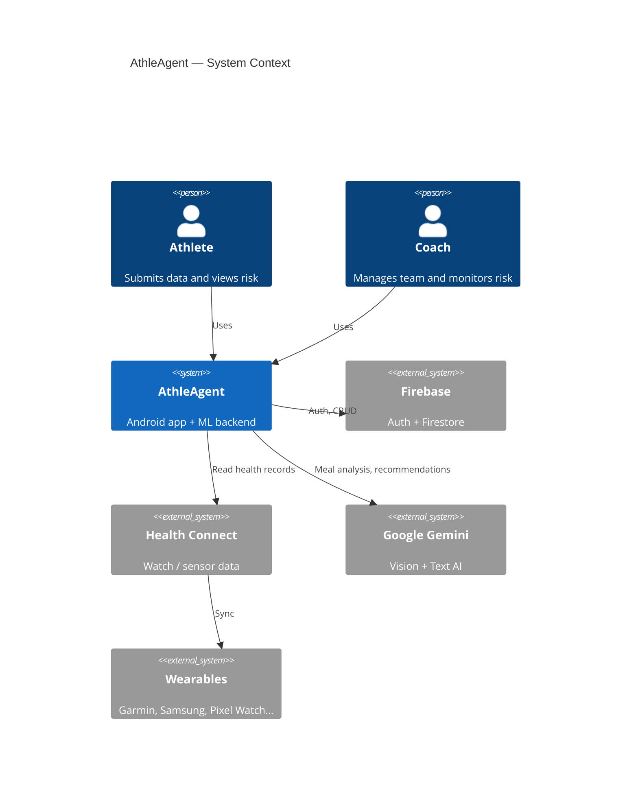
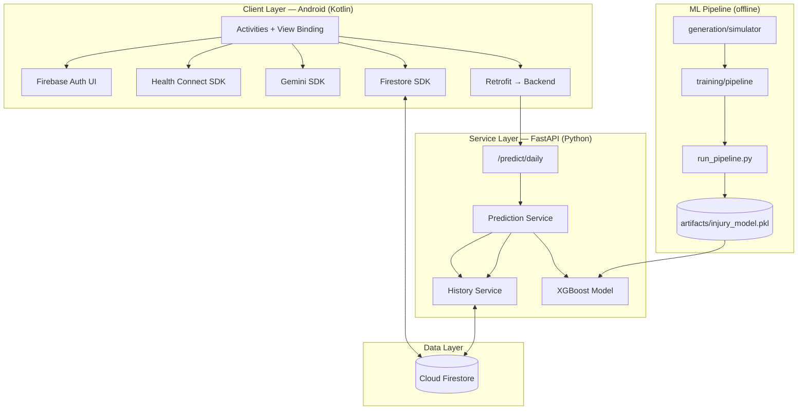
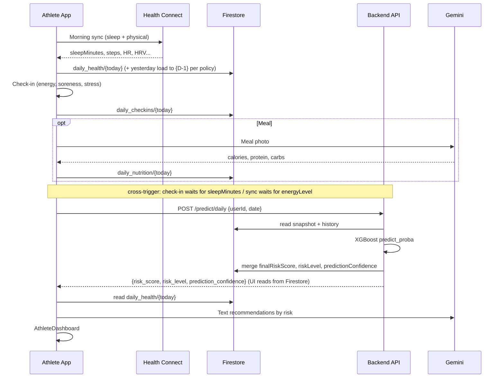
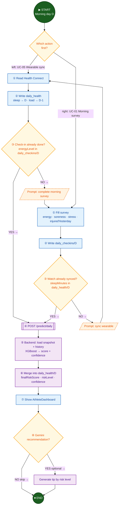
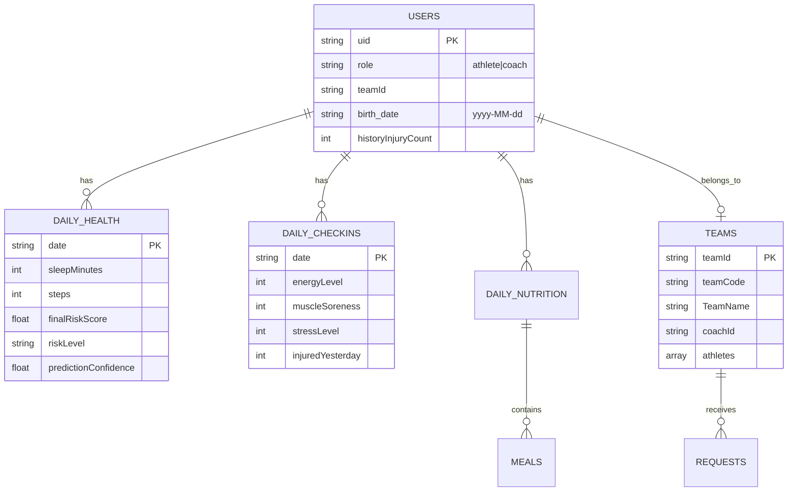

# AthleAgent — High-Level Design (HLD)
## Full-Project High-Level Design Document

| Field | Value |
|-------|-------|
| **Version** | 1.1 |
| **Date** | 2026-07-11 |
| **Authors** | Yahav Simon, Tzuf Feldon |
| **Audience** | Developers, course evaluators, technical stakeholders |
| **Related documents** | [LLD_PROJECT.md](LLD_PROJECT.md) · [DOCKER.md](DOCKER.md) · [MODEL_SELECTION.md](MODEL_SELECTION.md) |

---

## 1. Executive Summary

**AthleAgent** is a sports-injury prevention platform. The system collects daily data from multiple sources — self-reported check-ins, a smartwatch (via Health Connect), and optional AI-powered meal analysis — and computes a **Daily Injury Risk Score**.

The system serves two user roles:
- **Athlete** — submits data, views personal risk, and receives recommendations.
- **Coach** — manages a team, approves join requests, and monitors aggregate roster risk.

---

## 2. Goals and Non-Functional Requirements

### 2.1 Business Goals

| Goal | Success Metric |
|------|----------------|
| Early injury-risk detection | Daily score 0–100 + Low/Medium/High band |
| Reduced manual data entry | Automatic watch sync + optional AI meal analysis |
| Coach visibility | Real-time team dashboard |
| Continuous improvement | `run_pipeline.py` — retrain on synthetic data + promote |

### 2.2 Non-Functional Requirements

| Requirement | Current Implementation |
|-------------|------------------------|
| **Availability** | Cloud Firestore (managed) + stateless FastAPI |
| **Performance** | Prediction < 2 s (Firestore read + XGBoost inference) |
| **Reliability** | Defaults for missing data; confidence score |
| **Security** | Firebase Auth on client; **no auth on prediction API** (see §8) |
| **Maintainability** | Modular layout: Android / Backend / ML_model |
| **Privacy** | Health Connect permissions; `PrivacyPolicyActivity` |

---

## 3. System Context



---

## 4. Logical Architecture — Three Layers



### 4.1 Core Principle: Firestore as Source of Truth

- The Android app **writes** daily data to Cloud Firestore.
- The backend **reads** from Firestore, runs ML inference, and **writes back** prediction results.
- The app **reads** results from Firestore — not primarily from the HTTP response body.
- There is **no local SQL database**; all persistent application data lives in Cloud Firestore.

### 4.2 Separation of Responsibilities

| Component | Responsibility | Not Responsible For |
|-----------|----------------|---------------------|
| **Android** | UX, data collection, client-side Gemini, prediction trigger | ML inference |
| **Backend** | Firestore read/write, feature engineering, ML inference | UI, meal vision |
| **ML_model** | Training, validation, promotion | Runtime serving |
| **Firestore** | Persistent storage | Computation |

---

## 5. Roles and User Flows

### 5.1 Athlete — Daily Flow



**Cross-trigger conditions:**

| Screen | Triggers prediction when |
|--------|--------------------------|
| `DailyCheckInActivity` | `sleepMinutes` exists in `daily_health/{today}` |
| `WearableSyncActivity` | `energyLevel` exists in `daily_checkins/{today}` |

`MealAnalysisActivity` saves nutrition only — it does **not** call `POST /predict/daily`.

> **Gemini note:** Gemini runs client-side only and is optional for meal analysis. Daily injury-risk scoring works without Gemini.

### 5.2 Athlete — Daily Risk Activity Diagram (UC-01 + UC-05)

**Diagram type:** UML Activity Diagram (flowchart) · **Direction:** top → bottom · **UC:** 01 + 05

Cross-trigger: either path may run first; prediction fires only when both sleep and check-in exist.



### 5.3 Coach — Team Join Activity Diagram (UC-04 + UC-07)

**Diagram type:** UML Activity Diagram with swimlanes · **Direction:** top → bottom · **UC:** 04 + 07

```mermaid
%%{init: {"flowchart": {"htmlLabels": true, "curve": "linear", "nodeSpacing": 35, "rankSpacing": 40}, "theme": "base"}}%%
flowchart TB
    %% ===== UML Activity Diagram — Join Team =====
    Start((▶ START)) --> Enter[Athlete enters teamCode]

    subgraph Athlete["🏊 Swimlane: Athlete  ·  UC-04"]
        direction TB
        Enter --> Query[Query Firestore:<br/>teams where teamCode == code]
        Query --> Found{Team found?}
        Found -->|NO →| Err[/Error: team not found/]
        Err --> Enter
        Found -->|YES →| Send[Create requests/{uid}<br/>status = pending]
        Send --> Wait((⏸ Wait for coach))
    end

    Wait --> Open

    subgraph Coach["🏊 Swimlane: Coach  ·  UC-07"]
        direction TB
        Open[Open CoachRequests] --> Load[Load pending requests]
        Load --> Any{Any pending?}
        Any -->|NO →| Empty[/Empty state/]
        Empty --> EndIdle((⏹ END — nothing to do))
        Any -->|YES →| Decide{Approve or reject?}
        Decide -->|REJECT →| Rej[Set status = rejected]
        Rej --> EndRej((⏹ END — rejected))
        Decide -->|APPROVE →| Batch
    end

    subgraph Firestore["🗄️ Swimlane: Firestore batch"]
        direction TB
        Batch[[Atomic batch]]
        Batch --> A1[status = approved]
        Batch --> A2[athletes arrayUnion uid]
        Batch --> A3[users.teamId = teamId]
        A1 --> Linked
        A2 --> Linked
        A3 --> Linked[Athlete linked to team]
    end

    Linked --> Dash[CoachDashboard reads<br/>daily_health per athlete]
    Dash --> EndOk((⏹ END — on roster))

    classDef startEnd fill:#1B5E20,stroke:#0D3B12,color:#fff,stroke-width:2px
    classDef wait fill:#455A64,stroke:#263238,color:#fff,stroke-width:2px
    classDef process fill:#E3F2FD,stroke:#1565C0,color:#0D47A1,stroke-width:1.5px
    classDef decision fill:#FFF8E1,stroke:#F9A825,color:#E65100,stroke-width:2px
    classDef system fill:#F3E5F5,stroke:#7B1FA2,color:#4A148C,stroke-width:1.5px
    classDef error fill:#FFEBEE,stroke:#C62828,color:#B71C1C,stroke-width:1.5px,stroke-dasharray: 5 3

    class Start,EndIdle,EndRej,EndOk startEnd
    class Wait wait
    class Enter,Query,Send,Open,Load,Dash,A1,A2,A3,Linked,Rej process
    class Found,Any,Decide decision
    class Batch system
    class Err,Empty error
```

### 5.4 Coach — Screen Flow

```mermaid
flowchart LR
    C[Coach Login] --> HT[HomeCoachActivity]
    HT --> CT[CreateTeamActivity]
    HT --> CR[CoachRequestsActivity]
    HT --> CD[CoachDashboardActivity]
    CR -->|approve| FS[(teams.athletes[])]
    CD -->|read| FS2[daily_health per athlete]
```

---

## 6. Data Model (High Level)



> Field-level contract: `backend/data/model_feature_contract.json`

---

## 7. External Integrations

| Service | Direction | Usage | Code Location |
|---------|-----------|-------|---------------|
| **Firebase Auth** | Client → Google | Login, register, role routing | `LoginActivity.kt` |
| **Cloud Firestore** | Client ↔ Cloud, Backend ↔ Cloud | All application data | Activities, `history/inference_bundle.py` + `persist.py` |
| **Health Connect** | Device → Client | sleep, steps, HR, HRV, VO2 | `WearableSyncActivity.kt` |
| **Gemini API** | Client → Google | Meal vision, coaching text (optional) | `AnalyzingMealActivity.kt`, `AthleteDashboardActivity.kt` |
| **FastAPI Backend** | Client → Server | `POST /predict/daily`, `POST /api/v1/observability/client-events` | `ApiClient.kt`, `observability/` |
| **XGBoost** | Server (in-process) | Injury probability | `prediction/service.py` |

### 7.1 Local Execution (Backend + ML)

| Path | Command | When to Use |
|------|---------|-------------|
| **Docker** | `docker compose up --build` (repository root) | Evaluators, quick setup |
| **Python** | `uvicorn main:app` from `backend/` | Development with `--reload` |

> Docker guide: [DOCKER.md](DOCKER.md) · Android emulator → `http://10.0.2.2:8000` (no code changes required)

### 7.2 Configuration and Evaluation Credentials

**No `.env` file is required to run the backend.** Sensible defaults are defined in `backend/config.py`; optional overrides are documented in `backend/.env.example`.

For course evaluation, place credentials locally (do **not** commit or zip the Admin key):
- `backend/firebase-key.json` — Firebase Admin SDK service account (backend → Firestore); provide separately to evaluators
- `android_app/AthleAgent/app/google-services.json` — Firebase client configuration (already in the repo)

> **Security:** Keep the Admin service-account key out of public archives. Prefer a private hand-off for that file only.

---

## 8. Security — Current State and Recommendations

### 8.1 Current State

| Layer | Mechanism |
|-------|-----------|
| User authentication | Firebase Auth (Google + email/password) |
| Data authorization | Firestore Security Rules (assumed in Firebase project) |
| Prediction API | **No authentication** — `userId` supplied in request body |
| Backend → Firestore | Firebase Admin SDK (service account) |

### 8.2 Known Risks

- Calling `/predict/daily` with an arbitrary `userId` (IDOR).
- No rate limiting on the prediction API.

### 8.3 Production Recommendations

1. Firebase ID Token verification on the backend.
2. Firestore Rules: athletes read only their own data; coaches read athletes in their team.
3. HTTPS + API Gateway / Cloud Run with IAM.

---

## 9. ML — High-Level Overview

| Stage | Tool | Output |
|-------|------|--------|
| Synthetic data | `ML_model/generation/simulator.py` (CLI: `data_generator.py`) | `athlete_injury_data.csv` |
| Training | `ML_model/training/pipeline.py` (CLI: `train_model.py`) | `injury_model.pkl` + manifest |
| Quality gates | `validate_metrics.py`, `model_loader.py` | Recall ≥ 0.80, ROC-AUC ≥ 0.68 |
| Promotion | `run_pipeline.py` | `artifacts/promoted.json` |
| Serving | `POST /predict/daily` | Probability → risk bands |

### 9.1 Promoted Production Model (July 2026)

| Property | Value |
|----------|-------|
| **Model** | `XGBoostCalibratedTuned` |
| **Operating threshold** | ~0.10 |
| **Feature count** | 35 (see `backend/data/model_feature_contract.json`) |
| **Quality gates** | Recall ≥ 0.80, ROC-AUC ≥ 0.68 (from `backend/data/ml_policy.json`) |
| **Promotion pointer** | `ML_model/artifacts/promoted.json` → run `20260709_104916` |

> ML detail: [MODEL_SELECTION.md](MODEL_SELECTION.md)

---

## 10. Repository Structure

```
final_project_AthleAgent/
├── android_app/AthleAgent/     # Android application
├── backend/                    # FastAPI inference service
├── ML_model/                   # Training pipeline + artifacts
├── docs/                       # Project documentation (HLD/LLD/Docker)
├── logs/                       # athleagent.log (gitignored, backend + Android telemetry)
└── README.md
```

---

## 11. Dependencies and Technologies

| Layer | Stack |
|-------|-------|
| Mobile | Kotlin, Android SDK, View Binding, Material, Retrofit, Gson, MPAndroidChart |
| Backend | Python 3.x, FastAPI, Uvicorn, Pydantic, pandas, scikit-learn, XGBoost, firebase-admin |
| Cloud | Firebase Auth, Cloud Firestore |
| AI | Google Gemini (client-side only) |
| Health | Google Health Connect SDK |
| CI/Tests | pytest (backend), JUnit (Android placeholder) |

---

## 12. Known Limitations and Gaps

| Topic | Description |
|-------|-------------|
| **Android architecture** | Activity-centric + View Binding; no ViewModel/Repository layer (see README) |
| **Date-split sync** | Implemented: sleep on `{D}`, load on `{D-1}`; **gap:** front-end gate does not verify `{D-1}` load > 0 |
| **Missing nutrition** | Imputed from `nutrition_defaults.py` (2600 kcal, 130 g P, 300 g C); `nutritionImputed` lowers confidence |
| **Backend auth** | Not implemented on production routes |
| **Gemini on backend** | API key may exist in config but no routes — Gemini runs client-side only |
| **Prediction API auth** | No authentication; `userId` in request body is a known limitation |
| **UI data source** | Dashboard reads `finalRiskScore` from Firestore, not primarily from the HTTP response |

---

## 13. Architectural Roadmap (Recommendations)

1. **API authentication** — Firebase token middleware.
2. **Android Repository layer** — separate Firestore access from Activities.
3. **Front-end trigger gate** — verify `sleepMinutes > 0` and `{D-1}` load before `/predict/daily`.
4. **Cloud deployment** — backend on Cloud Run / Render (image buildable from existing `Dockerfile`).
5. **Firestore Rules** — hardening before production.

---

## 14. Document Map

| Document | Content |
|----------|---------|
| [DOCKER.md](DOCKER.md) | Backend + ML — Docker (evaluators) |
| [LLD_PROJECT.md](LLD_PROJECT.md) | Low-level design — full project |
| [README.md](../README.md) | Run locally / Docker, API, tests |
| [MODEL_SELECTION.md](MODEL_SELECTION.md) | Model selection protocol |
