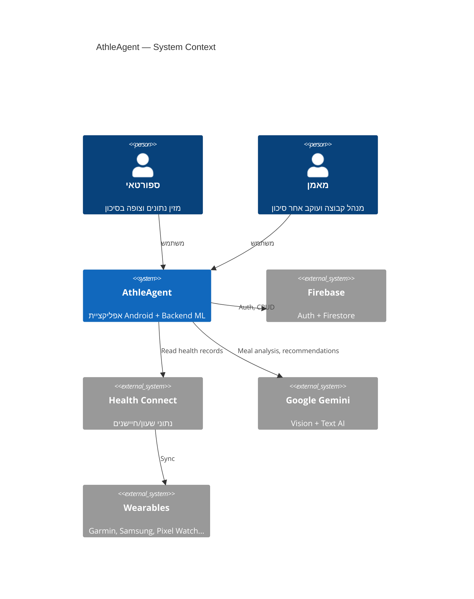
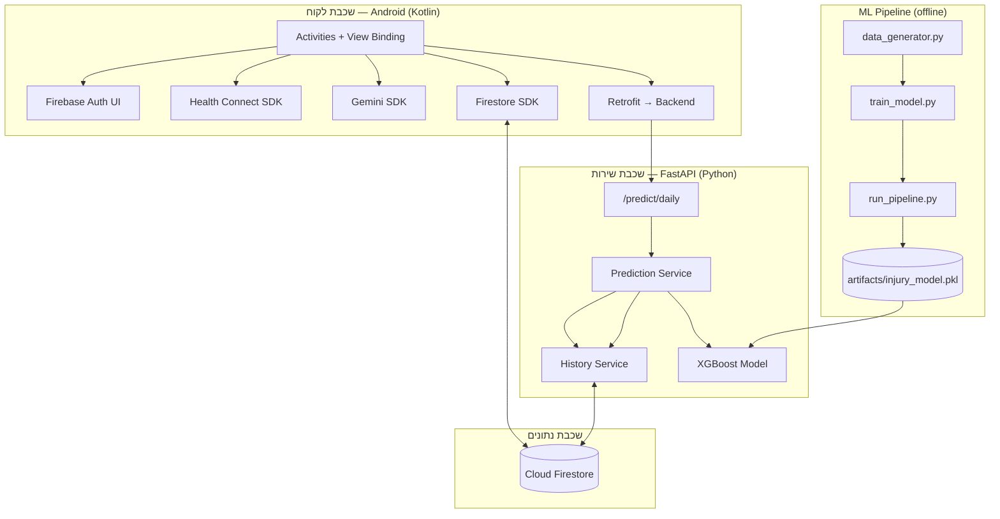
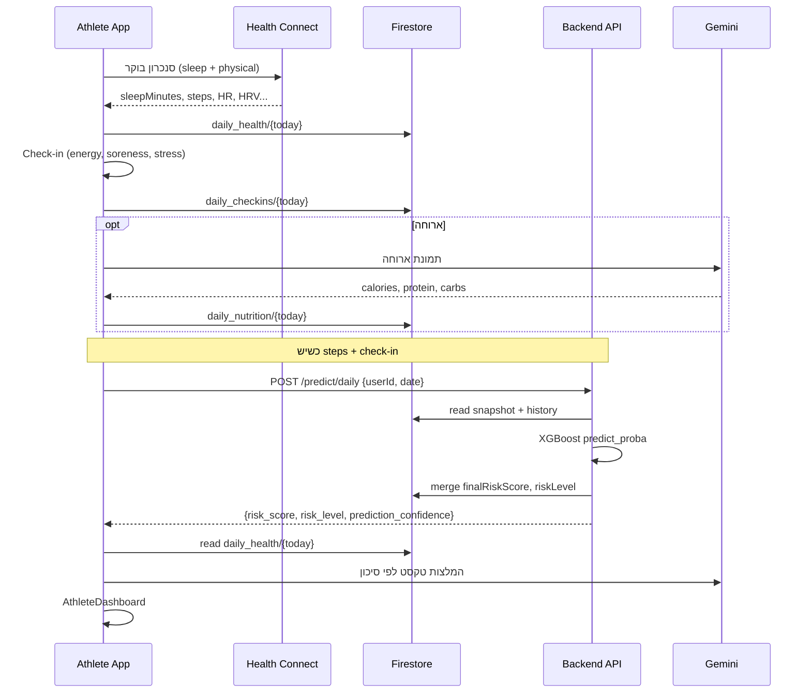
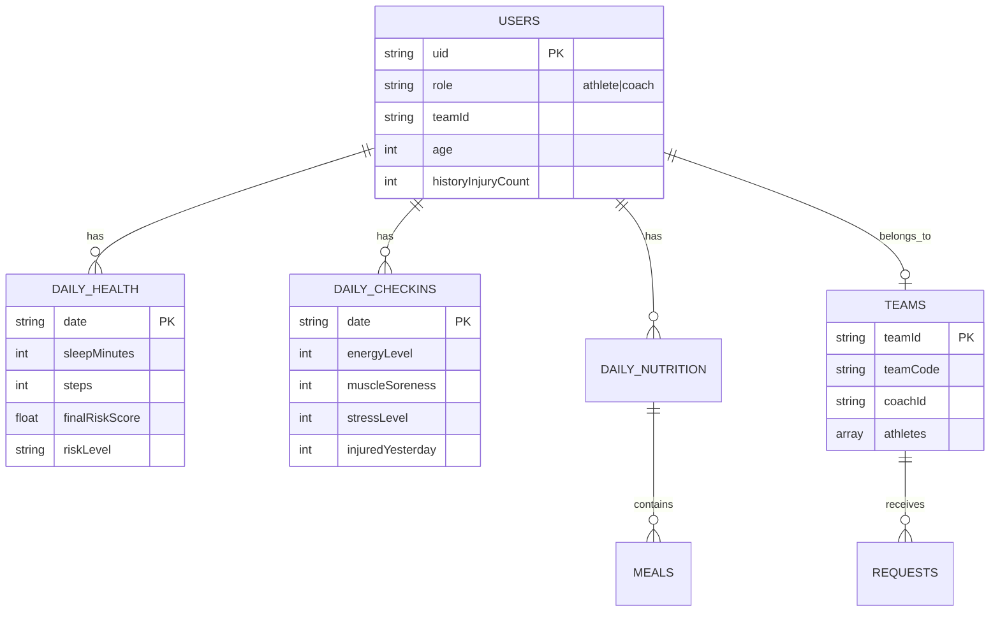

# AthleAgent — High Level Design (HLD)
## מסמך עיצוב ברמה גבוהה — פרויקט מלא

| שדה | ערך |
|-----|-----|
| **גרסה** | 1.0 |
| **תאריך** | 2026-06-19 |
| **קהל יעד** | מפתחים, בוחנים, stakeholders טכניים |
| **מסמכים קשורים** | [LLD_PROJECT.md](LLD_PROJECT.md) · [backend/docs/HLD.md](../backend/docs/HLD.md) · [DOCKER.md](DOCKER.md) |

---

## 1. תקציר מנהלים

**AthleAgent** היא פלטפורמה למניעת פציעות בספורטאים. המערכת אוספת נתונים יומיים ממקורות מרובים — שאלון עצמי, שעון חכם (Health Connect), וניתוח תזונה מבוסס AI — ומחשבת **ציון סיכון יומי לפציעה** (Daily Injury Risk Score).

המערכת משרתת שני סוגי משתמשים:
- **ספורטאי** — מזין נתונים, רואה סיכון אישי והמלצות.
- **מאמן** — מנהל קבוצה, מאשר בקשות הצטרפות, ועוקב אחר סיכון כלל הרשימה.

---

## 2. מטרות ודרישות לא-פונקציונליות

### 2.1 מטרות עסקיות
| מטרה | מדד הצלחה |
|------|-----------|
| זיהוי מוקדם של סיכון פציעה | ציון יומי 0–100 + רמת Low/Medium/High |
| הפחתת עומס ידני | סנכרון אוטומטי משעון + ניתוח ארוחות ב-AI |
| שקיפות למאמן | דשבורד קבוצתי בזמן אמת |
| שיפור מתמשך | pipeline אימון מחדש + Firestore export |

### 2.2 דרישות לא-פונקציונליות

> **מסמך מלא (מדדים, יעדים, ראיה):** [NFR.md](NFR.md)

| דרישה | יישום נוכחי |
|-------|-------------|
| **זמינות** | Firestore (managed) + FastAPI stateless |
| **ביצועים** | חיזוי < 2s (Firestore read + XGBoost inference) |
| **אמינות** | defaults לנתונים חסרים; confidence score |
| **אבטחה** | Firebase Auth בלקוח; **אין auth על API חיזוי** (ראו §8) |
| **תחזוקה** | מודולריות: Android / Backend / ML_model |
| **פרטיות** | Health Connect permissions; PrivacyPolicyActivity |

---

## 3. הקשר מערכת (System Context)



---

## 4. ארכיטקטורה לוגית — שלוש שכבות



### 4.1 עקרון מרכזי: Firestore כ-Source of Truth
- האפליקציה **כותבת** נתונים יומיים ל-Firestore.
- הבקאנד **קורא** מ-Firestore, מריץ ML, **כותב חזרה** תוצאות חיזוי.
- האפליקציה **קוראת** תוצאות מ-Firestore (לא מה-response של API בלבד).

### 4.2 הפרדת אחריות
| רכיב | אחריות | לא אחראי על |
|------|--------|-------------|
| **Android** | UX, איסוף נתונים, Gemini client-side, trigger חיזוי | inference ML |
| **Backend** | Firestore read/write, feature engineering, ML inference | UI, meal vision |
| **ML_model** | אימון, validation, promotion | serving runtime |
| **Firestore** | אחסון persistent | חישובים |

---

## 5. תפקידים וזרימות משתמש

### 5.1 ספורטאי — זרימה יומית



### 5.2 מאמן — זרימה

```mermaid
flowchart LR
    C[Coach Login] --> HT[HomeCoachActivity]
    HT --> CT[CreateTeamActivity]
    HT --> CR[CoachRequestsActivity]
    HT --> CD[CoachDashboardActivity]
    CR -->|approve| FS[(teams.athletes[])]
    CD -->|read| FS2[daily_health per athlete]
```

---

## 6. מודל נתונים (רמה גבוהה)



> פירוט שדות: [backend/docs/FEATURES.md](../backend/docs/FEATURES.md)

---

## 7. אינטגרציות חיצוניות

| שירות | כיוון | שימוש | מיקום בקוד |
|-------|-------|-------|------------|
| **Firebase Auth** | Client → Google | Login, Register, role routing | `LoginActivity.kt` |
| **Cloud Firestore** | Client ↔ Cloud, Backend ↔ Cloud | כל הנתונים | Activities, `history_service.py` |
| **Health Connect** | Device → Client | sleep, steps, HR, HRV, VO2 | `WearableSyncActivity.kt` |
| **Gemini API** | Client → Google | meal vision, coaching text | `AnalyzingMealActivity.kt`, `AthleteDashboardActivity.kt` |
| **FastAPI Backend** | Client → Server | `POST /predict/daily` | `ApiClient.kt` |
| **XGBoost** | Server (in-process) | injury probability | `prediction_service.py` |

### 7.1 הרצה מקומית (Backend + ML)

| מסלול | פקודה | מתי |
|-------|--------|-----|
| **Docker** | `docker compose up --build` (שורש repo) | בוחנים, setup מהיר |
| **Python** | `uvicorn main:app` מתוך `backend/` | פיתוח עם `--reload` |

> מדריך Docker: [DOCKER.md](DOCKER.md) · Android emulator → `10.0.2.2:8000` (ללא שינוי קוד)

---

## 8. אבטחה — מצב נוכחי והמלצות

### 8.1 מצב נוכחי
| שכבה | מנגנון |
|------|--------|
| אימות משתמש | Firebase Auth (Google + email/password) |
| הרשאות נתונים | Firestore Security Rules (מניחים קיום בפרויקט Firebase) |
| API חיזוי | **ללא authentication** — `userId` בגוף הבקשה |
| Backend → Firestore | Firebase Admin SDK (service account) |

### 8.2 סיכונים ידועים
- קריאה ל-`/predict/daily` עם `userId` זר (IDOR).
- אין rate limiting על API.

### 8.3 המלצות לייצור
1. Firebase ID Token verification בבקאנד.
2. Firestore Rules: athlete רואה רק את עצמו; coach רואה athletes בקבוצה.
3. HTTPS + API Gateway / Cloud Run עם IAM.

---

## 9. ML — סקירה ברמה גבוהה

| שלב | כלי | פלט |
|-----|-----|-----|
| Synthetic data | `ML_model/data_generator.py` | `athlete_injury_data.csv` |
| Training | `ML_model/train_model.py` | `injury_model.pkl` + manifest |
| Quality gates | `validate_metrics.py`, `model_loader.py` | Recall ≥ 0.80, AUC ≥ 0.68 |
| Promotion | `run_pipeline.py` | `artifacts/promoted.json` |
| Serving | `POST /predict/daily` | probability → risk bands |
| Retraining | `build_training_dataset_from_firestore.py` | CSV from real Firestore |

> פירוט ML: [backend/docs/MODEL.md](../backend/docs/MODEL.md) · [RISK_SCORE.md](../backend/docs/RISK_SCORE.md)

---

## 10. מבנה Repository

```
final_project_AthleAgent/
├── android_app/AthleAgent/     # אפליקציית Android
├── backend/                    # FastAPI inference service
├── ML_model/                   # Training pipeline + artifacts
├── docs/                       # תיעוד פרויקט (HLD/LLD)
└── README.md
```

---

## 11. תלויות וטכנולוגיות

| שכבה | Stack |
|------|-------|
| Mobile | Kotlin, Android SDK, View Binding, Material, Retrofit, Gson, MPAndroidChart |
| Backend | Python 3.x, FastAPI, Uvicorn, Pydantic, pandas, scikit-learn, XGBoost, firebase-admin |
| Cloud | Firebase Auth, Cloud Firestore |
| AI | Google Gemini (client-side) |
| Health | Google Health Connect SDK |
| CI/Tests | pytest (backend), JUnit (Android placeholder) |

---

## 12. מגבלות ופערים ידועים

| נושא | תיאור |
|------|--------|
| **ארכיטקטורת Android** | Activity-centric + View Binding; אין ViewModel/Repository (ראו README) |
| **Date-split sync** | Backend מצפה sleep ב-{D} ועומס ב-{D-1}; Android כותב לעיתים שניהם ל-{D} |
| **Backend auth** | לא מיושם ב-production routes |
| **Gemini בבקאנד** | מפתח ב-config אך אין routes — Gemini רץ רק בלקוח |

---

## 13. Roadmap ארכיטקטוני (המלצות)

1. **Auth על API** — Firebase token middleware.
2. **Repository layer ב-Android** — הפרדת Firestore מ-Activities.
3. **Date-split sync** — יישום מלא ב-`WearableSyncActivity`.
4. **Cloud deployment** — Backend על Cloud Run / Render (image ניתן לבנות מ-`Dockerfile` הקיים).
5. **Firestore Rules** — hardening לפני production.

---

## 14. מפת מסמכים

| מסמך | תוכן |
|------|------|
| [DOCKER.md](DOCKER.md) | Backend + ML — Docker (בוחנים) |
| [LLD_PROJECT.md](LLD_PROJECT.md) | עיצוב ברמה נמוכה — פרויקט מלא |
| [backend/docs/HLD.md](../backend/docs/HLD.md) | HLD בקאנד |
| [backend/docs/LLD.md](../backend/docs/LLD.md) | LLD בקאנד |
| [backend/docs/BACKEND.md](../backend/docs/BACKEND.md) | ארכיטקטורת בקאנד (קיים) |
| [backend/docs/FEATURES.md](../backend/docs/FEATURES.md) | חוזה נתונים production |
| [backend/docs/RISK_SCORE.md](../backend/docs/RISK_SCORE.md) | pipeline ציון סיכון E2E |
