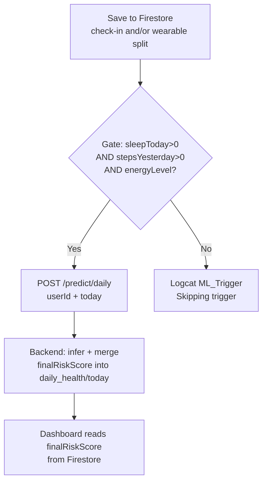
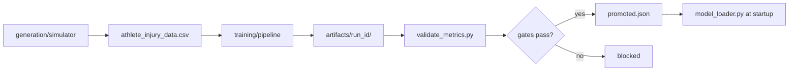
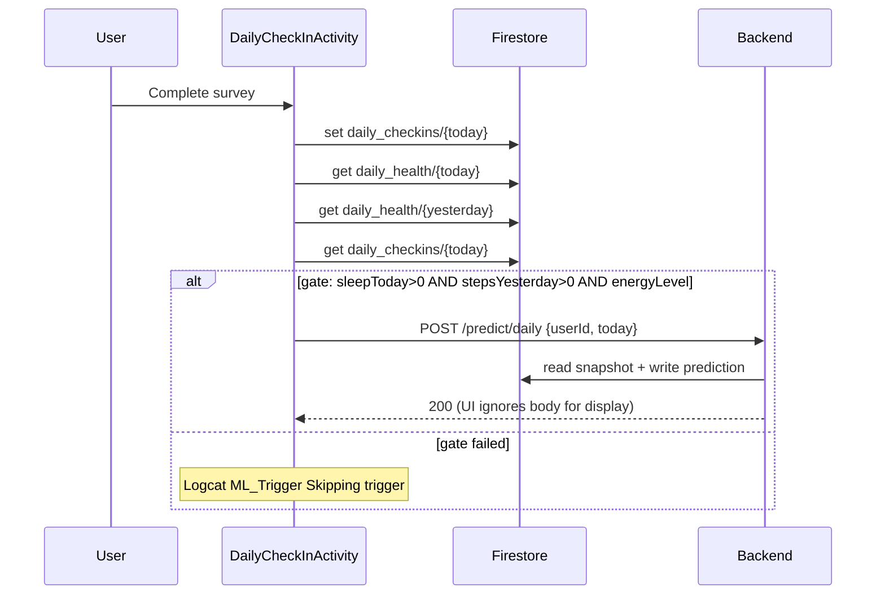
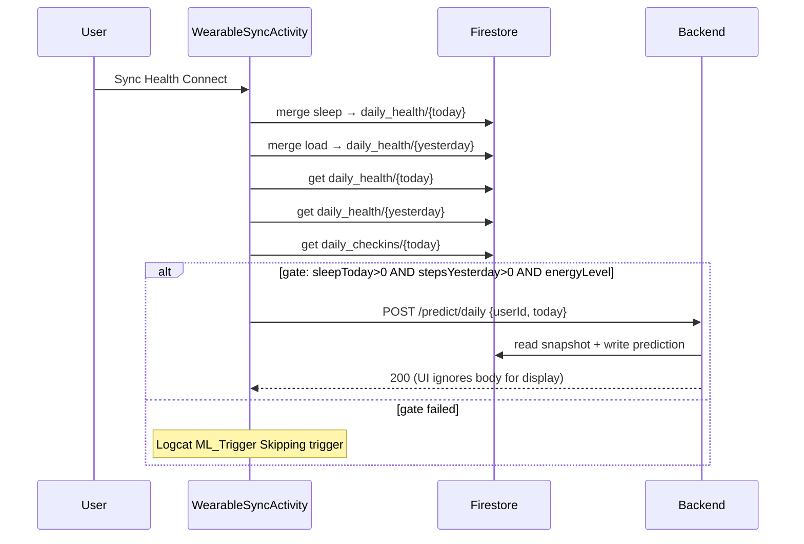
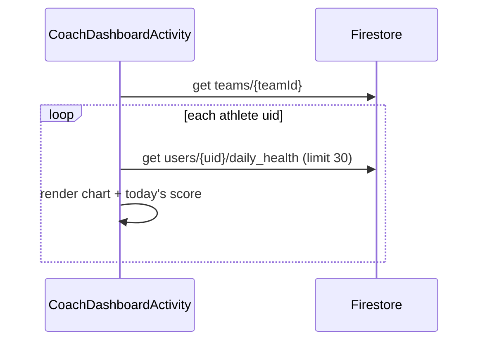

# AthleAgent — Low Level Design (LLD)

## Full-Project Low-Level Design Document


| Field                 | Value                                                                                |
| --------------------- | ------------------------------------------------------------------------------------ |
| **Version**           | 1.2                                                                                  |
| **Date**              | 2026-07-22                                                                           |
| **Audience**          | Developers                                                                           |
| **Related documents** | [HLD.md](HLD.md) · [DOCKER.md](DOCKER.md) · [MODEL_SELECTION.md](MODEL_SELECTION.md) |


---

## 1. Module Structure

```
final_project_AthleAgent/
│
├── android_app/AthleAgent/app/src/main/java/com/yahav/athleagent/
│   ├── App.kt                          # Application; initializes SignalManager
│   ├── logic/
│   │   └── LoginManager.kt             # Email/password registration helper
│   ├── model/                          # DTOs
│   │   ├── AthleteItem.kt
│   │   ├── AthleteRequest.kt
│   │   └── AlertItem.kt
│   ├── network/
│   │   ├── ApiClient.kt                # Retrofit singleton, base URL
│   │   └── ApiService.kt               # POST /predict/daily
│   ├── observability/
│   │   ├── ClientEventReporter.kt      # Android → POST /api/v1/observability/client-events
│   │   ├── ObservabilityApi.kt
│   │   ├── CorrelationIdInterceptor.kt
│   │   └── RequestIdHolder.kt
│   ├── ui/
│   │   ├── auth/                       # Login, Register, Main
│   │   ├── athlete/                    # 8 Activities
│   │   ├── coach/                      # 4 Activities + adapters
│   │   └── PrivacyPolicyActivity.kt
│   └── utilities/
│       └── SignalManager.kt            # Toast/Snackbar
│
├── backend/
│   ├── main.py                         # FastAPI entry
│   ├── config.py                       # Settings
│   ├── api/routes/                     # health.py, predict.py, observability.py
│   ├── services/                       # prediction, history, preprocessing...
│   ├── schemas/inference.py            # Pydantic contracts
│   ├── ml/model_loader.py              # joblib + gates
│
└── ML_model/
    ├── generation/                 # simulator, config, postprocess
    ├── training/                   # pipeline, policy, models
    ├── data/                       # demo CSV + fixed holdout
    ├── notebooks/                  # presentation notebook + its requirements
    ├── data_generator.py           # CLI → generation/
    ├── train_model.py              # CLI → training/
    ├── validate_metrics.py
    ├── run_pipeline.py
    └── artifacts/
        ├── promoted.json
        └── <run_id>/injury_model.pkl
```

---

## 2. Android — LLD

### 2.1 Activities and Responsibilities


| Activity                   | Package | Responsibility                 | Firestore paths                    |
| -------------------------- | ------- | ------------------------------ | ---------------------------------- |
| `LoginActivity`            | auth    | Firebase Auth UI, role routing | `users/{uid}` read                 |
| `RegisterActivity`         | auth    | Email/password signup          | `users/{uid}` create               |
| `HomeAthleteActivity`      | athlete | Hub, alerts, navigation        | Read today docs                    |
| `DailyCheckInActivity`     | athlete | 4-field survey                 | `daily_checkins/{today}`           |
| `WearableSyncActivity`     | athlete | Health Connect read/write      | `daily_health/{today}`             |
| `AnalyzingMealActivity`    | athlete | Gemini Vision                  | —                                  |
| `MealAnalysisActivity`     | athlete | Save meal + aggregates         | `daily_nutrition/{today}`          |
| `AthleteDashboardActivity` | athlete | Risk UI, chart, Gemini text    | `daily_health/*`                   |
| `JoinTeamActivity`         | athlete | Join by team code              | `teams/*/requests/{uid}`           |
| `HomeCoachActivity`        | coach   | Hub + pending badge            | `teams`, `requests`                |
| `CreateTeamActivity`       | coach   | Create team                    | `teams/{id}`                       |
| `CoachRequestsActivity`    | coach   | Approve/reject                 | `teams/*/requests`, `users.teamId` |
| `CoachDashboardActivity`   | coach   | Roster risk + charts           | Athletes' `daily_health`           |


### 2.2 Architectural Pattern (Current State)

```
┌─────────────────────────────────────┐
│           Activity (View)           │
│  - View Binding                     │
│  - FirebaseFirestore direct calls   │
│  - Retrofit Callbacks               │
│  - Coroutines (HC, Gemini)          │
└──────────────┬──────────────────────┘
               │
    ┌──────────┼──────────┐
    ▼          ▼          ▼
 Firestore  Retrofit   Gemini SDK
```

> **Note:** There is no Repository/ViewModel layer. Business logic is distributed across Activities.

### 2.3 Network Layer

`**ApiClient.kt**`

- Base URL: `http://10.0.2.2:8000/` (emulator → localhost)
- Gson converter; OkHttp interceptors (correlation id + **503 retry**)
- **NFR — retry:** on HTTP **503**, up to **3** retries with **2 s** (`Thread.sleep(2000)`) between attempts (see HLD §2.2)

`**ApiService.kt**` (source of truth for the HTTP contract):

```kotlin
@POST("/predict/daily")
fun getDailyPrediction(@Body data: PredictionTriggerRequest): Call<PredictionResponse>

data class PredictionResponse(
    val risk_level: String,
    val risk_score: Float,              // 0.0–1.0 — not used for UI display
    val prediction_confidence: Float    // 0–100
)
```

> **Risk score display:** Always from `daily_health/{date}.finalRiskScore` (0–100) in Firestore, not from the POST response body.

### 2.4 Prediction Trigger — Cross-Trigger

Both `DailyCheckInActivity` and `WearableSyncActivity` call a **private** `checkAndTriggerPredictionInBackground()` after a successful Firestore write. The gate logic is **identical** in both Activities (duplicated — not a shared utility). Either screen may run first; whichever save completes the gate last fires the API.

`MealAnalysisActivity` saves nutrition only — it does **not** call the trigger.

#### Shared gate (all three required)


| Condition                   | Firestore source                                                              |
| --------------------------- | ----------------------------------------------------------------------------- |
| `sleepMinutes > 0`          | `users/{uid}/daily_health/{today}`                                            |
| `steps > 0`                 | `users/{uid}/daily_health/{yesterday}`                                        |
| Check-in with `energyLevel` | `users/{uid}/daily_checkins/{today}` exists **and** `contains("energyLevel")` |


Reads: three sequential `get()`s (today health → yesterday health → today check-in). If any condition fails → **no** HTTP call; Logcat tag `ML_Trigger` with `Skipping trigger: …` (no Toast / no user prompt from the gate itself).

#### On gate pass

1. `POST /predict/daily` body: `{ userId, date: today }` via `ApiClient` / `ApiService.getDailyPrediction`.
2. App treats the response as fire-and-forget for UI: checks HTTP success only; **does not** bind gauge/chart from the body.
3. Display uses `daily_health/{today}.finalRiskScore` (0–100) written by the backend.
4. Observability: `ml_trigger` → on success `ml_trigger_success` (or `ml_performance_warning` if duration > 3 s); on HTTP 503 Toast + `ml_service_unavailable`; other failures → `error` events.

#### Wearable write context (why yesterday matters)

`WearableSyncActivity` date-splits before the trigger:

- Sleep → merge into `daily_health/{today}`
- Physical load (steps, distance, HR, …) → merge into `daily_health/{yesterday}`

Then it runs the same gate (which requires yesterday’s `steps > 0`).




> **Gap (also HLD §14):** the front-end gate does **not** require yesterday’s load metrics (e.g. `distanceMeters`) > 0 — only `steps`. Backend inference still applies the full D / D-1 merge policy when the request runs.

### 2.5 Health Connect — Fields Written

Physical fields below are merged into `daily_health/{yesterday}`; `sleepMinutes` (+ `lastSync`) into `daily_health/{today}`.


| Firestore field                | Health Connect source                     |
| ------------------------------ | ----------------------------------------- |
| `sleepMinutes`                 | SleepSession (previous night → `{today}`) |
| `steps`                        | Steps                                     |
| `distanceMeters`               | Distance                                  |
| `activeCalories`               | ActiveCaloriesBurned                      |
| `totalCalories`                | TotalCaloriesBurned                       |
| `heartRateAvg` / `Max` / `Min` | HeartRate                                 |
| `restingHeartRate`             | RestingHeartRate                          |
| `hrvRmssd`                     | HeartRateVariabilityRmssd                 |
| `vo2Max`                       | Vo2Max                                    |
| `oxygenSaturation`             | OxygenSaturation                          |
| `respiratoryRate`              | RespiratoryRate                           |
| `bodyFatPct`                   | BodyFat                                   |
| `weightKg`                     | Weight                                    |
| `bmrCalories`                  | BasalMetabolicRate                        |
| `elevationGainedMeters`        | ElevationGained                           |
| `floorsClimbed`                | FloorsClimbed                             |
| `avgSpeed` / `maxSpeed`        | Speed (converted to km/h)                 |
| `avgCadence`                   | StepsCadence                              |
| `lastSync`                     | client `serverTimestamp`                  |


See §2.7 for the full `daily_health` document (prediction + AI fields).

### 2.6 Gemini Integration


| Use case    | Activity                   | Input                | Output                                      |
| ----------- | -------------------------- | -------------------- | ------------------------------------------- |
| Meal vision | `AnalyzingMealActivity`    | Bitmap               | JSON: calories, protein, carbs, description |
| Coaching    | `AthleteDashboardActivity` | Risk score + context | Recommendation text                         |


- API key: `BuildConfig.GEMINI_API_KEY` ← `local.properties` (see `local.properties.example`)
- **Client-side only** — not routed through the backend

### 2.7 Firestore — App Writes

#### `users/{uid}`

```json
{
  "fullName": "string",
  "email": "string",
  "role": "athlete|coach",
  "birth_date": "1995-01-01",
  "historyInjuryCount": 0,
  "teamId": "string|null"
}
```

#### `users/{uid}/daily_checkins/{yyyy-MM-dd}`

```json
{
  "energyLevel": 1-10,
  "muscleSoreness": 1-10,
  "stressLevel": 1-10,
  "injuredYesterday": 0|1,
  "timestamp": "serverTimestamp"
}
```

#### `users/{uid}/daily_health/{yyyy-MM-dd}`

One document per calendar day. Contents depend on **who wrote** and **date-split policy** (sleep → wake-up day `D`; physical load → `D-1`). A single day doc is often a **merge** of sleep (when it is “today”), load (when it is “yesterday” for a later sync), and prediction outputs.

**A — Wearable / client (`WearableSyncActivity.fetchPhysicalData` + sleep write)**


| Field                                            | Typical source                 | Notes                              |
| ------------------------------------------------ | ------------------------------ | ---------------------------------- |
| `sleepMinutes`                                   | SleepSession                   | Written to `{today}` only          |
| `steps`                                          | Steps                          | Written to `{yesterday}` with load |
| `distanceMeters`                                 | Distance                       |                                    |
| `activeCalories`                                 | ActiveCaloriesBurned           |                                    |
| `totalCalories`                                  | TotalCaloriesBurned            |                                    |
| `heartRateAvg` / `heartRateMax` / `heartRateMin` | HeartRate                      |                                    |
| `restingHeartRate`                               | RestingHeartRate               |                                    |
| `hrvRmssd`                                       | HeartRateVariabilityRmssd      |                                    |
| `vo2Max`                                         | Vo2Max                         |                                    |
| `oxygenSaturation`                               | OxygenSaturation               |                                    |
| `respiratoryRate`                                | RespiratoryRate                |                                    |
| `bodyFatPct`                                     | BodyFat                        |                                    |
| `weightKg`                                       | Weight                         |                                    |
| `bmrCalories`                                    | BasalMetabolicRate             |                                    |
| `elevationGainedMeters`                          | ElevationGained                |                                    |
| `floorsClimbed`                                  | FloorsClimbed                  |                                    |
| `avgSpeed` / `maxSpeed`                          | Speed (stored as km/h)         |                                    |
| `avgCadence`                                     | StepsCadence                   |                                    |
| `lastSync`                                       | `FieldValue.serverTimestamp()` | On sleep and/or load write         |


Backend inference also accepts (schema / `DAILY_HEALTH_INFERENCE_FIELDS`) `heightCm` and `avgPower` when present on the health doc — the production sync map does **not** currently write `avgPower`; demo seed may put `heightCm` on `users/{uid}` instead.

**B — Backend prediction (`save_daily_prediction_result` → merge on `{D}`)**

```json
{
  "finalRiskScore": 25.5,
  "riskLevel": "Low|Medium|High",
  "predictionConfidence": 78.2,
  "predictionUpdatedAt": "ISO-8601 UTC"
}
```

**C — Client AI text (optional, Gemini)**


| Field              | Writer                                                                                                      |
| ------------------ | ----------------------------------------------------------------------------------------------------------- |
| `aiRecommendation` | `AthleteDashboardActivity` / `CoachDashboardActivity` (merge after Gemini) — **not** written by the backend |


**Example merged document** (illustrative — not every field is always present):

```json
{
  "sleepMinutes": 420,
  "steps": 8500,
  "distanceMeters": 6200,
  "activeCalories": 450,
  "totalCalories": 2200,
  "heartRateAvg": 72,
  "heartRateMax": 160,
  "heartRateMin": 48,
  "restingHeartRate": 55,
  "hrvRmssd": 58.5,
  "vo2Max": 48.0,
  "oxygenSaturation": 98.0,
  "respiratoryRate": 16.0,
  "bodyFatPct": 15.0,
  "weightKg": 72.5,
  "bmrCalories": 1600,
  "elevationGainedMeters": 120.0,
  "floorsClimbed": 8,
  "avgSpeed": 5.2,
  "maxSpeed": 12.0,
  "avgCadence": 110.0,
  "lastSync": "serverTimestamp",
  "finalRiskScore": 25.5,
  "riskLevel": "Medium",
  "predictionConfidence": 78.2,
  "predictionUpdatedAt": "2026-07-22T08:15:00+00:00",
  "aiRecommendation": "optional coaching text"
}
```

> Full inference projection list: `backend/services/history/firestore_io.py` → `DAILY_HEALTH_INFERENCE_FIELDS`. UI risk display reads `finalRiskScore` / `predictionConfidence` / `riskLevel` from this collection.

#### `users/{uid}/daily_nutrition/{yyyy-MM-dd}`

Written by `MealAnalysisActivity` after Gemini meal vision (`AnalyzingMealActivity`). **Does not** trigger `POST /predict/daily`.

Path layout:

```
users/{uid}/daily_nutrition/{yyyy-MM-dd}          ← day aggregates (merge + increments)
users/{uid}/daily_nutrition/{yyyy-MM-dd}/meals/{autoId}  ← one doc per meal
```

**Day aggregate** (`SetOptions.merge` + `FieldValue.increment`):


| Field                            | Role                                                       |
| -------------------------------- | ---------------------------------------------------------- |
| `totalCalories`                  | Sum of meal kcal (UI + backend → `nutritionTotalCalories`) |
| `totalProtein`                   | Sum of protein grams                                       |
| `totalCarbs`                     | Sum of carb grams                                          |
| `calories` / `protein` / `carbs` | Duplicate increments (legacy / UI aliases — same values)   |
| `mealsLoggedCount`               | Number of meals saved that day                             |
| `imputed`                        | `false` when user logged real meals                        |
| `lastMealAddedAt`                | `serverTimestamp`                                          |


**Meal subdocument** (`meals` collection):

```json
{
  "calories": 650,
  "protein": 40,
  "carbs": 70,
  "timestamp": "serverTimestamp"
}
```

**Inference policy:** for wake-up day `D`, the backend reads `**daily_nutrition/{D-1}`** (yesterday’s food), not `{D}`. Missing/zero aggregates → population defaults (`nutrition_defaults.py`: 2600 kcal, 130 g P, 300 g C, 3 meals) and `nutritionImputed=true` (lowers confidence).

New users (< 24 h since account creation): Android also mirrors the same aggregate increments onto `{yesterday}` so cold-start inference can see nutrition on D-1.

```json
{
  "totalCalories": 2400,
  "totalProtein": 120,
  "totalCarbs": 280,
  "calories": 2400,
  "protein": 120,
  "carbs": 280,
  "mealsLoggedCount": 3,
  "imputed": false,
  "lastMealAddedAt": "serverTimestamp"
}
```

> Inference projection: `DAILY_NUTRITION_INFERENCE_FIELDS` in `firestore_io.py` (`totalProtein`, `totalCarbs`, `mealsLoggedCount`, `totalCalories`).

#### `teams/{teamId}`

```json
{
  "TeamName": "string",
  "teamCode": "ABC123",
  "coachId": "uid",
  "athletes": ["uid1", "uid2"]
}
```

---

## 3. Backend — LLD

### 3.1 API Endpoints


| Method | Path                                  | Handler            | Response                                                                                  |
| ------ | ------------------------------------- | ------------------ | ----------------------------------------------------------------------------------------- |
| GET    | `/`                                   | `health.py`        | metadata                                                                                  |
| GET    | `/health`                             | `health.py`        | Readiness: `{status, checks}` — **200** when Firestore + live model OK, **503** otherwise |
| POST   | `/predict/daily`                      | `predict.py`       | `InjuryPredictionResponse`                                                                |
| GET    | `/status/ml`                          | `predict.py`       | model status                                                                              |
| POST   | `/api/v1/observability/client-events` | `observability.py` | 202 Accepted                                                                              |


### 3.2 Prediction Pipeline (Backend)

```
POST /predict/daily {userId, date}
    │
    ├─ run_daily_prediction()                            [prediction/service]
    │     ├─ load_cached_daily_prediction()              [history/persist] → return on cache hit
    │     │
    │     ├─ predict_injury_risk_from_firestore()
    │     │     ├─ fetch_inference_firestore_bundle()    [history/inference_bundle]
    │     │     │     profile, health{D}, health{D-1}, checkins{D}, nutrition{D-1} + history window
    │     │     │
    │     │     ├─ injury_prediction_request_from_firestore_snapshot()
    │     │     │     merge policy: sleep@D, physical@D-1, survey@D, nutrition@D-1
    │     │     │
    │     │     ├─ resolve_request_nutrition()             [nutrition_defaults]
    │     │     │
    │     │     ├─ injury_request_to_model_dataframe()   [preprocessing/]
    │     │     │     preprocessing + feature_engineering
    │     │     │
    │     │     ├─ apply_history_confidence_fallback()   [prediction/confidence]
    │     │     │     7-day rolling: ACWR, sleep_debt, hrv_drop  [history/rolling_features]
    │     │     │
    │     │     ├─ calculate_data_quality_score()          [preprocessing/quality]
    │     │     │
    │     │     ├─ compute_prediction_confidence_percent() [prediction/confidence]
    │     │     │
    │     │     └─ model.predict_proba() → proba           [prediction/bundle]
    │     │           classify_risk_level via risk_levels + RISK_*_CUTOFF (not bundle thresholds)
    │     │           Low ≤ 20%, Medium 21–70%, High > 70%
    │     │
    │     └─ save_daily_prediction_result_with_retries()   [history/persist]
    │           merge → daily_health/{date}; persist failure is logged only (HTTP still 200)
    │
    └─ InjuryPredictionResponse
```

### 3.3 Model Features (35 columns)

Source of truth: `backend/services/model_features.py` (contract: `backend/data/model_feature_contract.json`)

Train-serve parity: ACWR baseline uses **distance-only** 7-day history (`acwr_features_from_distance_history`); `sleep_debt_3d` is a rolling sum of clipped daily sleep deficits; history window defaults `include_target_day=False`.


| Category   | Features                                                                                                                            |
| ---------- | ----------------------------------------------------------------------------------------------------------------------------------- |
| Profile    | bmi, age (from `birth_date`), body_fat_pct, vo2_max, history_injury_count                                                           |
| Load       | daily_distance_km, workout_intensity_minutes, avg_cadence, elevation, floors, speed, power, active_calories_burned                  |
| Recovery   | sleep_hours, hrv_score, resting_hr, respiratory_rate, spo2                                                                          |
| Nutrition  | nutrition_intake_calories, daily_calories, total_calories_burned, calorie_balance                                                   |
| Subjective | stress_level, muscle_soreness, energy_level, injured_yesterday                                                                      |
| Engineered | acute_load_7d, acwr_ratio, acwr_ratio_ma7, sleep_hours_ma7, sleep_debt_3d, hrv_drop, load_recovery_imbalance, speed_intensity_ratio |


---

## 4. ML Pipeline — LLD

### 4.1 Training Flow




> CLI entry points: `data_generator.py` → `generation/`, `train_model.py` → `training/`.

### 4.2 Model Bundle Format (joblib)

The `estimator` field holds the winning model from the promoted training run — commonly `XGBoostCalibratedTuned` (`CalibratedClassifierCV` wrapping `XGBClassifier`), not necessarily a raw `XGBClassifier`.

```python
{
    "estimator": <sklearn-compatible model from promoted run>,  # e.g. XGBoostCalibratedTuned
    "feature_columns": [...],  # 35 names
    "threshold": "<from run_manifest.json>",  # required contract gate at serve
    "winner": "<from run_manifest.json>",  # e.g. "XGBoostCalibratedTuned"
    "policy": {...},  # selection gates snapshot
}
```

Serve (`prediction/bundle.resolve_model_bundle`) validates that `threshold` is present and numeric, then classifies risk with `services/risk_levels.py` + `RISK_HIGH_CUTOFF` / `RISK_MEDIUM_CUTOFF` so Android UI bands stay aligned.

### 4.3 Live Gates (`model_loader.py`)

Gate thresholds are defined in `backend/data/ml_policy.json` (`ml_gates`) and loaded via `backend/services/ml_policy.py` / `ML_model/policy_config.py`.


| Gate             | Threshold |
| ---------------- | --------- |
| Recall@Threshold | ≥ 0.80    |
| ROC-AUC          | ≥ 0.68    |


Run manifests are normalized at load time (`backend/ml/manifest.py`); legacy fields can be repaired with `python ML_model/normalize_artifacts.py`.

### 4.4 Promotion

After `run_pipeline.py`, `ML_model/artifacts/promoted.json` points at the latest `injury_model.pkl`. Restart the backend to load it.

Example `promoted.json`:

```json
{
  "model_path": "ML_model/artifacts/<run_id>/injury_model.pkl",
  "run_id": "<run_id>",
  "promoted_at_utc": "<ISO-8601>",
  "manifest_path": "ML_model/artifacts/<run_id>/run_manifest.json"
}
```

---

## 5. End-to-End Flows — Sequence Diagrams

### 5.1 Check-in → Prediction




### 5.2 Wearable sync → Prediction




### 5.3 Coach views athlete risk




---

## 6. Error Handling

### 6.1 Android


| Condition              | Behavior                                |
| ---------------------- | --------------------------------------- |
| Firestore offline      | Snackbar / retry                        |
| Backend 503            | Toast "prediction unavailable"          |
| Missing Health Connect | Redirect to PrivacyPolicy / permissions |
| Gemini failure         | Fallback message, manual entry option   |


### 6.2 Backend


| Condition                        | HTTP    | Detail                                                                                                                |
| -------------------------------- | ------- | --------------------------------------------------------------------------------------------------------------------- |
| Model blocked                    | 503     | `model_not_live:*`                                                                                                    |
| Firestore unavailable            | 503     | `firestore_snapshot_unavailable`                                                                                      |
| Readiness probe failed           | 503     | `/health` → `status: "unhealthy"` (missing Firestore or blocked model)                                                |
| Persist failed (after inference) | **200** | Score returned to client; failure logged server-side; safe to retry (`load_cached_daily_prediction` on later success) |


---

## 7. Observability & Logging

### 7.1 Backend logging


| Piece                                   | Role                                                                                        |
| --------------------------------------- | ------------------------------------------------------------------------------------------- |
| `backend/utils/logging.py`              | Configures `athleagent` logger: stdout + optional rotating file under `logs/athleagent.log` |
| `backend/middleware/request_logging.py` | Per-request timing/status; sets/propagates `X-Request-ID`; skips noisy paths from config    |
| `backend/utils/request_context.py`      | Contextvars for `request_id` / `user_id` injected into every log line                       |


Log format includes `[request_id=… user_id=…]`. Levels escalate for 4xx/5xx and slow requests (`SLOW_REQUEST_MS`).

Config knobs (defaults in `config.py`): `LOG_LEVEL`, `LOG_TO_FILE`, `LOG_DIR`, `LOG_FILE_NAME`, `LOG_RETENTION_DAYS`, `REQUEST_LOG_SKIP_PATHS`.

Pytest (`tests/conftest.py`) calls `setup_logging()` so suite output stays on stdout and does **not** grow `logs/athleagent.log`.

### 7.2 Android → backend client events


| Piece                                                | Role                                                                |
| ---------------------------------------------------- | ------------------------------------------------------------------- |
| `ClientEventReporter.kt` / `ObservabilityApi.kt`     | POST telemetry to backend                                           |
| `CorrelationIdInterceptor.kt` / `RequestIdHolder.kt` | Align client calls with `X-Request-ID`                              |
| `POST /api/v1/observability/client-events`           | Accepts events; **202**; rate-limited via `client_event_limiter.py` |


Event types (`schemas/observability.py`): `error`, `screen_view`, `user_action`, `ml_trigger`, `sync`.

### 7.3 Local debug (no server)


| Tag / channel         | Use                                                         |
| --------------------- | ----------------------------------------------------------- |
| Logcat `ML_Trigger`   | Prediction gate skip / fire from check-in or wearable sync  |
| `logs/athleagent.log` | Backend + ingested client events (when `LOG_TO_FILE` is on) |


High-level summary: [HLD.md §12](HLD.md#12-observability-and-logging).

---

## 8. Configuration

### 8.1 Android (`local.properties`)

Copy from `android_app/AthleAgent/local.properties.example`. No `.env` file is required for the Android app.

```properties
GEMINI_API_KEY=...
```

Meal-photo analysis and AI recommendations require `GEMINI_API_KEY` (create a free key in Google AI Studio; see root README). Risk scoring works without it.

### 8.2 Backend (environment variables)

No `.env` file is required. Defaults are defined in `backend/config.py` (pydantic-settings). Optional overrides can be set via environment variables or `backend/.env` (see `backend/.env.example`).


| Variable                       | Default                                                                                                                   |
| ------------------------------ | ------------------------------------------------------------------------------------------------------------------------- |
| `MODEL_PATH`                   | `None` → resolves via `ML_model/artifacts/promoted.json`, then `backend/injury_model.pkl`                                 |
| `FIREBASE_SERVICE_ACCOUNT_KEY` | `backend/firebase-key.json` (local only; auto-resolved when present)                                                      |
| `CORS_ORIGINS`                 | localhost ports                                                                                                           |
| ML gates / sleep target        | `backend/data/ml_policy.json` (override live gates via `ML_MIN_RECALL_HARD`, `ML_MIN_AUC_FOR_LIVE`, `SLEEP_TARGET_HOURS`) |


### 8.3 Emulator Networking

- Android emulator: `10.0.2.2:8000` → host `localhost:8000` (works with Docker port mapping `127.0.0.1:8000:8000`)
- Physical device: host machine IP address

### 8.4 Backend Deployment (Local)


| Method     | Command                                                              | Notes                                                                 |
| ---------- | -------------------------------------------------------------------- | --------------------------------------------------------------------- |
| **Docker** | `docker compose up --build` (repo root)                              | Backend + promoted model in one container; see [DOCKER.md](DOCKER.md) |
| **Python** | `cd backend && uvicorn main:app --reload --host 0.0.0.0 --port 8000` | Requires `pip install -r backend/requirements.txt`                    |


Both paths load the model from `ML_model/artifacts/promoted.json` at startup. The Android app requires no changes.

---

## 9. Testing

### 9.1 Overview


| Suite    | Framework | Tests                                               | CI                                                                              |
| -------- | --------- | --------------------------------------------------- | ------------------------------------------------------------------------------- |
| Backend  | pytest    | 252                                                 | `[.github/workflows/backend-tests.yml](../.github/workflows/backend-tests.yml)` |
| ML_model | pytest    | 12                                                  | same workflow (second step)                                                     |
| Android  | JUnit     | placeholder only (`ExampleUnitTest.kt`) — not in CI | —                                                                               |


Markers in `backend/pytest.ini`: `unit` (no network / Firestore / real artifacts) · `integration` (FastAPI routes).

### 9.2 Backend layout


| Layer       | Path                         | Focus                                                                                                                                                                                        |
| ----------- | ---------------------------- | -------------------------------------------------------------------------------------------------------------------------------------------------------------------------------------------- |
| Unit        | `backend/tests/unit/`        | Feature engineering, preprocessing, prediction service, model loader gates, history window / Firestore IO, confidence fallback, config ↔ `ml_policy.json`, schemas, risk bands               |
| Integration | `backend/tests/integration/` | HTTP contract (`/predict/daily`, `/health`, `/status/ml`), OpenAPI surface, request-id / client-events, real-model smoke (`test_prediction_model_columns.py` when `injury_model.pkl` exists) |


**Representative files:**


| Area                      | Key tests                                                                                                                              |
| ------------------------- | -------------------------------------------------------------------------------------------------------------------------------------- |
| ML gates / loader         | `tests/unit/test_model_loader.py`, `tests/unit/test_manifest.py`                                                                       |
| Inference pipeline        | `tests/unit/test_prediction_service.py`, `tests/unit/test_preprocessing.py`, `tests/unit/test_feature_engineering.py`                  |
| History / confidence      | `tests/unit/test_history_repository.py`, `tests/unit/test_confidence_fallback.py`                                                      |
| Health (dependency logic) | `tests/unit/test_health_status.py` — Firestore down / model blocked → 503                                                              |
| HTTP predict              | `tests/integration/test_routes_predict_daily.py` — validation, cache, persist, **real model gate** (no mock on `run_daily_prediction`) |
| HTTP health / ML status   | `tests/integration/test_routes_health.py` (smoke), `tests/integration/test_routes_ml_status.py` (schema + blocked state)               |
| API contract              | `tests/integration/test_openapi_contract.py`                                                                                           |


Removed duplicates (2026-07): `test_profile_defaults.py` (covered by prediction service); health 503 failure paths only in unit tests; ACWR same-day case only in `test_feature_engineering.py`.

### 9.3 ML_model layout


| File                                   | Focus                                                                          |
| -------------------------------------- | ------------------------------------------------------------------------------ |
| `ML_model/tests/test_policy_config.py` | Policy constants match `backend/data/ml_policy.json`; gate boundary evaluation |
| `ML_model/tests/test_serve_parity.py`  | Cold-start rows use contract rolling defaults (train-serve parity)             |


### 9.4 Run locally

```bash
cd backend && python -m pytest tests/ -v
cd ML_model && python -m pytest tests/ -v
```

Pre-demo smoke (promoted model path resolution):

```bash
cd backend && python -m pytest tests/unit/test_model_loader.py::TestPromotedPointerResolution -q
```

---

## 10. Known Gaps (LLD Level)


| #   | Component        | Gap                                                                                | Impact                                                      |
| --- | ---------------- | ---------------------------------------------------------------------------------- | ----------------------------------------------------------- |
| 1   | Android trigger  | Gate checks `{D-1}.steps > 0` only — not other load fields (e.g. `distanceMeters`) | Prediction may run with steps but weak/empty yesterday load |
| 2   | `google_auth.py` | Not wired to routes                                                                | API is open                                                 |
| 3   | Android          | No ViewModel/Repository                                                            | Difficult to unit-test                                      |


---

## 11. Critical File Map


| Flow            | Android                       | Backend                                                                                            |
| --------------- | ----------------------------- | -------------------------------------------------------------------------------------------------- |
| Login           | `LoginActivity.kt`            | —                                                                                                  |
| Sync            | `WearableSyncActivity.kt`     | `history/inference_bundle.py`                                                                      |
| Check-in        | `DailyCheckInActivity.kt`     | —                                                                                                  |
| Meal            | `MealAnalysisActivity.kt`     | `nutrition_defaults.py` (impute D-1)                                                               |
| Predict trigger | `ApiClient.kt`                | `predict.py`                                                                                       |
| Inference       | —                             | `prediction/service.py`                                                                            |
| Features        | —                             | `preprocessing/`, `history/history_window.py`, `feature_engineering.py`, `model_features.py`       |
| Confidence      | —                             | `prediction/confidence.py`, `preprocessing/quality.py`                                             |
| Persist         | —                             | `history/persist.py` (`load_cached_daily_prediction`, `save_daily_prediction_result_with_retries`) |
| Firestore IO    | —                             | `history/firestore_io.py`                                                                          |
| Dashboard       | `AthleteDashboardActivity.kt` | —                                                                                                  |
| Coach view      | `CoachDashboardActivity.kt`   | —                                                                                                  |
| Train           | —                             | `ML_model/training/pipeline.py` (CLI: `train_model.py`)                                            |


---

## 12. Document Map


| Document                                 | Content                                                   |
| ---------------------------------------- | --------------------------------------------------------- |
| [DOCKER.md](DOCKER.md)                   | Backend + ML — Docker                                     |
| [HLD.md](HLD.md)                         | Full-project HLD (incl. observability + testing overview) |
| [MODEL_SELECTION.md](MODEL_SELECTION.md) | Model selection protocol                                  |


