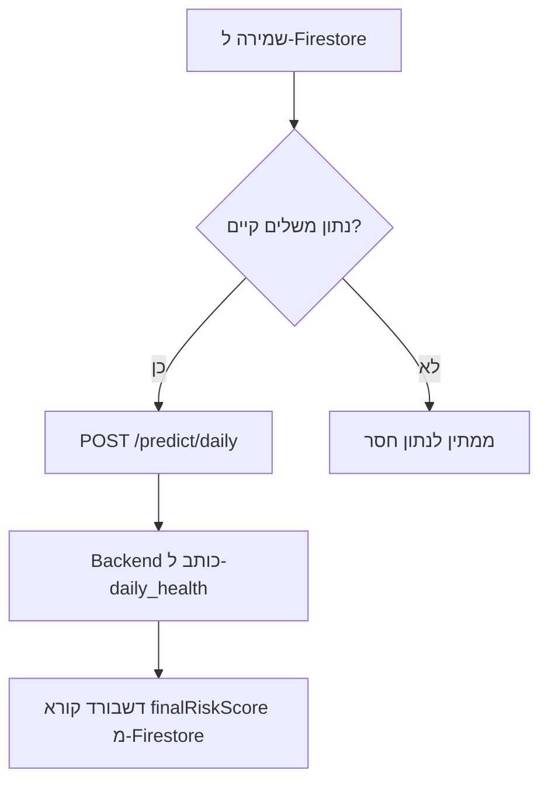
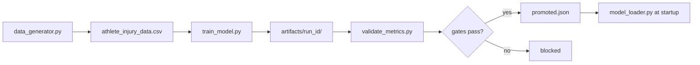
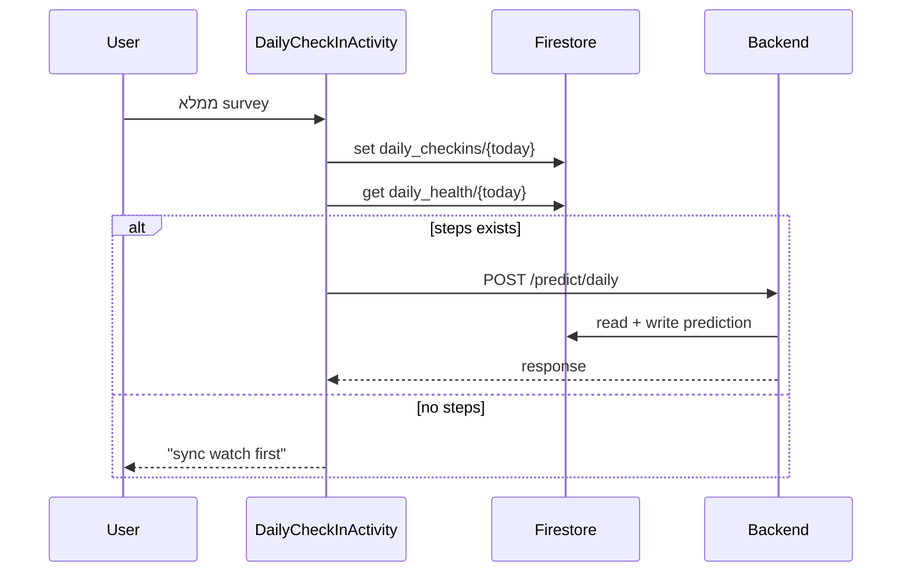
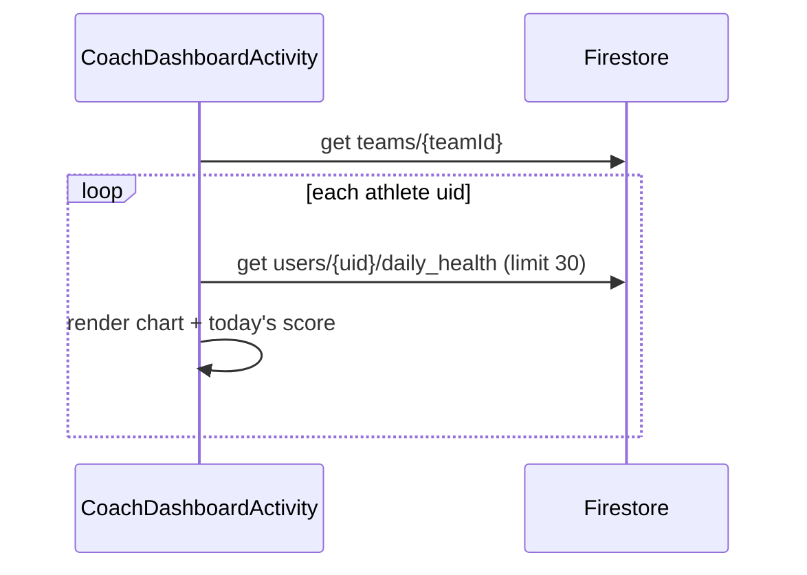

# AthleAgent — Low Level Design (LLD)
## מסמך עיצוב ברמה נמוכה — פרויקט מלא

| שדה | ערך |
|-----|-----|
| **גרסה** | 1.0 |
| **תאריך** | 2026-06-19 |
| **קהל יעד** | מפתחים |
| **מסמכים קשורים** | [HLD_PROJECT.md](HLD_PROJECT.md) · [backend/docs/LLD.md](../backend/docs/LLD.md) |

---

## 1. מבנה מודולים

```
final_project_AthleAgent/
│
├── android_app/AthleAgent/app/src/main/java/com/yahav/athleagent/
│   ├── App.kt                          # Application; מאתחל SignalManager
│   ├── logic/
│   │   └── LoginManager.kt             # עזר רישום email/password
│   ├── model/                          # DTOs
│   │   ├── AthleteItem.kt
│   │   ├── AthleteRequest.kt
│   │   ├── AlertItem.kt
│   │   └── PredictionModels.kt         # legacy mock DTO (/test_predict) — לא בשימוש
│   ├── network/
│   │   ├── ApiClient.kt                # Retrofit singleton, base URL
│   │   └── ApiService.kt               # POST /predict/daily
│   ├── observability/
│   │   ├── ClientEventReporter.kt      # Android → POST /api/v1/observability/client-events
│   │   ├── ObservabilityApi.kt
│   │   ├── CorrelationIdInterceptor.kt
│   │   └── RequestIdHolder.kt
│   ├── ui/
│   │   ├── auth/                       # Login, Register, Main
│   │   ├── athlete/                    # 8 Activities
│   │   ├── coach/                      # 4 Activities + adapters
│   │   └── PrivacyPolicyActivity.kt
│   └── utilities/
│       └── SignalManager.kt            # Toast/Snackbar
│
├── backend/
│   ├── main.py                         # FastAPI entry
│   ├── config.py                       # Settings
│   ├── api/routes/                     # health.py, predict.py
│   ├── services/                       # prediction, history, preprocessing...
│   ├── schemas/inference.py            # Pydantic contracts
│   ├── ml/model_loader.py              # joblib + gates
│   └── external/google_auth.py         # (לא מחובר)
│
└── ML_model/
    ├── data_generator.py
    ├── train_model.py
    ├── validate_metrics.py
    ├── run_pipeline.py
    └── artifacts/
        ├── promoted.json
        └── <run_id>/injury_model.pkl
```

---

## 2. Android — LLD

### 2.1 Activities ותפקידים

| Activity | Package | אחריות | Firestore paths |
|----------|---------|--------|-----------------|
| `LoginActivity` | auth | Firebase Auth UI, role routing | `users/{uid}` read |
| `RegisterActivity` | auth | email/password signup | `users/{uid}` create |
| `HomeAthleteActivity` | athlete | Hub, alerts, navigation | read today docs |
| `DailyCheckInActivity` | athlete | survey 4 שדות | `daily_checkins/{today}` |
| `WearableSyncActivity` | athlete | Health Connect read/write | `daily_health/{today}` |
| `AnalyzingMealActivity` | athlete | Gemini Vision | — |
| `MealAnalysisActivity` | athlete | save meal + aggregates | `daily_nutrition/{today}` |
| `AthleteDashboardActivity` | athlete | risk UI, chart, Gemini text | `daily_health/*` |
| `JoinTeamActivity` | athlete | join by team code | `teams/*/requests/{uid}` |
| `HomeCoachActivity` | coach | hub + pending badge | `teams`, `requests` |
| `CreateTeamActivity` | coach | create team | `teams/{id}` |
| `CoachRequestsActivity` | coach | approve/reject | `teams/*/requests`, `users.teamId` |
| `CoachDashboardActivity` | coach | roster risk + charts | athletes' `daily_health` |

### 2.2 תבנית ארכיטקטונית (מצב נוכחי)

```
┌─────────────────────────────────────┐
│           Activity (View)           │
│  - View Binding                     │
│  - FirebaseFirestore direct calls   │
│  - Retrofit Callbacks               │
│  - Coroutines (HC, Gemini)          │
└──────────────┬──────────────────────┘
               │
    ┌──────────┼──────────┐
    ▼          ▼          ▼
 Firestore  Retrofit   Gemini SDK
```

> **הערה:** אין שכבת Repository/ViewModel. לוגיקה עסקית מפוזרת ב-Activities.

### 2.3 Network Layer

**`ApiClient.kt`**
- Base URL: `http://10.0.2.2:8000/` (emulator → localhost)
- Gson converter, logging interceptor

**`ApiService.kt`** (מקור אמת לחוזה HTTP):
```kotlin
@POST("/predict/daily")
fun getDailyPrediction(@Body data: PredictionTriggerRequest): Call<PredictionResponse>

data class PredictionResponse(
    val risk_level: String,
    val risk_score: Float,              // 0.0–1.0 — לא נקרא לתצוגה
    val prediction_confidence: Float    // 0–100
)
```

> **`PredictionModels.kt`** — DTO legacy ל-`/test_predict` (mock); לא בשימוש בפרודקשן.  
> **תצוגת ציון סיכון:** תמיד מ-`daily_health/{date}.finalRiskScore` (0–100) ב-Firestore, לא מ-body של POST.

### 2.4 Trigger לחיזוי — cross-trigger

Activities הבאות קוראות ל-`checkAndTriggerPredictionInBackground()` לאחר שמירה:

| Activity | תנאי trigger |
|----------|--------------|
| `DailyCheckInActivity` | `daily_health/{today}` מכיל `sleepMinutes` |
| `WearableSyncActivity` | `daily_checkins/{today}` מכיל `energyLevel` |

`MealAnalysisActivity` **לא** מפעיל חיזוי.



> `POST /predict/daily` מחזיר `risk_score` (0–1) — האפליקציה בודקת רק הצלחה. התצוגה (מד, גרף) מ-`finalRiskScore` (0–100) ב-Firestore.

### 2.5 Health Connect — שדות שנכתבים

| שדה Firestore | מקור Health Connect |
|---------------|---------------------|
| `sleepMinutes` | SleepSession (לילה אחרון) |
| `steps` | Steps |
| `distanceMeters` | Distance |
| `activeCalories` | ActiveCaloriesBurned |
| `totalCalories` | TotalCaloriesBurned |
| `heartRateAvg/Max/Min` | HeartRateSeries |
| `hrvRmssd` | HeartRateVariabilityRmssd |
| `restingHeartRate` | RestingHeartRate |
| `vo2Max` | Vo2Max |
| `weightKg`, `heightCm` | Weight, Height |
| `lastSync` | timestamp |

### 2.6 Gemini Integration

| שימוש | Activity | Input | Output |
|-------|----------|-------|--------|
| Meal vision | `AnalyzingMealActivity` | Bitmap | JSON: calories, protein, carbs, description |
| Coaching | `AthleteDashboardActivity` | risk score + context | טקסט המלצה |

- API Key: `BuildConfig.GEMINI_API_KEY` ← `local.properties`
- **רץ client-side בלבד** — לא דרך backend

### 2.7 Firestore — כתיבה מהאפליקציה

#### `users/{uid}`
```json
{
  "fullName": "string",
  "email": "string",
  "role": "athlete|coach",
  "birth_date": "1995-01-01",
  "historyInjuryCount": 0,
  "teamId": "string|null"
}
```

#### `users/{uid}/daily_checkins/{yyyy-MM-dd}`
```json
{
  "energyLevel": 1-10,
  "muscleSoreness": 1-10,
  "stressLevel": 1-10,
  "injuredYesterday": 0|1,
  "timestamp": "serverTimestamp"
}
```

#### `users/{uid}/daily_health/{yyyy-MM-dd}`
```json
{
  "sleepMinutes": 420,
  "steps": 8500,
  "distanceMeters": 6200,
  "activeCalories": 450,
  "heartRateAvg": 72,
  "hrvRmssd": 58.5,
  "lastSync": "timestamp",
  "finalRiskScore": 25.5,
  "riskLevel": "Medium",
  "predictionConfidence": 78.2,
  "predictionUpdatedAt": "ISO-8601"
}
```

> שדות `finalRiskScore`, `riskLevel`, `predictionConfidence` — **נכתבים על ידי Backend**.

#### `teams/{teamId}`
```json
{
  "TeamName": "string",
  "teamCode": "ABC123",
  "coachId": "uid",
  "athletes": ["uid1", "uid2"]
}
```

---

## 3. Backend — LLD (סיכום)

> פירוט מלא: [backend/docs/LLD.md](../backend/docs/LLD.md)

### 3.1 API Endpoints

| Method | Path | Handler | Response |
|--------|------|---------|----------|
| GET | `/` | `health.py` | metadata |
| GET | `/health` | `health.py` | `{status: "healthy"}` |
| POST | `/predict/daily` | `predict.py` | `InjuryPredictionResponse` |
| GET | `/status/ml` | `predict.py` | model status |
| POST | `/api/v1/observability/client-events` | `observability.py` | 202 Accepted |
| POST | `/test_predict` | `predict.py` | mock |
| POST | `/predict/sklearn` | `predict.py` | legacy (disabled) |

### 3.2 Prediction Pipeline (Backend)

```
POST /predict/daily {userId, date}
    │
    ├─ fetch_daily_firestore_snapshot()
    │     profile, health{D}, health{D-1}, checkins{D}, nutrition{D-1}
    │
    ├─ injury_prediction_request_from_firestore_snapshot()
    │     merge policy: sleep@D, physical@D-1, survey@D, nutrition@D-1
    │
    ├─ injury_request_to_model_dataframe()
    │     preprocessing + feature_engineering
    │
    ├─ _apply_history_confidence_fallback()
    │     7-day rolling: ACWR, sleep_debt, hrv_drop
    │
    ├─ calculate_data_quality_score()
    │
    ├─ model.predict_proba() → proba
    │     classify_risk_level: Low ≤ 20%, Medium 21–70%, High > 70%
    │
    └─ save_daily_prediction_result()
          merge → daily_health/{date}
```

### 3.3 Model Features (36 columns)

מקור אמת: `backend/services/model_features.py`

| קטגוריה | Features |
|---------|----------|
| Profile | bmi, age (מ-`birth_date`), body_fat_pct, vo2_max, history_injury_count |
| Load | daily_distance_km, workout_intensity_minutes, avg_cadence, elevation, floors, speed, power, active_calories_burned |
| Recovery | sleep_hours, hrv_score, resting_hr, respiratory_rate, spo2 |
| Nutrition | nutrition_intake_calories, daily_calories, total_calories_burned, calorie_balance |
| Subjective | stress_level, muscle_soreness, energy_level, injured_yesterday |
| Engineered | acute_load_7d, chronic_load_21d, acwr_ratio, acwr_ratio_ma7, sleep_hours_ma7, sleep_debt_3d, hrv_drop, load_recovery_imbalance, speed_intensity_ratio |

---

## 4. ML Pipeline — LLD

### 4.1 Training Flow



### 4.2 Model Bundle Format (joblib)

```python
{
    "estimator": XGBClassifier,
    "feature_columns": [...],  # 36 names
    "threshold": 0.18,
    "medium_threshold": 0.11,
    "winner": "XGBoostDeep"
}
```

### 4.3 Live Gates (`model_loader.py`)

| Gate | Threshold |
|------|-----------|
| Recall@Threshold | ≥ 0.80 |
| ROC-AUC | ≥ 0.68 |

### 4.4 Retraining from Firestore

`backend/scripts/build_training_dataset_from_firestore.py`:
1. Iterate `users/*/daily_*` subcollections
2. Build feature row per (user, date)
3. Label: `injuredYesterday` on day D+1
4. Export CSV → `train_model.py`

---

## 5. זרימות End-to-End — Sequence Diagrams

### 5.1 Check-in → Prediction



### 5.2 Coach views athlete risk



---

## 6. Error Handling

### 6.1 Android
| מצב | התנהגות |
|-----|---------|
| Firestore offline | Snackbar / retry |
| Backend 503 | Toast "prediction unavailable" |
| Missing Health Connect | redirect to PrivacyPolicy / permissions |
| Gemini failure | fallback message, manual entry option |

### 6.2 Backend
| מצב | HTTP | Detail |
|-----|------|--------|
| Model blocked | 503 | `model_not_live:*` |
| Firestore unavailable | 503 | `firestore_snapshot_unavailable` |
| Persist failed | 503 | `prediction_persist_failed` |

---

## 7. Configuration

### 7.1 Android (`local.properties`)
```properties
GEMINI_API_KEY=...
```

### 7.2 Backend (`.env` / env vars)
| Variable | Default |
|----------|---------|
| `MODEL_PATH` | `None` → resolves via `promoted.json`, then `backend/injury_model.pkl` |
| `FIREBASE_SERVICE_ACCOUNT_KEY` | `backend/firebase-key.json` |
| `ENABLE_LEGACY_SKLEARN_ENDPOINT` | `false` |
| `CORS_ORIGINS` | localhost ports |

### 7.3 Emulator Networking
- Android emulator: `10.0.2.2:8000` → host `localhost:8000` (works with Docker port mapping `8000:8000`)
- Physical device: IP של המחשב המארח

### 7.4 Backend Deployment (local)

| Method | Command | Notes |
|--------|---------|-------|
| **Docker** | `docker compose up --build` (repo root) | Backend + promoted model in one container; see [DOCKER.md](DOCKER.md) |
| **Python** | `cd backend && uvicorn main:app --reload --host 0.0.0.0 --port 8000` | Requires `pip install -r backend/requirements.txt` |

Both paths load the model from `ML_model/artifacts/promoted.json` at startup. Android app requires no changes.

---

## 8. Testing

| שכבה | Framework | קבצים עיקריים |
|------|-----------|---------------|
| Backend | pytest | `tests/unit/test_preprocessing.py`, `tests/unit/test_model_loader.py`, `tests/unit/test_history_service.py`, `tests/integration/test_routes_predict_daily.py`, `tests/integration/test_openapi_contract.py` |
| Android | JUnit | `ExampleUnitTest.kt` (placeholder) |

**הרצה:**
```bash
cd backend && python -m pytest tests/ -v
```

---

## 9. פערים ידועים (LLD level)

| # | רכיב | פער | השפעה |
|---|------|-----|--------|
| 1 | Android trigger | אין gate על `daily_health/{D-1}` load > 0 | חיזוי עלול לרוץ בלי עומס אתמול |
| 2 | google_auth.py | לא מחובר ל-routes | API פתוח |
| 3 | Android | אין ViewModel/Repository | קושי בבדיקות unit |

---

## 10. מפת קבצים קריטיים

| זרימה | Android | Backend |
|-------|---------|---------|
| Login | `LoginActivity.kt` | — |
| Sync | `WearableSyncActivity.kt` | `history_service.py` |
| Check-in | `DailyCheckInActivity.kt` | — |
| Meal | `AnalyzingMealActivity.kt` | — |
| Predict trigger | `ApiClient.kt` | `predict.py` |
| Inference | — | `prediction_service.py` |
| Features | — | `preprocessing/`, `feature_engineering.py`, `model_features.py` |
| Persist | — | `history_service.save_daily_prediction_result` |
| Dashboard | `AthleteDashboardActivity.kt` | — |
| Coach view | `CoachDashboardActivity.kt` | — |
| Train | — | `ML_model/train_model.py` |

---

## 11. מפת מסמכים

| מסמך | תוכן |
|------|------|
| [DOCKER.md](DOCKER.md) | Backend + ML — Docker |
| [HLD_PROJECT.md](HLD_PROJECT.md) | HLD פרויקט מלא |
| [backend/docs/HLD.md](../backend/docs/HLD.md) | HLD בקאנד |
| [backend/docs/LLD.md](../backend/docs/LLD.md) | LLD בקאנד |
