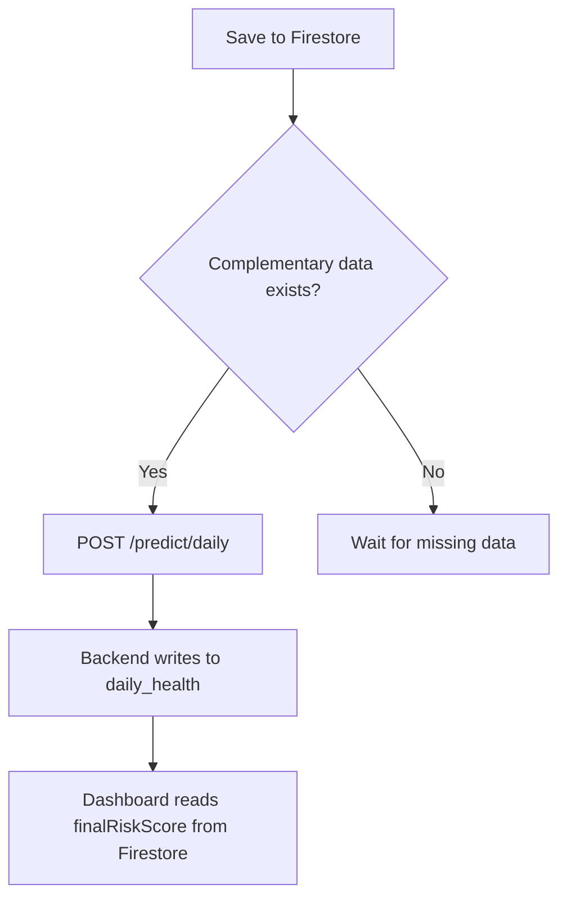
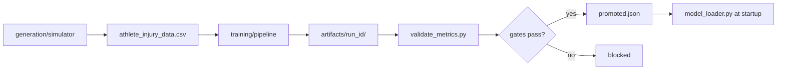
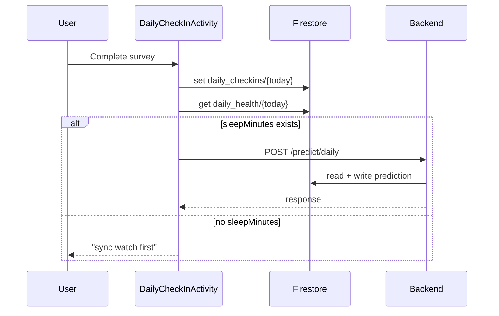
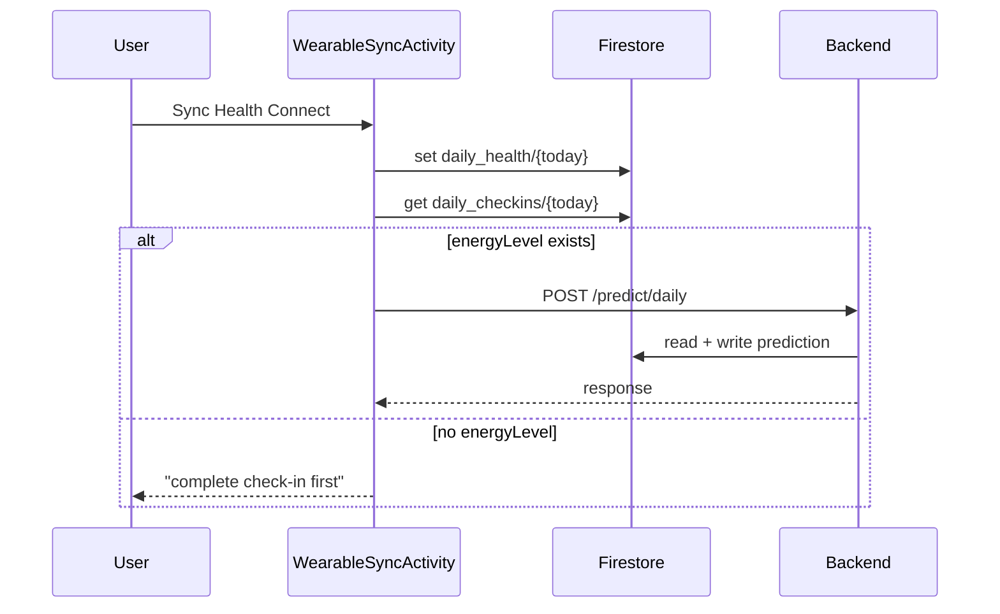
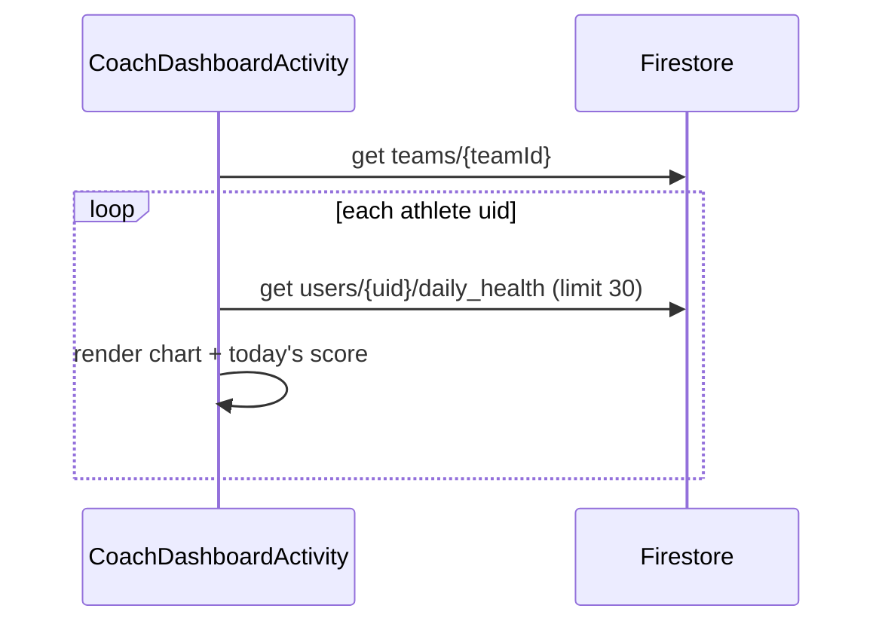

# AthleAgent — Low Level Design (LLD)
## Full-Project Low-Level Design Document

| Field | Value |
|-------|-------|
| **Version** | 1.1 |
| **Date** | 2026-07-11 |
| **Audience** | Developers |
| **Related documents** | [HLD_PROJECT.md](HLD_PROJECT.md) · [DOCKER.md](DOCKER.md) · [MODEL_SELECTION.md](MODEL_SELECTION.md) |

---

## 1. Module Structure

```
final_project_AthleAgent/
│
├── android_app/AthleAgent/app/src/main/java/com/yahav/athleagent/
│   ├── App.kt                          # Application; initializes SignalManager
│   ├── logic/
│   │   └── LoginManager.kt             # Email/password registration helper
│   ├── model/                          # DTOs
│   │   ├── AthleteItem.kt
│   │   ├── AthleteRequest.kt
│   │   └── AlertItem.kt
│   ├── network/
│   │   ├── ApiClient.kt                # Retrofit singleton, base URL
│   │   └── ApiService.kt               # POST /predict/daily
│   ├── observability/
│   │   ├── ClientEventReporter.kt      # Android → POST /api/v1/observability/client-events
│   │   ├── ObservabilityApi.kt
│   │   ├── CorrelationIdInterceptor.kt
│   │   └── RequestIdHolder.kt
│   ├── ui/
│   │   ├── auth/                       # Login, Register, Main
│   │   ├── athlete/                    # 8 Activities
│   │   ├── coach/                      # 4 Activities + adapters
│   │   └── PrivacyPolicyActivity.kt
│   └── utilities/
│       └── SignalManager.kt            # Toast/Snackbar
│
├── backend/
│   ├── main.py                         # FastAPI entry
│   ├── config.py                       # Settings
│   ├── api/routes/                     # health.py, predict.py, observability.py
│   ├── services/                       # prediction, history, preprocessing...
│   ├── schemas/inference.py            # Pydantic contracts
│   ├── ml/model_loader.py              # joblib + gates
│
└── ML_model/
    ├── generation/                 # simulator, config, postprocess
    ├── training/                   # pipeline, policy, models
    ├── data/                       # demo CSV + fixed holdout
    ├── notebooks/                  # presentation notebook + its requirements
    ├── data_generator.py           # CLI → generation/
    ├── train_model.py              # CLI → training/
    ├── validate_metrics.py
    ├── run_pipeline.py
    └── artifacts/
        ├── promoted.json
        └── <run_id>/injury_model.pkl
```

---

## 2. Android — LLD

### 2.1 Activities and Responsibilities

| Activity | Package | Responsibility | Firestore paths |
|----------|---------|----------------|-----------------|
| `LoginActivity` | auth | Firebase Auth UI, role routing | `users/{uid}` read |
| `RegisterActivity` | auth | Email/password signup | `users/{uid}` create |
| `HomeAthleteActivity` | athlete | Hub, alerts, navigation | Read today docs |
| `DailyCheckInActivity` | athlete | 4-field survey | `daily_checkins/{today}` |
| `WearableSyncActivity` | athlete | Health Connect read/write | `daily_health/{today}` |
| `AnalyzingMealActivity` | athlete | Gemini Vision | — |
| `MealAnalysisActivity` | athlete | Save meal + aggregates | `daily_nutrition/{today}` |
| `AthleteDashboardActivity` | athlete | Risk UI, chart, Gemini text | `daily_health/*` |
| `JoinTeamActivity` | athlete | Join by team code | `teams/*/requests/{uid}` |
| `HomeCoachActivity` | coach | Hub + pending badge | `teams`, `requests` |
| `CreateTeamActivity` | coach | Create team | `teams/{id}` |
| `CoachRequestsActivity` | coach | Approve/reject | `teams/*/requests`, `users.teamId` |
| `CoachDashboardActivity` | coach | Roster risk + charts | Athletes' `daily_health` |

### 2.2 Architectural Pattern (Current State)

```
┌─────────────────────────────────────┐
│           Activity (View)           │
│  - View Binding                     │
│  - FirebaseFirestore direct calls   │
│  - Retrofit Callbacks               │
│  - Coroutines (HC, Gemini)          │
└──────────────┬──────────────────────┘
               │
    ┌──────────┼──────────┐
    ▼          ▼          ▼
 Firestore  Retrofit   Gemini SDK
```

> **Note:** There is no Repository/ViewModel layer. Business logic is distributed across Activities.

### 2.3 Network Layer

**`ApiClient.kt`**
- Base URL: `http://10.0.2.2:8000/` (emulator → localhost)
- Gson converter, logging interceptor

**`ApiService.kt`** (source of truth for the HTTP contract):
```kotlin
@POST("/predict/daily")
fun getDailyPrediction(@Body data: PredictionTriggerRequest): Call<PredictionResponse>

data class PredictionResponse(
    val risk_level: String,
    val risk_score: Float,              // 0.0–1.0 — not used for UI display
    val prediction_confidence: Float    // 0–100
)
```

> **Risk score display:** Always from `daily_health/{date}.finalRiskScore` (0–100) in Firestore, not from the POST response body.

### 2.4 Prediction Trigger — Cross-Trigger

The following Activities call `checkAndTriggerPredictionInBackground()` after saving data:

| Activity | Trigger condition (complementary data must exist) |
|----------|---------------------------------------------------|
| `DailyCheckInActivity` | `daily_health/{today}` contains `sleepMinutes` |
| `WearableSyncActivity` | `daily_checkins/{today}` contains `energyLevel` |

`MealAnalysisActivity` does **not** trigger prediction.


```mermaid
flowchart TD
    Save[Save to Firestore] --> Check{Complementary data exists?}
    Check -->|Yes| API[POST /predict/daily]
    Check -->|No| Wait[Wait for missing data]
    API --> FS[Backend writes to daily_health]
    FS --> UI[Dashboard reads finalRiskScore from Firestore]
```

> `POST /predict/daily` returns `risk_score` (0–1). The app checks only for HTTP success. Display (gauge, chart) uses `finalRiskScore` (0–100) from Firestore.

### 2.5 Health Connect — Fields Written

| Firestore field | Health Connect source |
|-----------------|----------------------|
| `sleepMinutes` | SleepSession (previous night) |
| `steps` | Steps |
| `distanceMeters` | Distance |
| `activeCalories` | ActiveCaloriesBurned |
| `totalCalories` | TotalCaloriesBurned |
| `heartRateAvg/Max/Min` | HeartRateSeries |
| `hrvRmssd` | HeartRateVariabilityRmssd |
| `restingHeartRate` | RestingHeartRate |
| `vo2Max` | Vo2Max |
| `weightKg`, `heightCm` | Weight, Height |
| `lastSync` | timestamp |

### 2.6 Gemini Integration

| Use case | Activity | Input | Output |
|----------|----------|-------|--------|
| Meal vision | `AnalyzingMealActivity` | Bitmap | JSON: calories, protein, carbs, description |
| Coaching | `AthleteDashboardActivity` | Risk score + context | Recommendation text |

- API key: `BuildConfig.GEMINI_API_KEY` ← `local.properties` (see `local.properties.example`)
- **Client-side only** — not routed through the backend

### 2.7 Firestore — App Writes

#### `users/{uid}`
```json
{
  "fullName": "string",
  "email": "string",
  "role": "athlete|coach",
  "birth_date": "1995-01-01",
  "historyInjuryCount": 0,
  "teamId": "string|null"
}
```

#### `users/{uid}/daily_checkins/{yyyy-MM-dd}`
```json
{
  "energyLevel": 1-10,
  "muscleSoreness": 1-10,
  "stressLevel": 1-10,
  "injuredYesterday": 0|1,
  "timestamp": "serverTimestamp"
}
```

#### `users/{uid}/daily_health/{yyyy-MM-dd}`
```json
{
  "sleepMinutes": 420,
  "steps": 8500,
  "distanceMeters": 6200,
  "activeCalories": 450,
  "heartRateAvg": 72,
  "hrvRmssd": 58.5,
  "lastSync": "timestamp",
  "finalRiskScore": 25.5,
  "riskLevel": "Medium",
  "predictionConfidence": 78.2,
  "predictionUpdatedAt": "ISO-8601"
}
```

> Fields `finalRiskScore`, `riskLevel`, `predictionConfidence` are **written by the backend**.

#### `teams/{teamId}`
```json
{
  "TeamName": "string",
  "teamCode": "ABC123",
  "coachId": "uid",
  "athletes": ["uid1", "uid2"]
}
```

---

## 3. Backend — LLD

### 3.1 API Endpoints

| Method | Path | Handler | Response |
|--------|------|---------|----------|
| GET | `/` | `health.py` | metadata |
| GET | `/health` | `health.py` | `{status: "healthy"}` |
| POST | `/predict/daily` | `predict.py` | `InjuryPredictionResponse` |
| GET | `/status/ml` | `predict.py` | model status |
| POST | `/api/v1/observability/client-events` | `observability.py` | 202 Accepted |

### 3.2 Prediction Pipeline (Backend)

```
POST /predict/daily {userId, date}
    │
    ├─ fetch_inference_firestore_bundle()              [history/inference_bundle]
    │     profile, health{D}, health{D-1}, checkins{D}, nutrition{D-1} + history window
    │
    ├─ injury_prediction_request_from_firestore_snapshot()
    │     merge policy: sleep@D, physical@D-1, survey@D, nutrition@D-1
    │
    ├─ resolve_request_nutrition()                       [nutrition_defaults]
    │
    ├─ injury_request_to_model_dataframe()               [preprocessing/]
    │     preprocessing + feature_engineering
    │
    ├─ apply_history_confidence_fallback()             [prediction/confidence]
    │     7-day rolling: ACWR, sleep_debt, hrv_drop    [history/rolling_features]
    │
    ├─ calculate_data_quality_score()                    [preprocessing/quality]
    │
    ├─ compute_prediction_confidence_percent()         [prediction/confidence]
    │
    ├─ model.predict_proba() → proba                     [prediction/bundle]
    │     classify_risk_level: Low ≤ 20%, Medium 21–70%, High > 70%
    │
    └─ save_daily_prediction_result()
          merge → daily_health/{date}
```

### 3.3 Model Features (35 columns)

Source of truth: `backend/services/model_features.py`

| Category | Features |
|----------|----------|
| Profile | bmi, age (from `birth_date`), body_fat_pct, vo2_max, history_injury_count |
| Load | daily_distance_km, workout_intensity_minutes, avg_cadence, elevation, floors, speed, power, active_calories_burned |
| Recovery | sleep_hours, hrv_score, resting_hr, respiratory_rate, spo2 |
| Nutrition | nutrition_intake_calories, daily_calories, total_calories_burned, calorie_balance |
| Subjective | stress_level, muscle_soreness, energy_level, injured_yesterday |
| Engineered | acute_load_7d, acwr_ratio, acwr_ratio_ma7, sleep_hours_ma7, sleep_debt_3d, hrv_drop, load_recovery_imbalance, speed_intensity_ratio |

---

## 4. ML Pipeline — LLD

### 4.1 Training Flow


```mermaid
flowchart LR
    A[generation/simulator] --> B[athlete_injury_data.csv]
    B --> C[training/pipeline]
    C --> D[artifacts/run_id/]
    D --> E[validate_metrics.py]
    E --> F{gates pass?}
    F -->|yes| G[promoted.json]
    F -->|no| H[blocked]
    G --> I[model_loader.py at startup]
```

> CLI entry points: `data_generator.py` → `generation/`, `train_model.py` → `training/`.

### 4.2 Model Bundle Format (joblib)

The `estimator` field holds the winning model from the promoted training run — commonly `XGBoostCalibratedTuned` (`CalibratedClassifierCV` wrapping `XGBClassifier`), not necessarily a raw `XGBClassifier`.

```python
{
    "estimator": <sklearn-compatible model from promoted run>,  # e.g. XGBoostCalibratedTuned
    "feature_columns": [...],  # 35 names
    "threshold": "<from run_manifest.json>",
    "medium_threshold": 0.11,
    "winner": "<from run_manifest.json>"  # e.g. "XGBoostCalibratedTuned"
}
```

### 4.3 Live Gates (`model_loader.py`)

| Gate | Threshold |
|------|-----------|
| Recall@Threshold | ≥ 0.80 |
| ROC-AUC | ≥ 0.68 |

### 4.4 Promotion

After `run_pipeline.py`, `ML_model/artifacts/promoted.json` points at the latest `injury_model.pkl`. Restart the backend to load it.

Example `promoted.json`:
```json
{
  "model_path": "ML_model/artifacts/<run_id>/injury_model.pkl",
  "run_id": "<run_id>",
  "promoted_at_utc": "<ISO-8601>",
  "manifest_path": "ML_model/artifacts/<run_id>/run_manifest.json"
}
```

---

## 5. End-to-End Flows — Sequence Diagrams

### 5.1 Check-in → Prediction


```mermaid
sequenceDiagram
    participant U as User
    participant DCI as DailyCheckInActivity
    participant FS as Firestore
    participant BE as Backend

    U->>DCI: Complete survey
    DCI->>FS: set daily_checkins/{today}
    DCI->>FS: get daily_health/{today}
    alt sleepMinutes exists
        DCI->>BE: POST /predict/daily
        BE->>FS: read + write prediction
        BE-->>DCI: response
    else no sleepMinutes
        DCI-->>U: "sync watch first"
    end
```

### 5.2 Wearable sync → Prediction


```mermaid
sequenceDiagram
    participant U as User
    participant WS as WearableSyncActivity
    participant FS as Firestore
    participant BE as Backend

    U->>WS: Sync Health Connect
    WS->>FS: set daily_health/{today}
    WS->>FS: get daily_checkins/{today}
    alt energyLevel exists
        WS->>BE: POST /predict/daily
        BE->>FS: read + write prediction
        BE-->>WS: response
    else no energyLevel
        WS-->>U: "complete check-in first"
    end
```

### 5.3 Coach views athlete risk


```mermaid
sequenceDiagram
    participant C as CoachDashboardActivity
    participant FS as Firestore

    C->>FS: get teams/{teamId}
    loop each athlete uid
        C->>FS: get users/{uid}/daily_health (limit 30)
        C->>C: render chart + today's score
    end
```

---

## 6. Error Handling

### 6.1 Android

| Condition | Behavior |
|-----------|----------|
| Firestore offline | Snackbar / retry |
| Backend 503 | Toast "prediction unavailable" |
| Missing Health Connect | Redirect to PrivacyPolicy / permissions |
| Gemini failure | Fallback message, manual entry option |

### 6.2 Backend

| Condition | HTTP | Detail |
|-----------|------|--------|
| Model blocked | 503 | `model_not_live:*` |
| Firestore unavailable | 503 | `firestore_snapshot_unavailable` |
| Persist failed | 503 | `prediction_persist_failed` |

---

## 7. Configuration

### 7.1 Android (`local.properties`)

Copy from `android_app/AthleAgent/local.properties.example`. No `.env` file is required for the Android app.

```properties
GEMINI_API_KEY=...
```

Risk scoring works without a Gemini key; meal photo analysis requires it.

### 7.2 Backend (environment variables)

No `.env` file is required. Defaults are defined in `backend/config.py` (pydantic-settings). Optional overrides can be set via environment variables or `backend/.env` (see `backend/.env.example`).

| Variable | Default |
|----------|---------|
| `MODEL_PATH` | `None` → resolves via `ML_model/artifacts/promoted.json`, then `backend/injury_model.pkl` |
| `FIREBASE_SERVICE_ACCOUNT_KEY` | `backend/firebase-key.json` (local only; auto-resolved when present) |
| `CORS_ORIGINS` | localhost ports |

### 7.3 Emulator Networking

- Android emulator: `10.0.2.2:8000` → host `localhost:8000` (works with Docker port mapping `8000:8000`)
- Physical device: host machine IP address

### 7.4 Backend Deployment (Local)

| Method | Command | Notes |
|--------|---------|-------|
| **Docker** | `docker compose up --build` (repo root) | Backend + promoted model in one container; see [DOCKER.md](DOCKER.md) |
| **Python** | `cd backend && uvicorn main:app --reload --host 0.0.0.0 --port 8000` | Requires `pip install -r backend/requirements.txt` |

Both paths load the model from `ML_model/artifacts/promoted.json` at startup. The Android app requires no changes.

---

## 8. Testing

| Layer | Framework | Key files |
|-------|-----------|-----------|
| Backend | pytest | `tests/unit/test_preprocessing.py`, `tests/unit/test_model_loader.py`, `tests/unit/test_history_repository.py`, `tests/integration/test_routes_predict_daily.py`, `tests/integration/test_openapi_contract.py` |
| Android | JUnit | `ExampleUnitTest.kt` (placeholder) |

**Run backend tests:**
```bash
cd backend && python -m pytest tests/ -v
```

---

## 9. Known Gaps (LLD Level)

| # | Component | Gap | Impact |
|---|-----------|-----|--------|
| 1 | Android trigger | No gate on `daily_health/{D-1}` load > 0 | Prediction may run without yesterday's load |
| 2 | `google_auth.py` | Not wired to routes | API is open |
| 3 | Android | No ViewModel/Repository | Difficult to unit-test |

---

## 10. Critical File Map

| Flow | Android | Backend |
|------|---------|---------|
| Login | `LoginActivity.kt` | — |
| Sync | `WearableSyncActivity.kt` | `history/inference_bundle.py` |
| Check-in | `DailyCheckInActivity.kt` | — |
| Meal | `AnalyzingMealActivity.kt` | — |
| Predict trigger | `ApiClient.kt` | `predict.py` |
| Inference | — | `prediction/service.py` |
| Features | — | `preprocessing/`, `history/day_quality.py`, `feature_engineering.py`, `model_features.py` |
| Confidence | — | `prediction/confidence.py`, `preprocessing/quality.py` |
| Persist | — | `history/persist.save_daily_prediction_result` |
| Dashboard | `AthleteDashboardActivity.kt` | — |
| Coach view | `CoachDashboardActivity.kt` | — |
| Train | — | `ML_model/training/pipeline.py` (CLI: `train_model.py`) |

---

## 11. Document Map

| Document | Content |
|----------|---------|
| [DOCKER.md](DOCKER.md) | Backend + ML — Docker |
| [HLD_PROJECT.md](HLD_PROJECT.md) | Full-project HLD |
| [MODEL_SELECTION.md](MODEL_SELECTION.md) | Model selection protocol |
