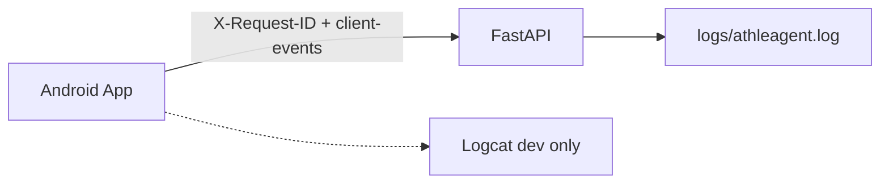

# AthleAgent — מדריך לוגים

| שדה | ערך |
|-----|-----|
| **גרסה** | 1.1 |
| **תאריך** | 2026-06-20 |
| **קהל יעד** | מפתחי Backend, Android, בוחני פרויקט גמר |
| **מסמכים קשורים** | [HLD §11](../backend/docs/HLD.md) |

---

## 1. למה יש לוגים?

כשמשהו נכשל (חיזוי לא רץ, sync נתקע, שגיאת API), הלוג עונה על:

1. **מה** קרה?
2. **מתי**?
3. **לאיזה משתמש**?
4. **כמה זמן** לקח?
5. האם הבעיה ב-**client** או ב-**server**?

**קובץ אחד:** `logs/athleagent.log` — Backend + Android (אחרי חיבור).

הלוג **לא** שומר נתוני בריאות (שינה, HRV, צעדים). הוא רושם **אירועים** בלבד.

---

## 2. Events לעומת State

| סוג | דוגמה | איפה |
|-----|--------|------|
| **Event** | בקשת חיזוי, שגיאה, מסך נפתח | `logs/athleagent.log` |
| **State** | snapshot יומי, תוצאת prediction | Firestore (לא לוג) |

---

## 3. ארכitektura

```
AthleAgent/
└── logs/
    └── athleagent.log    ← JSON Lines, gitignored
```



| `source` | מי כותב |
|----------|---------|
| `backend` | middleware, services, startup |
| `android` | `POST /api/v1/observability/client-events` |

---

## 4. פורמט הרשומה

- **JSON Lines** — שורה = אובייקט JSON
- **Rotation** — 10 MB × 5 גיבויים
- **מיקום** — `<repo_root>/logs/athleagent.log`

### שדות נפוצים

| שדה | תיאור |
|-----|--------|
| `timestamp`, `level`, `message` | בסיס |
| `source` | `backend` / `android` |
| `event` | סוג לסינון (`http_request_completed`, `client_event`, …) |
| `request_id` | מעקב E2E (UUID) |
| `user_id` | Firebase UID |

### דוגמה — Backend

```json
{
  "source": "backend",
  "event": "http_request_completed",
  "method": "POST",
  "path": "/predict/daily",
  "status_code": 200,
  "duration_ms": 842,
  "request_id": "abc-123",
  "user_id": "firebaseUid"
}
```

### דוגמה — Android

```json
{
  "source": "android",
  "event": "client_event",
  "client_event_type": "ml_trigger",
  "client_tag": "ML_Trigger",
  "client_message": "predict_daily_started",
  "request_id": "abc-123",
  "user_id": "firebaseUid"
}
```

---

## 5. Backend (`source: backend`)

קובץ middleware: `backend/middleware/request_logging.py`

| Path | נרשם? |
|------|--------|
| `POST /predict/daily` | כן (+ `duration_ms`) |
| `POST /api/v1/observability/client-events` | כן |
| `/health`, `/`, `/docs`, `/status/ml` | לא |

| תנאי | רמה |
|------|-----|
| 2xx | INFO |
| 4xx | WARNING |
| 5xx | ERROR |
| `duration_ms` > 2000 | WARNING |

**אירועי domain:**

| `event` | מתי |
|---------|-----|
| `server_startup` / `server_shutdown` | עלייה / כיבוי |
| `model_loaded` | טעינת מודל (+ `run_id`) |
| `predict_data_quality` / `predict_confidence_summary` | לפני/אחרי inference |
| `predict_blocked` | מודל לא live |
| `domain_error` | 422 / 503 |

**`X-Request-ID`:** הקליינט שולח, או הבקאנד יוצר UUID ומחזיר ב-response.

---

## 6. Android (`source: android`)

```
POST /api/v1/observability/client-events → 202
```

| `event_type` | מתי | Rate limit |
|--------------|-----|------------|
| `error` | כשל API / Firestore / Gemini | אין |
| `screen_view` | מסך מרכזי נפתח | 30s |
| `user_action` | submit check-in, meal | 10s |
| `ml_trigger` | לפני/אחרי חיזוי | 5s |
| `sync` | sync שעון | 15s |

**לא לשלוח:** כל click, PHI, stack traces, הודעות > 500 תווים.

**היום:** Logcat בלבד. **אחרי חיבור:** `ClientEventReporter` → אותו קובץ לוג.

---

## 7. חקירת תקלה

```bash
./backend/scripts/trace_request.sh abc-123          # לפי request_id
./backend/scripts/trace_request.sh --source android
./backend/scripts/trace_request.sh --event client_event
jq 'select(.path=="/predict/daily")' logs/athleagent.log
jq 'select(.duration_ms > 2000)' logs/athleagent.log
jq 'select(.event=="predict_blocked")' logs/athleagent.log
```

**Trace E2E (אחרי Android):**

```
[android]  ml_trigger: predict_daily_started
[backend]  http_request_completed  duration_ms=842
[backend]  predict_data_quality
```

**בדיקה בלי Android:**

```bash
curl -X POST http://localhost:8000/api/v1/observability/client-events \
  -H "Content-Type: application/json" \
  -H "X-Request-ID: test-001" \
  -d '{"event_type":"screen_view","level":"INFO","tag":"Dashboard","message":"screen_opened","user_id":"demo"}'
```

---

## 8. הגדרות

| משתנה | ברירת מחדל |
|--------|------------|
| `LOG_DIR` | `<repo>/logs` |
| `LOG_FILE_NAME` | `athleagent.log` |
| `LOG_FORMAT` | `json` |
| `LOG_LEVEL` | `INFO` |

קבצי קוד: `backend/config.py`, `utils/logging.py`, `utils/client_event_limiter.py`.

**תחזוקה:** rotation אוטומטי; `python clean_logs.py` מוחק גיבויים ישנים (7+ יום).

---

## 9. Android — מה ליישם (לא מומש עדיין)

**Dependencies:** okhttp 4.12, timber 5.0.1

**קבצים חדשים:** `CorrelationIdInterceptor.kt`, `RequestIdHolder.kt`, `ObservabilityApi.kt`, `ClientEventReporter.kt`

**לעדכן:** `ApiClient.kt`, `App.kt`, Activities (Dashboard, DailyCheckIn, WearableSync, MealAnalysis)

**Payload:**

```json
{
  "event_type": "error | screen_view | user_action | ml_trigger | sync",
  "level": "INFO | ERROR",
  "tag": "ML_Trigger",
  "message": "predict_daily_started",
  "screen": "DailyCheckInActivity",
  "request_id": "...",
  "user_id": "...",
  "app_version": "1.0"
}
```

שליחה async, לא לחסום UI, לא לזרוק אם השרver down.

---

## 10. FAQ

**למה לא ELK / Sentry?** — לפרויקט גמר: JSON + `jq` מספיק.

**למה `backend/logs/` ריק?** — הלוג עבר ל-`logs/` ב-root.

**מי מייצר `request_id`?** — הקליינט אם שולח; אחרת הבקאנד.

**כל לחיצה נרשמת?** — לא. רק מסכים, ML, sync, שגיאות.

---

## 11. מפת קבצים (לוגים בלבד)

| קובץ | תפקיד |
|------|--------|
| `logs/athleagent.log` | לוג מאוחד |
| `backend/utils/logging.py` | הגדרת logger |
| `backend/utils/request_context.py` | request_id / user_id |
| `backend/middleware/request_logging.py` | HTTP + duration |
| `backend/api/routes/observability.py` | קליטת Android |
| `backend/schemas/observability.py` | סכמת payload |
| `backend/utils/client_event_limiter.py` | rate limit |
| `backend/scripts/trace_request.sh` | חיפוש |
| `clean_logs.py` | ניקוי גיבויים |

---

*מסמך זה עוסק בלוגים בלבד. ML artifacts ו-Firestore — ראו [HLD](../backend/docs/HLD.md) ו-[MODEL.md](../backend/docs/MODEL.md).*
