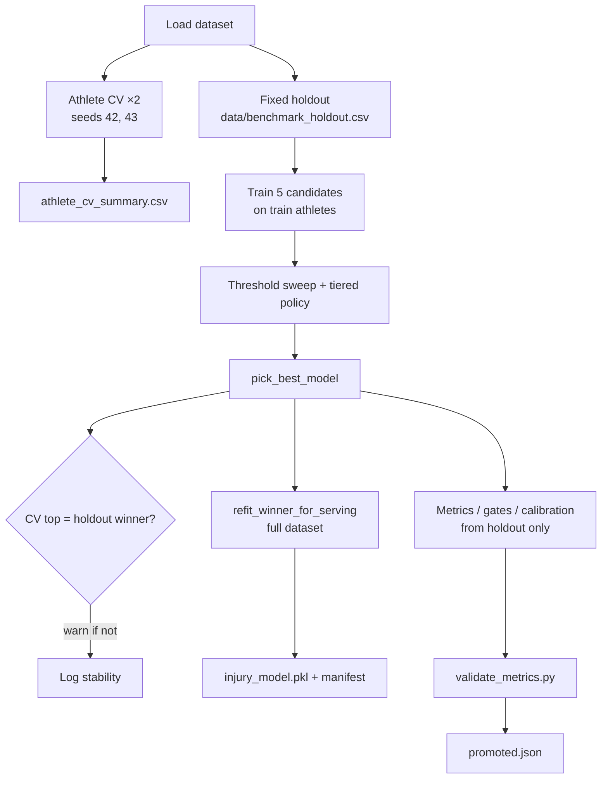

# Model selection protocol

Single source of truth for how AthleAgent picks and ships an injury model.  
**Code:** `ML_model/training/pipeline.py` (CLI: `train_model.py`) · **Demo notebook:** [`model_improvement_journey.ipynb`](../ML_model/notebooks/model_improvement_journey.ipynb) (see below) · **Gates:** `backend/data/ml_policy.json` (loaded by `backend/services/ml_policy.py` and `ML_model/policy_config.py`)

## Pipeline (production = notebook = `run_pipeline.py`)



| Step | Function | Picks winner? | Used for serving? |
|------|----------|---------------|-------------------|
| 1. Athlete CV (`ATHLETE_CV_SPLITS=2`) | `cross_validate_by_athlete` | No | No — stability only |
| 2. Fixed holdout | `make_train_split` + `train_and_compare` | **Yes** | Metrics, gates, calibration plots |
| 3. CV agreement check | `assess_cv_holdout_agreement` | No | Logged only |
| 4. Full-data refit | `refit_winner_for_serving` | No | **Yes** — `injury_model.pkl` |
| 5. Promotion | `validate_metrics.py` | No | Blocks promote if hard gates fail |

Constants (change in one place):

| Constant | Default | Location |
|----------|---------|----------|
| `ATHLETE_CV_SPLITS` | `2` | `training/constants.py` |
| `RANDOM_STATE` | `42` | `training/constants.py` |
| Holdout ratio | `0.20` | `create_benchmark_set.py`, notebook `DEMO_CONFIG` |
| Policy gates | Recall, FPR, F1, … | `backend/data/ml_policy.json` → `policy_config.py` |
| Model candidates | 5 names | `training/models.py` |

## Model candidates (`MODEL_CANDIDATE_NAMES`)

| Model | Role |
|-------|------|
| `LogisticRegression` | Linear baseline (scaled features) |
| `RandomForest` | Bagging ensemble |
| `GradientBoosting` | sklearn boosting |
| `XGBoostCalibratedTuned` | XGB + sigmoid calibration (`CalibratedClassifierCV`) |
| `XGBoostDeep` | Deeper XGB — high-recall alternative |

Edit the tuple in `training/models.py` to change candidates project-wide.

## Split rules (no leakage)

- Holdout is **by `athlete_id`** — all days of an athlete stay in train **or** holdout.
- Rolling features (`acwr_ratio_ma7`, `sleep_hours_ma7`) are computed per athlete before split.
- Production holdout is **fixed** in `ML_model/data/benchmark_holdout.csv` (seed 42 at creation).
- Notebook demo uses the same functions; holdout seed 42 on the demo subset instead of the benchmark file.

## Policy selection (`pick_best_model`)

Holdout candidates are ranked with a tiered threshold search (`pick_best_model`).
Athlete CV is informational only — if the CV leader differs from the holdout winner,
training logs a note but promotion is not blocked.

Tiered threshold search per candidate, then rank by:

1. Operating tier (0 = all gates pass → 3 = fallback)
2. F1 → Precision → FPR → Recall → ROC-AUC → Brier

Gates (defaults in `backend/data/ml_policy.json`):

| Gate | Default | Promotion | Backend live |
|------|---------|-----------|--------------|
| Recall hard | ≥ 0.80 | Hard reject | **Yes** (`model_loader.py`) |
| ROC-AUC | ≥ 0.68 | Warn / degraded | **Yes** |
| FPR @ operating | ≤ 0.55 | Target | No |
| Precision / F1 | 0.13 / 0.22 | Target | No |

## Artifacts per run

```
ML_model/artifacts/<run_id>/
├── injury_model.pkl              # full-data refit estimator
├── run_manifest.json             # holdout metrics + selection_protocol
├── model_comparison.csv
├── athlete_cv_folds.csv
├── athlete_cv_summary.csv
├── threshold_sweep.csv
├── best_operating_points.csv     # tiered policy per model
├── calibration_curve_data.csv    # holdout-based
├── risk_bins_summary.csv
└── feature_importance.csv        # full-data refit (falls back to holdout winner)
```

## What we already do (ML checklist)

- [x] Multiple algorithms (5 candidates)
- [x] Class imbalance (`class_weight`, `scale_pos_weight`)
- [x] Probability calibration (XGBoostCalibratedTuned)
- [x] Threshold tuning (operating point sweep)
- [x] Grouped holdout by athlete
- [x] Repeated athlete CV for stability
- [x] ROC-AUC, PR-AUC, Brier, calibration bins
- [x] Feature importance
- [x] Full-data refit before serving
- [x] Promotion gates + backend live gate

## Deferred (not in scope now)

| Idea | Why deferred |
|------|----------------|
| Hyperparameter search (Optuna / grid) | Needs locked benchmark + long runs; hand-tuned XGB already competitive |
| More models (LightGBM, CatBoost) | Marginal gain vs training time |
| SMOTE / row oversampling | Risks leakage with sequential athlete data |
| Temporal split (train past / test future per athlete) | Different product question; current split simulates “new athletes” |
| Auto feature selection | Contract is fixed 35 features (+ 15 integer columns) for train-serve parity |
| Neural nets | Tabular data; boosting is standard |

## Demo notebook (`model_improvement_journey.ipynb`)

Live presentation that **simulates** the same selection protocol — it does **not** re-implement training.
It imports `training.pipeline` / `training.policy` / `policy_config.py` and walks through CV → holdout → `pick_best_model` on a small slice, then loads the **promoted** full-run artifacts in Part 7.

| Layer | Role |
|-------|------|
| Parts 1–6 | Fast demo on `data/athlete_injury_demo.csv` → subset (~50 athletes × 120 days) |
| Part 7 | Reads `artifacts/promoted.json` + run folder (winner metrics, feature importance, calibration) |
| `run_pipeline.py` | Real training on the full CSV + fixed `benchmark_holdout.csv` |

**Data size note:** the production file `ML_model/athlete_injury_data.csv` is **large** (~340k rows; ~1,000 athletes × 340 days) and is **gitignored**. Regenerate locally with `python ML_model/data_generator.py` before a full retrain. The notebook only needs the small `athlete_injury_demo.csv` in git; scoring the promoted model on the benchmark holdout (Part 7.5) also needs the full CSV if you want those plots.

Demo `DEMO_CONFIG` / `PRODUCTION_REF` must stay aligned with the shipped run (currently **`XGBoostCalibratedTuned`**, run `20260709_104916`, operating threshold **0.10**). The demo slice may pick a different winner; the app always loads whatever `promoted.json` points to.

## Retrain (synthetic pipeline)

```bash
python ML_model/run_pipeline.py
```

Fixed inputs: `athlete_injury_data.csv` (from `data_generator.py` — large, not in git) and `data/benchmark_holdout.csv` (from `create_benchmark_set.py`).
