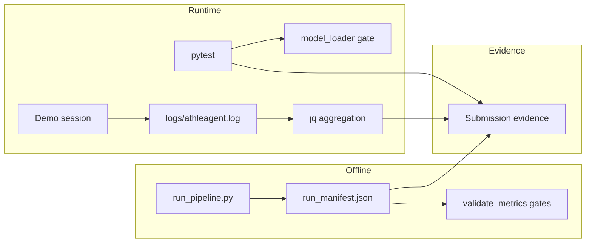

# AthleAgent — דרישות לא-פונקציונליות (NFR)


| שדה               | ערך                                                                                                                                                                                                       |
| ----------------- | --------------------------------------------------------------------------------------------------------------------------------------------------------------------------------------------------------- |
| **גרסה**          | 1.0                                                                                                                                                                                                       |
| **תאריך**         | 2026-06-20                                                                                                                                                                                                |
| **קהל יעד**       | בוחני פרויקט גמר, מפתחים, stakeholders                                                                                                                                                                    |
| **מסמכים קשורים** | [HLD_PROJECT.md](HLD_PROJECT.md) · [backend/docs/HLD.md](../backend/docs/HLD.md) · [LOGGING_HE.md](LOGGING_HE.md) · [MODEL.md](../backend/docs/MODEL.md) · [RISK_SCORE.md](../backend/docs/RISK_SCORE.md) |


---

## 1. מטרת המסמך

מסמך זה מגדיר **דרישות לא-פונקציונליות** (Non-Functional Requirements) לפרויקט AthleAgent.

כל דרישה כוללת:


| רכיב           | משמעות                                         |
| -------------- | ---------------------------------------------- |
| **מדד**        | מה מודדים (מספר, אחוז, זמן)                    |
| **יעד**        | סף מינימלי / מקסימלי להצלחה                    |
| **אופן מדידה** | כלי, לוג, סקריפט, או test                      |
| **ראיה**       | מה מציגים לבוחן (קובץ, screenshot, פלט pytest) |


> **עקרון:** אין דרישות מסוג "ידידותי למשתמש" ללא מדד. כל NFR חייב להיות **ניתן לאימות** בנתונים.

---

## 2. סיכום מנהלים — כל ה-NFRs


| ID           | קטגוריה       | מדד                                | יעד                  | עדיפות |
| ------------ | ------------- | ---------------------------------- | -------------------- | ------ |
| NFR-ML-01    | ML            | Recall@Threshold (0.18)            | ≥ 0.80               | P0     |
| NFR-ML-02    | ML            | ROC-AUC                            | ≥ 0.68               | P0     |
| NFR-ML-03    | ML            | Brier Score                        | ≤ 0.15               | P1     |
| NFR-ML-04    | ML            | Train–serve parity                 | 100%                 | P0     |
| NFR-ML-05    | ML            | Model gate (live)                  | Blocked אם gate נכשל | P0     |
| NFR-PERF-01  | ביצועים       | Latency p95 — `/predict/daily`     | < 2,000 ms           | P0     |
| NFR-PERF-02  | ביצועים       | Latency p50 — `/predict/daily`     | < 1,000 ms           | P1     |
| NFR-PERF-03  | ביצועים       | Model load (startup)               | < 5 s                | P2     |
| NFR-REL-01   | אמינות        | Success rate — `/predict/daily`    | ≥ 99%                | P0     |
| NFR-REL-02   | אמינות        | E2E prediction funnel              | ≥ 95%                | P1     |
| NFR-DQ-01    | איכות נתונים  | `prediction_confidence` ממוצע      | ≥ 55                 | P1     |
| NFR-DQ-02    | איכות נתונים  | % חיזויים confidence < 40          | < 25%                | P1     |
| NFR-DQ-03    | איכות נתונים  | `defaulted_critical` features      | ≤ 3 (rolling)        | P2     |
| NFR-SEC-01   | אבטחה         | PHI בלוגים                         | 0 מופעים             | P0     |
| NFR-SEC-02   | אבטחה         | Client event message length        | ≤ 500 תווים          | P1     |
| NFR-OBS-01   | Observability | Trace E2E (`request_id`)           | 100% בקשות HTTP      | P1     |
| NFR-OBS-02   | Observability | Log rotation                       | ≤ 50 MB סה"כ         | P2     |
| NFR-MAINT-01 | תחזוקה        | pytest pass rate                   | 100%                 | P0     |
| NFR-MAINT-02 | תחזוקה        | Contract tests (OpenAPI + columns) | 100% pass            | P1     |
| NFR-UX-01    | UX מדיד       | Time-to-insight (app → score)      | < 5 s p95            | P1     |
| NFR-UX-02    | UX מדיד       | Sync success rate                  | ≥ 90%                | P1     |


**Baseline נוכחי (מודל promoted):** run `20260512_075115` — ראו [§3.1](#31-מדדי-איכות-ml-offline).

---

## 3. איכות ML וממשל מודל

### 3.1 מדדי איכות ML (offline)

מודל production: **XGBoostDeep**, **36 פיצ'רים**. סף החלטה במודל (manifest): **0.18**; רמות UI/API: Low ≤20%, Medium 21–70%, High >70%.


| מדד                 | יעד (gate)      | Baseline (holdout) | מקור                                                   |
| ------------------- | --------------- | ------------------ | ------------------------------------------------------ |
| Recall@Threshold    | ≥ 0.80          | **0.866**          | `ML_model/artifacts/20260512_075115/run_manifest.json` |
| ROC-AUC             | ≥ 0.68          | **0.723**          | אותו manifest                                          |
| Precision@Threshold | ≥ 0.13 (policy) | **0.141**          | אותו manifest                                          |
| F1@Threshold        | ≥ 0.22 (policy) | **0.242**          | אותו manifest                                          |
| Brier Score         | ≤ 0.15          | **0.115**          | אותו manifest                                          |
| FPR@Threshold       | ≤ 0.70 (policy) | **0.651**          | אותו manifest                                          |


**Calibration (risk bins):**


| bin (finalRiskScore) | injury rate בפועל |
| -------------------- | ----------------- |
| 0–20 (green)         | 5.0%              |
| 20–50 (yellow)       | 11.4%             |
| 50–100 (red)         | 37.2%             |


> מונוטוניות: ככל שהציון גבוה יותר, שיעור הפציעות בדאטה גבוה יותר — evidence ל-calibration.

---

#### NFR-ML-01 — Recall@Threshold


|                   |                                                                  |
| ----------------- | ---------------------------------------------------------------- |
| **תיאור**         | המודל חייב לזהות רוב מקרי הפציעה (מינימום recall) בסף הפעלה 0.18 |
| **מדד**           | `Recall@Threshold`                                               |
| **יעד**           | ≥ 0.80 (hard gate בקוד); policy training: ≥ 0.85                 |
| **מדידה offline** | `ML_model/validate_metrics.py` + `run_manifest.json`             |
| **מדידה runtime** | `GET /status/ml` → `winner_metrics.Recall@Threshold`             |
| **Gate בקוד**     | `backend/ml/model_loader.py` — `MIN_RECALL_HARD = 0.80`          |
| **ראיה**          | manifest + screenshot `/status/ml` + `tests/unit/test_model_loader.py` |


---

#### NFR-ML-02 — ROC-AUC


|               |                                                       |
| ------------- | ----------------------------------------------------- |
| **תיאור**     | יכולת הבחנה כללית בין יום עם/בלי פציעה                |
| **מדד**       | `ROC-AUC`                                             |
| **יעד**       | ≥ 0.68                                                |
| **מדידה**     | holdout benchmark — `ML_model/benchmark_holdout.csv`  |
| **Gate בקוד** | `MIN_AUC_FOR_LIVE = 0.68`                             |
| **Baseline**  | 0.723                                                 |
| **ראיה**      | notebook `model_improvement_journey.ipynb` + manifest |


---

#### NFR-ML-03 — Brier Score (calibration)


|              |                                                    |
| ------------ | -------------------------------------------------- |
| **תיאור**    | הסתברויות שהמודל מחזיר קרובות לשיעור הפציעות בפועל |
| **מדד**      | Brier Score                                        |
| **יעד**      | ≤ 0.15                                             |
| **Baseline** | 0.115                                              |
| **מדידה**    | `winner_metrics.BrierScore` ב-manifest             |
| **ראיה**     | manifest + טבלת risk_bins (§3.1)                   |


---

#### NFR-ML-04 — Train–serve parity


|           |                                                 |
| --------- | ----------------------------------------------- |
| **תיאור** | אותם 36 פיצ'רים, באותו סדר, באימון וב-inference |
| **מדד**   | התאמת עמודות train vs serve                     |
| **יעד**   | 100% — אפס עמודות חסרות/עודפות                  |
| **מדידה** | `backend/tests/test_train_serve_parity.py`      |
| **ראיה**  | פלט pytest ירוק                                 |


---

#### NFR-ML-05 — Model gate (fail closed)


|                  |                                                                         |
| ---------------- | ----------------------------------------------------------------------- |
| **תיאור**        | אם המודל לא עובר gates — inference חסום; אין demo fallback ב-production |
| **מדד**          | `model_live` status                                                     |
| **יעד**          | `live: true` רק כש-manifest תקין; אחרת `Blocked` + HTTP **503**             |
| **מדידה**        | `GET /status/ml`, לוג `predict_blocked`                                 |
| **Gate reasons** | `manifest_recall_below_hard_gate`, `manifest_auc_too_low`, …            |
| **ראיה**         | `tests/integration/test_routes_predict_daily.py`, `tests/unit/test_model_loader.py`               |


---

## 4. ביצועים (Performance)

#### NFR-PERF-01 — Latency p95


|                    |                                                       |
| ------------------ | ----------------------------------------------------- |
| **תיאור**          | זמן תגובה לחיזוי יומי — חוויית בוקר                   |
| **מדד**            | `duration_ms` — percentile 95                         |
| **יעד**            | < 2,000 ms                                            |
| **Endpoint**       | `POST /predict/daily`                          |
| **מדידה**          | `logs/athleagent.log`, event `http_request_completed` |
| **Threshold בקוד** | `SLOW_MS = 2000` ב-`request_logging.py` → WARNING     |
| **ראיה**           | פלט jq (ראו [§10](#10-נספח-פקודות-מדידה))             |


---

#### NFR-PERF-02 — Latency p50


|           |                               |
| --------- | ----------------------------- |
| **תיאור** | חוויית משתמש טיפוסית          |
| **מדד**   | `duration_ms` — percentile 50 |
| **יעד**   | < 1,000 ms                    |
| **מדידה** | אותו לוג                      |
| **ראיה**  | jq aggregation                |


---

#### NFR-PERF-03 — Model load time


|           |                                            |
| --------- | ------------------------------------------ |
| **תיאור** | זמן טעינת `injury_model.pkl` בעליית השרver |
| **מדד**   | שניות מ-startup עד `model_live: true`      |
| **יעד**   | < 5 s                                      |
| **מדידה** | לוג startup / manual timing                |
| **ראיה**  | timestamp בלוג או screen recording         |


---

## 5. אמינות וזמינות (Reliability)

#### NFR-REL-01 — Prediction success rate


|            |                                                                  |
| ---------- | ---------------------------------------------------------------- |
| **תיאור**  | אחוז בקשות חיזוי שהושלמו בהצלחה                                  |
| **מדד**    | `count(status_code=200) / count(all)`                            |
| **יעד**    | ≥ 99% (מינimum 10 בקשות במדגם)                                   |
| **מדידה**  | `logs/athleagent.log` — `path="/predict/daily"`                  |
| **חריגים** | `predict_blocked` (model gate), Firestore down, missing snapshot |
| **ראיה**   | jq script + דוגמת trace                                          |


---

#### NFR-REL-02 — E2E prediction funnel


|                 |                                                                          |
| --------------- | ------------------------------------------------------------------------ |
| **תיאור**       | זרימה מלאה: sync → check-in → trigger → score מוצג                       |
| **מדד**         | `predict_daily_completed / predict_daily_started`                        |
| **יעד**         | ≥ 95%                                                                    |
| **מדידה**       | Android `client_event` (`ml_trigger`) + backend `http_request_completed` |
| **Correlation** | `request_id` משותף (ראו [LOGGING_HE.md](LOGGING_HE.md))                  |
| **ראיה**        | `./backend/scripts/trace_request.sh <request_id>`                        |


---

#### NFR-REL-03 — Graceful degradation (נתונים חסרים)


|           |                                                                     |
| --------- | ------------------------------------------------------------------- |
| **תיאור** | חיזוי רץ גם עם נתונים חלקיים; confidence משקף איכות                 |
| **מדד**   | אין crash; `prediction_confidence` יורד כש-quality נמוך             |
| **יעד**   | 0 unhandled exceptions על missing fields                            |
| **מדידה** | `test_inference_edge_cases.py`, defaults ב-`DEFAULT_FEATURE_VALUES` |
| **ראיה**  | pytest + לוג `predict_data_quality`                                 |


---

## 6. איכות נתונים (Data Quality)

`prediction_confidence` (0–100) = blend של:

- **60%** — ביטחון בהיסטוריה (`high` / `medium` / `low`, חלון 7 ימים)
- **40%** — שלמות קלט יומי (`quality_score`)

קוד: `backend/services/prediction/confidence.py`

---

#### NFR-DQ-01 — ממוצע prediction_confidence


|           |                                                     |
| --------- | --------------------------------------------------- |
| **תיאור** | רוב החיזויים מבוססים על קלט מספיק שלם               |
| **מדד**   | ממוצע `prediction_confidence`                       |
| **יעד**   | ≥ 55 (משתמש חדש עם היסטוריה חלקית ≈ 27–45)          |
| **מדידה** | Firestore export / לוג `predict_confidence_summary` |
| **ראיה**  | aggregation script או jq                            |


---

#### NFR-DQ-02 — חיזויים confidence נמוך


|           |                                          |
| --------- | ---------------------------------------- |
| **תיאור** | מעט מקרים שבהם המערכת "לא בטוחה" בקלט    |
| **מדד**   | % רשומות עם `prediction_confidence < 40` |
| **יעד**   | < 25%                                    |
| **מדידה** | Firestore / לוגים                        |
| **ראיה**  | histogram או טבלה                        |


---

#### NFR-DQ-03 — Rolling features defaults


|           |                                                                 |
| --------- | --------------------------------------------------------------- |
| **תיאור** | כמה פיצ'רים rolling (ACWR, sleep debt, HRV drop…) קיבלו default |
| **מדד**   | `defaulted_critical` (0–7)                                      |
| **יעד**   | ≤ 3 בממוצע; 7 = משתמש חדש לגמרי                                 |
| **מדידה** | לוג `predict_confidence_summary`                                |
| **ראיה**  | jq: `select(.event=="predict_confidence_summary")`              |


---

#### NFR-DQ-04 — Input completeness (same-day)


|           |                                                                                 |
| --------- | ------------------------------------------------------------------------------- |
| **תיאור** | נוכחות sleep + survey + physical yesterday לפני חיזוי                           |
| **מדד**   | % ימים עם שלושת המקורות                                                         |
| **יעד**   | ≥ 70% (בסביבת demo / pilot)                                                     |
| **מדידה** | Firestore audit: `daily_health/{D}`, `daily_checkins/{D}`, `daily_health/{D-1}` |
| **ראיה**  | script / spreadsheet                                                            |


> חוזה תאריכים: [FEATURES.md](../backend/docs/FEATURES.md) §משימות Android.

---

## 7. אבטחה ופרטיות (Security & Privacy)

#### NFR-SEC-01 — Zero PHI in logs


|           |                                                             |
| --------- | ----------------------------------------------------------- |
| **תיאור** | לוגים רושמים **אירועים**, לא נתוני בריאות                   |
| **מדד**   | 0 מופעים של: `sleepMinutes`, `heartRate`, `hrv`, `steps`, … |
| **יעד**   | 0                                                           |
| **מדידה** | grep / audit על `logs/athleagent.log`                       |
| **ראיה**  | פלט grep ריק + ציטוט [LOGGING_HE.md](LOGGING_HE.md) §1      |


---

#### NFR-SEC-02 — Client event payload limits


|                 |                                                      |
| --------------- | ---------------------------------------------------- |
| **תיאור**       | מניעת דליפת מידע ו-log flooding                      |
| **מדד**         | `len(message) ≤ 500`; אין stack traces               |
| **יעד**         | 100% compliance                                      |
| **מדידה**       | `schemas/observability.py` validation + rate limiter |
| **Rate limits** | screen 30s · action 10s · sync 15s · ml_trigger 5s   |
| **ראיה**        | `test_client_event_limiter.py`                       |


---

#### NFR-SEC-03 — Secrets not in repository


|           |                                                                                       |
| --------- | ------------------------------------------------------------------------------------- |
| **תיאור** | מפתחות Firebase / API keys לא ב-git                                                   |
| **מדד**   | 0 secrets ב-commit history (spot check)                                               |
| **יעד**   | `.gitignore` מכסה `firebase-key.json`, `.env`                                         |
| **מדידה** | `git status`, manual review                                                           |
| **הערה**  | `/predict/daily` ללא auth — documented risk; production: Firebase token (ראו HLD §10) |


---

## 8. Observability

#### NFR-OBS-01 — End-to-end traceability


|           |                                                    |
| --------- | -------------------------------------------------- |
| **תיאור** | מעקב בקשה מ-Android ל-Backend                      |
| **מדד**   | כל HTTP request (מלבד health/docs) עם `request_id` |
| **יעד**   | 100%                                               |
| **מדידה** | header `X-Request-ID`; שדה `request_id` בלוג JSON  |
| **כלי**   | `./backend/scripts/trace_request.sh <id>`          |
| **ראיה**  | trace מלא ב-[LOGGING_HE.md](LOGGING_HE.md) §7      |


---

#### NFR-OBS-02 — Log retention & size


|           |                                                     |
| --------- | --------------------------------------------------- |
| **תיאור** | לוג לא גדל ללא הגבלה                                |
| **מדד**   | גודל קובץ + גיבויים                                 |
| **יעד**   | rotation 10 MB × 5 = ≤ ~50 MB; ניקוי גיבויים 7+ יום |
| **מדידה** | `backend/utils/logging.py`, `clean_logs.py`         |
| **ראיה**  | `ls -la logs/`                                      |


---

#### NFR-OBS-03 — Domain events for ML pipeline


|            |                                                                         |
| ---------- | ----------------------------------------------------------------------- |
| **תיאור**  | אירועים מובנים לחקירת חיזוי                                             |
| **Events** | `predict_data_quality`, `predict_confidence_summary`, `predict_blocked` |
| **יעד**    | נרשם בכל חיזוי production                                               |
| **מדידה**  | `jq 'select(.event                                                      |
| **ראיה**   | דוגמת JSON ב-HLD §11                                                    |


---

## 9. תחזוקה, בדיקות ואיכות קוד

#### NFR-MAINT-01 — Automated test pass rate


|           |                                          |
| --------- | ---------------------------------------- |
| **תיאור** | regression suite עובר לפני demo / submit |
| **מדד**   | pytest exit code 0                       |
| **יעד**   | 100% pass                                |
| **Scope** | unit + integration + gates + contract    |
| **מדידה** | `cd backend && pytest`                   |
| **ראיה**  | terminal output / CI badge               |


**קבוצות בדיקות עיקריות:**


| סוג         | דוגמאות                                                        |
| ----------- | -------------------------------------------------------------- |
| Unit        | `tests/unit/test_preprocessing.py`, `tests/unit/test_prediction_service.py`          |
| Integration | `tests/integration/test_routes_predict_daily.py`, `tests/integration/test_inference_edge_cases.py` |
| Gates       | `tests/unit/test_model_loader.py`                                    |
| Contract    | `tests/unit/test_train_serve_parity.py`, `tests/integration/test_openapi_contract.py`       |


---

#### NFR-MAINT-02 — API contract stability


|           |                                                                |
| --------- | -------------------------------------------------------------- |
| **תיאור** | Response schema קבוע ל-Android                                 |
| **מדד**   | 3 שדות: `risk_score`, `risk_level`, `prediction_confidence`    |
| **יעד**   | 100% התאמה ל-OpenAPI + Firestore mapping                       |
| **מדידה** | `tests/integration/test_prediction_model_columns.py`, `tests/integration/test_openapi_contract.py` |
| **ראיה**  | pytest                                                         |


---

#### NFR-MAINT-03 — Modular deployment


|           |                                                        |
| --------- | ------------------------------------------------------ |
| **תיאור** | Backend stateless; ML artifacts נפרדים; הרצה ב-Docker או Python מקומי |
| **מדד**   | promote model בלי deploy קוד — restart container או uvicorn |
| **יעד**   | `ML_model/run_pipeline.py` → `promoted.json` → `docker compose up --build` או restart |
| **מדידה** | manual / documented procedure |
| **ראיה**  | [MODEL.md](../backend/docs/MODEL.md) · [DOCKER.md](DOCKER.md) |


---

## 10. UX מדיד (לא סубייקטיבי)

דרישות "חוויית משתמש" שמבוססות על **זמנים, שיעורי הצלחה ו-funnel** — לא על דעה.

#### NFR-UX-01 — Time-to-insight


|           |                                                                         |
| --------- | ----------------------------------------------------------------------- |
| **תיאור** | זמן מפתיחת Dashboard עד הצגת `finalRiskScore`                           |
| **מדד**   | Δt בין `screen_view: Dashboard` ל-`ml_trigger: predict_daily_completed` |
| **יעד**   | < 5 s (p95)                                                             |
| **מדידה** | client events + Firestore read latency                                  |
| **ראיה**  | trace לפי `request_id`                                                  |


---

#### NFR-UX-02 — Wearable sync success


|           |                                                   |
| --------- | ------------------------------------------------- |
| **תיאור** | סנכרון Health Connect מסתיים בהצלחה               |
| **מדד**   | `sync_completed / (sync_completed + sync_failed)` |
| **יעד**   | ≥ 90%                                             |
| **מדידה** | Android `client_event` type `sync`                |
| **ראיה**  | jq על לוג מאוחד                                   |


---

#### NFR-UX-03 — Morning flow completion


|           |                                          |
| --------- | ---------------------------------------- |
| **תיאור** | משתמש מסיים sync + check-in + רואה score |
| **מדד**   | funnel 3 שלבים                           |
| **יעד**   | ≥ 80% (pilot עם ≥ 5 משתמשים)             |
| **מדידה** | ידני: spreadsheet / client events        |
| **ראיה**  | טבלת pilot                               |


---

#### NFR-UX-04 — Error recovery


|           |                                          |
| --------- | ---------------------------------------- |
| **תיאור** | retry אחרי sync/predict failure          |
| **מדד**   | % failures עם success ב-retry תוך 5 דקות |
| **יעד**   | ≥ 70%                                    |
| **מדידה** | client events                            |
| **ראיה**  | trace דוגמה                              |


---

## 11. Scope ומגבלות (Out of Scope)


| נושא                               | מצב          | הערה                                         |
| ---------------------------------- | ------------ | -------------------------------------------- |
| **Availability 99.9%**             | לא נדרש      | single instance dev/demo                     |
| **Horizontal scale**               | לא נמדד      | FastAPI stateless — תיאורטית scalable        |
| **Auth על `/predict/daily`**       | known gap    | מתועד ב-HLD §10; NFR production עתידי        |
| **Real-user injury feedback loop** | offline בלבד | label מ-`injuredYesterday` ב-dataset builder |


---

## 12. תהליך אימות (Verification Process)




**לפני הגשה / מצגת:**

1. הרץ `pytest` — שמור פלט
2. הרץ 10+ חיזויים — אסוף latency + success rate
3. צלם `/status/ml` — הצג metrics
4. הרץ trace E2E אחד — `./backend/scripts/trace_request.sh`
5. audit PHI — grep על לוג
6. צרף baseline מ-§3.1 לדוח ההגשה

---

## 13. נספח — פקודות מדידה

### Latency — `/predict/daily`

```bash
# p50, p95, count
jq -s '
  [.[] | select(.path=="/predict/daily" and .duration_ms != null) | .duration_ms]
  | sort
  | . as $a
  | {
      count: ($a | length),
      p50: $a[(($a | length) * 0.50) | floor],
      p95: $a[(($a | length) * 0.95) | floor]
    }
' logs/athleagent.log
```

### Success rate

```bash
jq -s '
  [.[] | select(.path=="/predict/daily")]
  | {
      total: length,
      success: [.[] | select(.status_code == 200)] | length,
      rate: (if length > 0 then ([.[] | select(.status_code == 200)] | length) / length else 0 end)
    }
' logs/athleagent.log
```

### Slow requests (> 2s)

```bash
jq 'select(.path=="/predict/daily" and .duration_ms > 2000)' logs/athleagent.log
```

### Prediction confidence events

```bash
jq 'select(.event=="predict_confidence_summary")' logs/athleagent.log
```

### PHI audit (צריך להחזיר 0)

```bash
rg -i "sleepMinutes|heartRate|hrv|steps|calories" logs/athleagent.log | wc -l
```

### Model status

```bash
curl -s http://localhost:8000/status/ml | jq .
```

### Full test suite

```bash
cd backend && pytest -q
```

---

## 14. מפת מסמכים


| מסמך                                                                                     | קשר ל-NFR                        |
| ---------------------------------------------------------------------------------------- | -------------------------------- |
| [DOCKER.md](DOCKER.md)                                                                   | הרצת backend + ML לבוחנים        |
| [MODEL.md](../backend/docs/MODEL.md)                                                     | gates, promote, threshold        |
| [RISK_SCORE.md](../backend/docs/RISK_SCORE.md)                                           | confidence formula, risk bins    |
| [FEATURES.md](../backend/docs/FEATURES.md)                                               | data completeness contract       |
| [LOGGING_HE.md](LOGGING_HE.md)                                                           | observability, trace, PHI policy |
| [HLD §13](../backend/docs/HLD.md)                                                        | SLOs מקוריים                     |
| [model_improvement_journey.ipynb](../ML_model/notebooks/model_improvement_journey.ipynb) | ML narrative + graphs            |


---

## 15. Changelog


| גרסה | תאריך      | שינוי                                             |
| ---- | ---------- | ------------------------------------------------- |
| 1.0  | 2026-06-20 | מסמך ראשון — 21 NFRs עם baseline מ-promoted model |
| 1.1  | 2026-06-20 | NFR-MAINT-03 — הוספת Docker; מפת מסמכים |


---

*מסמך זה משלים את [HLD_PROJECT.md §2.2](HLD_PROJECT.md) — שם סיכום קצר; כאן הגדרה מלאה, מדידה וראיה.*