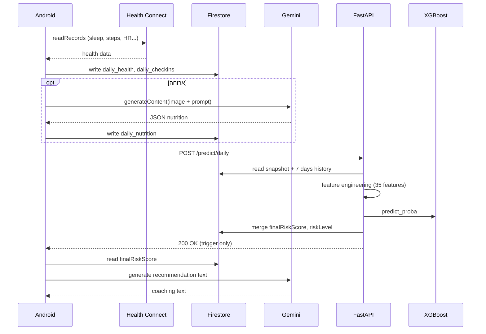
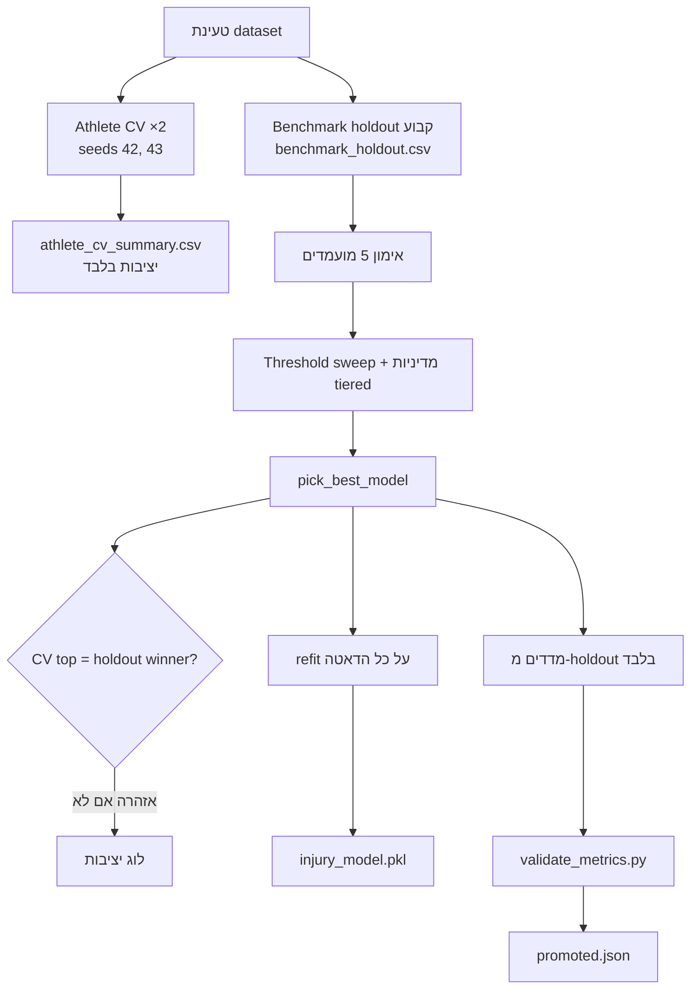
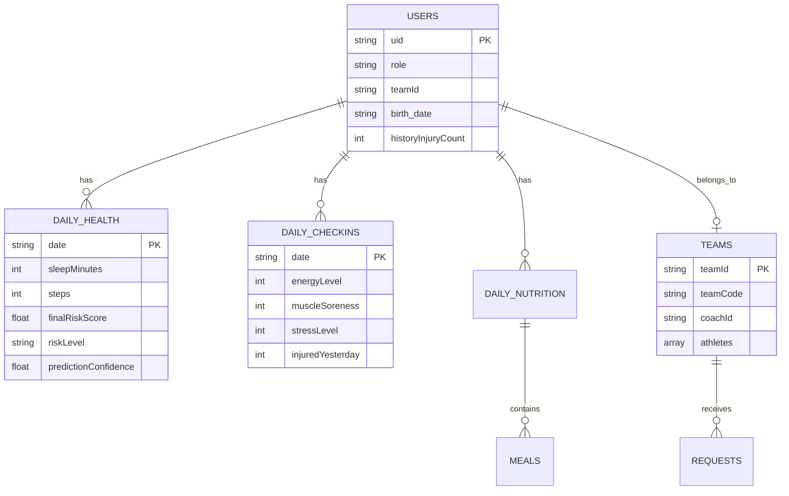

# AthleAgent — ספר פרויקט

| שדה | ערך |
|-----|-----|
| **שם הפרויקט** | AthleAgent — פלטפורמה למניעת פציעות בספורטאים |
| **מגישים** | יהב סימון · צוף פלדון |
| **מנחה** | מר איל איזנשטיין |
| **מחלקה** | מדעי המחשב |
| **תאריך** | יולי 2026 |
| **גרסת מסמך** | 1.0 |

---

## תוכן עניינים

1. [תקציר ומטרת הפרויקט](#1-תקציר-ומטרת-הפרויקט)
2. [סיפור הפרויקט](#2-סיפור-הפרויקט)
3. [שחקנים ודיאגרמת Use Case](#3-שחקנים-ודיאגרמת-use-case)
4. [דרישות מערכת (SRS)](#4-דרישות-מערכת-srs)
5. [אינטגרציות לממשקים חיצוניים](#5-אינטגרציות-לממשקים-חיצוניים)
6. [ארכיטקטורה כללית](#6-ארכיטקטורה-כללית)
7. [מסע האלגוריתם — איך הגענו למודל](#7-מסע-האלגוריתם--איך-הגענו-למודל)
8. [פירוט האלגוריתם והמודל](#8-פירוט-האלגוריתם-והמודל)
9. [תכונות מחלקות ורכיבים](#9-תכונות-מחלקות-ורכיבים)
10. [סיפורי באגים, תקלות וקשיים](#10-סיפורי-באגים-תקלות-וקשיים)
11. [מודל נתונים](#11-מודל-נתונים)
12. [בדיקות ואיכות](#12-בדיקות-ואיכות)
13. [מגבלות, סיכונים ו-Roadmap](#13-מגבלות-סיכונים-ו-roadmap)
14. [נספחים](#14-נספחים)

---

## 1. תקציר ומטרת הפרויקט

### 1.1 הבעיה

פציעות בספורט נובעות לרוב משילוב של **עומס אימון**, **התאוששות לקויה** (שינה, HRV), **תזונה** ו**סטרס** — אך הנתונים מפוזרים בין שעונים חכמים, אפליקציות תזונה ויומני אימון. רוב הפתרונות בתעשייה הם **תגובתיים**: טיפול מתחיל **אחרי** שהפציעה כבר קרתה.

### 1.2 המטרה

**AthleAgent** שואפת לעבור מטיפול תגובתי בפציעות ל**מניעה** — באמצעות **ציון סיכון יומי לפציעה** (Daily Injury Risk Score, 0–100%) שמאחד את כל מקורות הקלט לתמונה אחת, לספורטאי ולמאמן.

### 1.3 מדדי הצלחה

| מטרה | מדד |
|------|-----|
| זיהוי מוקדם של סיכון | ציון יומי + רמת Low / Medium / High |
| הפחתת עומס ידני | סנכרון אוטומטי משעון + ניתוח ארוחות ב-AI |
| שקיפות למאמן | דשבורד קבוצתי בזמן אמת |
| אמינות | `prediction_confidence` נפרד מהסיכון; ML gates לפני שרת חיזוי |
| שיפור מתמשך | pipeline אימון offline (`run_pipeline.py`) + promote |

### 1.4 משפט מפתח

> *מעבר מטיפול תגובתי בפציעות ל**מניעה**.*

---

## 2. סיפור הפרויקט

### 2.1 נקודת ההתחלה

הפרויקט נולד מהזיהוי שספורטאי חובב או מקצוען מתמודד כל בוקר עם שאלה מעשית: *האם בטוח לאמן היום?* התשובה תלויה בנתונים שמפוזרים — Garmin מראה עומס, אפליקציית שינה מראה חוב, והמאמן רואה רק חלק מהתמונה. רצינו לבנות **מקור אמת אחד** שמחבר הכל ומפיק החלטה נתמכת-נתונים.

### 2.2 כיוון הפתרון

בחרנו בארכיטקטורת **שלוש שכבות**:

1. **אפליקציית Android** — איסוף נתונים, UX, אינטגרציה עם Health Connect ו-Gemini.
2. **שרת FastAPI** — הנדסת פיצ'רים, inference של מודל ML, כתיבה חזרה ל-Firestore.
3. **Pipeline ML offline** — יצירת דאטה סינתטי, אימון, validation ו-promotion.

עקרון מרכזי שעיצב את כל ההחלטות: **Firestore כ-Source of Truth** — האפליקציה כותבת נתונים, מפעילה חיזוי, והדשבורד **קורא את התוצאה מ-Firestore** (לא מה-response של ה-API).

### 2.3 אבני דרך

| שלב | מה הושג |
|-----|---------|
| MVP | סקר יומי + חיזוי בסיסי |
| אינטגרציה | Health Connect (21 מדדים פיזיים), Firebase Auth + Firestore |
| AI | ניתוח ארוחות ב-Gemini Vision, המלצות טקסט בדשבורד |
| ML | 35 פיצ'רים, XGBoost, gates (Recall ≥ 80%, AUC ≥ 0.68) |
| מאמן | יצירת קבוצה, אישור בקשות, דשבורד קבוצתי |
| אמינות | cross-trigger, confidence score, train-serve parity tests |
| DevOps | Docker, ~150+ בדיקות pytest, observability |

---

## 3. שחקנים ודיאגרמת Use Case

### 3.1 שחקנים (Actors)

| שחקן | תיאור | אינטראקציה עיקרית |
|------|--------|-------------------|
| **ספורטאי (Athlete)** | משתמש קצה שמזין נתונים וצופה בסיכון אישי | סנכרון שעון, סקר, ארוחה, דשבורד |
| **מאמן (Coach)** | מנהל קבוצה ועוקב אחר סיכון הרשימה | יצירת קבוצה, אישור בקשות, דשבורד קבוצתי |
| **מערכת Firebase** | שירות ענן לאימות ואחסון | Auth + Firestore |
| **Health Connect** | גשר Google לנתוני wearables | קריאת שינה, עומס, דופק, HRV |
| **Google Gemini** | מודל AI לראייה וטקסט | ניתוח ארוחות, המלצות בדשבורד ספורטאי ומאמן |
| **שרת AthleAgent (Backend)** | שירות ML inference | `POST /predict/daily` |
| **מערכת ML (Offline)** | pipeline אימון | `run_pipeline.py` — לא בזמן ריצה של האפליקציה |

### 3.2 דיאגרמת Use Case

```mermaid
usecaseDiagram
    %% Primary Actors (Left Side)
    actor Athlete as "ספורטאי\n(Athlete)"
    actor Coach as "מאמן\n(Coach)"

    %% Secondary External Actors (Right Side)
    actor Firebase as "Firebase Cloud\n(Auth & Firestore)"
    actor HealthConnect as "Google Health Connect\n(OS Wearables API)"
    actor GeminiAI as "Google Gemini API\n(LLM & Vision)"
    actor Backend as "AthleAgent Backend\n(FastAPI ML Inference)"

    %% System Boundary
    rectangle "AthleAgent System Platform" {
        %% Core Shared Use Cases
        usecase UC_Auth as "הרשמה / התחברות\nוניתוב לפי תפקיד"

        %% Athlete Specific Use Cases
        usecase UC_Sync as "סנכרון שעון חכם\n(Health Connect)"
        usecase UC_Survey as "מילוי סקר יומי\n(Check-In)"
        usecase UC_Meal as "צילום וניתוח ארוחה\n(Gemini Vision)"
        usecase UC_Predict as "חיזוי סיכון פציעה יומי\n(ML Inference)"
        usecase UC_Dash as "צפייה בציון סיכון\nוהמלצות (דשבורד)"
        usecase UC_Join as "הצטרפות לקבוצה\n(קוד הצטרפות)"

        %% Coach Specific Use Cases
        usecase UC_Team as "יצירת קבוצה\n(הפקת קוד)"
        usecase UC_Approve as "אישור / דחיית בקשות\n(Roster)"
        usecase UC_CoachDash as "דשבורד מאמן\n(סיכון קבוצתי)"

        %% Conditional cross-trigger (not mandatory include)
        UC_Sync -.->|"cross-trigger"| UC_Predict
        UC_Survey -.->|"cross-trigger"| UC_Predict
    }

    %% Actor to Use Case Associations
    Athlete --> UC_Auth
    Athlete --> UC_Sync
    Athlete --> UC_Survey
    Athlete --> UC_Meal
    Athlete --> UC_Dash
    Athlete --> UC_Join

    Coach --> UC_Auth
    Coach --> UC_Team
    Coach --> UC_Approve
    Coach --> UC_CoachDash

    %% Use Case to External Systems Associations
    UC_Auth --> Firebase

    UC_Sync --> HealthConnect
    UC_Sync --> Firebase

    UC_Survey --> Firebase

    UC_Meal --> GeminiAI
    UC_Meal --> Firebase

    UC_Predict --> Backend
    Backend --> Firebase

    UC_Dash --> Firebase
    UC_Dash --> GeminiAI

    UC_Join --> Firebase

    UC_Team --> Firebase
    UC_Approve --> Firebase

    UC_CoachDash --> Firebase
    UC_CoachDash --> GeminiAI
```

> **הערות לדיאגרמה:**
> - **cross-trigger** — חיזוי ML מופעל רק כאשר גם נתוני שעון וגם סקר יומי קיימים ותקינים; זה לא `<<include>>` חובה.
> - **ארוחה** שומרת תזונה ב-Firestore בלבד — אינה מפעילה חיזוי ישירות.
> - **Backend** מבצע inference (`POST /predict/daily`) וקורא/כותב Firestore; האפליקציה מציגה את `finalRiskScore` מ-Firestore.
> - **ML Pipeline offline** (`run_pipeline.py`) אינו מופיע — לא use case בזמן ריצה של האפליקציה.

### 3.3 תרחישי שימוש עיקריים

#### UC-01: זרימה יומית של ספורטאי

1. סנכרון Health Connect בבוקר (שינה → היום, עומס → אתמול).
2. מילוי סקר (אנרגיה, סטרס, כאב שרירים, פציעה אתמול).
3. *(אופציונלי)* צילום ארוחה → Gemini מחלץ קלוריות ומאקרו.
4. cross-trigger מפעיל `POST /predict/daily`.
5. Backend קורא Firestore → 35 פיצ'רים → XGBoost → כותב `finalRiskScore`.
6. דשבורד מציג ציון, גרף היסטוריה והמלצת Gemini.

#### UC-02: ניהול קבוצה על ידי מאמן

1. מאמן יוצר קבוצה ומקבל קוד הצטרפות.
2. ספורטאים שולחים בקשות הצטרפות.
3. מאמן מאשר/דוחה.
4. דשבורד מאמן מציג סיכון יומי לכל ספורטאי בקבוצה; Gemini מייצר המלצת אימון קצרה לפי נתוני הספורטאי (אם חסרה ב-Firestore).

---

## 4. דרישות מערכת (SRS)

מסמך זה משלב מבנה **SRS** (Software Requirements Specification) עם תוספות פרויקט גמר: סיפור, מסע ML, באגים ואינטגרציות.

### 4.1 דרישות פונקציונליות

| מזהה | דרישה | עדיפות | מימוש |
|------|--------|--------|-------|
| FR-01 | הרשמה והתחברות (אימייל + Google) | חובה | `LoginActivity`, `RegisterActivity`, Firebase Auth |
| FR-02 | routing לפי תפקיד (athlete / coach) | חובה | `LoginActivity` → `users.role` |
| FR-03 | סנכרון נתוני wearables דרך Health Connect | חובה | `WearableSyncActivity` |
| FR-04 | סקר יומי (4 שדות) | חובה | `DailyCheckInActivity` |
| FR-05 | ניתוח ארוחה מתמונה (AI) | רצוי | `AnalyzingMealActivity` + Gemini |
| FR-06 | חיזוי סיכון פציעה יומי | חובה | `POST /predict/daily` |
| FR-07 | הצגת ציון סיכון, רמה והיסטוריה | חובה | `AthleteDashboardActivity` |
| FR-08 | המלצות טקסט מותאמות לסיכון | רצוי | Gemini ב-`AthleteDashboardActivity` |
| FR-09 | יצירת קבוצה וניהול בקשות | חובה | `CreateTeamActivity`, `CoachRequestsActivity` |
| FR-10 | דשבורד מאמן — סיכון קבוצתי | חובה | `CoachDashboardActivity` |
| FR-11 | הצטרפות לקבוצה בקוד | חובה | `JoinTeamActivity` |
| FR-12 | הצגת `prediction_confidence` | חובה | Backend + Firestore |

### 4.2 דרישות לא-פונקציונליות

| מזהה | דרישה | יישום |
|------|--------|-------|
| NFR-01 | חיזוי < 2 שניות | FastAPI stateless + XGBoost in-process |
| NFR-02 | זמינות | Firestore managed + backend stateless |
| NFR-03 | אמינות בנתונים חסרים | defaults ניטרליים + confidence |
| NFR-04 | ML gates | Recall ≥ 0.80, AUC ≥ 0.68 — `model_loader.py` |
| NFR-05 | train-serve parity | `test_train_serve_parity.py` |
| NFR-06 | פרטיות | ללא PHI בלוגים; Gemini client-side |
| NFR-07 | תחזוקה | הפרדת Android / Backend / ML_model |

### 4.3 דרישות ממשק (חיצוניות)

ראו [סעיף 5](#5-אינטגרציות-לממשקים-חיצוניים) — נדרשת שליטה מלאה בחיבורים ל-Firebase, Health Connect, Gemini ו-Retrofit.

### 4.4 מגבלות מוצר

- **לא אבחון רפואי** — כלי תמיכה להחלטות, לא מחליף איש מקצוע.
- **דאטה אימון סינתטי** — אין מספיק דאטה אמיתי מתויג לכל יום.
- **אין auth על API חיזוי** — מגבלת scope; מתועד כסיכון.

---

## 5. אינטגרציות לממשקים חיצוניים

> **דרישת הקורס:** להיות בקיאים בחיבורים לממשקים חיצוניים. להלן פירוט מלא לפי הפרויקט.

### 5.1 סיכום אינטגרציות

| שירות | פרוטוקול | כיוון | מיקום בקוד | תפקיד |
|-------|----------|-------|------------|-------|
| **Firebase Auth** | SDK | Client → Google | `LoginActivity.kt` | אימות משתמשים |
| **Cloud Firestore** | SDK | Client ↔ Cloud, Backend ↔ Cloud | Activities, `history/repository.py` | אחסון כל הנתונים |
| **Health Connect** | Android SDK | Device → Client | `WearableSyncActivity.kt` | שינה, עומס, דופק, HRV... |
| **Google Gemini** | REST/SDK | Client → Google | `AnalyzingMealActivity.kt`, `AthleteDashboardActivity.kt` | Vision + Text |
| **FastAPI Backend** | HTTP/JSON (Retrofit) | Client → Server | `ApiClient.kt`, `ApiService.kt` | trigger חיזוי |
| **Firebase Admin** | SDK | Server → Google | `history/firestore_client.py` | קריאה/כתיבה ל-Firestore |
| **XGBoost** | in-process (joblib) | Server פנימי | `prediction/service.py` | inference |

### 5.2 Firebase Authentication

**זרימה:**
1. משתמש מתחבר באימייל/סיסמה או Google Sign-In.
2. Firebase מחזיר `uid`.
3. האפליקציה קוראת `users/{uid}` מ-Firestore לקבלת `role`.
4. ניתוב ל-`HomeAthleteActivity` או `HomeCoachActivity`.

**קבצים:** `LoginActivity.kt`, `RegisterActivity.kt`, `logic/LoginManager.kt`

### 5.3 Cloud Firestore

**עקרון:** כל הנתונים היומיים + תוצאות חיזוי נשמרים ב-Firestore. ה-UI **לא** מסתמך על response body של API לתצוגת ציון.

**נתיבים עיקריים:**

| נתיב | כותב | קורא |
|------|------|------|
| `users/{uid}` | אפליקציה | אפליקציה, Backend |
| `users/{uid}/daily_health/{date}` | אפליקציה + Backend | אפליקציה, Backend |
| `users/{uid}/daily_checkins/{date}` | אפליקציה | Backend |
| `users/{uid}/daily_nutrition/{date}` | אפליקציה | Backend |
| `teams/{teamId}` | מאמן | אפליקציה |

### 5.4 Health Connect

**הרשאות:** 19 סוגי רשומות (שינה, צעדים, מרחק, דופק, HRV, VO2max, SpO2 ועוד).

**מדיניות date-split (קריטי):**

| נתון | תאריך ב-Firestore | סיבה |
|------|-------------------|------|
| שינה (`sleepMinutes`) | `daily_health/{D}` | הלילה שזה עתה נגמר |
| עומס פיזי (צעדים, HRV...) | `daily_health/{D-1}` | יום מלא אתמול |
| סקר | `daily_checkins/{D}` | מצב נפשי הבוקר |
| תזונה | `daily_nutrition/{D-1}` | צריכה אתמול |

**קובץ:** `WearableSyncActivity.kt`

### 5.5 Google Gemini API

**שני שימושים — שניהם client-side:**

| שימוש | Activity | מודל | קלט | פלט |
|-------|----------|------|-----|-----|
| ניתוח ארוחה | `AnalyzingMealActivity` | `gemini-2.5-flash` | Bitmap + prompt | JSON: calories, protein, carbs |
| המלצות | `AthleteDashboardActivity` | `gemini-2.5-flash` | ציון סיכון + הקשר | טקסט המלצה |

**הגדרות:**
- API Key: `BuildConfig.GEMINI_API_KEY` ← `local.properties`
- `temperature = 0.0f` לניתוח ארוחות (דטרמיניסטי)

**הערה:** Gemini **לא** רץ בבקאנד — מפתח קיים ב-`config.py` אך אין routes.

### 5.6 FastAPI Backend (Retrofit)

**חוזה HTTP:**

```kotlin
@POST("/predict/daily")
fun getDailyPrediction(@Body data: PredictionTriggerRequest): Call<PredictionResponse>
```

- **Base URL (אמולטור):** `http://10.0.2.2:8000/`
- **Body:** `{ userId, date }`
- **Response:** `{ risk_level, risk_score, prediction_confidence }` — האפליקציה בודקת רק `isSuccessful`; התצוגה מ-Firestore.

**Endpoints נוספים:**

| Method | Path | תפקיד |
|--------|------|-------|
| GET | `/health` | liveness |
| GET | `/status/ml` | Live / Blocked |
| POST | `/api/v1/observability/client-events` | telemetry מאנדרואיד |

### 5.7 דיאגרמת רצף — אינטגרציה מלאה



---

## 6. ארכיטקטורה כללית

### 6.1 שלוש שכבות

```
┌─────────────────────────────────────────────────────────┐
│  שכבת לקוח — Android (Kotlin)                           │
│  Activities + View Binding + Retrofit + Firestore SDK   │
└────────────────────────┬────────────────────────────────┘
                         │ HTTP + Firestore
┌────────────────────────▼────────────────────────────────┐
│  שכבת שירות — FastAPI (Python)                          │
│  Prediction · History · Preprocessing · ML Loader     │
└────────────────────────┬────────────────────────────────┘
                         │ Firestore Admin SDK
┌────────────────────────▼────────────────────────────────┐
│  שכבת נתונים — Cloud Firestore                          │
└─────────────────────────────────────────────────────────┘

┌─────────────────────────────────────────────────────────┐
│  ML Pipeline (offline) — ML_model/                      │
│  data_generator → train_model → run_pipeline → promote  │
└─────────────────────────────────────────────────────────┘
```

### 6.2 מבנה Repository

```
final_project_AthleAgent/
├── android_app/AthleAgent/     # אפליקציית Android
├── backend/                    # FastAPI inference service
├── ML_model/                   # Training pipeline + artifacts
├── docs/                       # תיעוד פרויקט
└── README.md
```

### 6.3 Tech Stack

| שכבה | טכנולוגיות |
|------|------------|
| Mobile | Kotlin, Activities, View Binding, Material, Retrofit, MPAndroidChart |
| Cloud | Firebase Auth, Cloud Firestore |
| Backend | Python, FastAPI, Uvicorn, Pydantic, firebase-admin |
| ML | XGBoost, scikit-learn, pandas, joblib |
| AI | Google Gemini (client-side) |
| Health | Google Health Connect SDK |
| DevOps | Docker, pytest, GitHub Actions |

---

## 7. מסע האלגוריתם — איך הגענו למודל

### 7.1 נקודת פתיחה — הבעיה בדאטה

אין לנו מאגר ציבורי גדול של ספורטאים עם תיוג יומי "נפצע / לא נפצע". לכן בנינו **דאטה סינתטי** ב-`data_generator.py`:

- 1,000 ספורטאים × 365 יום ≈ **359,000 שורות**
- מודל סיכון מבוסס מחקר ספורט:
  - **ACWR > 1.4** (Gabbett, 2016)
  - חוב שינה מצטבר
  - ירידת HRV
  - סטרס גבוה + עומס
  - Cooldown אחרי פציעה

### 7.2 למה לא התחלנו עם XGBoost בלבד?

הגישה הייתה **השוואת מועמדים** ולא "לקחת אלגוריתם אחד":

| מועמד | תפקיד |
|-------|-------|
| `LogisticRegression` | Baseline ליניארי (עם scaling) |
| `RandomForest` | Bagging ensemble |
| `GradientBoosting` | sklearn boosting |
| `XGBoostCalibratedTuned` | XGB + כיול sigmoid |
| `XGBoostDeep` | XGB עמוק יותר — חלופה ל-Recall גבוה |

### 7.3 פרוטוקול בחירה (5 שלבים)



**עקרונות מניעת דליפה (leakage):**
- Holdout לפי `athlete_id` — כל ימי ספורטאי באותו צד.
- פיצ'רים מתגלגלים (ACWR, sleep_debt) מחושבים **לפני** הפיצול.
- מדדי promotion מה-holdout; המודל לפרודקשן מאומן מחדש על **כל** השורות.

### 7.4 אבני דרך במסע

| שלב | תובנה |
|-----|-------|
| Baseline LR | AUC נמוך — קשרים לא-ליניאריים חשובים |
| Random Forest | טוב אך פחות כיול הסתברויות |
| XGBoost רגיל | Recall גבוה, Brier גבוה |
| **XGBoostCalibratedTuned** | איזון: Recall > 80%, AUC ~0.79, Brier ~0.11 |
| Gates | Backend חוסם מודל שלא עובר Recall/AUC |

### 7.5 מודל promoted נוכחי

| פרמטר | ערך |
|-------|-----|
| Run ID | `20260629_184034` |
| Winner | `XGBoostCalibratedTuned` |
| Threshold | 0.10 |
| Recall@Threshold | **81.1%** |
| ROC-AUC | **0.793** |
| Brier Score | **0.113** |
| שורות אימון | 359,000 |

---

## 8. פירוט האלגוריתם והמודל

### 8.1 מה המודל חוזה?

**מטרת החיזוי:** הסתברות לפציעה **היום** (יום D), בבוקר — לפני איסוף עומס של היום.

**פלט:**
1. `risk_score` — הסתברות 0–1 (`predict_proba` class 1)
2. `finalRiskScore` — אותו ערך × 100 (0–100%) — מה שהמשתמש רואה
3. `risk_level` — Low / Medium / High
4. `prediction_confidence` — איכות הקלט (לא הסיכון!)

### 8.2 רמות סיכון (Production)

| רמה | טווח `finalRiskScore` | צבע UI |
|-----|----------------------|--------|
| Low | 0–20% | ירוק |
| Medium | 21–70% | צהוב/כתום |
| High | 71–100% | אדום |

קוד: `backend/services/risk_levels.py`

### 8.3 35 הפיצ'רים

| קטגוריה | פיצ'רים |
|---------|---------|
| פרופיל | `bmi`, `age`, `body_fat_pct`, `vo2_max`, `history_injury_count` |
| עומס | `daily_distance_km`, `workout_intensity_minutes`, `avg_cadence`, `elevation_gained_m`, `floors_climbed`, `avg_speed`, `max_speed`, `avg_power`, `active_calories_burned` |
| התאוששות | `sleep_hours`, `hrv_score`, `resting_hr`, `respiratory_rate`, `spo2` |
| תזונה | `nutrition_intake_calories`, `daily_calories`, `total_calories_burned`, `calorie_balance` |
| סובייקטיבי | `stress_level`, `muscle_soreness`, `energy_level`, `injured_yesterday` |
| מנוע (engineered) | `acute_load_7d`, `acwr_ratio`, `acwr_ratio_ma7`, `sleep_hours_ma7`, `sleep_debt_3d`, `hrv_drop`, `load_recovery_imbalance`, `speed_intensity_ratio` |

מקור אמת: `backend/data/model_feature_contract.json`

### 8.4 Top 5 פיצ'רים לפי חשיבות

| # | פיצ'ר | משמעות | חשיבות משוערת |
|---|-------|--------|---------------|
| 1 | `hrv_drop` | ירידה ב-HRV לעומת ממוצע 7 ימים | ~28% |
| 2 | `stress_level` | סטרס מהסקר | ~14% |
| 3 | `sleep_debt_3d` | חוב שינה 3 ימים | ~11% |
| 4 | `injured_yesterday` | פציעה אתמול | ~9% |
| 5 | `load_recovery_imbalance` | עומס גבוה בלי התאוששות | ~7% |

### 8.5 Pipeline חיזוי (Backend)

```
POST /predict/daily {userId, date}
    │
    ├─ fetch_daily_firestore_snapshot()
    │     profile, health{D}, health{D-1}, checkins{D}, nutrition{D-1}
    │
    ├─ injury_prediction_request_from_firestore_snapshot()
    │     מדיניות date-split + nutrition defaults
    │
    ├─ injury_request_to_model_dataframe()
    │     preprocessing + feature_engineering
    │
    ├─ apply_history_confidence_fallback()
    │     rolling 7 ימים: ACWR, sleep_debt, hrv_drop
    │
    ├─ calculate_data_quality_score()
    │     prediction_confidence = 0.6×history + 0.4×quality
    │
    ├─ model.predict_proba() → proba
    │     classify_risk_level(proba)
    │
    └─ save_daily_prediction_result()
          merge → daily_health/{date}
```

### 8.6 ML Gates (Live)

הבקאנד **לא משרת** חיזוי אם המודל לא עובר:

| Gate | סף | קובץ |
|------|-----|------|
| Recall@Threshold | ≥ 0.80 | `model_loader.py` |
| ROC-AUC | ≥ 0.68 | `model_loader.py` |

בדיקה: `GET /status/ml` → `"status": "Live"` או `"Blocked"`

### 8.7 כיול לפי רמות (Holdout)

| רמת ציון | % דגימות | שיעור פציעה בפועל |
|----------|----------|-------------------|
| ירוק (0–20%) | רוב הימים | ~9% |
| צהוב (20–50%) | בינוני | ~31% |
| אדום (50–100%) | מיעוט | ~65% |

→ כשהציון גבוה, באמת יש יותר פציעות — המודל מכויל.

### 8.8 Recall גבוה, Precision נמוך — בכוונה

במניעת פציעות עדיף **להזהיר מוקדם** (False Positive) מאשר לפספס פציעה (False Negative). Recall של ~81% אומר שרוב ימי הסיכון האמיתיים מזוהים; Precision של ~29% אומר שחלק מההתראות יהיו "יתר על המידה" — trade-off מקובל בתחום מניעה.

---

## 9. תכונות מחלקות ורכיבים

### 9.1 Android — Activities

| מחלקה | חבילה | אחריות | Firestore / API |
|-------|--------|--------|-----------------|
| `App` | root | אתחול `Timber`, `ClientEventReporter` | — |
| `LoginActivity` | auth | Firebase Auth, routing לפי role | `users/{uid}` read |
| `RegisterActivity` | auth | הרשמה email/password | `users/{uid}` create |
| `MainActivity` | auth | מסך פתיחה / ניתוב | — |
| `HomeAthleteActivity` | athlete | Hub ניווט, התראות יומיות | read today docs |
| `DailyCheckInActivity` | athlete | סקר 4 שדות + cross-trigger | `daily_checkins/{today}` |
| `WearableSyncActivity` | athlete | Health Connect read/write + cross-trigger | `daily_health/{today}`, `{D-1}` |
| `AnalyzingMealActivity` | athlete | Gemini Vision על תמונה | — |
| `MealAnalysisActivity` | athlete | שמירת ארוחה ואגרגטים | `daily_nutrition/{today}` |
| `AthleteDashboardActivity` | athlete | מחוון סיכון, גרף, Gemini המלצות | `daily_health/*` |
| `JoinTeamActivity` | athlete | הצטרפות בקוד קבוצה | `teams/*/requests/{uid}` |
| `HomeCoachActivity` | coach | Hub + badge בקשות ממתינות | `teams`, `requests` |
| `CreateTeamActivity` | coach | יצירת קבוצה | `teams/{id}` |
| `CoachRequestsActivity` | coach | אישור/דחיית בקשות | `teams/*/requests`, `users.teamId` |
| `CoachDashboardActivity` | coach | דשבורד סיכון קבוצתי | athletes' `daily_health` |
| `PrivacyPolicyActivity` | ui | מדיניות פרטיות + הרשאות | — |

### 9.2 Android — Network & Observability

| מחלקה | אחריות |
|-------|--------|
| `ApiClient` | Retrofit singleton, base URL `10.0.2.2:8000` |
| `ApiService` | `POST /predict/daily`, DTOs |
| `ClientEventReporter` | שליחת events ל-observability API |
| `CorrelationIdInterceptor` | `X-Request-ID` לtrace |
| `RequestIdHolder` | שמירת request ID thread-local |

### 9.3 Android — Models & Utilities

| מחלקה | אחריות |
|-------|--------|
| `AthleteItem` | DTO לרשימת ספורטאים בדשבורד מאמן |
| `AthleteRequest` | DTO לבקשת הצטרפות |
| `AlertItem` | DTO להתראות ב-Home |
| `PredictionModels` | DTO legacy ל-`/test_predict` (לא בשימוש production) |
| `LoginManager` | עזר לרישום email/password |
| `SignalManager` | Toast / Snackbar |
| `AthleteAdapter`, `AlertAdapter`, `requestsAdapter` | RecyclerView adapters |

### 9.4 Backend — API Layer

| מחלקה / מודול | אחריות |
|---------------|--------|
| `main.py` | FastAPI app, CORS, lifespan, `load_model()` |
| `config.py` | Settings (Pydantic), paths, defaults |
| `api/routes/health.py` | `GET /`, `GET /health` |
| `api/routes/predict.py` | `POST /predict/daily`, `GET /status/ml` |
| `api/routes/observability.py` | `POST /api/v1/observability/client-events` |
| `middleware/request_logging.py` | לוג בקשות עם correlation ID |

### 9.5 Backend — Services

| מחלקה / פונקציה | אחריות |
|-----------------|--------|
| `prediction/service.predict_injury_risk_from_firestore` | כניסה ראשית: snapshot → predict |
| `prediction/service.predict_injury_risk` | לוגיקת inference |
| `prediction/firestore_mapping` | Firestore dict → `InjuryPredictionRequest` |
| `prediction/confidence` | history confidence + blend |
| `prediction/bundle` | parse joblib bundle |
| `history/repository` | קריאה/כתיבה Firestore |
| `history/rolling_features` | ACWR, sleep_debt, hrv_drop על 7 ימים |
| `preprocessing/` | validation, scales, request_mapping |
| `feature_engineering.py` | פיצ'רים נגזרים |
| `field_transforms.py` | המרות שדות Firestore |
| `model_features.py` | טעינת חוזה 35 פיצ'רים |
| `risk_levels.py` | `classify_risk_level` |
| `nutrition_defaults.py` | ממוצעי אוכלוסייה כשתזונה חסרה |

### 9.6 Backend — Schemas

| מחלקה | שדות עיקריים | שימוש |
|-------|--------------|-------|
| `DailyPredictionTriggerRequest` | `userId`, `date` | קלט API |
| `InjuryPredictionResponse` | `risk_level`, `risk_score`, `prediction_confidence` | פלט API |
| `InjuryPredictionRequest` | 40+ שדות אופציונליים | פנימי אחרי merge |

### 9.7 Backend — ML

| מחלקה | אחריות |
|-------|--------|
| `ml/model_loader.py` | טעינת joblib, בדיקת gates, Live/Blocked |

### 9.8 ML_model — סקריפטים

| קובץ | אחריות |
|------|--------|
| `data_generator.py` | יצירת `athlete_injury_data.csv` סינתטי |
| `create_benchmark_set.py` | holdout קבוע `benchmark_holdout.csv` |
| `train_model.py` | CV, השוואת מועמדים, refit, artifacts |
| `validate_metrics.py` | gates לפני promotion |
| `run_pipeline.py` | end-to-end + `promoted.json` |
| `policy_config.py` | ספי Recall, FPR, F1 |

---

## 10. סיפורי באגים, תקלות וקשיים

> סעיף זה מתעד את הקשיים האמיתיים שפגשנו — כפי שהמרצה ביקש: "באגים סיפורים".

### 10.1 Gemini תזונה לא מדויק

**הבעיה:** ניתוח ארוחות ב-`AnalyzingMealActivity` מסתמך על Gemini Vision ללא מאזניים או הקשר מטבח. התוצאות משתנות לפי:
- זווית צילום ותאורה
- מנות לא סטנדרטיות (אוכל ביתי, מסעדה)
- הערכת מנה — המודל "מנחש" גודל מנה

**דוגמאות:**
- סלט נראה "קל" → קלוריות נמוכות מדי
- מנה עמוסה בצלחת → הערכת יתר
- מנות מעורבות (פלאפל, קוסקוס) → פיזור גדול בין הרצות

**מה עשינו:**
- `temperature = 0.0f` ליציבות
- Prompt מפורש: "clinical nutritionist", JSON בלבד
- ניקוי markdown מ-response (` ```json `)
- **החיזוי ML לא תלוי בדיוק מוחלט** — תזונה חסרה מושלמת → `nutrition_defaults.py` + ירידת `prediction_confidence`
- `MealAnalysisActivity` **לא** מפעיל חיזוי — תזונה היא שכבה משלימה

**מה לא פתרנו (מגבלה ידועה):**
- אין אימות מול מסד נתונים תזונתי
- אין אפשרות תיקון ידני מתקדמת לפני שמירה (scope)

### 10.2 חיזוי על נתוני אפס (Zero Values)

**הבעיה:** Health Connect לפעמים מחזיר `steps = 0` או `sleepMinutes = 0` כשאין סנכרון אמיתי — אבל המסמך ב-Firestore **קיים**. cross-trigger הישן הפעיל חיזוי על נתונים מטעים.

**התיקון:** ב-`DailyCheckInActivity` ו-`WearableSyncActivity`:

```kotlin
// New fix: ensure data is greater than 0 and not empty/misleading
if (todaySleep > 0L && yesterdaySteps > 0L && hasTodaySurvey) {
    // trigger prediction
}
```

**לקח:** validation בפרונט חייב לבדוק **ערכים**, לא רק **קיום מסמך**.

### 10.3 בלבול בין `risk_score` ל-`finalRiskScore`

**הבעיה:** ה-API מחזיר `risk_score` בטווח 0–1; Firestore שומר `finalRiskScore` בטווח 0–100. בפיתוח חשבו שזה באג.

**המציאות:** המרה **מכוונת**. ה-UI קורא תמיד מ-Firestore (`finalRiskScore`). ה-response של API הוא trigger בלבד.

### 10.4 cross-trigger — מי מפעיל את החיזוי?

**הבעיה:** אם רק סקר או רק סנכרון הושלמו — חיזוי רץ על קלט חלקי ומייצר ציון לא אמין.

**הפתרון:** שני מסכים מפעילים חיזוי **רק** כשהצד השני כבר קיים:
- `DailyCheckInActivity` → מחכה ל-`sleepMinutes` ב-health היום
- `WearableSyncActivity` → מחכה ל-`energyLevel` ב-checkin היום

**פער שנותר:** אין gate מפורש על עומס `{D-1}` בכל המסכים (מתועד ב-LLD).

### 10.5 Train-Serve Parity

**הבעיה:** פיצ'רים שונים בין `data_generator.py` (אימון) ל-`feature_engineering.py` (שרת) גורמים לציונים שונים על אותם נתונים.

**הפתרון:** חוזה קבוע של 35 פיצ'רים (`model_feature_contract.json`) + בדיקות `test_train_serve_parity.py`.

### 10.6 Docker / Firebase Key חסר

**הבעיה:** `docker compose up` נכשל בלי `backend/firebase-key.json`.

**הפתרון:** תיעוד ב-`docs/DOCKER.md`, הודעת שגיאה ברורה, `introspect_firestore.py --debug`.

### 10.7 מודל נחסם (HTTP 503)

**הבעיה:** אחרי אימון, מודל עם Recall < 80% גורם ל-`GET /status/ml` → Blocked.

**הפתרון:** `validate_metrics.py` לפני promote; `model_loader.py` ב-startup. זה **feature**, לא באג — מונע שרת חיזוי גרוע.

### 10.8 Health Connect — הרשאות ומכשירים

**הבעיה:** לא כל מכשיר תומך בכל 19 הרשומות; חלק מהחיישנים (HRV, VO2) חסרים ב-wearables מסוימים.

**הפתרון:** defaults בשרת, `prediction_confidence` יורד, fallback reads ב-`WearableSyncActivity`.

### 10.9 אין ViewModel / Repository ב-Android

**הבעיה (ארכיטקטונית):** לוגיקה מפוזרת ב-Activities — קשה לבדיקות unit.

**המצב:** מגבלת scope בפרויקט גמר. מתועד כ-Roadmap. בפוסטר מופיע MVVM; במימוש — Activity-centric + View Binding.

---

## 11. מודל נתונים

### 11.1 ER Diagram (רמה גבוהה)



### 11.2 שדות שכתב Backend בלבד

| שדה | מקור |
|-----|------|
| `finalRiskScore` | Backend ML |
| `riskLevel` | Backend ML |
| `predictionConfidence` | Backend ML |
| `predictionUpdatedAt` | Backend |

---

## 12. בדיקות ואיכות

| שכבה | Framework | דוגמאות |
|------|-----------|---------|
| Backend unit | pytest | `test_preprocessing`, `test_prediction_service`, `test_model_loader` |
| Backend integration | pytest | `test_routes_predict_daily`, `test_openapi_contract` |
| Train-serve | pytest | `test_train_serve_parity` |
| Android | JUnit | `ExampleUnitTest` (placeholder) |

**הרצה:**
```bash
cd backend && python -m pytest tests/ -v
```

**ספירה:** ~150+ בדיקות backend.

---

## 13. מגבלות, סיכונים ו-Roadmap

### 13.1 מגבלות נוכחיות

| נושא | תיאור |
|------|--------|
| דאטה אימון | סינתטי — לא מייצג אוכלוסייה אמיתית |
| Gemini תזונה | אומדן ויזואלי — לא מדויק קלינית |
| API auth | אין אימות על `/predict/daily` — סיכון IDOR |
| Android arch | Activity-centric — ללא Repository |
| תזונה חסרה | ממוצעי אוכלוסייה, לא 14 ימים אחורה |

### 13.2 Roadmap

1. Firebase ID Token middleware על API
2. Firestore Security Rules מחמירות
3. Deploy ל-Cloud Run / Render
4. Repository layer ב-Android
5. Trigger gate מלא — בדיקת עומס `{D-1}` בפרונט
6. דאטה אמיתי מתויג (שיתוף פעולה עם מועדון)

### 13.3 הצהרת אחריות

AthleAgent היא **כלי תמיכה להחלטות** — לא אבחון רפואי ולא תחליף לרופא, פיזיותרפיסט או מאמן מוסמך.

---

## 14. נספחים

### נספח א׳ — מפת מסמכים טכניים

| מסמך | תוכן |
|------|------|
| [HLD_PROJECT.md](HLD_PROJECT.md) | עיצוב ברמה גבוהה |
| [LLD_PROJECT.md](LLD_PROJECT.md) | עיצוב ברמה נמוכה |
| [backend/docs/MODEL.md](../backend/docs/MODEL.md) | קונפיג ML production |
| [backend/docs/RISK_SCORE.md](../backend/docs/RISK_SCORE.md) | pipeline ציון סיכון E2E |
| [ML_model/docs/MODEL_SELECTION.md](../ML_model/docs/MODEL_SELECTION.md) | פרוטוקול בחירת מודל |
| [EXHIBITION_PREP_HE.md](EXHIBITION_PREP_HE.md) | הכנה לתערוכה |
| [DOCKER.md](DOCKER.md) | הרצה ב-Docker |

### נספח ב׳ — פקודות שימושיות

```bash
# Backend
docker compose up --build
# או: cd backend && uvicorn main:app --reload

# בדיקת מודל
curl http://localhost:8000/status/ml

# אימון מחדש
python ML_model/run_pipeline.py

# בדיקות
cd backend && python -m pytest tests/ -v
```

### נספח ג׳ — שלושה מספרים שלא לבלבל

| שם | טווח | משמעות |
|----|------|--------|
| `finalRiskScore` | 0–100% | **סיכון פציעה** — מה שהמשתמש רואה |
| `prediction_confidence` | 0–100 | **איכות הקלט** — לא הסיכון! |
| `risk_level` | Low/Medium/High | סיווג לפי ספים |

---

*מסמך זה נכתב כספר פרויקט לפרויקט הגמר AthleAgent — יהב סימון וצוף פלדון, מדעי המחשב, מנחה: מר איל איזנשטיין.*
