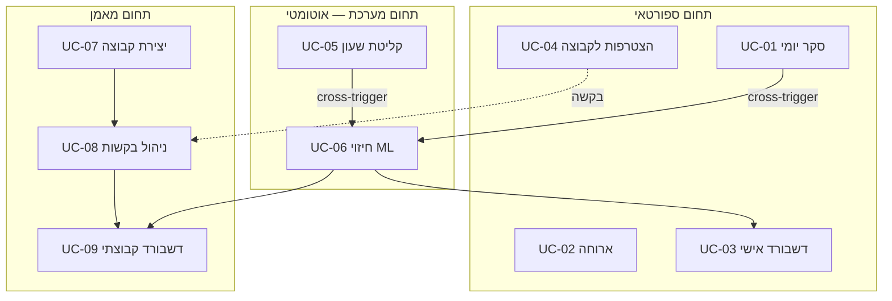
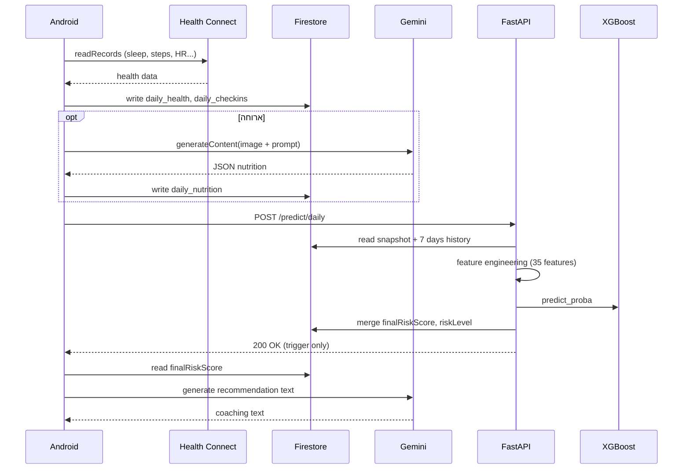
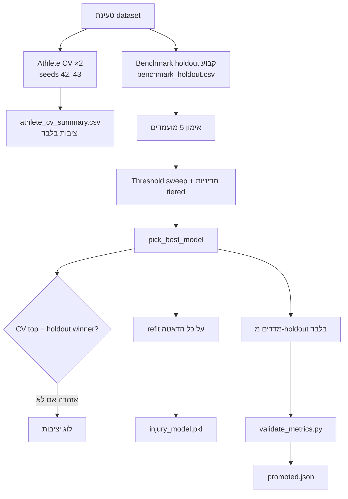
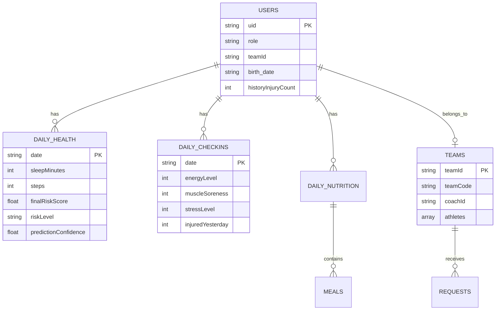

# AthleAgent — ספר פרויקט

| שדה | ערך |
|-----|-----|
| **שם הפרויקט** | AthleAgent — פלטפורמה למניעת פציעות בספורטאים |
| **מגישים** | יהב סימון · צוף פלדון |
| **מנחה** | מר איל איזנשטיין |
| **מחלקה** | מדעי המחשב |
| **תאריך** | יולי 2026 |
| **גרסת מסמך** | 1.2 |

---

## תוכן עניינים

1. [תקציר ומטרת הפרויקט](#1-תקציר-ומטרת-הפרויקט)
2. [סיפור הפרויקט](#2-סיפור-הפרויקט)
3. [שחקנים ודיאגרמת Use Case](#3-שחקנים-ודיאגרמת-use-case)
4. [דרישות מערכת (SRS)](#4-דרישות-מערכת-srs)
5. [אינטגרציות לממשקים חיצוניים](#5-אינטגרציות-לממשקים-חיצוניים)
6. [ארכיטקטורה כללית ומבנה הפרויקט](#6-ארכיטקטורה-כללית-ומבנה-הפרויקט)
7. [מסע האלגוריתם — איך הגענו למודל](#7-מסע-האלגוריתם--איך-הגענו-למודל)
8. [פירוט האלגוריתם והמודל](#8-פירוט-האלגוריתם-והמודל)
9. [תכונות מחלקות ורכיבים](#9-תכונות-מחלקות-ורכיבים)
10. [סיפורי באגים, תקלות וקשיים](#10-סיפורי-באגים-תקלות-וקשיים)
11. [מודל נתונים](#11-מודל-נתונים)
12. [בדיקות ואיכות](#12-בדיקות-ואיכות)
13. [מגבלות, סיכונים ו-Roadmap](#13-מגבלות-סיכונים-ו-roadmap)
14. [נספחים](#14-נספחים)

---

## 1. תקציר ומטרת הפרויקט

### 1.1 הבעיה

פציעות בספורט נובעות לרוב משילוב של **עומס אימון**, **התאוששות לקויה** (שינה, HRV), **תזונה** ו**סטרס** — אך הנתונים מפוזרים בין שעונים חכמים, אפליקציות תזונה ויומני אימון. רוב הפתרונות בתעשייה הם **תגובתיים**: טיפול מתחיל **אחרי** שהפציעה כבר קרתה.

### 1.2 המטרה

**AthleAgent** שואפת לעבור מטיפול תגובתי בפציעות ל**מניעה** — באמצעות **ציון סיכון יומי לפציעה** (Daily Injury Risk Score, 0–100%) שמאחד את כל מקורות הקלט לתמונה אחת, לספורטאי ולמאמן.

### 1.3 מדדי הצלחה

| מטרה | מדד |
|------|-----|
| זיהוי מוקדם של סיכון | ציון יומי + רמת Low / Medium / High |
| הפחתת עומס ידני | סנכרון אוטומטי משעון + ניתוח ארוחות ב-AI |
| שקיפות למאמן | דשבורד קבוצתי בזמן אמת |
| אמינות | `prediction_confidence` נפרד מהסיכון; ML gates לפני שרת חיזוי |
| שיפור מתמשך | pipeline אימון offline (`run_pipeline.py`) + promote |

### 1.4 משפט מפתח

> *מעבר מטיפול תגובתי בפציעות ל**מניעה**.*

---

## 2. סיפור הפרויקט

### 2.1 נקודת ההתחלה

הפרויקט נולד מהזיהוי שספורטאי חובב או מקצוען מתמודד כל בוקר עם שאלה מעשית: *האם בטוח לאמן היום?* התשובה תלויה בנתונים שמפוזרים — Garmin מראה עומס, אפליקציית שינה מראה חוב, והמאמן רואה רק חלק מהתמונה. רצינו לבנות **מקור אמת אחד** שמחבר הכל ומפיק החלטה נתמכת-נתונים.

### 2.2 כיוון הפתרון

בחרנו בארכיטקטורת **שלוש שכבות**:

1. **אפליקציית Android** — איסוף נתונים, UX, אינטגרציה עם Health Connect ו-Gemini.
2. **שרת FastAPI** — הנדסת פיצ'רים, inference של מודל ML, כתיבה חזרה ל-Firestore.
3. **Pipeline ML offline** — יצירת דאטה סינתטי, אימון, validation ו-promotion.

עקרון מרכזי שעיצב את כל ההחלטות: **Firestore כ-Source of Truth** — האפליקציה כותבת נתונים, מפעילה חיזוי, והדשבורד **קורא את התוצאה מ-Firestore** (לא מה-response של ה-API).

### 2.3 אבני דרך

| שלב | מה הושג |
|-----|---------|
| MVP | סקר יומי + חיזוי בסיסי |
| אינטגרציה | Health Connect (21 מדדים פיזיים), Firebase Auth + Firestore |
| AI | ניתוח ארוחות ב-Gemini Vision, המלצות טקסט בדשבורד |
| ML | 35 פיצ'רים, XGBoost, gates (Recall ≥ 80%, AUC ≥ 0.68) |
| מאמן | יצירת קבוצה, אישור בקשות, דשבורד קבוצתי |
| אמינות | cross-trigger, confidence score, train-serve parity (חוזה 35 + 15 שלמים) |
| DevOps | Docker, 244 בדיקות pytest, observability |

---

## 3. שחקנים ודיאגרמת Use Case

> **היקף דיאגרמה:** סעיף זה מתאר את **מטרות העסק** של AthleAgent — איסוף נתונים, חיזוי סיכון וניהול קבוצה. **הרשמה והתחברות** (Firebase Auth) הן תשתית אבטחה נדרשת לפני כל שימוש, אך **אינן** מופיעות בדיאגרמת Use Case — ראו [§3.5](#35-תשתית-אימות-מחוץ-לדיאגרמה).

### 3.1 שחקנים (Actors)

שחקנים מחולקים לשלוש קבוצות: **אנושיים ראשיים**, **מערכות חיצוניות**, ו**מערכות פנימיות**.

#### שחקנים אנושיים ראשיים (Primary Actors)

| שחקן | מי הוא? | מטרות במערכת | מסכים מרכזיים | נתונים שמזין / קורא |
|------|---------|--------------|---------------|---------------------|
| **ספורטאי (Athlete)** | משתמש קצה שמתאמן ורוצה לדעת אם בטוח לאמן היום | דיווח מצב יומי, צפייה בסיכון אישי, הצטרפות לקבוצת מאמן | `DailyCheckInActivity`, `WearableSyncActivity`, `AthleteDashboardActivity`, `JoinTeamActivity` | כותב: `daily_checkins`, `daily_health`, `daily_nutrition`. קורא: `finalRiskScore`, היסטוריה |
| **מאמן (Coach)** | מנהל קבוצת אימון שצריך תמונת סיכון לכל הרשימה | יצירת קבוצה, אישור ספורטאים, מעקב סיכון קבוצתי | `CreateTeamActivity`, `CoachRequestsActivity`, `CoachDashboardActivity` | כותב: `teams`, סטטוס בקשות. קורא: `daily_health` של כל ספורטאי בקבוצה |

**הבחנה חשובה:** הספורטאי **לא** מזין ידנית נתוני שעון — שעונים (Garmin, Samsung וכו') מסנכרנים ל-Health Connect **בלעדיו**. האפליקציה רק **שואבת** משם (UC-05). המאמן **לא** מזין נתוני בריאות — הוא **צופה** בתוצאות חיזוי שכבר חושבו.

#### שחקנים חיצוניים (Secondary / External Actors)

| שחקן | תפקיד במערכת | מתי נכנס לפעולה |
|------|--------------|-----------------|
| **Cloud Firestore** | Source of Truth — אחסון כל הנתונים היומיים ותוצאות חיזוי | בכל כתיבה/קריאה מהאפליקציה או מהבקאנד |
| **Firebase Auth** | אימות זהות (מחוץ לדיאגרמת UC) | לפני כניסה לאפליקציה — ראו §3.5 |
| **Health Connect** | גשר Android לנתוני wearables וחיישנים | סנכרון בוקר — שינה, צעדים, HRV, דופק |
| **Google Gemini** | AI לראייה (ארוחות) וטקסט (המלצות) | צילום ארוחה; טעינת דשבורד ספורטאי/מאמן |
| **שרת AthleAgent (Backend)** | inference ML — 35 פיצ'רים + XGBoost | `POST /predict/daily` אחרי cross-trigger |
| **מערכת ML (Offline)** | אימון, validation, promotion | `run_pipeline.py` — **לא** בזמן ריצה של האפליקציה |

#### מי **לא** שחקן?

| רכיב | למה לא שחקן |
|------|-------------|
| `MainActivity` / `HomeAthleteActivity` / `HomeCoachActivity` | ניווט בלבד — hub למסכים |
| `PrivacyPolicyActivity` | תצוגת טקסט משפטי |
| Logout | סיום סשן — לא מטרה עסקית |
| `WearableSyncActivity` (כמסך) | המסך הוא ממשק; ה-UC הוא **קליטת נתונים** — מופעל על ידי Health Connect |

### 3.2 רשימת Use Cases — מטרות עסקיות (ללא הרשמה/התחברות)

| מזהה | Use Case | שחקן יוזם | מטרה עסקית | מימוש | מערכות חיצוניות |
|------|----------|-----------|------------|-------|------------------|
| **UC-01** | **מילוי סקר יומי** | ספורטאי | דיווח מצב גוף/נפש: אנרגיה, סטרס, כאב שרירים, פציעה אתמול (1–10) | `DailyCheckInActivity` | Firestore |
| **UC-02** | **תיעוד ארוחה מתמונה** | ספורטאי | חילוץ קלוריות ומאקרו מתמונה ושמירה | `AnalyzingMealActivity` → `MealAnalysisActivity` | Gemini, Firestore |
| **UC-03** | **צפייה בסיכון אישי, היסטוריה והמלצות** | ספורטאי | ציון יומי (`finalRiskScore`), `prediction_confidence`, גרף 7 ימים, המלצת AI | `AthleteDashboardActivity` | Firestore, Gemini |
| **UC-04** | **בקשת הצטרפות לקבוצה** | ספורטאי | שליחת בקשה לפי קוד קבוצה שהמאמן מסר | `JoinTeamActivity` | Firestore |
| **UC-05** | **קליטת נתוני שעון אוטומטית** | Health Connect *(לא ספורטאי)* | שאיבת שינה/עומס/HRV מ-Health Connect ל-Firestore | `WearableSyncActivity` | Health Connect, Firestore |
| **UC-06** | **חיזוי סיכון פציעה יומי** | מערכת *(cross-trigger)* | הנדסת 35 פיצ'רים + XGBoost + שמירת `finalRiskScore` | `POST /predict/daily` | Backend → Firestore |
| **UC-07** | **יצירת קבוצת אימון** | מאמן | הגדרת שם קבוצה וקוד הצטרפות ייחודי | `CreateTeamActivity` | Firestore |
| **UC-08** | **ניהול בקשות הצטרפות** | מאמן | אישור או דחיית ספורטאים; עדכון `users.teamId` | `CoachRequestsActivity` | Firestore |
| **UC-09** | **מעקב סיכון קבוצתי ופרטי ספורטאי** | מאמן | רשימת ספורטאים, ציון יומי, גרף היסטוריה, המלצת AI לכל אחד | `CoachDashboardActivity` | Firestore, Gemini |

**לא נכללו (לא use case עסקי):**

| פעולה | סיבה |
|--------|------|
| הרשמה / התחברות | תשתית אבטחה — §3.5 |
| התנתקות | סיום סשן |
| מדיניות פרטיות | טקסט משפטי |
| מסכי Home | ניווט בלבד |

> **היסטוריה:** "צפייה בהיסטוריה" הייתה UC נפרד בתכנון; במימוש היא **חלק מ-UC-03** (ספורטאי) ומ-**UC-09** (מאמן — drill-down לספורטאי בודד).

### 3.3 מבנה ה-Use Cases לפי תחום


```mermaid
flowchart TB
    subgraph Athlete["תחום ספורטאי"]
        UC01[UC-01 סקר יומי]
        UC02[UC-02 ארוחה]
        UC03[UC-03 דשבורד אישי]
        UC04[UC-04 הצטרפות לקבוצה]
    end

    subgraph System["תחום מערכת — אוטומטי"]
        UC05[UC-05 קליטת שעון]
        UC06[UC-06 חיזוי ML]
        UC05 -->|cross-trigger| UC06
        UC01 -->|cross-trigger| UC06
    end

    subgraph Coach["תחום מאמן"]
        UC07[UC-07 יצירת קבוצה]
        UC08[UC-08 ניהול בקשות]
        UC09[UC-09 דשבורד קבוצתי]
        UC07 --> UC08
        UC08 --> UC09
    end

    UC04 -.->|בקשה| UC08
    UC06 --> UC03
    UC06 --> UC09
```

| תחום | Use Cases | תלות |
|------|-----------|------|
| **ספורטאי — קלט** | UC-01, UC-02, UC-05 | UC-02 אופציונלי; UC-01 + UC-05 נדרשים ל-UC-06 |
| **ספורטאי — פלט** | UC-03 | דורש UC-06 (או ציון קודם ב-Firestore) |
| **מאמן — קבוצה** | UC-07 → UC-08 → UC-09 | ספורטאי חייב UC-04 לפני שיופיע ב-UC-09 |
| **מערכת** | UC-05, UC-06 | cross-trigger: שינה>0 + צעדים אתמול>0 + סקר היום |

### 3.4 דיאגרמת Use Case (ללא הרשמה/התחברות)

```mermaid
usecaseDiagram
    actor Athlete as "ספורטאי\n(Athlete)"
    actor Coach as "מאמן\n(Coach)"

    actor Firestore as "Cloud Firestore"
    actor HealthConnect as "Health Connect"
    actor GeminiAI as "Google Gemini"
    actor Backend as "AthleAgent Backend"

    rectangle "AthleAgent — מטרות עסקיות" {
        usecase UC_CheckIn as "UC-01 מילוי סקר יומי"
        usecase UC_Meal as "UC-02 תיעוד ארוחה"
        usecase UC_AthleteDash as "UC-03 סיכון אישי\nהיסטוריה והמלצות"
        usecase UC_Join as "UC-04 הצטרפות לקבוצה"

        usecase UC_Sync as "UC-05 קליטת נתוני שעון"
        usecase UC_Predict as "UC-06 חיזוי סיכון יומי"

        usecase UC_CreateTeam as "UC-07 יצירת קבוצה"
        usecase UC_ManageReq as "UC-08 ניהול בקשות"
        usecase UC_CoachDash as "UC-09 מעקב סיכון קבוצתי"

        UC_Sync -.->|"cross-trigger"| UC_Predict
        UC_CheckIn -.->|"cross-trigger"| UC_Predict
    }

    Athlete --> UC_CheckIn
    Athlete --> UC_Meal
    Athlete --> UC_AthleteDash
    Athlete --> UC_Join

    Coach --> UC_CreateTeam
    Coach --> UC_ManageReq
    Coach --> UC_CoachDash

    HealthConnect --> UC_Sync

    UC_CheckIn --> Firestore
    UC_Meal --> GeminiAI
    UC_Meal --> Firestore
    UC_AthleteDash --> Firestore
    UC_AthleteDash --> GeminiAI
    UC_Join --> Firestore
    UC_Sync --> HealthConnect
    UC_Sync --> Firestore
    UC_Predict --> Backend
    Backend --> Firestore
    UC_CreateTeam --> Firestore
    UC_ManageReq --> Firestore
    UC_CoachDash --> Firestore
    UC_CoachDash --> GeminiAI
```

> **הערות לדיאגרמה:**
> - **UC-05** — אין קישור `Athlete → UC-05`; השעון מסנכרן ל-Health Connect ברקע.
> - **cross-trigger (UC-06)** — רק כש-UC-01 + UC-05 מוכנים עם ערכים תקינים (>0).
> - **UC-02** שומרת תזונה בלבד — **לא** מפעילה חיזוי.
> - **UC-03 / UC-09** כוללים גרף היסטוריה — לא UC נפרד.
> - **ML Pipeline offline** (`run_pipeline.py`) אינו מופיע — לא use case בזמן ריצה.

### 3.5 תשתית אימות (מחוץ לדיאגרמה)

הרשמה והתחברות **נדרשות** לפני כל Use Case עסקי, אך אינן מטרות המוצר:

| פעולה | מימוש | מה קורה |
|-------|-------|---------|
| **הרשמה** | `RegisterActivity`, `LoginManager` | Firebase Auth + יצירת `users/{uid}` עם `role`, תאריך לידה ופציעות עבר (ספורטאי) |
| **התחברות** | `LoginActivity`, `MainActivity` | אימייל/סיסמה או Google Sign-In → קריאת `role` → ניתוב ל-`HomeAthleteActivity` / `HomeCoachActivity` |
| **ניתוב אוטומטי** | `MainActivity` | אם כבר מחובר — דילוג על Login |

### 3.6 תרחישי שימוש עיקריים

#### תרחיש 1: זרימה יומית של ספורטאי

1. **UC-05** — נתוני שעון זורמים ל-Health Connect; האפליקציה שואבת (שינה → היום, עומס → אתמול).
2. **UC-01** — מילוי סקר (אנרגיה, סטרס, כאב שרירים, פציעה אתמול).
3. *(אופציונלי)* **UC-02** — צילום ארוחה → Gemini מחלץ קלוריות ומאקרו.
4. **UC-06** — cross-trigger מפעיל `POST /predict/daily`.
5. Backend → 35 פיצ'רים → XGBoost → `finalRiskScore` ב-Firestore.
6. **UC-03** — דשבורד מציג ציון, גרף והמלצת Gemini.

#### תרחיש 2: ניהול קבוצה על ידי מאמן

1. **UC-07** — מאמן יוצר קבוצה וקוד הצטרפות.
2. **UC-04** — ספורטאים שולחים בקשות.
3. **UC-08** — מאמן מאשר או דוחה.
4. **UC-09** — דשבורד מאמן: סיכון יומי והמלצות לכל ספורטאי.

---

## 4. דרישות מערכת (SRS)

מסמך זה משלב מבנה **SRS** (Software Requirements Specification) עם תוספות פרויקט גמר: סיפור, מסע ML, באגים ואינטגרציות.

### 4.1 דרישות פונקציונליות

| מזהה | דרישה | עדיפות | מימוש |
|------|--------|--------|-------|
| FR-01 | הרשמה והתחברות (אימייל + Google) | חובה | `LoginActivity`, `RegisterActivity` — **תשתית**, לא UC עסקי (§3.5) |
| FR-02 | routing לפי תפקיד (athlete / coach) | חובה | `MainActivity` → `users.role` |
| FR-03 | סנכרון נתוני wearables דרך Health Connect | חובה | `WearableSyncActivity` |
| FR-04 | סקר יומי (4 שדות) | חובה | `DailyCheckInActivity` |
| FR-05 | ניתוח ארוחה מתמונה (AI) | רצוי | `AnalyzingMealActivity` + Gemini |
| FR-06 | חיזוי סיכון פציעה יומי | חובה | `POST /predict/daily` |
| FR-07 | הצגת ציון סיכון, רמה והיסטוריה | חובה | `AthleteDashboardActivity` |
| FR-08 | המלצות טקסט מותאמות לסיכון | רצוי | Gemini ב-`AthleteDashboardActivity` |
| FR-09 | יצירת קבוצה וניהול בקשות | חובה | `CreateTeamActivity`, `CoachRequestsActivity` |
| FR-10 | דשבורד מאמן — סיכון קבוצתי | חובה | `CoachDashboardActivity` |
| FR-11 | הצטרפות לקבוצה בקוד | חובה | `JoinTeamActivity` |
| FR-12 | הצגת `prediction_confidence` | חובה | Backend + Firestore |

### 4.2 דרישות לא-פונקציונליות

| מזהה | דרישה | יישום |
|------|--------|-------|
| NFR-01 | חיזוי < 2 שניות | FastAPI stateless + XGBoost in-process |
| NFR-02 | זמינות | Firestore managed + backend stateless |
| NFR-03 | אמינות בנתונים חסרים | defaults ניטרליים + confidence |
| NFR-04 | ML gates | Recall ≥ 0.80, AUC ≥ 0.68 — `model_loader.py` |
| NFR-05 | train-serve parity | חוזה 35 פיצ'רים + 15 עמודות שלמות + נוסחאות משותפות (`feature_contract.py` / `request_features.py`) |
| NFR-06 | פרטיות | ללא PHI בלוגים; Gemini client-side |
| NFR-07 | תחזוקה | הפרדת Android / Backend / ML_model |

### 4.3 דרישות ממשק (חיצוניות)

ראו [סעיף 5](#5-אינטגרציות-לממשקים-חיצוניים) — נדרשת שליטה מלאה בחיבורים ל-Firebase, Health Connect, Gemini ו-Retrofit.

### 4.4 מגבלות מוצר

- **לא אבחון רפואי** — כלי תמיכה להחלטות, לא מחליף איש מקצוע.
- **דאטה אימון סינתטי** — אין מספיק דאטה אמיתי מתויג לכל יום.
- **אין auth על API חיזוי** — מגבלת scope; מתועד כסיכון.

---

## 5. אינטגרציות לממשקים חיצוניים

> **דרישת הקורס:** להיות בקיאים בחיבורים לממשקים חיצוניים. להלן פירוט מלא לפי הפרויקט.

### 5.1 סיכום אינטגרציות

| שירות | פרוטוקול | כיוון | מיקום בקוד | תפקיד |
|-------|----------|-------|------------|-------|
| **Firebase Auth** | SDK | Client → Google | `LoginActivity.kt` | אימות משתמשים |
| **Cloud Firestore** | SDK | Client ↔ Cloud, Backend ↔ Cloud | Activities, `history/repository.py` | אחסון כל הנתונים |
| **Health Connect** | Android SDK | Device → Client | `WearableSyncActivity.kt` | שינה, עומס, דופק, HRV... |
| **Google Gemini** | REST/SDK | Client → Google | `AnalyzingMealActivity.kt`, `AthleteDashboardActivity.kt` | Vision + Text |
| **FastAPI Backend** | HTTP/JSON (Retrofit) | Client → Server | `ApiClient.kt`, `ApiService.kt` | trigger חיזוי |
| **Firebase Admin** | SDK | Server → Google | `history/firestore_client.py` | קריאה/כתיבה ל-Firestore |
| **XGBoost** | in-process (joblib) | Server פנימי | `prediction/service.py` | inference |

### 5.2 Firebase Authentication

**זרימה:**
1. משתמש מתחבר באימייל/סיסמה או Google Sign-In.
2. Firebase מחזיר `uid`.
3. האפליקציה קוראת `users/{uid}` מ-Firestore לקבלת `role`.
4. ניתוב ל-`HomeAthleteActivity` או `HomeCoachActivity`.

**קבצים:** `LoginActivity.kt`, `RegisterActivity.kt`, `logic/LoginManager.kt`

### 5.3 Cloud Firestore

**עקרון:** כל הנתונים היומיים + תוצאות חיזוי נשמרים ב-Firestore. ה-UI **לא** מסתמך על response body של API לתצוגת ציון.

**נתיבים עיקריים:**

| נתיב | כותב | קורא |
|------|------|------|
| `users/{uid}` | אפליקציה | אפליקציה, Backend |
| `users/{uid}/daily_health/{date}` | אפליקציה + Backend | אפליקציה, Backend |
| `users/{uid}/daily_checkins/{date}` | אפליקציה | Backend |
| `users/{uid}/daily_nutrition/{date}` | אפליקציה | Backend |
| `teams/{teamId}` | מאמן | אפליקציה |

### 5.4 Health Connect

**הרשאות:** 19 סוגי רשומות (שינה, צעדים, מרחק, דופק, HRV, VO2max, SpO2 ועוד).

**מדיניות date-split (קריטי):**

| נתון | תאריך ב-Firestore | סיבה |
|------|-------------------|------|
| שינה (`sleepMinutes`) | `daily_health/{D}` | הלילה שזה עתה נגמר |
| עומס פיזי (צעדים, HRV...) | `daily_health/{D-1}` | יום מלא אתמול |
| סקר | `daily_checkins/{D}` | מצב נפשי הבוקר |
| תזונה | `daily_nutrition/{D-1}` | צריכה אתמול |

**קובץ:** `WearableSyncActivity.kt`

### 5.5 Google Gemini API

**שני שימושים — שניהם client-side:**

| שימוש | Activity | מודל | קלט | פלט |
|-------|----------|------|-----|-----|
| ניתוח ארוחה | `AnalyzingMealActivity` | `gemini-2.5-flash` | Bitmap + prompt | JSON: calories, protein, carbs |
| המלצות | `AthleteDashboardActivity` | `gemini-2.5-flash` | ציון סיכון + הקשר | טקסט המלצה |

**הגדרות:**
- API Key: `BuildConfig.GEMINI_API_KEY` ← `local.properties`
- `temperature = 0.0f` לניתוח ארוחות (דטרמיניסטי)

**הערה:** Gemini **לא** רץ בבקאנד — מפתח קיים ב-`config.py` אך אין routes.

### 5.6 FastAPI Backend (Retrofit)

**חוזה HTTP:**

```kotlin
@POST("/predict/daily")
fun getDailyPrediction(@Body data: PredictionTriggerRequest): Call<PredictionResponse>
```

- **Base URL (אמולטור):** `http://10.0.2.2:8000/`
- **Body:** `{ userId, date }`
- **Response:** `{ risk_level, risk_score, prediction_confidence }` — האפליקציה בודקת רק `isSuccessful`; התצוגה מ-Firestore.

**Endpoints נוספים:**

| Method | Path | תפקיד |
|--------|------|-------|
| GET | `/health` | liveness |
| GET | `/status/ml` | Live / Blocked |
| POST | `/api/v1/observability/client-events` | telemetry מאנדרואיד |

### 5.7 דיאגרמת רצף — אינטגרציה מלאה


```mermaid
sequenceDiagram
    participant App as Android
    participant HC as Health Connect
    participant FS as Firestore
    participant GM as Gemini
    participant BE as FastAPI
    participant ML as XGBoost

    App->>HC: readRecords (sleep, steps, HR...)
    HC-->>App: health data
    App->>FS: write daily_health, daily_checkins

    opt ארוחה
        App->>GM: generateContent(image + prompt)
        GM-->>App: JSON nutrition
        App->>FS: write daily_nutrition
    end

    App->>BE: POST /predict/daily
    BE->>FS: read snapshot + 7 days history
    BE->>BE: feature engineering (35 features)
    BE->>ML: predict_proba
    BE->>FS: merge finalRiskScore, riskLevel
    BE-->>App: 200 OK (trigger only)

    App->>FS: read finalRiskScore
    App->>GM: generate recommendation text
    GM-->>App: coaching text
```

---

## 6. ארכיטקטורה כללית ומבנה הפרויקט

### 6.1 שלוש שכבות

```
┌─────────────────────────────────────────────────────────┐
│  שכבת לקוח — Android (Kotlin)                           │
│  Activities + View Binding + Retrofit + Firestore SDK   │
└────────────────────────┬────────────────────────────────┘
                         │ HTTP + Firestore
┌────────────────────────▼────────────────────────────────┐
│  שכבת שירות — FastAPI (Python)                          │
│  Prediction · History · Preprocessing · ML Loader     │
└────────────────────────┬────────────────────────────────┘
                         │ Firestore Admin SDK
┌────────────────────────▼────────────────────────────────┐
│  שכבת נתונים — Cloud Firestore                          │
└─────────────────────────────────────────────────────────┘

┌─────────────────────────────────────────────────────────┐
│  ML Pipeline (offline) — ML_model/                      │
│  data_generator → train_model → run_pipeline → promote  │
└─────────────────────────────────────────────────────────┘
```

### 6.2 עץ תיקיות הפרויקט (מלא)

```
final_project_AthleAgent/
├── android_app/AthleAgent/          # אפליקציית Android (Kotlin)
├── backend/                         # שרת FastAPI — inference + Firestore
├── ML_model/                        # pipeline אימון offline + artifacts
├── docs/                            # תיעוד פרויקט (עברית + אנגלית)
├── logs/                            # לוג מרכזי JSON Lines (gitignored)
├── uploads/                         # תמונות legacy (אם הועלו)
├── .github/workflows/               # CI — הרצת pytest ב-GitHub Actions
├── Dockerfile                       # image לבקאנד
├── docker-compose.yml               # הרצה מקומית (backend + volume לוגים)
├── clean_logs.py                    # ניקוי logs/athleagent.log
├── requirements.txt                 # alias ל-backend/requirements.txt
├── .env.example                     # משתני סביבה לדוגמה (שורש)
├── pyrightconfig.json               # הגדרות type checker ל-Python
└── README.md                        # סקירת פרויקט (אנגלית)
```

### 6.3 פירוט תיקיות — שורש הפרויקט

| תיקייה / קובץ | תפקיד |
|---------------|--------|
| **`android_app/`** | כל קוד הלקוח — אפליקציית Android ב-Kotlin |
| **`backend/`** | שרת Python — API, ML inference, קריאה/כתיבה ל-Firestore |
| **`ML_model/`** | אימון מודל offline — לא רץ בזמן שימוש באפליקציה |
| **`docs/`** | מסמכי פרויקט גמר: ספר פרויקט, HLD, LLD, Docker, לוגים, תערוכה |
| **`logs/`** | קובץ לוג מרכזי `athleagent.log` — Backend + אירועי Android (דרך API). פורמט JSON Lines, rotation 10MB×5. ראו [LOGGING_HE.md](LOGGING_HE.md) |
| **`uploads/`** | אחסון תמונות זמני (legacy); ארוחות נשמרות ב-Firestore, לא כאן |
| **`.github/workflows/`** | `backend-tests.yml` — pytest על push/PR ל-main |
| **`Dockerfile`** | בונה image עם Python + backend + מודל promoted |
| **`docker-compose.yml`** | מריץ backend על `127.0.0.1:8000`, ממפה `./logs` → `/app/logs` |
| **`clean_logs.py`** | סקריפט עזר לריקון קובץ הלוג לפני דמו/דיבוג |

### 6.4 פירוט — `android_app/AthleAgent/`

| נתיב | תפקיד |
|------|--------|
| **`app/src/main/java/com/yahav/athleagent/`** | קוד Kotlin ראשי |
| `ui/auth/` | `LoginActivity`, `RegisterActivity`, `MainActivity` — אימות וניתוב |
| `ui/athlete/` | מסכי ספורטאי: סקר, שעון, ארוחה, דשבורד, הצטרפות לקבוצה |
| `ui/coach/` | מסכי מאמן: יצירת קבוצה, בקשות, דשבורד קבוצתי |
| `ui/PrivacyPolicyActivity.kt` | מדיניות פרטיות |
| `network/` | `ApiClient`, `ApiService` — Retrofit ל-`POST /predict/daily` |
| `observability/` | `ClientEventReporter`, `CorrelationIdInterceptor` — telemetry ל-API |
| `logic/` | `LoginManager` — עזר הרשמה/התחברות |
| `model/` | DTOs: `AthleteItem`, `AlertItem`, `PredictionModels` |
| `utilities/` | `SignalManager` — Toast/Snackbar |
| `App.kt` | אתחול אפליקציה: Timber, observability |
| **`app/src/main/res/`** | layouts (`activity_*.xml`), drawables, strings, themes |
| **`app/src/main/AndroidManifest.xml`** | הרשאות Health Connect, הגדרת Activities |
| **`app/src/test/`** | `ExampleUnitTest` — placeholder |
| **`app/src/androidTest/`** | `ExampleInstrumentedTest` — placeholder |
| **`app/build.gradle.kts`** | תלויות: Firebase, Retrofit, Gemini, Health Connect, MPAndroidChart |
| **`local.properties`** | `GEMINI_API_KEY`, נתיב SDK — **לא ב-git** |
| **`gradle/`** | Gradle wrapper |

### 6.5 פירוט — `backend/`

| נתיב | תפקיד |
|------|--------|
| **`main.py`** | FastAPI app, CORS, lifespan, טעינת מודל ב-startup |
| **`config.py`** | Settings (Pydantic): מפת מדיניות מרכזית — `ML_MIN_*`, `RISK_*_CUTOFF`, `HISTORY_*`, `CONFIDENCE_*`, `NUTRITION_DEFAULT_*` (ראו [§8.6](#86-prediction_confidence--איכות-הקלט)) |
| **`injury_model.pkl`** | symlink/copy למודל promoted (נטען ע"י `model_loader`) |
| **`firebase-key.json`** | Service Account ל-Firestore Admin — **לא ב-git** |
| **`api/routes/`** | `health.py`, `predict.py`, `observability.py` |
| **`middleware/`** | `request_logging.py` — לוג בקשות + `X-Request-ID` |
| **`ml/model_loader.py`** | טעינת joblib, בדיקת gates, Live/Blocked |
| **`schemas/`** | Pydantic: `inference.py`, `observability.py`, `enums.py`, `types.py` |
| **`services/prediction/`** | `service.py` (orchestration), `firestore_mapping`, `confidence`, `bundle` |
| **`services/history/`** | `repository`, `rolling_features`, `day_quality`, `history_merge`, `date_utils`, `firestore_client` |
| **`services/preprocessing/`** | `request_features`, `request_mapping`, `validation`, `scales`, `quality`, `helpers`, `constants` |
| **`services/` (שורש) | `feature_engineering`, `field_transforms`, `model_features`, `risk_levels`, `nutrition_defaults` |
| **`data/model_feature_contract.json`** | חוזה 35 פיצ'רים + 15 שלמים |
| **`utils/`** | `logging.py`, `exceptions.py`, `client_event_limiter.py`, `request_context.py` |
| **`scripts/`** | `seed_demo_athlete_firestore.py` — דאטה לדמו; `trace_request.sh` |
| **`docs/`** | תיעוד טכני: HLD, LLD, MODEL, RISK_SCORE, FEATURES, BACKEND |
| **`tests/`** | 244 בדיקות pytest — ראו [§12](#12-בדיקות-ואיכות) |
| **`logs/`** | עותק מקומי אופציונלי; הקובץ הראשי בשורש `logs/` |
| **`uploads/images/`** | legacy — לא בשימוש production לארוחות |
| **`pytest.ini`** | הגדרות pytest |
| **`requirements.txt`** | תלויות Python (FastAPI, firebase-admin, xgboost, sklearn…) |

### 6.6 פירוט — `ML_model/`

| נתיב | תפקיד |
|------|--------|
| **`generation/`** | לוגיקת דאטה סינתטי: `config`, `simulator`, `postprocess` |
| **`training/`** | לוגיקת אימון: `pipeline`, `policy`, `models`, `constants` |
| **`data_generator.py`** | CLI wrapper — מפנה ל-`generation/simulator.py` |
| **`create_benchmark_set.py`** | holdout קבוע `benchmark_holdout.csv` |
| **`train_model.py`** | CLI wrapper — מפנה ל-`training/pipeline.py` |
| **`validate_metrics.py`** | gates לפני promotion |
| **`run_pipeline.py`** | end-to-end: generate → train → validate → `promoted.json` |
| **`feature_contract.py`** | חוזה משותף עם backend — `workout_intensity_minutes()` |
| **`policy_config.py`** | ספי Recall, FPR, F1 — נטען גם ב-`backend/config.py` |
| **`artifacts/`** | תוצאות אימון לפי `run_id/` + `promoted.json` |
| **`artifacts/<run_id>/`** | `injury_model.pkl`, `run_manifest.json`, CSVs, calibration |
| **`fixtures/`** | `athlete_injury_demo.csv` — דאטה קטן לנוטבוק (ב-git) |
| **`notebooks/`** | `model_improvement_journey.ipynb` — מסע שיפור המודל |
| **`docs/MODEL_SELECTION.md`** | פרוטוקול בחירת מודל |
| **`athlete_injury_data.csv`** | דאטה מלא (gitignored, נוצר ע"י `generation/`) |
| **`benchmark_holdout.csv`** | holdout קבוע לבחירת מודל |

### 6.7 פירוט — `docs/`

| מסמך | תוכן |
|------|------|
| **`PROJECT_BOOK_HE.md`** | ספר פרויקט זה — מסמך מרכזי לפרויקט גמר |
| **`HLD_PROJECT.md`** | עיצוב ברמה גבוהה — ארכיטקטורה מלאה |
| **`LLD_PROJECT.md`** | עיצוב ברמה נמוכה — מחלקות וזרימות |
| **`DOCKER.md`** | הרצה ב-Docker, firebase-key, troubleshooting |
| **`LOGGING_HE.md`** | מדריך לוגים — פורמט, correlation ID, observability |
| **`EXHIBITION_PREP_HE.md`** | הכנה לתערוכה — שאלות ותשובות |
| **`EXHIBITION_QA_CHEATSHEET_HE.md`** | צ'יטשיט לשאלות נפוצות |
| **`NFR.md`** | דרישות לא-פונקציונליות מפורטות |

### 6.8 Tech Stack

| שכבה | טכנולוגיות |
|------|------------|
| Mobile | Kotlin, Activities, View Binding, Material, Retrofit, MPAndroidChart |
| Cloud | Firebase Auth, Cloud Firestore |
| Backend | Python, FastAPI, Uvicorn, Pydantic, firebase-admin |
| ML | XGBoost, scikit-learn, pandas, joblib |
| AI | Google Gemini (client-side) |
| Health | Google Health Connect SDK |
| DevOps | Docker, pytest, GitHub Actions |

---

## 7. מסע האלגוריתם — איך הגענו למודל

### 7.1 נקודת פתיחה — הבעיה בדאטה

אין לנו מאגר ציבורי גדול של ספורטאים עם תיוג יומי "נפצע / לא נפצע". לכן בנינו **דאטה סינתטי** ב-`generation/simulator.py` (נקרא דרך `data_generator.py`):

- 1,000 ספורטאים × 340 יום = **340,000 שורות**
- מודל סיכון מבוסס מחקר ספורט:
  - **ACWR > 1.4** (Gabbett, 2016)
  - חוב שינה מצטבר
  - ירידת HRV
  - סטרס גבוה + עומס
  - Cooldown אחרי פציעה

### 7.2 למה לא התחלנו עם XGBoost בלבד?

הגישה הייתה **השוואת מועמדים** ולא "לקחת אלגוריתם אחד":

| מועמד | תפקיד |
|-------|-------|
| `LogisticRegression` | Baseline ליניארי (עם scaling) |
| `RandomForest` | Bagging ensemble |
| `GradientBoosting` | sklearn boosting |
| `XGBoostCalibratedTuned` | XGB + כיול sigmoid |
| `XGBoostDeep` | XGB עמוק יותר — חלופה ל-Recall גבוה |

### 7.3 פרוטוקול בחירה (5 שלבים)


```mermaid
flowchart TD
    A[טעינת dataset] --> B[Athlete CV ×2<br/>seeds 42, 43]
    B --> C[athlete_cv_summary.csv<br/>יציבות בלבד]
    A --> D[Benchmark holdout קבוע<br/>benchmark_holdout.csv]
    D --> E[אימון 5 מועמדים]
    E --> F[Threshold sweep + מדיניות tiered]
    F --> G[pick_best_model]
    G --> H{CV top = holdout winner?}
    H -->|אזהרה אם לא| I[לוג יציבות]
    G --> J[refit על כל הדאטה]
    J --> K[injury_model.pkl]
    G --> L[מדדים מ-holdout בלבד]
    L --> M[validate_metrics.py]
    M --> N[promoted.json]
```

**עקרונות מניעת דליפה (leakage):**
- Holdout לפי `athlete_id` — כל ימי ספורטאי באותו צד.
- פיצ'רים מתגלגלים (ACWR, sleep_debt) מחושבים **לפני** הפיצול.
- מדדי promotion מה-holdout; המודל לפרודקשן מאומן מחדש על **כל** השורות.

### 7.4 אבני דרך במסע

| שלב | תובנה |
|-----|-------|
| Baseline LR | AUC נמוך — קשרים לא-ליניאריים חשובים |
| Random Forest | טוב אך פחות כיול הסתברויות |
| XGBoost רגיל | Recall גבוה, Brier גבוה |
| **XGBoostCalibratedTuned** | איזון: Recall > 80%, AUC ~0.79, Brier ~0.11 |
| Gates | Backend חוסם מודל שלא עובר Recall/AUC |

### 7.5 מודל promoted נוכחי

| פרמטר | ערך |
|-------|-----|
| Run ID | `20260629_184034` |
| Winner | `XGBoostCalibratedTuned` |
| Threshold | 0.10 |
| Recall@Threshold | **81.1%** |
| ROC-AUC | **0.793** |
| Brier Score | **0.113** |
| שורות אימון | 340,000 |

---

## 8. פירוט האלגוריתם והמודל

### 8.1 מה המודל חוזה?

**מטרת החיזוי:** הסתברות לפציעה **היום** (יום D), בבוקר — לפני איסוף עומס של היום.

**פלט:**
1. `risk_score` — הסתברות 0–1 (`predict_proba` class 1)
2. `finalRiskScore` — אותו ערך × 100 (0–100%) — מה שהמשתמש רואה
3. `risk_level` — Low / Medium / High
4. `prediction_confidence` — איכות הקלט (לא הסיכון!)

### 8.2 רמות סיכון (Production)

| רמה | טווח `finalRiskScore` | צבע UI |
|-----|----------------------|--------|
| Low | 0–20% | ירוק |
| Medium | 21–70% | צהוב/כתום |
| High | 71–100% | אדום |

קוד: `backend/services/risk_levels.py` — ספים נטענים מ-`config.settings` (`RISK_HIGH_CUTOFF=0.70`, `RISK_MEDIUM_CUTOFF=0.20`)

### 8.3 35 הפיצ'רים

| קטגוריה | פיצ'רים |
|---------|---------|
| פרופיל | `bmi`, `age`, `body_fat_pct`, `vo2_max`, `history_injury_count` |
| עומס | `daily_distance_km`, `workout_intensity_minutes`, `avg_cadence`, `elevation_gained_m`, `floors_climbed`, `avg_speed`, `max_speed`, `avg_power`, `active_calories_burned` |
| התאוששות | `sleep_hours`, `hrv_score`, `resting_hr`, `respiratory_rate`, `spo2` |
| תזונה | `nutrition_intake_calories`, `daily_calories`, `total_calories_burned`, `calorie_balance` |
| סובייקטיבי | `stress_level`, `muscle_soreness`, `energy_level`, `injured_yesterday` |
| מנוע (engineered) | `acute_load_7d`, `acwr_ratio`, `acwr_ratio_ma7`, `sleep_hours_ma7`, `sleep_debt_3d`, `hrv_drop`, `load_recovery_imbalance`, `speed_intensity_ratio` |

מקור אמת: `backend/data/model_feature_contract.json` (כולל `integer_feature_columns` — 15 שדות שלמים)

### 8.4 Top 5 פיצ'רים לפי חשיבות

| # | פיצ'ר | משמעות | חשיבות משוערת |
|---|-------|--------|---------------|
| 1 | `hrv_drop` | ירידה ב-HRV לעומת ממוצע 7 ימים | ~28% |
| 2 | `stress_level` | סטרס מהסקר | ~14% |
| 3 | `sleep_debt_3d` | חוב שינה 3 ימים | ~11% |
| 4 | `injured_yesterday` | פציעה אתמול | ~9% |
| 5 | `load_recovery_imbalance` | עומס גבוה בלי התאוששות | ~7% |

### 8.5 Pipeline חיזוי (Backend)

כניסה: `prediction/service.predict_injury_risk_from_firestore` → `predict_injury_risk`

```
POST /predict/daily {userId, date}
    │
    ├─ fetch_daily_firestore_snapshot()                    [history/repository]
    │     profile, health{D}, health{D-1}, checkins{D}, nutrition{D-1}
    │
    ├─ injury_prediction_request_from_firestore_snapshot() [prediction/firestore_mapping]
    │     מדיניות date-split
    │
    ├─ resolve_request_nutrition()                           [nutrition_defaults]
    │
    ├─ injury_request_to_model_dataframe()                 [preprocessing/]
    │     request_features + feature_engineering
    │
    ├─ apply_history_confidence_fallback()                 [prediction/confidence]
    │     rolling 7 ימים: ACWR, sleep_debt, hrv_drop [history/rolling_features]
    │
    ├─ calculate_data_quality_score()                      [preprocessing/quality]
    │
    ├─ compute_prediction_confidence_percent()             [prediction/confidence]
    │     0.6×history_score + 0.4×quality_score — ראו §8.6
    │
    ├─ resolve_model_bundle() → predict_proba() → proba    [prediction/bundle + ml/model_loader]
    │     classify_risk_level(proba)                       [risk_levels]
    │
    └─ save_daily_prediction_result()                      [history/repository]
          merge → daily_health/{date}
```

> המודל **תמיד** מחזיר סיכון; `prediction_confidence` יורד כשהקלט חלקי — **לא** דוחה את הבקשה.

### 8.6 `prediction_confidence` — איכות הקלט

ה-confidence **נפרד מהסיכון** — מודד כמה אמינים הנתונים שעליהם מבוסס החיזוי.

**נוסחה** (`prediction/confidence.py` + `config.py`):

```
prediction_confidence = (CONFIDENCE_HISTORY_WEIGHT × history_score + CONFIDENCE_QUALITY_WEIGHT × quality_score) × 100
```

| רכיב | משקל (ברירת מחדל) | מה נמדד |
|------|-------------------|---------|
| **history_score** | 60% | כמה "ימי שעון אמיתיים" יש בחלון 7 ימים |
| **quality_score** | 40% | שלמות שדות הבוקר (שינה, צעדים, HRV…) — 0 עד 1 |

**יום איכותי בהיסטוריה** (`history/day_quality.py`): בשורה ממוזגת (עומס@אתמול + שינה@היום) צריך לפחות **3 מתוך 4** קטגוריות עם ערך תקין (`HISTORY_MIN_WATCH_SYNC_SIGNAL_GROUPS`):

| קטגוריה | דוגמאות שדות |
|---------|--------------|
| עומס (load) | `steps`, `distanceMeters` |
| שינה (sleep) | `sleepMinutes` |
| דופק (heart) | `heartRateAvg`, `hrvRmssd`, `restingHeartRate` |
| אנרגיה (energy) | `activeCalories`, `totalCalories`, `bmrCalories` |

| ימי איכות בחלון 7 | רמת היסטוריה | `history_score` |
|-------------------|--------------|-----------------|
| ≥ 7 | HIGH | 0.95 |
| 4–6 | MEDIUM | 0.70 |
| 0–3 | LOW | 0.45 |

**quality_score** (`preprocessing/quality.py`): מתחיל מ-1.0, יורד **−0.08** לכל שדה מדידה חסר/אפס, **−0.12** אם תזונה ממוצעת (`nutritionImputed`).

**דוגמה:** היסטוריה HIGH (0.95) + קלט חלקי (0.8) → `(0.6×0.95 + 0.4×0.8)×100 ≈ 89`.

### 8.7 ML Gates (Live)

הבקאנד **לא משרת** חיזוי אם המודל לא עובר:

| Gate | סף | קובץ |
|------|-----|------|
| Recall@Threshold | ≥ 0.80 | `model_loader.py` |
| ROC-AUC | ≥ 0.68 | `model_loader.py` |

בדיקה: `GET /status/ml` → `"status": "Live"` או `"Blocked"`

### 8.8 כיול לפי רמות (Holdout)

| רמת ציון | % דגימות | שיעור פציעה בפועל |
|----------|----------|-------------------|
| ירוק (0–20%) | רוב הימים | ~9% |
| צהוב (20–50%) | בינוני | ~31% |
| אדום (50–100%) | מיעוט | ~65% |

→ כשהציון גבוה, באמת יש יותר פציעות — המודל מכויל.

### 8.9 Recall גבוה, Precision נמוך — בכוונה

במניעת פציעות עדיף **להזהיר מוקדם** (False Positive) מאשר לפספס פציעה (False Negative). Recall של ~81% אומר שרוב ימי הסיכון האמיתיים מזוהים; Precision של ~29% אומר שחלק מההתראות יהיו "יתר על המידה" — trade-off מקובל בתחום מניעה.

---

## 9. תכונות מחלקות ורכיבים

### 9.1 Android — Activities

| מחלקה | חבילה | אחריות | Firestore / API |
|-------|--------|--------|-----------------|
| `App` | root | אתחול `Timber`, `ClientEventReporter` | — |
| `LoginActivity` | auth | Firebase Auth, routing לפי role | `users/{uid}` read |
| `RegisterActivity` | auth | הרשמה email/password | `users/{uid}` create |
| `MainActivity` | auth | מסך פתיחה / ניתוב | — |
| `HomeAthleteActivity` | athlete | Hub ניווט, התראות יומיות | read today docs |
| `DailyCheckInActivity` | athlete | סקר 4 שדות + cross-trigger | `daily_checkins/{today}` |
| `WearableSyncActivity` | athlete | Health Connect read/write + cross-trigger | `daily_health/{today}`, `{D-1}` |
| `AnalyzingMealActivity` | athlete | Gemini Vision על תמונה | — |
| `MealAnalysisActivity` | athlete | שמירת ארוחה ואגרגטים | `daily_nutrition/{today}` |
| `AthleteDashboardActivity` | athlete | מחוון סיכון, גרף, Gemini המלצות | `daily_health/*` |
| `JoinTeamActivity` | athlete | הצטרפות בקוד קבוצה | `teams/*/requests/{uid}` |
| `HomeCoachActivity` | coach | Hub + badge בקשות ממתינות | `teams`, `requests` |
| `CreateTeamActivity` | coach | יצירת קבוצה | `teams/{id}` |
| `CoachRequestsActivity` | coach | אישור/דחיית בקשות | `teams/*/requests`, `users.teamId` |
| `CoachDashboardActivity` | coach | דשבורד סיכון קבוצתי | athletes' `daily_health` |
| `PrivacyPolicyActivity` | ui | מדיניות פרטיות + הרשאות | — |

### 9.2 Android — Network & Observability

| מחלקה | אחריות |
|-------|--------|
| `ApiClient` | Retrofit singleton, base URL `10.0.2.2:8000` |
| `ApiService` | `POST /predict/daily`, DTOs |
| `ClientEventReporter` | שליחת events ל-`POST /api/v1/observability/client-events` |
| `ObservabilityApi` | DTO לאירועי client |
| `CorrelationIdInterceptor` | `X-Request-ID` לtrace |
| `RequestIdHolder` | שמירת request ID thread-local |

### 9.3 Android — Models & Utilities

| מחלקה | אחריות |
|-------|--------|
| `AthleteItem` | DTO לרשימת ספורטאים בדשבורד מאמן |
| `AthleteRequest` | DTO לבקשת הצטרפות |
| `AlertItem` | DTO להתראות ב-Home |
| `PredictionModels` | DTO legacy ל-`/test_predict` (לא בשימוש production) |
| `LoginManager` | עזר לרישום email/password |
| `SignalManager` | Toast / Snackbar |
| `AthleteAdapter`, `AlertAdapter`, `requestsAdapter` | RecyclerView adapters |

### 9.4 Backend — API Layer

| מחלקה / מודול | אחריות |
|---------------|--------|
| `main.py` | FastAPI app, CORS, lifespan, `load_model()` |
| `config.py` | Settings (Pydantic): `ML_MIN_*`, `RISK_*`, `HISTORY_*`, `CONFIDENCE_*`, logging |
| `api/routes/health.py` | `GET /`, `GET /health` |
| `api/routes/predict.py` | `POST /predict/daily`, `GET /status/ml` |
| `api/routes/observability.py` | `POST /api/v1/observability/client-events` |
| `middleware/request_logging.py` | לוג בקשות עם correlation ID |

### 9.5 Backend — Services

| מחלקה / פונקציה | אחריות |
|-----------------|--------|
| `prediction/service.predict_injury_risk_from_firestore` | כניסה ראשית: snapshot → predict → persist |
| `prediction/service.predict_injury_risk` | orchestration: nutrition → features → ML → תשובה |
| `prediction/firestore_mapping` | Firestore dict → `InjuryPredictionRequest` (date-split) |
| `prediction/confidence.apply_history_confidence_fallback` | enrichment היסטורי 7 ימים + `HistoryConfidence` |
| `prediction/confidence.compute_prediction_confidence_percent` | blend 60/40 history + quality |
| `prediction/bundle.resolve_model_bundle` | parse joblib → `ResolvedModelBundle` |
| `history/repository` | קריאה/כתיבה Firestore, `fetch_user_history` |
| `history/rolling_features` | ACWR, sleep_debt, hrv_drop על 7 ימים |
| `history/day_quality` | יום איכותי = ≥3/4 קטגוריות שעון |
| `history/history_merge` | מיזוג שורות עומס@אתמול + שינה@היום |
| `history/date_utils` | מפתחות תאריך `yyyy-MM-dd` |
| `history/firestore_client` | Firebase Admin SDK singleton |
| `preprocessing/request_features` | API → base model feature dict |
| `preprocessing/request_mapping` | base + derived → DataFrame |
| `preprocessing/validation` | `ModelServingContract`, column alignment |
| `preprocessing/quality.calculate_data_quality_score` | `quality_score`, `weak_fields` |
| `preprocessing/helpers` | `safe_float`, `is_absent_or_weak` |
| `preprocessing/scales` | עיגול סקר 1–10 |
| `feature_engineering.py` | פיצ'רים נגזרים (ACWR proxies) |
| `field_transforms.py` | המרות שדות Firestore |
| `model_features.py` | טעינת חוזה 35 פיצ'רים + `coerce_whole_number_features` |
| `risk_levels.classify_risk_level` | Low/Medium/High — ספים מ-`config.settings` |
| `nutrition_defaults.resolve_request_nutrition` | ממוצעי אוכלוסייה כשתזונה חסרה |

### 9.6 Backend — Schemas

| מחלקה | שדות עיקריים | שימוש |
|-------|--------------|-------|
| `DailyPredictionTriggerRequest` | `userId`, `date` | קלט API |
| `InjuryPredictionResponse` | `risk_level`, `risk_score`, `prediction_confidence` | פלט API |
| `InjuryPredictionRequest` | 40+ שדות אופציונליים | פנימי אחרי merge |

### 9.7 Backend — ML

| מחלקה | אחריות |
|-------|--------|
| `ml/model_loader.py` | טעינת joblib, בדיקת gates, Live/Blocked |

### 9.8 ML_model — סקריפטים וחבילות

| קובץ / חבילה | אחריות |
|--------------|--------|
| `generation/simulator.py` | סימולציית 340,000 שורות סינתטיות |
| `generation/config.py` | פרמטרים: 1,000 ספורטאים × 340 יום |
| `generation/postprocess.py` | דוח איכות דאטה (`quality_report`) |
| `training/pipeline.py` | CV, השוואת מועמדים, refit, artifacts |
| `training/policy.py` | בחירת threshold, risk bins, gates |
| `training/models.py` | קטלוג 5 מועמדים (XGBoost, RF, …) |
| `data_generator.py` | CLI wrapper → `generation/` |
| `create_benchmark_set.py` | holdout קבוע `benchmark_holdout.csv` |
| `train_model.py` | CLI wrapper → `training/` |
| `validate_metrics.py` | gates לפני promotion |
| `run_pipeline.py` | end-to-end + `promoted.json` |
| `policy_config.py` | ספי Recall, FPR, F1 |

---

## 10. סיפורי באגים, תקלות וקשיים

> סעיף זה מתעד את הקשיים האמיתיים שפגשנו — כפי שהמרצה ביקש: "באגים סיפורים".

### 10.1 Gemini תזונה לא מדויק

**הבעיה:** ניתוח ארוחות ב-`AnalyzingMealActivity` מסתמך על Gemini Vision ללא מאזניים או הקשר מטבח. התוצאות משתנות לפי:
- זווית צילום ותאורה
- מנות לא סטנדרטיות (אוכל ביתי, מסעדה)
- הערכת מנה — המודל "מנחש" גודל מנה

**דוגמאות:**
- סלט נראה "קל" → קלוריות נמוכות מדי
- מנה עמוסה בצלחת → הערכת יתר
- מנות מעורבות (פלאפל, קוסקוס) → פיזור גדול בין הרצות

**מה עשינו:**
- `temperature = 0.0f` ליציבות
- Prompt מפורש: "clinical nutritionist", JSON בלבד
- ניקוי markdown מ-response (` ```json `)
- **החיזוי ML לא תלוי בדיוק מוחלט** — תזונה חסרה מושלמת → `nutrition_defaults.py` + ירידת `prediction_confidence`
- `MealAnalysisActivity` **לא** מפעיל חיזוי — תזונה היא שכבה משלימה

**מה לא פתרנו (מגבלה ידועה):**
- אין אימות מול מסד נתונים תזונתי
- אין אפשרות תיקון ידני מתקדמת לפני שמירה (scope)

### 10.2 חיזוי על נתוני אפס (Zero Values)

**הבעיה:** Health Connect לפעמים מחזיר `steps = 0` או `sleepMinutes = 0` כשאין סנכרון אמיתי — אבל המסמך ב-Firestore **קיים**. cross-trigger הישן הפעיל חיזוי על נתונים מטעים.

**התיקון:** ב-`DailyCheckInActivity` ו-`WearableSyncActivity`:

```kotlin
// New fix: ensure data is greater than 0 and not empty/misleading
if (todaySleep > 0L && yesterdaySteps > 0L && hasTodaySurvey) {
    // trigger prediction
}
```

**לקח:** validation בפרונט חייב לבדוק **ערכים**, לא רק **קיום מסמך**.

### 10.3 בלבול בין `risk_score` ל-`finalRiskScore`

**הבעיה:** ה-API מחזיר `risk_score` בטווח 0–1; Firestore שומר `finalRiskScore` בטווח 0–100. בפיתוח חשבו שזה באג.

**המציאות:** המרה **מכוונת**. ה-UI קורא תמיד מ-Firestore (`finalRiskScore`). ה-response של API הוא trigger בלבד.

### 10.4 cross-trigger — מי מפעיל את החיזוי?

**הבעיה:** אם רק סקר או רק סנכרון הושלמו — חיזוי רץ על קלט חלקי ומייצר ציון לא אמין.

**הפתרון:** שני מסכים מפעילים חיזוי **רק** כשהצד השני כבר קיים:
- `DailyCheckInActivity` → מחכה ל-`sleepMinutes` ב-health היום
- `WearableSyncActivity` → מחכה ל-`energyLevel` ב-checkin היום

**פער שנותר:** אין gate מפורש על עומס `{D-1}` בכל המסכים (מתועד ב-LLD).

### 10.5 Train-Serve Parity

**הבעיה:** פיצ'רים שונים בין `generation/simulator.py` (אימון) ל-`feature_engineering.py` (שרת) גורמים לציונים שונים על אותם נתונים.

**הפתרון:** חוזה קבוע של 35 פיצ'רים (`model_feature_contract.json`) כולל `integer_feature_columns` (15 שדות שלמים — סקר, קלוריות, HR וכו'). נוסחאות משותפות: `workout_intensity_minutes()` ב-`ML_model/feature_contract.py` וב-`preprocessing/request_features.py`; עיגול סקר ב-`scales.py`; `coerce_whole_number_features()` ב-`model_features.py` לפני inference. בדיקות: `test_feature_type_contract.py`.

### 10.6 Docker / Firebase Key חסר

**הבעיה:** `docker compose up` נכשל בלי `backend/firebase-key.json`.

**הפתרון:** תיעוד ב-`docs/DOCKER.md`, הודעת שגיאה ברורה, `introspect_firestore.py --debug`.

### 10.7 מודל נחסם (HTTP 503)

**הבעיה:** אחרי אימון, מודל עם Recall < 80% גורם ל-`GET /status/ml` → Blocked.

**הפתרון:** `validate_metrics.py` לפני promote; `model_loader.py` ב-startup. זה **feature**, לא באג — מונע שרת חיזוי גרוע.

### 10.8 Health Connect — הרשאות ומכשירים

**הבעיה:** לא כל מכשיר תומך בכל 19 הרשומות; חלק מהחיישנים (HRV, VO2) חסרים ב-wearables מסוימים.

**הפתרון:** defaults בשרת, `prediction_confidence` יורד, fallback reads ב-`WearableSyncActivity`.

### 10.9 אין ViewModel / Repository ב-Android

**הבעיה (ארכיטקטונית):** לוגיקה מפוזרת ב-Activities — קשה לבדיקות unit.

**המצב:** מגבלת scope בפרויקט גמר. מתועד כ-Roadmap. בפוסטר מופיע MVVM; במימוש — Activity-centric + View Binding.

---

## 11. מודל נתונים

### 11.1 ER Diagram (רמה גבוהה)


```mermaid
erDiagram
    USERS ||--o{ DAILY_HEALTH : has
    USERS ||--o{ DAILY_CHECKINS : has
    USERS ||--o{ DAILY_NUTRITION : has
    DAILY_NUTRITION ||--o{ MEALS : contains
    TEAMS ||--o{ REQUESTS : receives
    USERS ||--o| TEAMS : belongs_to

    USERS {
        string uid PK
        string role
        string teamId
        string birth_date
        int historyInjuryCount
    }

    DAILY_HEALTH {
        string date PK
        int sleepMinutes
        int steps
        float finalRiskScore
        string riskLevel
        float predictionConfidence
    }

    DAILY_CHECKINS {
        string date PK
        int energyLevel
        int muscleSoreness
        int stressLevel
        int injuredYesterday
    }

    TEAMS {
        string teamId PK
        string teamCode
        string coachId
        array athletes
    }
```

### 11.2 שדות שכתב Backend בלבד

| שדה | מקור |
|-----|------|
| `finalRiskScore` | Backend ML |
| `riskLevel` | Backend ML |
| `predictionConfidence` | Backend ML |
| `predictionUpdatedAt` | Backend |

---

## 12. בדיקות ואיכות

### 12.1 סיכום

| שכבה | Framework | כמות | מיקום |
|------|-----------|------|-------|
| Backend unit | pytest | 214 | `backend/tests/unit/` |
| Backend integration | pytest | 30 | `backend/tests/integration/` |
| Train-serve parity | חוזה JSON + בדיקות | — | `model_feature_contract.json`, `test_feature_type_contract.py` |
| Android | JUnit | placeholder | `app/src/test/`, `app/src/androidTest/` |
| **סה"כ backend** | pytest | **244** | `backend/tests/` |

**הרצה:**
```bash
cd backend && python -m pytest tests/ -v
```

**CI:** `.github/workflows/backend-tests.yml` — Python 3.12, `ATHLEAGENT_DISABLE_FILE_LOGGING=1`.

### 12.2 מבנה `backend/tests/`

```
backend/tests/
├── conftest.py              # fixtures משותפים: TestClient, mock pipeline
├── unit/                    # בדיקות מבודדות — ללא Firestore אמיתי
│   ├── test_prediction_service.py    # לוגיקת inference
│   ├── test_preprocessing.py         # מיפוי request → features
│   ├── test_request_features.py      # 35 פיצ'רים
│   ├── test_feature_type_contract.py # train-serve parity
│   ├── test_feature_engineering.py   # ACWR, sleep_debt, hrv_drop
│   ├── test_confidence_fallback.py   # history confidence
│   ├── test_risk_levels.py           # Low/Medium/High
│   ├── test_model_loader.py          # gates, promoted artifact
│   ├── test_history_repository.py    # Firestore mock reads/writes
│   ├── test_validation.py            # ModelServingContract
│   ├── test_field_transforms.py      # המרות Firestore
│   ├── test_nutrition_defaults.py    # ממוצעי אוכלוסייה
│   ├── test_schemas.py               # Pydantic models
│   ├── test_config.py                # Settings
│   ├── test_exceptions.py            # שגיאות מותאמות
│   ├── test_request_logging.py       # middleware לוגים
│   └── test_client_event_limiter.py  # rate limit observability
├── integration/             # בדיקות HTTP end-to-end (mocked Firestore)
│   ├── test_routes_predict_daily.py  # POST /predict/daily
│   ├── test_routes_ml_status.py      # GET /status/ml
│   ├── test_routes_health.py         # GET /health
│   ├── test_openapi_contract.py      # סכמת OpenAPI
│   ├── test_routes_legacy.py         # endpoints ישנים (אם קיימים)
│   └── test_prediction_model_columns.py # עמודות מודל
```

### 12.3 מה נבדק?

| תחום | דוגמאות בדיקה |
|------|---------------|
| **Inference** | `predict_injury_risk`, gates, 503 כשמודל Blocked |
| **Features** | 35 עמודות, 15 שלמים, נוסחאות ACWR |
| **API** | status codes, OpenAPI schema, correlation ID |
| **Firestore mapping** | date-split (שינה@D, עומס@D-1) |
| **Confidence** | blend history + data quality |
| **Observability** | client-events endpoint, rate limiting |

### 12.4 לוגים ובדיקות

בזמן pytest מוגדר `ATHLEAGENT_DISABLE_FILE_LOGGING=1` ב-`conftest.py` — הבדיקות **לא** כותבות ל-`logs/athleagent.log`. זה מונע זיהום הלוג בזמן CI.

---

## 13. מגבלות, סיכונים ו-Roadmap

### 13.1 מגבלות נוכחיות

| נושא | תיאור |
|------|--------|
| דאטה אימון | סינתטי — לא מייצג אוכלוסייה אמיתית |
| Gemini תזונה | אומדן ויזואלי — לא מדויק קלינית |
| API auth | אין אימות על `/predict/daily` — סיכון IDOR |
| Android arch | Activity-centric — ללא Repository |
| תזונה חסרה | ממוצעי אוכלוסייה, לא 14 ימים אחורה |

### 13.2 Roadmap

1. Firebase ID Token middleware על API
2. Firestore Security Rules מחמירות
3. Deploy ל-Cloud Run / Render
4. Repository layer ב-Android
5. Trigger gate מלא — בדיקת עומס `{D-1}` בפרונט
6. דאטה אמיתי מתויג (שיתוף פעולה עם מועדון)

### 13.3 הצהרת אחריות

AthleAgent היא **כלי תמיכה להחלטות** — לא אבחון רפואי ולא תחליף לרופא, פיזיותרפיסט או מאמן מוסמך.

---

## 14. נספחים

### נספח א׳ — מפת מסמכים טכניים

| מסמך | תוכן |
|------|------|
| [HLD_PROJECT.md](HLD_PROJECT.md) | עיצוב ברמה גבוהה |
| [LLD_PROJECT.md](LLD_PROJECT.md) | עיצוב ברמה נמוכה |
| [backend/docs/MODEL.md](../backend/docs/MODEL.md) | קונפיג ML production |
| [backend/docs/RISK_SCORE.md](../backend/docs/RISK_SCORE.md) | pipeline ציון סיכון E2E |
| [ML_model/docs/MODEL_SELECTION.md](../ML_model/docs/MODEL_SELECTION.md) | פרוטוקול בחירת מודל |
| [EXHIBITION_PREP_HE.md](EXHIBITION_PREP_HE.md) | הכנה לתערוכה |
| [LOGGING_HE.md](LOGGING_HE.md) | מדריך לוגים ו-observability |
| [DOCKER.md](DOCKER.md) | הרצה ב-Docker |

### נספח ב׳ — פקודות שימושיות

```bash
# Backend
docker compose up --build
# או: cd backend && uvicorn main:app --reload

# בדיקת מודל
curl http://localhost:8000/status/ml

# אימון מחדש
python ML_model/run_pipeline.py

# בדיקות
cd backend && python -m pytest tests/ -v
```

### נספח ג׳ — שלושה מספרים שלא לבלבל

| שם | טווח | משמעות |
|----|------|--------|
| `finalRiskScore` | 0–100% | **סיכון פציעה** — מה שהמשתמש רואה |
| `prediction_confidence` | 0–100 | **איכות הקלט** — לא הסיכון! |
| `risk_level` | Low/Medium/High | סיווג לפי ספים |

---

*מסמך זה נכתב כספר פרויקט לפרויקט הגמר AthleAgent — יהב סימון וצוף פלדון, מדעי המחשב, מנחה: מר איל איזנשטיין.*
