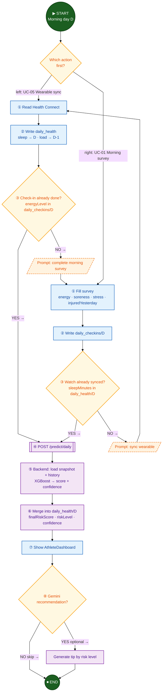

# AthleAgent — מדריך שיפורים לספר הפרויקט

| שדה | ערך |
|-----|-----|
| **מסמך מקור** | `ספר פרוייקט - AthleAgent (4).docx` |
| **תאריך סקירה** | 2026-07-09 |
| **מגישים** | יהב סימון, צוף פלדון |
| **מנחה** | מר איל איזנשטיין |
| **מטרת המסמך** | רשימת פעולות מסודרת לשיפור ספר הפרויקט לפני הגשה |

---

## תוכן עניינים

1. [סיכום מנהלים](#1-סיכום-מנהלים)
2. [חובה לתקן לפני הגשה (P0)](#2-חובה-לתקן-לפני-הגשה-p0)
3. [שיפורים מבניים — סעיפים חסרים (P1)](#3-שיפורים-מבניים--סעיפים-חסרים-p1)
4. [תוכן טכני — דיוק והשלמה (P1)](#4-תוכן-טכני--דיוק-והשלמה-p1)
5. [ויזואליזציה ודיאגרמות (P1)](#5-ויזואליזציה-ודיאגרמות-p1)
6. [כתיבה, עיצוב ועקביות (P2)](#6-כתיבה-עיצוב-ועקביות-p2)
7. [מה לשמר — נקודות חוזק](#7-מה-לשמר--נקודות-חוזק)
8. [תוכן מוכן להדבקה — סעיף המודל](#8-תוכן-מוכן-להדבקה--סעיף-המודל)
9. [תוכן מוכן להדבקה — סכמת Firestore מלאה](#9-תוכן-מוכן-להדבקה--סכמת-firestore-מלאה)
10. [תוכן מוכן להדבקה — זרימות Activity](#10-תוכן-מוכן-להדבקה--זרימות-activity)
11. [לוח זמנים מומלץ לסגירה](#11-לוח-זמנים-מומלץ-לסגירה)
12. [צ'קליסט סופי לפני הגשה](#12-צקליסט-סופי-לפני-הגשה)

---

## 1. סיכום מנהלים

ספר הפרויקט הנוכחי מציג **הבנה הנדסית עמוקה** — במיוחד בארכיטקטורה, הנדסת פיצ'רים, מדיניות מידע חסר, ובחירת מודל ML. אלה נקודות חוזק משמעותיות שמבדילות את הפרויקט.

הפערים העיקריים הם:

| קטגוריה | מצב נוכחי | השפעה על הבוחן |
|---------|-----------|----------------|
| **שלמות** | 3 סעיפים ריקים / placeholder | נראה לא גמור |
| **הצגה** | חסרות דיאגרמות וצילומי מסך | קשה להבין את המוצר בלי להריץ |
| **הקשר אקדמי** | אין סקירת ספרות / מתודולוגיה | חסר מסגרת מחקרית |
| **איזון** | ~40% ML, מעט UI/הדגמה | חוסר איזון בתוכן |

**המלצה:** לפני הגשה — לסגור קודם את כל סעיפי P0, ואז להוסיף דיאגרמות + הדגמה (P1).

---

## 2. חובה לתקן לפני הגשה (P0)

### 2.1 סעיפים לא גמורים

| # | מיקום במסמך | מה כתוב היום | פעולה נדרשת |
|---|-------------|--------------|-------------|
| 1 | **דיאגרמת Use Case** | "להוסיף" | להוסיף דיאגרמת UML עם שני שחקנים אנושיים (ספורטאי, מאמן) + מערכות חיצוניות (Health Connect, Firestore, Gemini, Backend) |
| 2 | **המודל שנבחר ותוצאותיו** | "להשלים אחרי אימון נוסף" | **אין צורך באימון נוסף** — הנתונים קיימים (ראו [§8](#8-תוכן-מוכן-להדבקה--סעיף-המודל)) |
| 3 | **טסטים — Android** | כותרת בלי תוכן | למלא תוכן או למחוק את הכותרת |

### 2.2 שאריות תבנית

| # | בעיה | פעולה |
|---|------|-------|
| 1 | הטקסט **"הפרויקט שלך:"** לפני טבלת ה-Gates | למחוק — זו שארית מתבנית המכללה |
| 2 | תוכן עניינים — מספרי עמודים דבוקים לכותרות ("תקציר ומטרת הפרויקט**4**") | ב-Word: `References → Update Table of Contents` |

### 2.3 מודל נתונים — חסרים קריטיים

בסכמת Firestore במסמך חסרים רכיבים שבשימוש בקוד:

| חסר במסמך | שימוש במערכת |
|-----------|--------------|
| Collection `teams` | יצירת קבוצה (UC-06), הצטרפות (UC-04) |
| Sub-collection `teams/{teamId}/requests` | בקשות הצטרפות (UC-04, UC-07) |
| שדות ב-`daily_health` | `distanceMeters`, `activeCalories`, `heartRateAvg`, `predictionUpdatedAt` |

> סכמה מלאה מוכנה להדבקה: [§9](#9-תוכן-מוכן-להדבקה--סכמת-firestore-מלאה)

---

## 3. שיפורים מבניים — סעיפים חסרים (P1)

ספר פרויקט גמר טיפוסי כולל סעיפים שחסרים כרגע. מומלץ להוסיף:

### 3.1 סקירת ספרות / מוצרים קיימים (½–1 עמוד)

**למה:** מציב את הפרויקט בהקשר שוקי ומראה מחקר.

**מוצרים להשוואה:**

| מוצר | מה עושה | מה AthleAgent עושה אחרת |
|------|---------|-------------------------|
| **WHOOP** | Recovery score, strain | איחוד תזונה + סקר + שעון; confidence נפרד מסיכון |
| **TrainingPeaks** | TSS, CTL/ATL | ACWR + ML gates; ממוקד פציעה לא רק עומס |
| **Kitman Labs** | פלטפורמת מניעה למועדונים | פתרון נגיש לספורטאי/מאמן בודד; Gemini לתזונה |
| **MyFitnessPal** | תזונה ידנית | ניתוח ארוחה מתמונה ב-AI |

**מסר מרכזי:** רוב הפתרונות **תגובתיים** או **מפוצלים** — AthleAgent מאחד מקורות ומפיק ציון פרואקטיבי יומי.

### 3.2 מתודולוגיית מחקר / יצירת הדאטה (½–1 עמוד)

**למה:** הבוחן ישאל על 340K שורות סינתטיות.

**מה לכלול:**

- מקור: `ML_model/data_generator.py`
- גודל: **340,000** שורות (לפי `run_manifest.json` של run `20260709_104916`)
- תיוג: פציעה ביום D לפי שילוב עומס, שינה, HRV, סטרס
- פיצול: **Athlete-split** — כל ימי ספורטאי באותה קבוצה (אימון או בחינה)
- Holdout קבוע: `benchmark_holdout.csv` לעקביות לאורך זמן
- מגבלה: אין דאטה קליני אמיתי — מודל נבדק offline בלבד

### 3.3 הדגמה ותוצאות (1–2 עמודים)

**למה:** בוחן שלא מריץ את המערכת צריך לראות את המוצר.

**מה לכלול:**

1. **Walkthrough יומי לספורטאי:** סנכרון שעון → סקר בוקר → טריגר חיזוי → ציון + המלצת Gemini
2. **Walkthrough למאמן:** דשבורד קבוצתי → drill-down לספורטאי → גרף היסטוריה
3. **4–6 צילומי מסך** מהאפליקציה (דשבורד, סקר, סנכרון, ניתוח ארוחה, מאמן)
4. (אופציונלי) סרטון הדגמה קצר (2–3 דקות)

### 3.4 חלוקת עבודה בצוות (½ עמוד)

| תחום | אחריות מוצעת לתיעוד |
|------|---------------------|
| Android UI + Health Connect + Gemini client | יהב / צוף — לפי מה שבוצע בפועל |
| FastAPI Backend + Firestore integration | |
| ML Pipeline + Feature Engineering | |
| תיעוד + CI + Docker | |

> לעדכן לפי חלוקה אמיתית — הבוחן שואל על זה.

### 3.5 לוח זמנים / אבני דרך (½ עמוד)

טבלה או Gantt פשוט:

| אבן דרך | תאריך משוער | סטטוס |
|---------|-------------|-------|
| הגדרת ארכיטקטורה | | ✓ |
| אפליקציית Android — MVP | | ✓ |
| Backend + חיזוי יומי | | ✓ |
| ML Pipeline + Promotion | | ✓ |
| Gemini תזונה + המלצות | | ✓ |
| טסטים + CI | | ✓ |
| ספר פרויקט | | בתהליך |

### 3.6 סיכונים ומגבלות (½ עמוד)

| סיכון | השפעה | הפחתת סיכון |
|-------|--------|------------|
| דאטה סינתטי בלבד | דיוק בשטח לא מוכח | Future work: שיתוף פעולה עם מועדונים |
| Gemini — דיוק כמויות תזונה | ערכי קלוריות/חלבון משוערים | confidence יורד; Future: מנוע תזונה מסחרי |
| API חיזוי ללא Auth | סיכון אבטחה | Future: Firebase token validation |
| סנכרון ידני משעון | תלות במשתמש | Future: סנכרון אוטומטי לפי שעת השכמה |
| אין אימות קליני | לא מוצר רפואי | Disclaimer (כבר קיים — טוב) |

---

## 4. תוכן טכני — דיוק והשלמה (P1)

### 4.1 NFR — הרחבה

במסמך יש **3** דרישות לא-פונקציונליות. ב-`docs/NFR.md` יש **20+**.

**מומלץ להוסיף לפחות:**

| ID | קטגוריה | מדד | יעד |
|----|---------|-----|-----|
| NFR-PERF-01 | ביצועים | Latency p95 — `/predict/daily` | < 2,000 ms |
| NFR-SEC-01 | אבטחה | PHI בלוגים | 0 מופעים |
| NFR-MAINT-01 | תחזוקה | pytest pass rate | 100% (225 בדיקות) |
| NFR-OBS-01 | Observability | Trace E2E (`X-Request-ID`) | 100% בקשות HTTP |
| NFR-ML-03 | ML | Brier Score | ≤ 0.15 |

### 4.2 דיוק ניסוחים

| נושא | ניסוח במסמך | תיקון מוצע |
|------|-------------|-----------|
| ולידציה נתונים | "בדיקת קיימות הנתונים מבוצעת בפרונטאנד" | "ולידציה בסיסית בלקוח; השלמת ערכים חסרים, חישוב confidence ו-inference — בשרת" |
| מספר שורות דאטה | 359,000 (שגוי) | **340,000** (לפי `run_manifest.json`) |
| שמות שדות | `predictionConfidence` / `prediction_confidence` | לבחור convention אחד לכל המסמך |
| FPR gate | ≤ 55% | נכון לפי manifest — לוודא עקביות עם שאר המסמכים |

### 4.3 אבטחה — להזכיר במפורש

כדאי להוסיף פסקה קצרה:

- **Firebase Authentication** — אימות משתמשים בלקוח
- **Firestore Security Rules** — הגבלת גישה לפי `uid` ותפקיד
- **מגבלה ידועה:** `POST /predict/daily` אינו מאומת בשרת (מזוהה ב-HLD)
- **כיוון עתידי:** אימות Firebase token על ה-API

### 4.4 טסטים — Android

במסמך חסר תוכן תחת "הצד של האפליקציה (Android)".

**מה לכתוב:**

| סוג | כמות | תיאור |
|-----|------|-------|
| Unit Tests | ~5 קבצים | `CalculationUtilsTest`, `ClientEventReporterTest`, `RequestIdHolderTest` |
| Instrumented Tests | 1 (דוגמה) | `ExampleInstrumentedTest` |
| CI | GitHub Actions | `android-ci.yml` — build + unit tests |

> אם אין כיסוי משמעותי — לציין בכנות ולהוסיף ל-Future work.

---

## 5. ויזואליזציה ודיאגרמות (P1)

### 5.1 דיאגרמות חובה

| # | דיאגרמה | מקור / הערות |
|---|---------|--------------|
| 1 | **Use Case** | ספורטאי + מאמן + 8 UC; מערכות: Health Connect, Gemini, Firestore, Backend |
| 2 | **ארכיטקטורה כללית** | 3 שכבות: Android / FastAPI / ML Pipeline + Firestore |
| 3 | **Sequence — חיזוי יומי** | סנכרון → Firestore → POST `/predict/daily` → כתיבה → קריאה ל-UI |
| 4 | **זרימת נתונים D / D-1** | שינה@D, עומס@D-1, סקר@D, תזונה@D-1 |
| 5 | **Activity — חיזוי יומי** | UC-01 + UC-05: סקר + סנכרון + cross-trigger ([§10](#10-תוכן-מוכן-להדבקה--זרימות-activity)) |
| 6 | **Activity — הצטרפות לקבוצה** | UC-04 + UC-07: בקשה → אישור/דחייה מאמן ([§10](#10-תוכן-מוכן-להדבקה--זרימות-activity)) |

> דיאגרמות Mermaid מוכנות ב-`docs/HLD_PROJECT.md` וב-[§10](#10-תוכן-מוכן-להדבקה--זרימות-activity) — לייצא כתמונה מ-[mermaid.live](https://mermaid.live).

### 5.2 גרפים ויזואליים — ML

| # | גרף | קובץ מקור |
|---|-----|-----------|
| 1 | Feature Importance (Top 10) | `ML_model/artifacts/20260709_104916/feature_importance.csv` |
| 2 | Risk Bins (green/yellow/red) | `run_manifest.json` → `risk_bins` |
| 3 | (אופציונלי) ROC Curve | מתוך artifacts של הריצה |
| 4 | (אופציונלי) Confusion Matrix | מתוך artifacts של הריצה |

### 5.3 צילומי מסך

| # | מסך | תפקיד |
|---|-----|-------|
| 1 | דשבורד ספורטאי | ציון סיכון + gauge |
| 2 | סקר בוקר | UC-01 |
| 3 | סנכרון שעון | UC-05 |
| 4 | ניתוח ארוחה | UC-02 |
| 5 | דשבורד מאמן | UC-08 |
| 6 | בקשות הצטרפות | UC-07 |

> תמונות זמינות גם ב-README (GitHub assets).

---

## 6. כתיבה, עיצוב ועקביות (P2)

### 6.1 תקציר

**מצב:** קצר יחסית לעומק הטכני.

**שיפור:** להרחיב ל-½ עמוד — לכלול:
- הבעיה (פציעות, מידע מפוזר)
- הפתרון (ציון יומי 0–100%, confidence נפרד)
- תוצאות מודל (Recall 80.8%, AUC 78.3%)
- טכנולוגיות עיקריות (Android, FastAPI, XGBoost, Firestore, Gemini)

### 6.2 סיכום ותובנות

**מצב:** כללי ("כלי נגיש ופשוט").

**שיפור:** לחזור על תובנות ספציפיות:
- Firestore כ-Source of Truth — הפרדה בין UI לחישוב
- confidence נפרד מסיכון — שקיפות למשתמש
- ML gates — בטיחות לפני עלייה לפרודקשן
- דאטה סינתטי — בסיס לאימון; שטח אמיתי = כיוון עתידי

### 6.3 עקביות מונחים

| אנגלית | עברית מומלצת | הערה |
|--------|--------------|------|
| Recall | רגישות | להשתמש בעקביות |
| Precision | דיוק נקודתי | |
| FPR | שיעור התראות שווא | |
| Confidence | רמת ביטחון / אמינות החיזוי | לבחור אחד |
| Feature | פיצ'ר / מאפיין | לבחור אחד |

### 6.4 טיפוגרפיה ועיצוב

| בעיה | תיקון |
|------|-------|
| "ערך.הפתרון" (חסר רווח) | "ערך. הפתרון:" |
| כותרות ברמות שונות | ליישר היררכיה: H1 → H2 → H3 |
| טבלאות ארוכות | לשבור לעמודים או לצמצם עמודות |
| קוד Firestore schema | פונט monospace + הזחה עקבית |

---

## 7. מה לשמר — נקודות חוזק

אל **לא** לשנות / לקצר — אלה נקודות חוזק:

- [x] **הבעיה והמטרה** — ברורות, עם הקשר מקצועי (ACWR, HRV, שחיקה)
- [x] **מקרי שימוש UC-01 עד UC-08** — מפורטים ומקושרים לזרימה
- [x] **תיאור תהליך החיזוי** — חלוקת D/D-1, תנאי טריגר, שלבי פיצ'רים
- [x] **מדיניות מידע חסר + confidence** — מבדיל מהמתחרים
- [x] **צינור ML** — Athlete CV, Holdout, Promotion, Gates
- [x] **אתגרים בתהליך הפיתוח** — כנות טכנית
- [x] **פיתוחים לעתיד** — מפורטים ומנומקים
- [x] **Disclaimer** — נדרש ומנוסח היטב
- [x] **איסוף לוגים + X-Request-ID** — observability מקצועי
- [x] **טסטים Backend (225)** — מרשים לבוחן

---

## 8. תוכן מוכן להדבקה — סעיף המודל

> להחליף את "להשלים אחרי אימון נוסף" בתוכן הבא:

### המודל שנבחר ותוצאותיו

לאחר הרצת צינור הבחירה (`run_pipeline.py`) על 340,000 שורות נתונים סינתטיים, עם Holdout קבוע (`benchmark_holdout.csv`) ופיצול מבוסס-ספורטאי, נבחר המודל **XGBoostCalibratedTuned** לפרודקשן.

**פרמטרים:**
- סף החלטה (Threshold): **0.10**
- מספר פיצ'רים: **35**
- Run ID: `20260709_104916`

**מדדי איכות על Holdout:**

| מדד | יעד (Gate) | תוצאה | עמידה |
|-----|------------|-------|-------|
| Recall | ≥ 80% | **80.8%** | ✓ |
| ROC-AUC | ≥ 0.68 | **0.783** | ✓ |
| Precision | ≥ 13% | **27.1%** | ✓ |
| F1 | ≥ 22% | **40.6%** | ✓ |
| FPR | ≤ 55% | **42.5%** | ✓ |
| Brier Score | ≤ 0.15 | **0.111** | ✓ |

**פירוש Risk Bins (כיול לשטח):**

| רמה | טווח ציון | שיעור פציעה בפועל (Holdout) |
|-----|-----------|----------------------------|
| Low (ירוק) | 0–20% | 9.2% |
| Medium (צהוב) | 21–50% | 30.9% |
| High (אדום) | 51–100% | 62.6% |

המודל עומד בכל ה-Gates הקשיחים (Recall + AUC) וקודם לפרודקשן דרך `promoted.json`. במקרה של כישלון Gate — השרת חוסם את `/predict/daily` ומחזיר HTTP 503.

**למה XGBoostCalibratedTuned ולא האחרים:**
- Logistic Regression — baseline ליניארי; Recall נמוך מדי
- Random Forest / Gradient Boosting — ביצועים טובים אך ללא כיול הסתברויות מדויק
- XGBoost Deep — נפסל עקב Overfitting ורגישות לרעש

---

## 9. תוכן מוכן להדבקה — סכמת Firestore מלאה

```
[Collection] users
└── {uid} (Document)
    ├── fullName: string
    ├── email: string
    ├── role: string ("Athlete" | "Coach")
    ├── teamId: string
    ├── birth_date: string
    ├── historyInjuryCount: int
    │
    ├── [Sub-Collection] daily_health
    │   └── {yyyy-MM-dd} (Document)
    │       ├── sleepMinutes: int
    │       ├── steps: int
    │       ├── distanceMeters: double
    │       ├── activeCalories: double
    │       ├── heartRateAvg: double
    │       ├── hrvRmssd: double
    │       ├── restingHeartRate: double
    │       ├── weightKg: double
    │       ├── heightCm: double
    │       ├── finalRiskScore: double
    │       ├── riskLevel: string ("Low" | "Medium" | "High")
    │       ├── predictionConfidence: double
    │       ├── predictionUpdatedAt: string (ISO-8601)
    │       └── aiRecommendation: string
    │
    ├── [Sub-Collection] daily_checkins
    │   └── {yyyy-MM-dd} (Document)
    │       ├── energyLevel: int
    │       ├── muscleSoreness: int
    │       ├── stressLevel: int
    │       ├── injuredYesterday: int
    │       └── lastCheckInTime: timestamp
    │
    └── [Sub-Collection] daily_nutrition
        └── {yyyy-MM-dd} (Document)
            ├── totalCalories: double
            ├── totalProtein: double
            ├── totalCarbs: double
            ├── mealsLoggedCount: int
            │
            └── [Sub-Collection] meals
                └── {mealId} (Document)
                    ├── calories: double
                    ├── protein: double
                    ├── carbs: double
                    └── timestamp: timestamp

[Collection] teams
└── {teamId} (Document)
    ├── TeamName: string
    ├── teamCode: string
    ├── coachId: string (uid)
    ├── athletes: array<string> (uids)
    │
    └── [Sub-Collection] requests
        └── {athleteUid} (Document)
            ├── athleteName: string
            ├── status: string ("pending" | "approved" | "rejected")
            └── requestedAt: timestamp
```

---

## 10. תוכן מוכן להדבקה — זרימות Activity

> להדביק אחרי טבלת מקרי השימוש (UC-01…UC-08).  
> **שתי זרימות בלבד** — ליבת המוצר (חיזוי) + אינטראקציה ספורטאי↔מאמן.  
> לייצוא תמונה: להדביק את בלוק ה-Mermaid ב-[mermaid.live](https://mermaid.live) → Export PNG/SVG.

### 10.1 זרימת Activity — חיזוי סיכון יומי (UC-01 + UC-05)

**כותרת מומלצת בספר:** Activity Diagram — Daily Injury Risk Prediction (UC-01 + UC-05)

| מטא | ערך |
|-----|-----|
| **סוג דיאגרמה** | UML Activity Diagram |
| **כיוון** | מלמעלה למטה (TB) |
| **מקרא** | ירוק = התחלה/סיום · כחול = פעולה · צהוב = החלטה · סגול = Backend/מערכת · כתום מקווקו = הנחיה למשתמש |

**טקסט מלווה (להדבקה):**

הזרימה המרכזית של AthleAgent היא הפקת **ציון סיכון פציעה יומי** בבוקר יום D. הספורטאי משלים שני מקורות חובה — **סנכרון שעון** (UC-05) ו**סקר בוקר** (UC-01) — בסדר חופשי. המערכת מפעילה `POST /predict/daily` רק כששני המקורות קיימים (**cross-trigger**): אחרי סקר — אם קיים `sleepMinutes`; אחרי סנכרון — אם קיים `energyLevel`. ניתוח ארוחה (UC-02) אינו מפעיל חיזוי. התוצאה נשמרת ב-Firestore ומוצגת בדשבורד, עם המלצת Gemini אופציונלית.



**נקודות להדגשה ליד הדיאגרמה:**

| נקודה | פירוט |
|-------|--------|
| Cross-trigger | שני מסכים; חיזוי רק כששני המקורות קיימים |
| D / D-1 | שינה וסקר ב-D; עומס ותזונה ממודל ב-D-1 |
| Confidence | מידע חסר מוריד `predictionConfidence` — לא חוסם את ה-API |
| UC-02 | תזונה נשמרת בנפרד ואינה טריגר לחיזוי |

---

### 10.2 זרימת Activity — הצטרפות לקבוצה (UC-04 + UC-07)

**כותרת מומלצת בספר:** Activity Diagram — Join Team Request & Coach Approval (UC-04 + UC-07)

| מטא | ערך |
|-----|-----|
| **סוג דיאגרמה** | UML Activity Diagram + Swimlanes |
| **כיוון** | מלמעלה למטה (TB) |
| **מסלולים** | Athlete → Coach → Firestore batch |
| **מקרא** | ירוק = התחלה/סיום · אפור = המתנה · כחול = פעולה · צהוב = החלטה · סגול = batch · אדום מקווקו = שגיאה/ריק |

**טקסט מלווה (להדבקה):**

ספורטאי מצטרף לקבוצה באמצעות **קוד קבוצה** (UC-04). הבקשה נשמרת ב-`teams/{teamId}/requests` במצב `pending`. המאמן רואה בקשות ממתינות (UC-07) ויכול לאשר או לדחות. באישור מתבצע **Firestore batch אטומי**: עדכון סטטוס ל-`approved`, הוספת ה-uid לרשימת `athletes`, ועדכון `teamId` בפרופיל הספורטאי. לאחר מכן המאמן יכול לעקוב אחרי ציון הסיכון בדשבורד הקבוצתי (UC-08).

```mermaid
%%{init: {"flowchart": {"htmlLabels": true, "curve": "linear", "nodeSpacing": 35, "rankSpacing": 40}, "theme": "base"}}%%
flowchart TB
    Start((▶ START)) --> Enter[Athlete enters teamCode]

    subgraph Athlete["Swimlane: Athlete  ·  UC-04"]
        direction TB
        Enter --> Query[Query Firestore:<br/>teams where teamCode == code]
        Query --> Found{Team found?}
        Found -->|NO →| Err[/Error: team not found/]
        Err --> Enter
        Found -->|YES →| Send[Create requests/{uid}<br/>status = pending]
        Send --> Wait((⏸ Wait for coach))
    end

    Wait --> Open

    subgraph Coach["Swimlane: Coach  ·  UC-07"]
        direction TB
        Open[Open CoachRequests] --> Load[Load pending requests]
        Load --> Any{Any pending?}
        Any -->|NO →| Empty[/Empty state/]
        Empty --> EndIdle((⏹ END — nothing to do))
        Any -->|YES →| Decide{Approve or reject?}
        Decide -->|REJECT →| Rej[Set status = rejected]
        Rej --> EndRej((⏹ END — rejected))
        Decide -->|APPROVE →| Batch
    end

    subgraph Firestore["Swimlane: Firestore batch"]
        direction TB
        Batch[[Atomic batch]]
        Batch --> A1[status = approved]
        Batch --> A2[athletes arrayUnion uid]
        Batch --> A3[users.teamId = teamId]
        A1 --> Linked
        A2 --> Linked
        A3 --> Linked[Athlete linked to team]
    end

    Linked --> Dash[CoachDashboard reads<br/>daily_health per athlete]
    Dash --> EndOk((⏹ END — on roster))

    classDef startEnd fill:#1B5E20,stroke:#0D3B12,color:#fff,stroke-width:2px
    classDef wait fill:#455A64,stroke:#263238,color:#fff,stroke-width:2px
    classDef process fill:#E3F2FD,stroke:#1565C0,color:#0D47A1,stroke-width:1.5px
    classDef decision fill:#FFF8E1,stroke:#F9A825,color:#E65100,stroke-width:2px
    classDef system fill:#F3E5F5,stroke:#7B1FA2,color:#4A148C,stroke-width:1.5px
    classDef error fill:#FFEBEE,stroke:#C62828,color:#B71C1C,stroke-width:1.5px,stroke-dasharray: 5 3

    class Start,EndIdle,EndRej,EndOk startEnd
    class Wait wait
    class Enter,Query,Send,Open,Load,Dash,A1,A2,A3,Linked,Rej process
    class Found,Any,Decide decision
    class Batch system
    class Err,Empty error
```

**נקודות להדגשה ליד הדיאגרמה:**

| נקודה | פירוט |
|-------|--------|
| שני שחקנים | ספורטאי שולח; מאמן מאשר/דוחה |
| Source of Truth | Firestore בלבד — בלי Backend לזרימה זו |
| אטומיות | אישור ב-batch כדי למנוע מצב חלקי |
| המשך | אחרי אישור — ניטור סיכון ב-UC-08 |

---

## 11. לוח זמנים מומלץ לסגירה

| יום | משימות | עדיפות |
|-----|--------|--------|
| **1** | השלמת סעיף המודל (§8), מחיקת placeholders, תיקון מספרי דאטה | P0 |
| **2** | דיאגרמת Use Case + ארכיטקטורה + Sequence + Activity (§10) | P0–P1 |
| **3** | עדכון סכמת Firestore (§9), הרחבת NFR | P0–P1 |
| **4** | 4–6 צילומי מסך + walkthrough הדגמה | P1 |
| **5** | סקירת מוצרים + מתודולוגיה + חלוקת עבודה | P1 |
| **6** | תקציר מורחב, סיכום משופר, עדכון תוכן עניינים | P2 |
| **7** | קריאה סופית, צ'קליסט (§12), הדפסה/PDF | — |

---

## 12. צ'קליסט סופי לפני הגשה

### שלמות

- [ ] אין סעיפים עם "להוסיף" / "להשלים"
- [ ] אין שאריות תבנית ("הפרויקט שלך")
- [ ] תוכן עניינים מעודכן עם מספרי עמודים נכונים
- [ ] שם הפרויקט, מגישים, מנחה, תאריך — עקביים בכל העמודים

### תוכן

- [ ] סעיף המודל עם טבלת מדדים מלאה
- [ ] סכמת Firestore כוללת `teams` + `requests`
- [ ] לפחות 3 NFR נוספים (ביצועים, אבטחה, CI)
- [ ] סקירת מוצרים קיימים (½ עמוד)
- [ ] מתודולוגיית דאטה סינתטי (½ עמוד)
- [ ] חלוקת עבודה בצוות

### ויזואליזציה

- [ ] דיאגרמת Use Case
- [ ] דיאגרמת ארכיטקטורה
- [ ] דיאגרמת Sequence (חיזוי יומי)
- [ ] דיאגרמת Activity — חיזוי יומי (UC-01 + UC-05)
- [ ] דיאגרמת Activity — הצטרפות לקבוצה (UC-04 + UC-07)
- [ ] 4+ צילומי מסך
- [ ] גרף Feature Importance או Risk Bins

### דיוק

- [ ] 340,000 שורות (לפי `run_manifest.json`)
- [ ] ניסוח ולידציה: לקוח + שרת
- [ ] convention אחיד לשמות שדות
- [ ] Disclaimer קיים וברור

### עיצוב

- [ ] כותרות בהיררכיה עקבית
- [ ] טבלאות לא נשברות באמצע עמוד
- [ ] פונט אחיד לקוד ולסכמות
- [ ] איות ורווחים (כולל "ערך. הפתרון")

---

## נספח — מסמכי עזר בפרויקט

| מסמך | שימוש לספר הפרויקט |
|------|---------------------|
| [`docs/HLD_PROJECT.md`](HLD_PROJECT.md) | דיאגרמות Mermaid, ארכיטקטורה, Activity flows |
| [`docs/LLD_PROJECT.md`](LLD_PROJECT.md) | סכמות Firestore, API, Activities |
| [`docs/NFR.md`](NFR.md) | הרחבת דרישות לא-פונקציונליות |
| [`docs/LOGGING_HE.md`](LOGGING_HE.md) | פירוט איסוף לוגים |
| [`ML_model/artifacts/20260709_104916/run_manifest.json`](../ML_model/artifacts/20260709_104916/run_manifest.json) | מדדי מודל מדויקים |
| [`README.md`](../README.md) | תקציר, screenshots, tech stack |

---

*מסמך זה נוצר כהנחיה פנימית לשיפור ספר הפרויקט. לעדכונים — לערוך קובץ זה או לסמן פריטים בצ'קליסט.*
